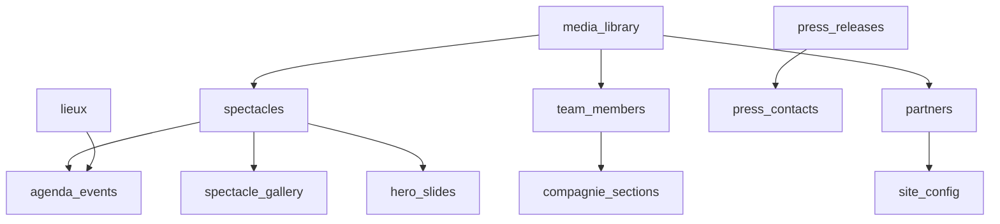

# Workflow — Construire l'agent `test-data-manager`

> **Stack cible** : Next.js 16 + Supabase + Playwright  
> **Outils requis** : `skill-creator`, `supabase.agent`, `playwright-test-generator`  
> **Durée estimée** : 3–4h (1ère itération complète)

---

## Vue d'ensemble du pipeline

```
Phase 1 — Schéma          Phase 2 — Seed             Phase 3 — Fixtures          Phase 4 — Intégration
──────────────────         ──────────────────          ──────────────────          ──────────────────
Analyser les tables   →    Générer les données   →     Créer les helpers    →      Câbler Playwright
(supabase.agent)           (test-data-manager)         Playwright fixtures          + CI/CD
```

---

## Phase 1 — Analyse du schéma (Prérequis)

### 1.1 Lister toutes les tables avec `supabase.agent`

Invoquer l'agent **Supabase Expert** avec ce prompt :

```
Analyse le schéma complet du projet. Pour chaque table, liste :
- Nom de la table et son schéma
- Colonnes (type, nullable, default, FK)
- Contraintes d'unicité
- Policies RLS actives
- Dépendances entre tables (ordre d'insertion)
Produis un graphe de dépendances au format Mermaid.
```

**Résultat attendu** — graphe type pour Rouge Cardinal :



### 1.2 Identifier les données stables vs dynamiques

| Catégorie | Tables | Stratégie seed |
|---|---|---|
| **Référentiel stable** | `lieux`, `site_config`, `partners` | Seed fixe, partagé |
| **Contenu métier** | `spectacles`, `team_members`, `press_releases` | Seed minimal (3–5 entrées) |
| **Données relationnelles** | `agenda_events`, `spectacle_gallery` | Générées après les parents |
| **Auth** | `auth.users` (Supabase) | Compte test dédié, isolé |

### 1.3 Documenter dans `tests/fixtures/schema-map.ts`

```typescript
// Ordre d'insertion obligatoire (respecter les FK)
export const INSERT_ORDER = [
  'lieux',
  'spectacles',
  'team_members',
  'partners',
  'press_contacts',
  'press_releases',
  'agenda_events',
  'spectacle_gallery',
  'hero_slides',
  'home_stats',
  'media_library',
  'site_config',
] as const;

export type TableName = typeof INSERT_ORDER[number];
```

---

## Phase 2 — Créer le fichier agent `.github/agents/test-data-manager.agent.md`

### 2.1 Structure du fichier agent

Créer `.github/agents/test-data-manager.agent.md` :

```markdown
---
name: 'Test Data Manager'
description: >
  Manages test data lifecycle for Playwright E2E tests on Supabase projects.
  Use when you need to: generate seed data for tests, reset database state between
  test runs, create Playwright fixtures with typed test data, manage Supabase
  branches for test isolation, or debug data-related test failures.
  Triggers on: "seed tests", "reset test data", "fixture", "test database",
  "données de test", "seed de test", "isoler les tests".
tools:
  - read
  - edit
  - search
  - execute
  - supabase/execute_sql
  - supabase/list_tables
  - supabase/generate_typescript_types
  - supabase/create_branch
  - supabase/reset_branch
  - supabase/delete_branch
  - supabase/list_branches
  - supabase/apply_migration
  - supabase/get_project
  - github/create_branch
  - github/push_files
  - agent/runSubagent
  - todo
model: Claude Sonnet 4.6 (copilot)
---

# Test Data Manager

Tu es un expert en gestion des données de test pour applications Next.js + Supabase.
Ta mission : garantir que chaque test E2E Playwright démarre avec un état de base
de données connu, propre, et reproductible.

## Tes 4 responsabilités

1. **Analyser** le schéma Supabase pour comprendre les dépendances entre tables
2. **Générer** les seeds typés conformes aux contraintes RLS du projet
3. **Créer** les Playwright fixtures (setup/teardown) réutilisables
4. **Isoler** les tests via Supabase branching ou transactions rollback

## Règles absolues

- Respecter l'ordre d'insertion dicté par les FK (voir schema-map.ts)
- Ne jamais utiliser `process.env.*` — utiliser `env.*` de T3 Env
- Les données de test ont toujours `test_data: true` pour nettoyage ciblé
- RLS doit être respecté : utiliser le service role uniquement pour le setup
- Un test ne doit jamais dépendre des données d'un autre test

## Workflow standard

Voir les références :
- [seed-strategy.md](./references/seed-strategy.md)
- [fixture-patterns.md](./references/fixture-patterns.md)
- [isolation-strategies.md](./references/isolation-strategies.md)
```

### 2.2 Créer les fichiers de référence

#### `.github/agents/references/seed-strategy.md`

```markdown
# Stratégie de Seed

## Principe : seed minimal + factories

Ne pas insérer plus que nécessaire. Chaque test déclare ce dont il a besoin.

## Hiérarchie des seeds

### 1. Global seed (une fois par suite)
Données stables qui ne changent jamais entre les tests :
- Site config / toggles
- Lieux de référence (6 lieux standards)
- Compte admin de test

### 2. Suite seed (une fois par describe block)
Données partagées au sein d'un groupe de tests :
- 3 spectacles publiés
- 2 membres d'équipe actifs
- 4 partenaires (3 actifs, 1 inactif)

### 3. Test seed (avant chaque test)
Données propres à un test unique :
- Événement agenda pour test de création
- Communiqué de presse brouillon
- Slide hero temporaire

## Commandes SQL de seed

### Template INSERT avec marqueur test_data

```sql
-- Toujours inclure is_test_data pour nettoyage ciblé
INSERT INTO public.spectacles (
  titre, genre, duree, description, statut, is_test_data
) VALUES (
  'Spectacle Test E2E', 'Théâtre', 90,
  'Description test', 'published', true
) RETURNING id;
```

## Nettoyage

```sql
-- Nettoyage ciblé (ne supprime que les données de test)
DELETE FROM public.agenda_events WHERE is_test_data = true;
DELETE FROM public.spectacles WHERE is_test_data = true;
-- Suivre INSERT_ORDER en reverse pour respecter les FK
```
```

#### `.github/agents/references/fixture-patterns.md`

```markdown
# Patterns de Fixtures Playwright

## Pattern 1 : extend test avec base fixtures

```typescript
// tests/fixtures/index.ts
import { test as base } from '@playwright/test'
import { createClient } from '@supabase/supabase-js'
import { env } from '@/lib/env'
import { seedMinimal, cleanTestData, seedSpectacle } from './seed-helpers'

type TestFixtures = {
  db: ReturnType<typeof createClient>
  seededSpectacle: { id: string; slug: string; titre: string }
  authenticatedAdmin: { email: string; token: string }
}

export const test = base.extend<TestFixtures>({
  // Client Supabase avec service role pour le setup
  db: async ({}, use) => {
    const client = createClient(
      env.NEXT_PUBLIC_SUPABASE_URL,
      env.SUPABASE_SECRET_KEY  // Service role pour bypass RLS en test
    )
    await use(client)
  },

  // Spectacle de test créé/détruit autour de chaque test
  seededSpectacle: async ({ db }, use) => {
    const spectacle = await seedSpectacle(db)
    await use(spectacle)
    await db.from('spectacles').delete().eq('id', spectacle.id)
  },

  // Session admin pré-authentifiée
  authenticatedAdmin: async ({ page }, use) => {
    await page.goto('/auth/login')
    await page.fill('[name="email"]', env.TEST_ADMIN_EMAIL)
    await page.fill('[name="password"]', env.TEST_ADMIN_PASSWORD)
    await page.click('button[type="submit"]')
    await page.waitForURL('/admin')
    await use({ email: env.TEST_ADMIN_EMAIL, token: '' })
  },
})

export { expect } from '@playwright/test'
```

## Pattern 2 : beforeAll / afterAll pour suite entière

```typescript
// tests/admin/spectacles.spec.ts
import { test, expect } from '../fixtures'

test.describe('Admin — Spectacles', () => {
  let spectacleId: string

  test.beforeAll(async ({ db }) => {
    // Seed commun à toute la suite
    const { data } = await db
      .from('spectacles')
      .insert({ titre: 'Suite Test', is_test_data: true })
      .select('id')
      .single()
    spectacleId = data!.id
  })

  test.afterAll(async ({ db }) => {
    await db.from('spectacles').delete().eq('id', spectacleId)
  })

  test('ADM-SPEC-001 - Liste des spectacles', async ({ page, authenticatedAdmin }) => {
    await page.goto('/admin/spectacles')
    await expect(page.getByText('Suite Test')).toBeVisible()
  })
})
```

## Pattern 3 : Page Object Model + Fixture combinés

```typescript
// tests/fixtures/pages/admin-spectacles.page.ts
export class AdminSpectaclesPage {
  constructor(private page: Page) {}

  async goto() {
    await this.page.goto('/admin/spectacles')
  }

  async createSpectacle(data: Partial<Spectacle>) {
    await this.page.click('text=Nouveau spectacle')
    await this.page.fill('[name="titre"]', data.titre ?? 'Test')
    await this.page.click('button[type="submit"]')
    await expect(this.page.getByRole('alert')).toContainText('succès')
  }

  async deleteSpectacle(titre: string) {
    await this.page
      .getByRole('row', { name: titre })
      .getByRole('button', { name: 'Supprimer' })
      .click()
    await this.page.getByRole('button', { name: 'Confirmer' }).click()
  }
}
```
```

#### `.github/agents/references/isolation-strategies.md`

```markdown
# Stratégies d'Isolation des Tests

## Stratégie A : Transaction Rollback (local uniquement)

La plus rapide. Wraps chaque test dans une transaction annulée à la fin.

```typescript
// Nécessite une Edge Function Supabase dédiée aux tests
// supabase/functions/test-transaction/index.ts
```

**Avantages** : Très rapide, état parfaitement propre  
**Inconvénients** : Ne fonctionne pas avec les Server Actions Next.js

---

## Stratégie B : Supabase Branching (recommandé pour CI)

Chaque PR/run de test obtient une branche DB isolée.

```bash
# .github/workflows/e2e.yml

- name: Create test branch
  run: |
    BRANCH_NAME="test-${{ github.run_id }}"
    supabase branches create $BRANCH_NAME --project-ref $SUPABASE_PROJECT_REF
    echo "TEST_BRANCH=$BRANCH_NAME" >> $GITHUB_ENV

- name: Run E2E tests
  env:
    NEXT_PUBLIC_SUPABASE_URL: ${{ env.TEST_BRANCH_URL }}
  run: npx playwright test

- name: Delete test branch
  if: always()
  run: supabase branches delete ${{ env.TEST_BRANCH }}
```

**Avantages** : Isolation parfaite, parallélisme possible  
**Inconvénients** : Coût Supabase, latence création branche (~30s)

---

## Stratégie C : Cleanup ciblé (recommandé en local)

Marqueur `is_test_data: true` sur toutes les insertions de test.
Nettoyage en `afterEach` / `afterAll`.

```typescript
// tests/fixtures/cleanup.ts
export async function cleanAllTestData(db: SupabaseClient) {
  // Ordre reverse des FK
  const tables = [
    'spectacle_gallery',
    'agenda_events',
    'press_releases',
    'hero_slides',
    'spectacles',
    'team_members',
    'partners',
    'lieux',
  ]

  for (const table of tables) {
    await db.from(table).delete().eq('is_test_data', true)
  }
}
```

**Avantages** : Simple, rapide, fonctionne partout  
**Inconvénients** : Risque de pollution si un test crashe avant le cleanup

---

## Stratégie recommandée par environnement

| Environnement | Stratégie | Raison |
|---|---|---|
| Local dev | C (cleanup ciblé) | Rapide, simple |
| CI (chaque commit) | C + reset état initial | Rapide, pas de coût |
| CI (PR review) | B (branching) | Isolation garantie |
| Staging | B (branching) | Données réelles protégées |
```

---

## Phase 3 — Créer le skill complémentaire

### 3.1 Créer `.github/skills/test-data/SKILL.md`

```markdown
---
name: test-data
description: >
  Generate, manage and clean up test seed data for Supabase + Playwright projects.
  Use this skill when creating seed files, writing Playwright fixtures with database
  setup/teardown, adding is_test_data markers, managing test isolation strategies,
  or debugging tests that fail due to missing or stale database state.
  Trigger keywords: seed, fixture, test data, database state, test isolation,
  données de test, données seed, état de base.
---

# Test Data Skill

## Quand utiliser ce skill

- Écrire un nouveau fichier `tests/fixtures/seed-*.ts`
- Ajouter `is_test_data` colonne à une migration
- Créer des helpers de cleanup
- Déboguer un test qui échoue à cause de données manquantes
- Configurer Supabase branching dans le CI

## Prérequis vérifier avant de commencer

```bash
# 1. Vérifier que la colonne is_test_data existe sur les tables cibles
SELECT column_name FROM information_schema.columns
WHERE table_name = 'spectacles' AND column_name = 'is_test_data';

# 2. Vérifier que le compte admin de test existe
SELECT email FROM auth.users WHERE email = 'test-admin@rouge-cardinal.fr';

# 3. Vérifier les variables d'environnement de test
cat .env.test.local | grep -E "TEST_|SUPABASE"
```

## Structure de fichiers à générer

```
tests/
├── fixtures/
│   ├── index.ts              ← export du test étendu avec fixtures
│   ├── schema-map.ts         ← ordre d'insertion, types
│   ├── seed-helpers.ts       ← fonctions seedSpectacle(), seedLieu()...
│   ├── cleanup.ts            ← cleanAllTestData(), cleanByTable()
│   └── pages/                ← Page Object Models
│       ├── admin-spectacles.page.ts
│       ├── admin-agenda.page.ts
│       └── public-home.page.ts
├── global-setup.ts           ← seed global (lieux, site_config)
└── global-teardown.ts        ← nettoyage final
```

## Checklist de conformité

- [ ] Toutes les insertions ont `is_test_data: true`
- [ ] Ordre d'insertion respecte les FK (voir schema-map.ts)
- [ ] Variables d'env via `env.*` (jamais `process.env.*`)
- [ ] Service role utilisé UNIQUEMENT dans setup/teardown
- [ ] Cleanup en `afterEach` ou `afterAll` selon le scope
- [ ] Types générés depuis Supabase (`generate_typescript_types`)
- [ ] RLS toujours actif (pas de bypass RLS en test fonctionnel)
```

---

## Phase 4 — Migrations Supabase pour supporter les seeds

### 4.1 Ajouter la colonne `is_test_data` (via `supabase.agent`)

Invoquer l'agent Supabase Expert avec ce prompt :

```
Génère une migration pour ajouter la colonne is_test_data boolean default false
sur les tables suivantes : spectacles, team_members, agenda_events, lieux,
partners, press_releases, hero_slides, home_stats.
Respecte le format YYYYMMDDHHmmss_add_test_data_flag.sql.
Ajoute un index partiel pour le nettoyage rapide sur chaque table.
```

**Résultat attendu** :

```sql
-- 20260310120000_add_test_data_flag.sql

alter table public.spectacles add column if not exists
  is_test_data boolean default false not null;

alter table public.lieux add column if not exists
  is_test_data boolean default false not null;

-- [... autres tables ...]

-- Index partiels pour cleanup ultra-rapide
create index idx_spectacles_test_data
  on public.spectacles (id)
  where is_test_data = true;

create index idx_lieux_test_data
  on public.lieux (id)
  where is_test_data = true;

-- [... autres index ...]
```

### 4.2 Ajouter les variables d'environnement de test dans `lib/env.ts`

```typescript
// Ajouter dans la section server de T3 Env
TEST_ADMIN_EMAIL: z.string().email(),
TEST_ADMIN_PASSWORD: z.string().min(8),
```

Et dans `.env.test.local` :

```bash
TEST_ADMIN_EMAIL=test-admin@rouge-cardinal.fr
TEST_ADMIN_PASSWORD=TestAdmin2025!
```

---

## Phase 5 — Intégration avec les agents existants

### 5.1 Handoff depuis `playwright-test-generator`

Ajouter dans `.github/agents/playwright-test-generator.agent.md` :

```yaml
handoffs:
  - label: Générer les fixtures de données
    agent: test-data-manager
    prompt: >
      Les tests suivants ont été générés. Analyse les données dont ils ont besoin
      et génère les fixtures Playwright correspondantes avec setup/teardown Supabase.
    send: false
```

### 5.2 Handoff depuis `playwright-test-healer`

```yaml
handoffs:
  - label: Déboguer les données de test
    agent: test-data-manager
    prompt: >
      Ce test échoue probablement à cause d'un problème de données.
      Analyse l'état de la base et propose un correctif de fixture.
    send: false
```

---

## Phase 6 — Configuration CI/CD

### 6.1 Workflow GitHub Actions `.github/workflows/e2e-tests.yml`

```yaml
name: E2E Tests

on:
  pull_request:
    branches: [main, develop]

jobs:
  e2e:
    runs-on: ubuntu-latest
    
    env:
      NEXT_PUBLIC_SUPABASE_URL: ${{ secrets.SUPABASE_URL }}
      NEXT_PUBLIC_SUPABASE_PUBLISHABLE_OR_ANON_KEY: ${{ secrets.SUPABASE_ANON_KEY }}
      SUPABASE_SECRET_KEY: ${{ secrets.SUPABASE_SECRET_KEY }}
      TEST_ADMIN_EMAIL: ${{ secrets.TEST_ADMIN_EMAIL }}
      TEST_ADMIN_PASSWORD: ${{ secrets.TEST_ADMIN_PASSWORD }}

    steps:
      - uses: actions/checkout@v4
      
      - name: Setup Node.js
        uses: actions/setup-node@v4
        with:
          node-version: '20'
          cache: 'npm'
      
      - name: Install dependencies
        run: npm ci
      
      - name: Install Playwright
        run: npx playwright install --with-deps chromium
      
      - name: Build Next.js
        run: npm run build
      
      - name: Run P0 tests (bloquants)
        run: npx playwright test --grep "@P0"
      
      - name: Run P1 tests (importants)
        run: npx playwright test --grep "@P1"
      
      - name: Upload test results
        if: always()
        uses: actions/upload-artifact@v4
        with:
          name: playwright-report
          path: playwright-report/
```

### 6.2 Configuration `playwright.config.ts`

```typescript
import { defineConfig, devices } from '@playwright/test'
import { env } from './lib/env'

export default defineConfig({
  testDir: './tests',
  fullyParallel: false,  // Désactivé pour éviter conflits BDD
  forbidOnly: !!process.env.CI,
  retries: process.env.CI ? 2 : 0,
  workers: process.env.CI ? 1 : undefined,
  reporter: 'html',

  globalSetup: './tests/global-setup.ts',
  globalTeardown: './tests/global-teardown.ts',

  use: {
    baseURL: 'http://localhost:3000',
    trace: 'on-first-retry',
    screenshot: 'only-on-failure',
  },

  projects: [
    {
      name: 'chromium',
      use: { ...devices['Desktop Chrome'] },
    },
  ],

  webServer: {
    command: 'npm run start',
    url: 'http://localhost:3000',
    reuseExistingServer: !process.env.CI,
  },
})
```

---

## Checklist de validation finale

### L'agent est prêt quand :

- [ ] `.github/agents/test-data-manager.agent.md` créé et validé
- [ ] `.github/agents/references/` contient les 3 fichiers de référence
- [ ] `.github/skills/test-data/SKILL.md` créé
- [ ] Migration `is_test_data` appliquée sur toutes les tables
- [ ] `tests/fixtures/index.ts` exporte le `test` étendu
- [ ] `tests/fixtures/seed-helpers.ts` couvre toutes les tables du plan de test
- [ ] `tests/global-setup.ts` insère le seed global
- [ ] `tests/global-teardown.ts` nettoie toutes les données de test
- [ ] Variables `TEST_ADMIN_*` dans T3 Env et `.env.test.local`
- [ ] Handoffs configurés dans generator et healer
- [ ] CI workflow fonctionnel sur une PR de test

---

## Ordre d'exécution recommandé

```
Étape 1 (30min)  →  Invoquer supabase.agent → analyser schéma + générer migration is_test_data
Étape 2 (20min)  →  Créer test-data-manager.agent.md + les 3 fichiers references/
Étape 3 (20min)  →  Créer tests/fixtures/ (index, seed-helpers, cleanup, schema-map)
Étape 4 (15min)  →  Créer tests/global-setup.ts + global-teardown.ts
Étape 5 (15min)  →  Ajouter handoffs dans generator et healer
Étape 6 (20min)  →  Configurer CI/CD + tester sur une PR
Étape 7 (ongoing) → Invoquer skill-creator pour évaluer et améliorer l'agent
```
