# Next.js 16 - Règles d'implémentation Server Actions & API Routes

> Instructions pour agents IA (GitHub Copilot, Claude Code, Cursor, etc.)
> Version: Next.js 16 / React 19
> Date: Octobre 2024

---

## 🎯 OBJECTIF

Respecter les bonnes pratiques Next.js 16 pour Server Actions, API Routes et Server Components. Éviter les antipatterns courants et les mythes sur le parallélisme.

---

## 📐 RÈGLES D'ARCHITECTURE

### 1. SERVER ACTIONS

**✅ Utiliser Server Actions pour :**

- Mutations via formulaires (POST/PUT/DELETE/PATCH)
- Actions internes à l'application (non exposées publiquement)
- Progressive enhancement (fonctionnement sans JS)
- Quand le typage end-to-end TypeScript est crucial

**❌ NE PAS utiliser Server Actions pour :**

- API publiques consommées par des clients externes
- Webhooks ou intégrations tierces (Zapier, n8n, etc.)
- Endpoints nécessitant un versioning strict

**Structure de fichier :**

```typescript
// app/actions/user.actions.ts
'use server' // TOUJOURS en minuscules

import { revalidatePath } from 'next/cache'
import { z } from 'zod'

// Schéma de validation
const CreateUserSchema = z.object({
  email: z.string().email(),
  password: z.string().min(8)
})

export async function createUserAction(
  prevState: any,
  formData: FormData
) {
  // 1. Extraire les données
  const rawData = {
    email: formData.get('email'),
    password: formData.get('password')
  }

  // 2. TOUJOURS valider côté serveur
  const validated = CreateUserSchema.safeParse(rawData)
  
  if (!validated.success) {
    return { 
      error: 'Données invalides',
      fields: validated.error.flatten().fieldErrors 
    }
  }

  try {
    // 3. Logique métier
    const user = await db.user.create({
      data: validated.data
    })

    // 4. Revalidation du cache
    revalidatePath('/users')
    
    return { success: true, user }
  } catch (e) {
    return { error: 'Erreur serveur' }
  }
}
```

**Appel côté client (React 19) :**

```typescript
'use client'

import { useActionState } from 'react'
import { createUserAction } from '@/app/actions/user.actions'

export function CreateUserForm() {
  const [state, action, isPending] = useActionState(
    createUserAction,
    null
  )

  return (
    <form action={action}>
      <input name="email" type="email" required />
      <input name="password" type="password" required />
      
      <button type="submit" disabled={isPending}>
        {isPending ? 'Création...' : 'Créer utilisateur'}
      </button>
      
      {state?.error && (
        <p className="error">{state.error}</p>
      )}
      
      {state?.success && (
        <p className="success">Utilisateur créé !</p>
      )}
    </form>
  )
}
```

---

### 2. API ROUTES

**✅ Utiliser API Routes pour :**

- Endpoints HTTP publics/externes
- APIs REST/GraphQL consommées par mobile, CLI, services tiers
- Webhooks (Stripe, GitHub, etc.)
- Intégrations nécessitant un versioning (`/api/v1`, `/api/v2`)
- Authentification OAuth (callbacks)

**❌ NE PAS utiliser API Routes pour :**

- Mutations simples depuis le même frontend Next.js (préférer Server Actions)

**Structure de fichier :**

```typescript
// app/api/v1/users/route.ts
import { NextRequest, NextResponse } from 'next/server'
import { z } from 'zod'

const CreateUserSchema = z.object({
  email: z.string().email(),
  password: z.string().min(8)
})

// GET /api/v1/users
export async function GET(request: NextRequest) {
  try {
    // Gestion des query params
    const searchParams = request.nextUrl.searchParams
    const page = parseInt(searchParams.get('page') || '1')
    const limit = parseInt(searchParams.get('limit') || '10')

    const users = await db.user.findMany({
      skip: (page - 1) * limit,
      take: limit,
      select: { id: true, email: true } // Ne pas exposer passwords
    })

    return NextResponse.json({
      data: users,
      pagination: { page, limit }
    })
  } catch (error) {
    return NextResponse.json(
      { error: 'Erreur serveur' },
      { status: 500 }
    )
  }
}

// POST /api/v1/users
export async function POST(request: NextRequest) {
  try {
    const body = await request.json()
    
    // Validation
    const validated = CreateUserSchema.safeParse(body)
    if (!validated.success) {
      return NextResponse.json(
        { error: 'Données invalides', details: validated.error },
        { status: 400 }
      )
    }

    const user = await db.user.create({
      data: validated.data
    })

    return NextResponse.json(
      { data: user },
      { status: 201 }
    )
  } catch (error) {
    return NextResponse.json(
      { error: 'Erreur création' },
      { status: 500 }
    )
  }
}

// Configuration optionnelle
export const runtime = 'nodejs' // ou 'edge'
export const dynamic = 'force-dynamic' // Désactiver le cache
```

**Appel côté client :**

```typescript
'use client'

import { useMutation, useQueryClient } from '@tanstack/react-query'

export function useCreateUser() {
  const queryClient = useQueryClient()
  
  return useMutation({
    mutationFn: async (data: { email: string; password: string }) => {
      const response = await fetch('/api/v1/users', {
        method: 'POST',
        headers: { 'Content-Type': 'application/json' },
        body: JSON.stringify(data)
      })
      
      if (!response.ok) {
        const error = await response.json()
        throw new Error(error.error)
      }
      
      return response.json()
    },
    onSuccess: () => {
      queryClient.invalidateQueries({ queryKey: ['users'] })
    }
  })
}
```

---

### 3. SERVER COMPONENTS

**✅ Utiliser Server Components pour :**

- Fetching de données pour le rendu initial (SSR)
- Streaming de contenu
- Accès direct à la base de données sans API intermédiaire
- SEO-critical content

**❌ NE PAS utiliser Server Components pour :**

- Mutations (utiliser Server Actions ou API Routes)
- Interactivité client (event handlers, state)

**Exemple :**

```typescript
// app/users/page.tsx (Server Component par défaut)
import { db } from '@/lib/db'

// Cette fonction s'exécute côté serveur
async function getUsers() {
  return await db.user.findMany({
    select: { id: true, email: true }
  })
}

export default async function UsersPage() {
  // Appel direct - pas besoin d'API Route
  const users = await getUsers()

  return (
    <div>
      <h1>Utilisateurs</h1>
      <ul>
        {users.map(user => (
          <li key={user.id}>{user.email}</li>
        ))}
      </ul>
    </div>
  )
}

// Configuration du cache
export const revalidate = 60 // ISR: revalider toutes les 60s
```

**Avec streaming :**

```typescript
import { Suspense } from 'react'

async function UserList() {
  const users = await db.user.findMany() // Requête lente
  return <ul>{/* ... */}</ul>
}

export default function UsersPage() {
  return (
    <div>
      <h1>Utilisateurs</h1>
      <Suspense fallback={<div>Chargement...</div>}>
        <UserList />
      </Suspense>
    </div>
  )
}
```

---

## 🔒 SÉCURITÉ

### Validation obligatoire

**❌ JAMAIS faire ça :**

```typescript
'use server'
export async function deleteUser(userId: string) {
  await db.user.delete({ where: { id: userId } }) // Dangereux !
}
```

**✅ TOUJOURS faire ça :**

```typescript
'use server'
import { auth } from '@/lib/auth'
import { z } from 'zod'

const DeleteUserSchema = z.object({
  userId: z.string().uuid()
})

export async function deleteUser(formData: FormData) {
  // 1. Authentification
  const session = await auth()
  if (!session?.user) {
    return { error: 'Non authentifié' }
  }

  // 2. Validation
  const validated = DeleteUserSchema.safeParse({
    userId: formData.get('userId')
  })
  
  if (!validated.success) {
    return { error: 'ID invalide' }
  }

  // 3. Authorization
  if (session.user.id !== validated.data.userId && !session.user.isAdmin) {
    return { error: 'Non autorisé' }
  }

  // 4. Action
  await db.user.delete({ where: { id: validated.data.userId } })
  return { success: true }
}
```

### Checklist sécurité (à vérifier systématiquement)

- [ ] Validation des entrées avec Zod/Yup
- [ ] Authentification vérifiée (`auth()`, `getServerSession()`)
- [ ] Authorization (permissions utilisateur)
- [ ] Rate limiting pour les API publiques
- [ ] Sanitization des données avant affichage
- [ ] Pas de données sensibles dans les logs
- [ ] CORS configuré pour les API publiques

---

## 🎭 PARALLÉLISME

### ✅ Server Actions SUPPORTENT le parallélisme

```typescript
'use server'

export async function fetchUser(id: string) {
  return await db.user.findUnique({ where: { id } })
}

export async function fetchPosts(userId: string) {
  return await db.post.findMany({ where: { userId } })
}

// ✅ Exécution parallèle (pas séquentielle)
export async function getUserWithPosts(userId: string) {
  const [user, posts] = await Promise.all([
    fetchUser(userId),
    fetchPosts(userId)
  ])
  return { user, posts }
}
```

### Pattern de batching

```typescript
'use client'
import { useActionState } from 'react'

// ✅ Bon : batching manuel si nécessaire
export function BulkOperations() {
  const [state, action] = useActionState(bulkDeleteAction, null)
  
  return (
    <form action={action}>
      <input type="hidden" name="ids" value="[1,2,3]" />
      <button>Supprimer 3 éléments</button>
    </form>
  )
}
```

---

## 📊 CACHING & REVALIDATION

### Server Actions

```typescript
'use server'
import { revalidatePath, revalidateTag } from 'next/cache'

export async function updatePost(id: string, data: any) {
  await db.post.update({ where: { id }, data })
  
  // Revalider une page spécifique
  revalidatePath(`/posts/${id}`)
  
  // Ou revalider par tag
  revalidateTag('posts')
}
```

### API Routes (caching HTTP)

```typescript
// app/api/posts/route.ts
export async function GET() {
  const posts = await db.post.findMany()
  
  return NextResponse.json(posts, {
    headers: {
      'Cache-Control': 'public, s-maxage=60, stale-while-revalidate=120'
    }
  })
}
```

### Server Components

```typescript
// Cache automatique par défaut
export default async function Page() {
  const data = await fetch('https://api.example.com/data', {
    next: { revalidate: 3600 } // Cache 1h
  })
  return <div>{/* ... */}</div>
}
```

---

## 🧪 TESTING

### Server Actions

```typescript
// __tests__/actions/user.test.ts
import { createUserAction } from '@/app/actions/user.actions'

describe('createUserAction', () => {
  it('devrait créer un utilisateur valide', async () => {
    const formData = new FormData()
    formData.append('email', 'test@example.com')
    formData.append('password', 'password123')

    const result = await createUserAction(null, formData)
    
    expect(result.success).toBe(true)
    expect(result.user).toHaveProperty('id')
  })

  it('devrait rejeter un email invalide', async () => {
    const formData = new FormData()
    formData.append('email', 'invalid-email')
    formData.append('password', 'password123')

    const result = await createUserAction(null, formData)
    
    expect(result.error).toBeDefined()
  })
})
```

### API Routes

```typescript
// __tests__/api/users.test.ts
import { POST } from '@/app/api/v1/users/route'
import { NextRequest } from 'next/server'

describe('POST /api/v1/users', () => {
  it('devrait créer un utilisateur', async () => {
    const request = new NextRequest('http://localhost/api/v1/users', {
      method: 'POST',
      body: JSON.stringify({
        email: 'test@example.com',
        password: 'password123'
      })
    })

    const response = await POST(request)
    const data = await response.json()

    expect(response.status).toBe(201)
    expect(data.data).toHaveProperty('id')
  })
})
```

---

## 📚 PATTERNS AVANCÉS

### Composition de Server Actions

```typescript
'use server'

// Actions atomiques réutilisables
async function createUser(data: UserData) {
  return await db.user.create({ data })
}

async function sendWelcomeEmail(email: string) {
  await emailService.send({ to: email, template: 'welcome' })
}

// Action composée
export async function registerUserAction(prevState: any, formData: FormData) {
  const validated = validateUserData(formData)
  if (!validated.success) return { error: validated.error }

  const user = await createUser(validated.data)
  await sendWelcomeEmail(user.email)
  
  revalidatePath('/users')
  return { success: true, user }
}
```

### Optimistic Updates

```typescript
'use client'
import { useOptimistic } from 'react'

export function TodoList({ todos }: { todos: Todo[] }) {
  const [optimisticTodos, addOptimisticTodo] = useOptimistic(
    todos,
    (state, newTodo: Todo) => [...state, newTodo]
  )

  async function handleSubmit(formData: FormData) {
    const text = formData.get('text') as string
    addOptimisticTodo({ id: crypto.randomUUID(), text, done: false })
    await createTodoAction(formData)
  }

  return (
    <form action={handleSubmit}>
      <input name="text" />
      <button>Ajouter</button>
      <ul>
        {optimisticTodos.map(todo => (
          <li key={todo.id}>{todo.text}</li>
        ))}
      </ul>
    </form>
  )
}
```

---

## 🚨 CODE REVIEW CHECKLIST

### Pour les Server Actions

- [ ] Directive `'use server'` présente (minuscules)
- [ ] Validation avec Zod/Yup
- [ ] Gestion d'erreur avec try/catch
- [ ] Retour d'état explicite (`{ success, error }`)
- [ ] `revalidatePath()` ou `revalidateTag()` si mutation de données
- [ ] Pas d'appel depuis des composants qui devraient utiliser Server Components
- [ ] Utilisé avec `useActionState` (pas `startTransition`)

### Pour les API Routes

- [ ] Versioning (`/api/v1`) si API publique
- [ ] Validation du body/query params
- [ ] Codes HTTP appropriés (200, 201, 400, 401, 404, 500)
- [ ] Headers CORS si nécessaire
- [ ] Rate limiting considéré
- [ ] Documentation OpenAPI/Swagger si API externe
- [ ] Pas utilisé pour des mutations internes simples (préférer Server Actions)

### Pour les Server Components

- [ ] Async/await utilisé correctement
- [ ] Pas de useState/useEffect/event handlers
- [ ] Suspense boundaries pour le streaming
- [ ] Configuration cache appropriée (`revalidate`, `dynamic`)
- [ ] Pas de mutations (utiliser Server Actions)

---

## 🎯 DÉCISION RAPIDE

```mermaid
graph TD
    A[Besoin d'une action côté serveur] --> B{Action interne ou API publique?}
    B -->|Interne| C{Type d'action?}
    B -->|Publique/Externe| D[API Route]
    C -->|Mutation| E[Server Action]
    C -->|Lecture SSR| F[Server Component]
    C -->|Lecture client| G{Besoin de revalidation?}
    G -->|Oui| E
    G -->|Non| H[Server Component + fetch]
```



### Arbre de décision textuel

1. **C'est une mutation (POST/PUT/DELETE) ?**
   - Oui, depuis le même frontend → **Server Action**
   - Oui, depuis un client externe → **API Route**

2. **C'est du fetching pour le rendu initial ?**
   - Oui → **Server Component**

3. **C'est du fetching côté client avec cache ?**
   - Oui, simple → **Server Component** + client component pour affichage
   - Oui, complexe avec mutations → **API Route** + TanStack Query

4. **C'est un webhook/callback OAuth ?**
   - Toujours → **API Route**

---

## 📖 RESSOURCES

```md
- Next.js 16 Docs - Server Actions: 'https://nextjs.org/docs/app/building-your-application/data-fetching/server-actions-and-mutations'
- React 19 - useActionState: 'https://react.dev/reference/react/useActionState'
- Next.js 16 - Route Handlers: 'https://nextjs.org/docs/app/building-your-application/routing/route-handlers'
- Zod validation: 'https://zod.dev/'
```

---

## 🔄 MIGRATIONS

### De Pages Router vers App Router

```typescript
// ❌ Ancien (Pages Router)
// pages/api/users.ts
export default async function handler(req, res) {
  if (req.method === 'POST') {
    const user = await createUser(req.body)
    res.json(user)
  }
}

// ✅ Nouveau (App Router) - Option 1: API Route
// app/api/users/route.ts
export async function POST(request: NextRequest) {
  const body = await request.json()
  const user = await createUser(body)
  return NextResponse.json(user)
}

// ✅ Nouveau (App Router) - Option 2: Server Action
// app/actions/user.actions.ts
'use server'
export async function createUserAction(prevState: any, formData: FormData) {
  const user = await createUser(Object.fromEntries(formData))
  return { success: true, user }
}
```

---

## ⚡ PERFORMANCE

### Éviter le sur-fetching

```typescript
// ❌ Mauvais : fetch tout
const users = await db.user.findMany()

// ✅ Bon : select uniquement ce qui est nécessaire
const users = await db.user.findMany({
  select: { id: true, email: true }
})
```

### Streaming avec Suspense

```typescript
export default function Page() {
  return (
    <>
      <Header /> {/* Rendu immédiat */}
      <Suspense fallback={<Skeleton />}>
        <SlowComponent /> {/* Streamed quand prêt */}
      </Suspense>
    </>
  )
}
```

### Parallélisation

```typescript
// ✅ Bon : requêtes en parallèle
const [users, posts, comments] = await Promise.all([
  db.user.findMany(),
  db.post.findMany(),
  db.comment.findMany()
])
```

---

**Version:** 1.0.0  
**Dernière mise à jour:** Octobre 2024  
**Compatible:** Next.js 16.x, React 19.x
