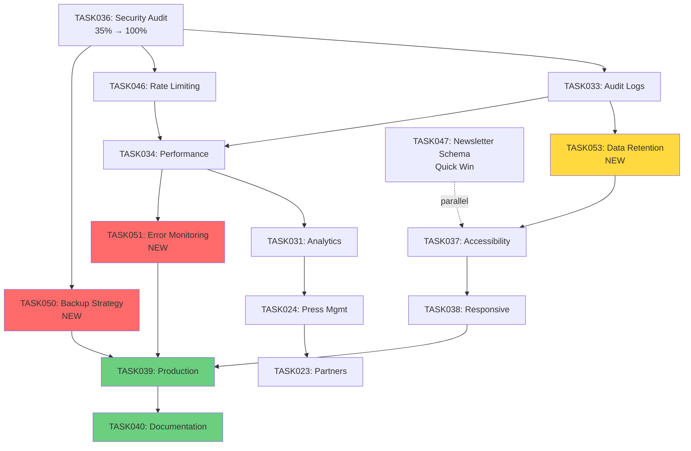

# 📋 Plan d'Implémentation TASKS Manquantes

## ✅ État Actuel Confirmé

```yaml
✅ Completed:
  - TASK027 (Company Content Management)
  - TASK028 (Content Versioning UI)
  - TASK035 (Testing Suite)
  - TASK036 (Security Audit) - 35% → besoin finalisation
```

---

## 🎯 PLAN RÉVISÉ - TASKS RESTANTES

### Phase 1: Finalisation Sécurité (CRITIQUE) - 3-5 jours

```yaml
priority: p0 (bloquant production)
status: partial (4/10 subtasks completed) -> finalize remaining subtasks

task036: security audit - finalisation
├─ already done: subtasks 1.6, 1.7, 1.8, 1.10
├─ remaining: 1.1, 1.2, 1.3, 1.4, 1.5, 1.9 (to be validated and scheduled)
└─ action: enumerate and assign remaining subtasks before starting phase 1 work

estimated: 3-5 jours
blocking: task039, task050
```

---

### Phase 2: Infrastructure Critique (NOUVEAU) - 1 semaine

```yaml
Priority: P0 (Manquant dans plan initial)

⚠️ TASK050: Database Backup & Recovery Strategy
├─ Configure Supabase PITR (Point-in-Time Recovery)
├─ Document restore procedures
├─ Test backup restoration (dry-run)
├─ Setup retention policies (30d/1y)
└─ Create runbook for emergency recovery

Estimated: 2-3 jours
Dépend de: TASK036
Bloquant pour: TASK039

⚠️ TASK051: Error Monitoring & Alerting
├─ Integrate Sentry (DSN + error boundaries)
├─ Configure alert thresholds
├─ Setup notification channels (Slack/email)
├─ Add custom error context (user, route, action)
└─ Document incident response procedures

Estimated: 2-3 jours
Dépend de: TASK034
Bloquant pour: TASK039
```

---

### Phase 3: Stabilité & Protection (IMPORTANT) - 1 semaine

note: `TASK046 (Rate-limiting)` and `TASK033 (Audit Logs Viewer)` are marked completed in project records (2026-01-04 and 2026-01-03 respectively) and are therefore not listed as open work here. They remain as references.

```yaml
priority: p1 (important before production)

# open items (if any additional protective work required, add here)
estimated: 0.5-1 jour (validation / smoke tests)
depends_on: task036
```

---

### Phase 4: Performance & Observability - 1 semaine

```yaml
Priority: P1 (Important pour UX)

TASK034: Performance Optimization
├─ Profile slow DB queries (DAL layer)
├─ Add missing indexes (based on RLS policies)
├─ Implement caching layers (revalidate tags)
├─ Reduce client bundle size (lazy-load)
└─ Document performance benchmarks

Estimated: 3-4 jours
Dépend de: TASK036, TASK046
Bloquant pour: TASK031, TASK051

TASK031: Analytics Dashboard
├─ Define metrics (pageviews, errors, performance)
├─ DAL aggregated queries (time-series)
├─ Dashboard UI (charts + date filters)
└─ Export options (CSV, JSON)

Estimated: 2-3 jours
Dépend de: TASK034, TASK033
Bloquant pour: TASK039
```

---

### Phase 5: Contenus Publics (FONCTIONNEL) - 1-2 semaines

```yaml
Priority: P2 (Fonctionnalités publiques)

TASK024: Press Management
├─ Confirm communiques_presse schema
├─ DAL CRUD + file attachments (Supabase Storage)
├─ Admin UI (RichText editor + preview)
├─ Access control (editors/admins only)
└─ Tests (upload rules, RLS policies)

Estimated: 4-5 jours
Dépend de: TASK036, TASK046
Bloquant pour: TASK039

TASK023: Partners Management
├─ Confirm partners schema (logo_url, display_order)
├─ DAL methods (persistence + ordering)
├─ Admin UI (list, upload, drag-to-reorder)
└─ Persist ordering + revalidate fragments

Estimated: 3-4 jours
Dépend de: TASK029 ✅ (Media Library completed)
Bloquant pour: TASK039
```

---

### Phase 6: Qualité & Conformité (PRÉ-PRODUCTION) - 1 semaine

```yaml
Priority: P2 (Conformité réglementaire)

🟡 TASK053: Data Retention Automation (NOUVEAU)
├─ Newsletter unsubscribers: auto-delete after 90j (configurable)
├─ Audit logs: retention 1 year
├─ Contact messages: configurable retention
└─ Setup cron job (pg_cron or Edge Function)

Estimated: 1-2 jours
Depends_on: task033 (completed) — can be implemented in parallel
Blocking: task037, task039

TASK047: Newsletter Schema Extraction
├─ Create lib/schemas/newsletter.ts
├─ Export in lib/schemas/index.ts
├─ Remove from lib/schemas/contact.ts
├─ Update imports in consumers
└─ Verify build + lint

Estimated: 1 jour (quick win)
Dépend de: Rien (parallélisable)
Bloquant pour: Rien

TASK037: Accessibility Compliance
├─ Run axe-core audits (key pages)
├─ Fix contrast, semantics, keyboard nav
├─ Add accessibility tests in CI
└─ Produce accessibility report (WCAG 2.1 AA)

Estimated: 3-4 jours
Dépend de: TASK053
Bloquant pour: TASK039

TASK038: Responsive Testing
├─ Define device matrix (mobile/tablet/desktop)
├─ Add Playwright tests (device simulations)
├─ Run visual diffs (regressions)
└─ Fix UI breakpoints + touch targets

Estimated: 2-3 jours
Dépend de: TASK037
Bloquant pour: TASK039
```

---

### Phase 7: Déploiement Final (RELEASE) - 1 semaine

```yaml
Priority: P0 (Orchestration finale)

TASK039: Production Deployment
├─ Configure CI pipeline (lint, tests, build)
├─ Setup secrets management (env vars)
├─ Add health checks + monitoring
├─ Perform staged rollout + smoke tests
└─ Create deployment runbook

Estimated: 3-4 jours
Dépend de: TOUTES les tasks précédentes
Bloquant pour: TASK040

TASK040: Documentation
├─ Draft admin user guide (common tasks)
├─ Technical docs (architecture, DAL patterns)
├─ Deployment runbook (operations)
└─ Co-locate docs in memory-bank/ + README links

Estimated: 2-3 jours
Dépend de: TASK039
Bloquant pour: Launch
```

---

## 📊 TIMELINE ESTIMÉE

```yaml
Phase 1 (Sécurité):        1 semaine  (TASK036 finalization)
Phase 2 (Infrastructure):  1 semaine  (TASK050, TASK051)
Phase 3 (Stabilité):       1 semaine  (TASK046, TASK033)
Phase 4 (Performance):     1 semaine  (TASK034, TASK031)
Phase 5 (Contenus):        1-2 sem.   (TASK024, TASK023)
Phase 6 (Conformité):      1 semaine  (TASK053, TASK047, TASK037, TASK038)
Phase 7 (Déploiement):     1 semaine  (TASK039, TASK040)

TOTAL: 5-6 semaines réalistes (avec 1 dev full-time) — corrections appliquées: TASK033/TASK046 sont complétées, TASK047 repositionnée
```

---

## 🆕 NOUVELLES TASKS À CRÉER

### TASK050: Database Backup & Recovery Strategy

```markdown
# [TASK050] - Database Backup & Recovery Strategy

**Status:** Not Started  
**Priority:** P0 (Critical)  
**Added:** 2026-01-06  
**Updated:** 2026-01-06

## Original Request

Configure automated database backups, Point-in-Time Recovery (PITR), and document restore procedures before production deployment.

## Context

Current state:
- Migration history contains destructive operations (DROP CASCADE)
- No documented backup/restore procedures
- No tested recovery process
- PITR not configured on Supabase Cloud

## Thought Process

Backup strategy must cover:
1. **Automated backups** via Supabase PITR (30 days retention)
2. **Long-term archives** for compliance (1 year retention)
3. **Tested restore procedures** (dry-run validation)
4. **Emergency runbook** for incident response

## Implementation Plan

### Phase 1: Configure PITR (1 day)
- Enable PITR on Supabase Cloud project settings
- Configure retention period (30 days minimum)
- Document backup frequency (continuous WAL archiving)
- Test PITR restore to staging environment

### Phase 2: Long-term Archives (1 day)
- Setup weekly full backups via `supabase db dump`
- Store encrypted backups in external storage (S3/GCS)
- Configure lifecycle policies (1 year retention)
- Document archive restoration procedure

### Phase 3: Restore Testing (1 day)
- Create test restore scenario (data corruption simulation)
- Perform full database restore from PITR
- Perform full database restore from archive
- Document restore time (RTO) and data loss window (RPO)

### Phase 4: Runbook & Automation (1 day)
- Write emergency recovery runbook
- Create restore automation scripts
- Document stakeholder notification procedures
- Setup backup health monitoring alerts

## Progress Tracking

**Overall Status:** Not Started - 0%

### Subtasks

| ID | Description | Status | Updated | Notes |
|----|-------------|--------|---------|-------|
| 1.1 | Enable Supabase PITR | Not Started | - | 30d retention |
| 1.2 | Test PITR restore to staging | Not Started | - | Dry-run |
| 2.1 | Setup weekly backup automation | Not Started | - | S3/GCS storage |
| 2.2 | Configure lifecycle policies | Not Started | - | 1 year retention |
| 3.1 | Test PITR recovery | Not Started | - | Document RTO/RPO |
| 3.2 | Test archive recovery | Not Started | - | Cold backup |
| 4.1 | Write emergency runbook | Not Started | - | Operations guide |
| 4.2 | Create restore scripts | Not Started | - | Automation |

## Dependencies

- **Depends on:** TASK036 (Security Audit) - backup security validation
- **Blocks:** TASK039 (Production Deployment) - mandatory before launch

## Acceptance Criteria

- [ ] PITR enabled with 30-day retention
- [ ] Weekly backups stored in external storage (1 year retention)
- [ ] Full restore tested successfully (PITR + archive)
- [ ] Recovery Time Objective (RTO) documented: < 4 hours
- [ ] Recovery Point Objective (RPO) documented: < 15 minutes
- [ ] Emergency runbook written and reviewed
- [ ] Backup health monitoring alerts configured

## References

- Supabase PITR docs: https://supabase.com/docs/guides/platform/backups
- PostgreSQL WAL archiving: https://www.postgresql.org/docs/current/continuous-archiving.html
- RTO/RPO best practices: https://aws.amazon.com/blogs/storage/disaster-recovery-dr-architecture-on-aws-part-i-strategies-for-recovery-in-the-cloud/

## Progress Log

### 2026-01-06
- Task created (critical infrastructure requirement)
- Estimated effort: 3-4 days
```

---

### TASK051: Error Monitoring & Alerting

```markdown
# [TASK051] - Error Monitoring & Alerting

**Status:** Not Started  
**Priority:** P0 (Critical)  
**Added:** 2026-01-06  
**Updated:** 2026-01-06

## Original Request

Setup comprehensive error monitoring, alerting, and incident response procedures before production deployment.

## Context

Current state:
- No centralized error tracking
- No error boundaries in React components
- No automated alerts for critical errors
- No incident response procedures

## Thought Process

Error monitoring strategy:
1. **Sentry integration** for error tracking + performance
2. **React error boundaries** for graceful degradation
3. **Alert thresholds** for critical errors (rate-based)
4. **Notification channels** (Slack/email for on-call)

## Implementation Plan

### Phase 1: Sentry Integration (1 day)
- Create Sentry project (supabase.com/docs/guides/integrations/sentry)
- Add @sentry/nextjs package
- Configure DSN in environment variables
- Setup source maps upload in CI/CD

### Phase 2: Error Boundaries (1 day)
- Create RootErrorBoundary component
- Create PageErrorBoundary component
- Create ComponentErrorBoundary (granular)
- Add custom error context (user, route, action)

### Phase 3: Alert Configuration (1 day)
- Configure alert thresholds:
  - Critical: >10 errors/min (P0 alert)
  - High: >50 errors/hour (P1 alert)
  - DB connection failures (immediate alert)
- Setup notification channels:
  - Slack webhook for critical alerts
  - Email for high-priority alerts
- Test alert delivery (dry-run)

### Phase 4: Incident Response (1 day)
- Write incident response runbook
- Define error severity levels (P0/P1/P2/P3)
- Document escalation procedures
- Create error triage workflow

## Progress Tracking

**Overall Status:** Not Started - 0%

### Subtasks

| ID | Description | Status | Updated | Notes |
|----|-------------|--------|---------|-------|
| 1.1 | Create Sentry project | Not Started | - | DSN config |
| 1.2 | Install @sentry/nextjs | Not Started | - | Package |
| 1.3 | Configure source maps upload | Not Started | - | CI/CD |
| 2.1 | Create RootErrorBoundary | Not Started | - | App-level |
| 2.2 | Create PageErrorBoundary | Not Started | - | Page-level |
| 2.3 | Add custom error context | Not Started | - | User/route |
| 3.1 | Configure alert thresholds | Not Started | - | Rate-based |
| 3.2 | Setup Slack webhook | Not Started | - | Critical alerts |
| 3.3 | Test alert delivery | Not Started | - | Dry-run |
| 4.1 | Write incident runbook | Not Started | - | Operations |
| 4.2 | Define severity levels | Not Started | - | P0/P1/P2/P3 |

## Dependencies

- **Depends on:** TASK034 (Performance Optimization) - baseline metrics
- **Blocks:** TASK039 (Production Deployment) - mandatory observability

## Acceptance Criteria

- [ ] Sentry DSN configured in all environments (dev/staging/prod)
- [ ] Error boundaries implemented (3 levels: root/page/component)
- [ ] Source maps uploaded to Sentry (CI/CD automated)
- [ ] Alert thresholds configured (critical: >10/min, high: >50/hour)
- [ ] Notification channels tested (Slack webhook + email)
- [ ] Incident response runbook written and reviewed
- [ ] Error severity levels documented (P0/P1/P2/P3)

## References

- Sentry Next.js docs: https://docs.sentry.io/platforms/javascript/guides/nextjs/
- React Error Boundaries: https://react.dev/reference/react/Component#catching-rendering-errors-with-an-error-boundary
- Incident response best practices: https://response.pagerduty.com/

## Progress Log

### 2026-01-06
- Task created (critical observability requirement)
- Estimated effort: 3-4 days
```

---

### TASK053: Data Retention Automation

```markdown
# [TASK053] - Data Retention Automation

**Status:** Not Started  
**Priority:** P1 (Important)  
**Added:** 2026-01-06  
**Updated:** 2026-01-06

## Original Request

Automate RGPD-compliant data retention policies for newsletter unsubscribers, audit logs, and contact messages.

## Context

Current state:
- Newsletter retention policy documented (90 days) but not automated
- Audit logs retention undefined
- Contact messages retention undefined
- Manual purge required (operational burden)

## Thought Process

Data retention strategy:
1. **Newsletter unsubscribers:** Auto-delete after 90 days
2. **Audit logs:** Retention 1 year (compliance)
3. **Contact messages:** Configurable retention (30-180 days)
4. **Automation:** pg_cron (preferred) or Edge Function

## Implementation Plan

### Phase 1: Database Setup (1 day)
- Enable pg_cron extension on Supabase Cloud
- Create retention configuration table (if dynamic)
- Write SQL purge functions (idempotent)
- Test purge functions on staging data

### Phase 2: Automated Jobs (1 day)
- Schedule newsletter purge (daily at 02:00 UTC)
- Schedule audit logs purge (weekly at 03:00 UTC)
- Schedule contact messages purge (daily at 02:30 UTC)
- Add job monitoring (failed runs alert)

### Phase 3: Admin UI (optional, 1 day)
- Add retention policy configuration page
- Display next purge execution times
- Add manual purge triggers (admin action)
- Add purge history logs

## Progress Tracking

**Overall Status:** Not Started - 0%

### Subtasks

| ID | Description | Status | Updated | Notes |
|----|-------------|--------|---------|-------|
| 1.1 | Enable pg_cron extension | Not Started | - | Supabase Cloud |
| 1.2 | Create SQL purge functions | Not Started | - | Idempotent |
| 1.3 | Test purge on staging | Not Started | - | Dry-run |
| 2.1 | Schedule newsletter purge | Not Started | - | Daily 02:00 UTC |
| 2.2 | Schedule audit logs purge | Not Started | - | Weekly 03:00 UTC |
| 2.3 | Schedule contact purge | Not Started | - | Daily 02:30 UTC |
| 2.4 | Add job monitoring | Not Started | - | Failed runs alert |
| 3.1 | Admin UI (optional) | Not Started | - | Configuration page |

## Dependencies

- **Depends on:** TASK033 (Audit Logs Viewer) - logs table schema
- **Blocks:** TASK037 (Accessibility Compliance) - RGPD audit requirement

## Acceptance Criteria

- [ ] pg_cron enabled on Supabase Cloud
- [ ] Newsletter unsubscribers auto-deleted after 90 days
- [ ] Audit logs auto-deleted after 1 year
- [ ] Contact messages retention configurable (30-180 days)
- [ ] Scheduled jobs running successfully (daily/weekly)
- [ ] Failed purge jobs trigger alerts
- [ ] Purge operations logged in audit_logs table

## SQL Example

```sql
-- Newsletter unsubscribers purge (90 days)
CREATE OR REPLACE FUNCTION purge_newsletter_unsubscribers()
RETURNS void AS $$
BEGIN
  DELETE FROM public.abonnes_newsletter
  WHERE subscribed = false
    AND unsubscribed_at < now() - interval '90 days';
  
  INSERT INTO public.logs_audit (table_name, action, details)
  VALUES ('abonnes_newsletter', 'purge', 
          jsonb_build_object('deleted_rows', ROW_COUNT));
END;
$$ LANGUAGE plpgsql SECURITY DEFINER;

-- Schedule daily execution
SELECT cron.schedule(
  'newsletter-purge',
  '0 2 * * *', -- 02:00 UTC daily
  'SELECT purge_newsletter_unsubscribers()'
);
```

## References

- pg_cron documentation: https://supabase.com/docs/guides/database/extensions/pg_cron
- RGPD retention requirements: https://www.cnil.fr/fr/duree-de-conservation-comment-la-determiner

## Progress Log

### 2026-01-06

- Task created (RGPD compliance requirement)
- Estimated effort: 2-3 days

---

## 📋 TASKS À CRÉER IMMÉDIATEMENT

### Fichiers à créer dans `memory-bank/tasks/`

```bash
# Créer les 3 nouvelles tasks
touch memory-bank/tasks/TASK050-database-backup-recovery.md
touch memory-bank/tasks/TASK051-error-monitoring-alerting.md
touch memory-bank/tasks/TASK053-data-retention-automation.md

# Mettre à jour l'index
vim memory-bank/tasks/_index.md
```

---

## 📊 MATRICE DE DÉPENDANCES FINALE



---

## ✅ CHECKLIST DE CRÉATION

```yaml
☐ Créer TASK050-database-backup-recovery.md
☐ Créer TASK051-error-monitoring-alerting.md
☐ Créer TASK053-data-retention-automation.md
☐ Mettre à jour memory-bank/tasks/_index.md
☐ Mettre à jour memory-bank/activeContext.md
☐ Créer issues GitHub (#50, #51, #53)
☐ Ajouter dans projects board (colonnes: Not Started)
```

---

## 🎯 RÉSUMÉ EXÉCUTIF

**3 nouvelles tasks critiques identifiées** :

1. **TASK050** (P0) : Database Backup & Recovery → **Bloquant production**
2. **TASK051** (P0) : Error Monitoring & Alerting → **Bloquant production**
3. **TASK053** (P1) : Data Retention Automation → **Conformité RGPD**

**Estimation totale restante** : **7-8 semaines** (1 dev full-time)

**Ordre d'exécution recommandé** :

```
TASK036 (finalize) → TASK050 → TASK051 → TASK046 → TASK033
→ TASK034 → TASK031 → TASK024 → TASK023 → TASK053 → TASK047
→ TASK037 → TASK038 → TASK039 → TASK040
```

**Next action** : Créer les 3 fichiers de tasks + mettre à jour l'index ✅
