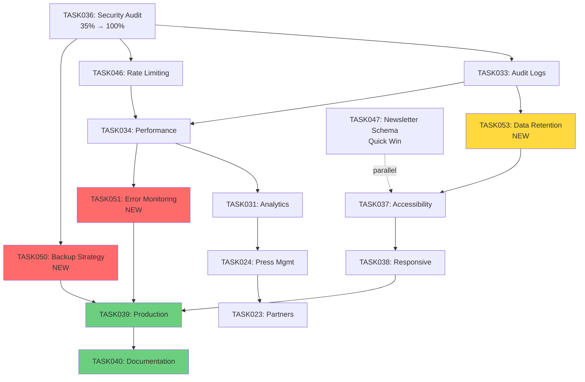

# 📋 Plan d'Implémentation TASKS Manquantes

## ✅ État Actuel Confirmé

```yaml
✅ Completed:
  - TASK027 (Company Content Management) - ✅ Complete (date TBD)
  - TASK028 (Content Versioning UI) - ✅ Complete (date TBD)
  - TASK035 (Testing Suite) - ✅ Complete (date TBD)
  - TASK036 (Security Audit) - ✅ 100% Complete (2026-01-03)
  - TASK033 (Audit Logs Viewer) - ✅ Complete (2026-01-03)
  - TASK046 (Rate-Limiting) - ✅ Complete (2026-01-04)
  - TASK050 (Database Backup & Recovery) - ✅ Complete (2026-01-14)
  - TASK051 (Error Monitoring & Alerting) - ✅ Complete (2026-01-14)
  - TASK034 (Performance Optimization) - ✅ Complete (2026-01-16)
  - TASK031 (Analytics Dashboard) - ✅ Complete (2026-01-17)
  - TASK047 (Newsletter Schema Extraction) - ✅ Complete (2026-01-17)
  - TASK053 (Data Retention Automation) - ✅ Complete (2026-01-18)
  - TASK023 (Partners Management) - ✅ Complete (2026-01-19)
  - TASK024 (Press Management) - ✅ Complete (2026-01-21)
```

---

## 🎯 PLAN RÉVISÉ - TASKS RESTANTES

### Phase 1: Infrastructure Critique (P0) - ✅ TASK051 Complete

```yaml
Priority: P0 (Critical for production)

✅ TASK050: Database Backup & Recovery Strategy (Complete 2026-01-14)
├─ ✅ Script pg_dump avec compression gzip
├─ ✅ Bucket Storage privé 'backups' avec RLS
├─ ✅ GitHub Actions workflow hebdomadaire (dimanche 3h UTC)
├─ ✅ Connection pooler configuré (port 6543)
└─ ✅ Runbook et documentation complète

Completed: 2026-01-14
TASK039 Unblocked: ✅

✅ TASK051: Error Monitoring & Alerting (Complete 2026-01-14)
├─ ✅ Sentry Integration (DSN + 4 config files)
├─ ✅ Error Boundaries (3 levels + error pages)
├─ ✅ Alert Configuration (P0/P1 + email <2min)
├─ ✅ Incident Response (runbook + severity levels)
└─ ✅ SENTRY_AUTH_TOKEN configured in GitHub

Completed: 2026-01-14
Production Ready: ✅
TASK039 Unblocked: ✅ (pending TASK050)
```

---

### Phase 2: Stabilité & Protection (IMPORTANT) - 0.5-1 jour

note: `TASK046 (Rate-limiting)`, `TASK033 (Audit Logs Viewer)`, and `TASK036 (Security Audit)` are marked completed in project records (2026-01-04, 2026-01-03, and 2026-01-03 respectively) and are therefore not listed as open work here.

```yaml
priority: p1 (validation / smoke tests)

# validation of completed security/protection tasks
estimated: 0.5-1 jour (integration testing)
depends_on: task050, task051 (from phase 1)
```

---

### Phase 3: Performance & Observability - ✅ COMPLÈTE

```yaml
Priority: P1 (Important pour UX)

✅ TASK034: Performance Optimization (Complete 2026-01-16)
├─ ✅ Removed artificial delays (5-8s gain)
├─ ✅ SELECT * → explicit columns (30-50% bandwidth)
├─ ✅ ISR on public pages (revalidate=60)
├─ ✅ Partial index spectacles.slug (20% improvement)
├─ ✅ Presse streaming with Suspense (TTI improved)
├─ ✅ Bundle analyzer installed
├─ ✅ revalidateTag + unstable_cache (granular invalidation)
└─ ✅ React cache() wrapper on 21 DAL functions

Completed: 2026-01-16
Dépendait de: TASK036, TASK046
Débloque: TASK031

✅ TASK031: Analytics Dashboard (Complete 2026-01-17)
├─ ✅ Define metrics (pageviews, errors, performance)
├─ ✅ DAL aggregated queries (time-series)
├─ ✅ Dashboard UI (charts + date filters 7/30/90d)
├─ ✅ Sentry API integration (14d limit)
└─ ✅ Export options (CSV, JSON)

Completed: 2026-01-17
Dépendait de: TASK034, TASK033
Débloque: TASK039
```

---

### Phase 4: Contenus Publics (FONCTIONNEL) - ✅ COMPLÈTE

```yaml
Priority: P2 (Fonctionnalités publiques)

✅ TASK024: Press Management (Complete 2026-01-21)
├─ ✅ 3 modules: Communiqués, Articles, Contacts presse
├─ ✅ DAL CRUD + Server Actions (21 functions, 11 actions)
├─ ✅ Admin UI with Tabs navigation + preview page
├─ ✅ Workflow brouillon/publié (is_public boolean)
└─ ✅ PDF support migration for medias bucket

Completed: 2026-01-21
Dépendait de: TASK036 ✅, TASK046 ✅
Débloque: TASK039

✅ TASK023: Partners Management (Complete 2026-01-19)
├─ ✅ DAL admin-partners.ts + home-partners.ts (Media Library join)
├─ ✅ Schemas partners.ts (Server + UI, bigint→number)
├─ ✅ Admin UI with @dnd-kit/core drag-and-drop reordering
├─ ✅ Migration 20260118234945_add_partners_media_folder.sql
└─ ✅ Dashboard stats + test scripts updated

Completed: 2026-01-19
Dépendait de: TASK029 ✅ (Media Library completed)
Débloque: TASK039
```

---

### Phase 5: Qualité & Conformité (PRÉ-PRODUCTION) - 1 semaine

```yaml
Priority: P2 (Conformité réglementaire)

✅ TASK053: Data Retention Automation (Complete 2026-01-18)
├─ ✅ data_retention_config + data_retention_audit tables
├─ ✅ 4 SECURITY DEFINER cleanup functions
├─ ✅ Edge Function scheduled-cleanup (Deno)
├─ ✅ pg_cron job: daily 2:00 AM UTC
└─ ✅ RGPD documentation complète

Completed: 2026-01-18
Dépendait de: TASK033 (completed)
Débloque: TASK037, TASK039

✅ TASK047: Newsletter Schema Extraction (Complete 2026-01-17)
├─ ✅ Created lib/schemas/newsletter.ts
├─ ✅ Exported in lib/schemas/index.ts
├─ ✅ Removed from lib/schemas/contact.ts
├─ ✅ Updated imports in consumers
└─ ✅ Verified build + lint

Completed: 2026-01-17
Estimation: 25 minutes (quick win)
Dépendait de: Rien (parallélisé)

TASK037: Accessibility Compliance
├─ Run axe-core audits (key pages)
├─ Fix contrast, semantics, keyboard nav
├─ Add accessibility tests in CI
└─ Produce accessibility report (WCAG 2.1 AA)

Estimated: 3-4 jours
Dépend de: TASK053
Bloquant pour: TASK039

TASK038: Responsive Testing
├─ Define device matrix (mobile/tablet/desktop)
├─ Add Playwright tests (device simulations)
├─ Run visual diffs (regressions)
└─ Fix UI breakpoints + touch targets

Estimated: 2-3 jours
Dépend de: TASK037
Bloquant pour: TASK039
```

---

### Phase 6: Déploiement Final (RELEASE) - 1 semaine

```yaml
Priority: P0 (Orchestration finale)

TASK039: Production Deployment
├─ Configure CI pipeline (lint, tests, build)
├─ Setup secrets management (env vars)
├─ Add health checks + monitoring
├─ Perform staged rollout + smoke tests
└─ Create deployment runbook

Estimated: 3-4 jours
Dépend de: TOUTES les tasks précédentes
Bloquant pour: TASK040

TASK040: Documentation
├─ Draft admin user guide (common tasks)
├─ Technical docs (architecture, DAL patterns)
├─ Deployment runbook (operations)
└─ Co-locate docs in memory-bank/ + README links

Estimated: 2-3 jours
Dépend de: TASK039
Bloquant pour: Launch
```

---

## 📊 TIMELINE ESTIMÉE

```yaml
✅ Phase 1 (Infrastructure):  COMPLÈTE  (TASK050, TASK051) - 2026-01-14
✅ Phase 2 (Stabilité):       COMPLÈTE  (Validation tests)
✅ Phase 3 (Performance):     COMPLÈTE  (TASK034, TASK031) - 2026-01-17
✅ Phase 4 (Contenus):        COMPLÈTE  (TASK024, TASK023) - 2026-01-21
✅ Phase 5 (Conformité):      COMPLÈTE  (TASK053, TASK047) - 2026-01-18
                              Restant: TASK037, TASK038
Phase 6 (Déploiement):     1 semaine  (TASK039, TASK040)

RESTANT: ~1-2 semaines réalistes (avec 1 dev full-time)

Note: 14 TASKS complétées sur 20 TASKS back-office
Progrès global: 70% des TASKS back-office terminées
```

---

## 🆕 NOUVELLES TASKS À CRÉER

### TASK050: Database Backup & Recovery Strategy

```markdown
# [TASK050] - Database Backup & Recovery Strategy

**Status:** Not Started  
**Priority:** P0 (Critical)  
**Added:** 2026-01-06  
**Updated:** 2026-01-06

## Original Request

Configure automated database backups, Point-in-Time Recovery (PITR), and document restore procedures before production deployment.

## Context

Current state:
- Migration history contains destructive operations (DROP CASCADE)
- No documented backup/restore procedures
- No tested recovery process
- PITR not configured on Supabase Cloud

## Thought Process

Backup strategy must cover:
1. **Automated backups** via Supabase PITR (30 days retention)
2. **Long-term archives** for compliance (1 year retention)
3. **Tested restore procedures** (dry-run validation)
4. **Emergency runbook** for incident response

## Implementation Plan

### Phase 1: Configure PITR (1 day)
- Enable PITR on Supabase Cloud project settings
- Configure retention period (30 days minimum)
- Document backup frequency (continuous WAL archiving)
- Test PITR restore to staging environment

### Phase 2: Long-term Archives (1 day)
- Setup weekly full backups via `supabase db dump`
- Store encrypted backups in external storage (S3/GCS)
- Configure lifecycle policies (1 year retention)
- Document archive restoration procedure

### Phase 3: Restore Testing (1 day)
- Create test restore scenario (data corruption simulation)
- Perform full database restore from PITR
- Perform full database restore from archive
- Document restore time (RTO) and data loss window (RPO)

### Phase 4: Runbook & Automation (1 day)
- Write emergency recovery runbook
- Create restore automation scripts
- Document stakeholder notification procedures
- Setup backup health monitoring alerts

## Progress Tracking

**Overall Status:** Not Started - 0%

### Subtasks

| ID | Description | Status | Updated | Notes |
|----|-------------|--------|---------|-------|
| 1.1 | Enable Supabase PITR | Not Started | - | 30d retention |
| 1.2 | Test PITR restore to staging | Not Started | - | Dry-run |
| 2.1 | Setup weekly backup automation | Not Started | - | S3/GCS storage |
| 2.2 | Configure lifecycle policies | Not Started | - | 1 year retention |
| 3.1 | Test PITR recovery | Not Started | - | Document RTO/RPO |
| 3.2 | Test archive recovery | Not Started | - | Cold backup |
| 4.1 | Write emergency runbook | Not Started | - | Operations guide |
| 4.2 | Create restore scripts | Not Started | - | Automation |

## Dependencies

- **Depends on:** TASK036 (Security Audit) - backup security validation
- **Blocks:** TASK039 (Production Deployment) - mandatory before launch

## Acceptance Criteria

- [ ] PITR enabled with 30-day retention
- [ ] Weekly backups stored in external storage (1 year retention)
- [ ] Full restore tested successfully (PITR + archive)
- [ ] Recovery Time Objective (RTO) documented: < 4 hours
- [ ] Recovery Point Objective (RPO) documented: < 15 minutes
- [ ] Emergency runbook written and reviewed
- [ ] Backup health monitoring alerts configured

## References

- Supabase PITR docs: https://supabase.com/docs/guides/platform/backups
- PostgreSQL WAL archiving: https://www.postgresql.org/docs/current/continuous-archiving.html
- RTO/RPO best practices: https://aws.amazon.com/blogs/storage/disaster-recovery-dr-architecture-on-aws-part-i-strategies-for-recovery-in-the-cloud/

## Progress Log

### 2026-01-06
- Task created (critical infrastructure requirement)
- Estimated effort: 3-4 days
```

---

### TASK051: Error Monitoring & Alerting

```markdown
# [TASK051] - Error Monitoring & Alerting

**Status:** Not Started  
**Priority:** P0 (Critical)  
**Added:** 2026-01-05  
**Updated:** 2026-01-13

## Original Request

Setup comprehensive error monitoring, alerting, and incident response procedures before production deployment.

## Context

Current state:
- No centralized error tracking (dispersed logs, console.log usage)
- No error boundaries in React components
- No automated alerts for critical errors
- No incident response procedures documented
- MTTR (Mean Time To Recovery) unknown and untracked

Production requirements:
- Fast incident detection and notification
- Graceful error handling (user experience)
- Detailed error context for debugging
- Clear escalation procedures

## Thought Process

Error monitoring strategy must cover 4 layers:
1. **Sentry integration** for centralized error tracking + performance monitoring
2. **React error boundaries** for graceful UI degradation
3. **Alert thresholds** for critical errors (rate-based triggers)
4. **Notification channels** (Slack/email for on-call response)

## Implementation Plan

### Phase 1: Sentry Integration (1 day)
- Create Sentry project (Next.js template)
- Add `@sentry/nextjs` package
- Configure DSN in environment variables (T3 Env)
- Setup source maps upload in CI/CD (Vercel integration)
- Add release tagging for version tracking
- Test error capture on staging

### Phase 2: Error Boundaries (1 day)
- Create `RootErrorBoundary` component (app-level catch-all)
- Create `PageErrorBoundary` component (route-level)
- Create `ComponentErrorBoundary` (granular, reusable)
- Add custom error context to Sentry:
  - User ID (if authenticated)
  - Current route/pathname
  - Server Action name (if applicable)
  - Request ID for tracing
- Implement fallback UI components (user-friendly error states)

### Phase 3: Alert Configuration (1 day)
- Configure alert thresholds in Sentry:
  - **Critical (P0)**: >10 errors/min → immediate alert
  - **High (P1)**: >50 errors/hour → urgent alert
  - **DB connection failures** → immediate alert
  - **Auth failures spike** → security alert
- Setup notification channels:
  - Slack webhook for critical/high alerts
  - Email for daily digest and P1 alerts
- Configure alert rules (deduplication, rate limits)
- Test alert delivery (simulate error scenarios)

### Phase 4: Incident Response (1 day)
- Write incident response runbook:
  - Detection → Triage → Mitigation → Resolution → Postmortem
- Define error severity levels:
  - **P0**: Service down, data loss risk → 15min response
  - **P1**: Major feature broken → 1h response
  - **P2**: Minor feature degraded → 4h response
  - **P3**: Cosmetic/low impact → Next sprint
- Document escalation procedures (who to contact)
- Create error triage workflow (Sentry → Slack → Action)
- Setup on-call rotation (if applicable)

## Progress Tracking

**Overall Status:** Not Started - 0%

### Subtasks

| ID | Description | Status | Updated | Notes |
|----|-------------|--------|---------|-------|
| 1.1 | Create Sentry project | Not Started | - | Next.js template |
| 1.2 | Install @sentry/nextjs | Not Started | - | Package + config |
| 1.3 | Configure DSN in T3 Env | Not Started | - | SENTRY_DSN env var |
| 1.4 | Setup source maps upload | Not Started | - | Vercel CI integration |
| 2.1 | Create RootErrorBoundary | Not Started | - | App-level catch-all |
| 2.2 | Create PageErrorBoundary | Not Started | - | Route-level |
| 2.3 | Create ComponentErrorBoundary | Not Started | - | Reusable wrapper |
| 2.4 | Add custom error context | Not Started | - | User/route/action |
| 3.1 | Configure alert thresholds | Not Started | - | P0: >10/min, P1: >50/h |
| 3.2 | Setup Slack webhook | Not Started | - | Critical alerts channel |
| 3.3 | Setup email notifications | Not Started | - | Daily digest + P1 |
| 3.4 | Test alert delivery | Not Started | - | Simulate errors |
| 4.1 | Write incident response runbook | Not Started | - | Detection → Postmortem |
| 4.2 | Define severity levels (P0-P3) | Not Started | - | Response time SLAs |
| 4.3 | Document escalation procedures | Not Started | - | Contact list + workflow |

## Dependencies

- **Depends on:** TASK034 (Performance Optimization) - baseline metrics for anomaly detection
- **Blocks:** TASK039 (Production Deployment) - mandatory observability before launch

## Acceptance Criteria

- [ ] Sentry DSN configured in all environments (dev/staging/prod)
- [ ] Error boundaries implemented (3 levels: root/page/component)
- [ ] Source maps uploaded to Sentry (CI/CD automated via Vercel)
- [ ] Custom error context captured (user ID, route, action name)
- [ ] Alert thresholds configured (P0: >10/min, P1: >50/hour)
- [ ] Notification channels tested (Slack webhook + email)
- [ ] Incident response runbook written and reviewed
- [ ] Error severity levels documented (P0/P1/P2/P3 with SLAs)
- [ ] Test error successfully captured and alerted in staging

## Estimation

3-4 jours (4 phases × 1 jour)

## References

- Sentry Next.js SDK: https://docs.sentry.io/platforms/javascript/guides/nextjs/
- Sentry + Vercel integration: https://vercel.com/integrations/sentry
- React Error Boundaries: https://react.dev/reference/react/Component#catching-rendering-errors-with-an-error-boundary
- Incident response best practices: https://response.pagerduty.com/
- Error boundary patterns: https://kentcdodds.com/blog/use-react-error-boundary-to-handle-errors-in-react

## Progress Log

### 2026-01-05
- Task created (critical observability requirement for production)

### 2026-01-13
- Task documentation completed with full implementation plan
- Estimated effort: 3-4 days across 4 phases
```

---

### TASK053: Data Retention Automation

```markdown
# [TASK053] - Data Retention Automation

**Status:** Not Started  
**Priority:** P1 (Important)  
**Added:** 2026-01-06  
**Updated:** 2026-01-06

## Original Request

Automate RGPD-compliant data retention policies for newsletter unsubscribers, audit logs, and contact messages.

## Context

Current state:
- Newsletter retention policy documented (90 days) but not automated
- Audit logs retention undefined
- Contact messages retention undefined
- Manual purge required (operational burden)

## Thought Process

Data retention strategy:
1. **Newsletter unsubscribers:** Auto-delete after 90 days
2. **Audit logs:** Retention 1 year (compliance)
3. **Contact messages:** Configurable retention (30-180 days)
4. **Automation:** pg_cron (preferred) or Edge Function

## Implementation Plan

### Phase 1: Database Setup (1 day)
- Enable pg_cron extension on Supabase Cloud
- Create retention configuration table (if dynamic)
- Write SQL purge functions (idempotent)
- Test purge functions on staging data

### Phase 2: Automated Jobs (1 day)
- Schedule newsletter purge (daily at 02:00 UTC)
- Schedule audit logs purge (weekly at 03:00 UTC)
- Schedule contact messages purge (daily at 02:30 UTC)
- Add job monitoring (failed runs alert)

### Phase 3: Admin UI (optional, 1 day)
- Add retention policy configuration page
- Display next purge execution times
- Add manual purge triggers (admin action)
- Add purge history logs

## Progress Tracking

**Overall Status:** Not Started - 0%

### Subtasks

| ID | Description | Status | Updated | Notes |
|----|-------------|--------|---------|-------|
| 1.1 | Enable pg_cron extension | Not Started | - | Supabase Cloud |
| 1.2 | Create SQL purge functions | Not Started | - | Idempotent |
| 1.3 | Test purge on staging | Not Started | - | Dry-run |
| 2.1 | Schedule newsletter purge | Not Started | - | Daily 02:00 UTC |
| 2.2 | Schedule audit logs purge | Not Started | - | Weekly 03:00 UTC |
| 2.3 | Schedule contact purge | Not Started | - | Daily 02:30 UTC |
| 2.4 | Add job monitoring | Not Started | - | Failed runs alert |
| 3.1 | Admin UI (optional) | Not Started | - | Configuration page |

## Dependencies

- **Depends on:** TASK033 (Audit Logs Viewer) - logs table schema
- **Blocks:** TASK037 (Accessibility Compliance) - RGPD audit requirement

## Acceptance Criteria

- [ ] pg_cron enabled on Supabase Cloud
- [ ] Newsletter unsubscribers auto-deleted after 90 days
- [ ] Audit logs auto-deleted after 1 year
- [ ] Contact messages retention configurable (30-180 days)
- [ ] Scheduled jobs running successfully (daily/weekly)
- [ ] Failed purge jobs trigger alerts
- [ ] Purge operations logged in audit_logs table

## SQL Example

```sql
-- Newsletter unsubscribers purge (90 days)
CREATE OR REPLACE FUNCTION purge_newsletter_unsubscribers()
RETURNS void AS $$
BEGIN
  DELETE FROM public.abonnes_newsletter
  WHERE subscribed = false
    AND unsubscribed_at < now() - interval '90 days';
  
  INSERT INTO public.logs_audit (table_name, action, details)
  VALUES ('abonnes_newsletter', 'purge', 
          jsonb_build_object('deleted_rows', ROW_COUNT));
END;
$$ LANGUAGE plpgsql SECURITY DEFINER;

-- Schedule daily execution
SELECT cron.schedule(
  'newsletter-purge',
  '0 2 * * *', -- 02:00 UTC daily
  'SELECT purge_newsletter_unsubscribers()'
);
```

## References

- pg_cron documentation: https://supabase.com/docs/guides/database/extensions/pg_cron
- RGPD retention requirements: https://www.cnil.fr/fr/duree-de-conservation-comment-la-determiner

## Progress Log

### 2026-01-06

- Task created (RGPD compliance requirement)
- Estimated effort: 2-3 days

---

## 📋 TASKS À CRÉER IMMÉDIATEMENT

### Fichiers à créer dans `memory-bank/tasks/`

```bash
# Créer les 3 nouvelles tasks
touch memory-bank/tasks/TASK050-database-backup-recovery.md
touch memory-bank/tasks/TASK051-error-monitoring-alerting.md
touch memory-bank/tasks/TASK053-data-retention-automation.md

# Mettre à jour l'index
vim memory-bank/tasks/_index.md
```

---

## 📊 MATRICE DE DÉPENDANCES FINALE



---

## ✅ CHECKLIST DE CRÉATION

```yaml
☑ Créer TASK050-database-backup-recovery.md
☑ Créer TASK051-error-monitoring-alerting.md
☑ Créer TASK053-data-retention-automation.md
☑ Mettre à jour memory-bank/tasks/_index.md
☐ Mettre à jour memory-bank/activeContext.md
☐ Ajouter dans projects board (colonnes: Not Started)
```

---

## 🎯 RÉSUMÉ EXÉCUTIF

**3 nouvelles tasks critiques identifiées** :

1. **TASK050** (P0) : Database Backup & Recovery → **Bloquant production**
2. **TASK051** (P0) : Error Monitoring & Alerting → **Bloquant production**
3. **TASK053** (P1) : Data Retention Automation → **Conformité RGPD**

**Estimation totale restante** : **5-6 semaines réalistes** (1 dev full-time) — corrections appliquées: TASK033/TASK046 sont complétées, TASK047 repositionnée

**Ordre d'exécution recommandé** :

```bash
TASK036 (finalize) → TASK050 → TASK051 → TASK034 → TASK031 → TASK024 → TASK023 → TASK053 → TASK047
→ TASK037 → TASK038 → TASK039 → TASK040
```

**Next action (done)** : les 3 fichiers TASK050/051/053 ont été créés et `memory-bank/tasks/_index.md` mis à jour.
