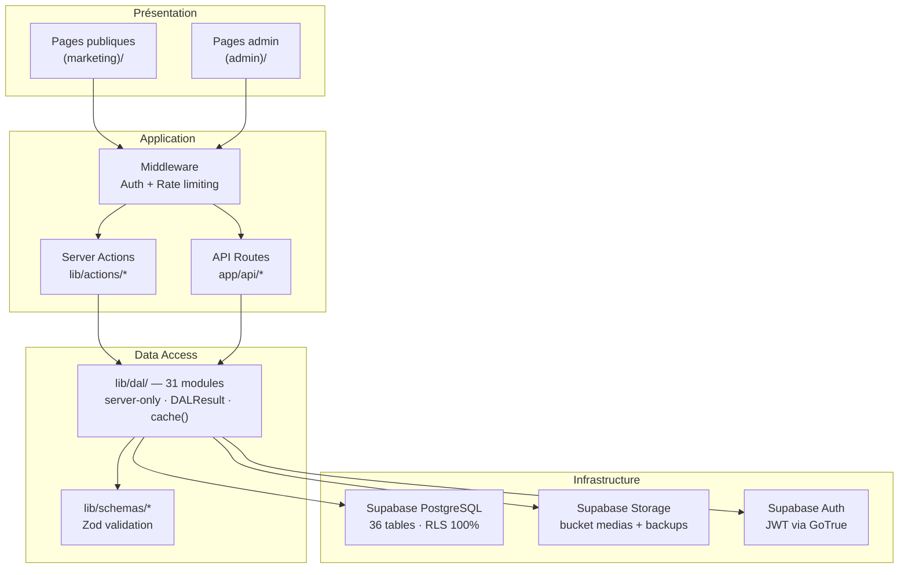
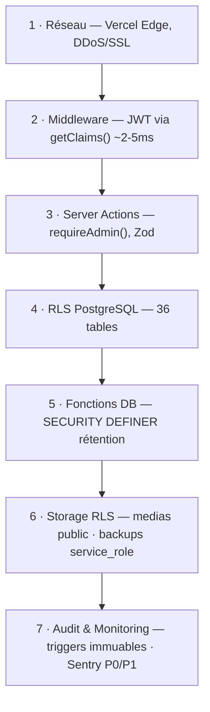

# Rouge Cardinal - Site web

[](https://deepwiki.com/YanBerdin/rougecardinalcompany)

Plateforme web officielle de la compagnie de théâtre Rouge Cardinal : vitrine publique, médiathèque, espace presse et back-office d'administration.

Rouge Cardinal Company est une application web pour une compagnie de théâtre conçue pour :

- présenter l’identité, l’équipe, les productions et partenaires
- gérer et afficher spectacles, événements et calendriers avec réordonnancement drag-and-drop
- fournir un espace presse professionnel
- gérer abonnements newsletter et formulaires de contact avec limitation de débit
- offrir une interface d’administration sécurisée avec versioning automatique
- suivre les événements analytiques et la santé via Sentry
- automatiser la rétention RGPD
- gérer une médiathèque complète avec déduplication SHA‑256, tags, dossiers et suivi d’usage.

**Le système sert trois groupes d’utilisateurs :**

- visiteurs anonymes
- utilisateurs authentifiés
- administrateurs, avec contrôle d’accès via Row Level Security (RLS) et une architecture de défense en profondeur sur sept couches.

---

## Table des matières

1. [Présentation](#présentation)
2. [Stack technique](#stack-technique)
3. [Architecture](#architecture)
4. [Sécurité](#sécurité)
5. [Installation](#installation)
6. [Commandes utiles](#commandes-utiles)
7. [Déploiement et migrations](#déploiement-et-migrations)
8. [État du projet](#état-du-projet)

---

## Présentation

Rouge Cardinal Company est une application web full-stack conçue pour :

- Présenter l'identité, l'équipe, les productions et partenaires de la compagnie
- Gérer et afficher spectacles, événements et calendriers avec réordonnancement drag-and-drop
- Fournir un espace presse professionnel (communiqués, articles, kit média)
- Gérer les abonnements newsletter et les formulaires de contact avec limitation de débit
- Offrir une interface d'administration sécurisée avec versioning automatique du contenu
- Suivre les événements analytiques et la santé applicative via Sentry
- Gérer une médiathèque complète avec déduplication SHA-256, tags, dossiers et suivi d'usage
- Automatiser la rétention RGPD

**Trois groupes d'utilisateurs :**

- Visiteurs anonymes
- Utilisateurs authentifiés
- Administrateurs — contrôle d'accès via Row Level Security (RLS) et architecture de défense en profondeur sur sept couches

---

## Stack technique

| Couche | Technologie | Version |
| -------- | ------------- | --------- |
| **Framework** | Next.js (App Router, Turbopack) | 16.1.5 |
| **Runtime** | React + React DOM | 19.2.0 |
| **Langage** | TypeScript (strict mode) | 5.x |
| **UI** | Tailwind CSS + shadcn/ui (Radix) | 3.4.1 |
| **Base de données** | Supabase PostgreSQL | 17.6.1.063 |
| **Auth** | Supabase Auth — `getClaims()` ~2-5ms | @supabase/ssr |
| **Validation** | Zod | 4.1.0 |
| **Email** | React Email + Resend SDK | v4 |
| **Formulaires** | react-hook-form + @hookform/resolvers | 7.65.0 |
| **Monitoring** | Sentry (client + server + edge) | @sentry/nextjs 10 |
| **Env** | T3 Env (@t3-oss/env-nextjs) | 0.13.10 |
| **Images** | Sharp (thumbnails 300×300 JPEG) | 0.34.5 |
| **DnD** | @dnd-kit/core + @dnd-kit/sortable | — |
| **Package manager** | pnpm | 9+ |

**Extensions PostgreSQL actives :** `pgcrypto`, `pg_trgm`, `unaccent`, `citext`

---

## Architecture

L'application suit le pattern App Router de Next.js avec une séparation stricte entre routes publiques `(marketing)` et protégées `(admin)`.

La couche intermédiaire applique les principes de Clean Architecture avec une Data Access Layer (DAL) serveur-only interfaçant exclusivement Supabase (PostgreSQL, Auth, Storage).



**Chiffres clés :**

- 14 sections admin (~30 pages), 9 pages publiques, 10 API Routes
- 31 modules DAL + 5 helpers
- 36 tables PostgreSQL, 100% RLS, 45 fichiers de schéma déclaratif
- 93 migrations SQL (sept. 2025 → fév. 2026)
- 87 scripts de test/audit/maintenance

---

## Sécurité

La sécurité est organisée en sept couches de défense en profondeur :



**Principes appliqués :** zero trust · least privilege · defense in depth · auditabilité · fail-secure

**Headers de sécurité (OWASP A05) :** CSP, HSTS, X-Frame-Options, X-Content-Type-Options, Referrer-Policy, Permissions-Policy

> [!NOTE]
> `script-src` contient encore `'unsafe-inline'` et `'unsafe-eval'`
> TODO pour la production : migrer vers nonces ou hashes.

---

## Installation

### Prérequis

- Node.js 20+
- pnpm 8+
- Supabase CLI (pour les migrations locales)
- Un projet Supabase configuré

### Étapes

```bash
# 1. Cloner et installer
git clone https://github.com/YanBerdin/rougecardinalcompany.git
cd rougecardinalcompany
pnpm install

# 2. Configurer les variables d'environnement
cp .env.example .env.local
# Éditez .env.local avec vos credentials Supabase et Resend

# 3. Valider les variables d'environnement (T3 Env)
pnpm exec tsx scripts/test-env-validation.ts

# 4. Créer l'utilisateur admin initial
pnpm exec tsx scripts/create-admin-user.ts

# 5. Démarrer le serveur de développement
pnpm dev
```

L'application sera disponible sur [http://localhost:3000](http://localhost:3000).

> [!NOTE]
> Pour tester les invitations par email et les notifications
> avec Resend en mode test, activez la redirection d'email dans `.env.local` :
>
>```env
> EMAIL_DEV_REDIRECT=true
> EMAIL_DEV_REDIRECT_TO=your-dev-email@example.com
>```

---

> [!CAUTION]
> Désactivez cette option avant tout déploiement en production.

---

## Commandes utiles

```bash
# Développement
pnpm dev            # Serveur dev (Turbopack)
pnpm build          # Build production
pnpm start          # Serveur production local

# Qualité
pnpm lint           # ESLint
pnpm lint:md        # Markdownlint

# Scripts
pnpm exec tsx scripts/<nom-du-script>.ts

# Base de données (Supabase CLI)
pnpm dlx supabase start          # Démarrer la DB locale
pnpm dlx supabase db diff -f <nom>  # Générer une migration
pnpm dlx supabase db push           # Appliquer les migrations
```

---

## Déploiement et migrations

**Déploiement recommandé :** Vercel (frontend) + Supabase Cloud (DB + Storage + Edge Functions)

### Workflow migrations (schéma déclaratif)

> [!IMPORTANT]
> Ne jamais modifier directement `supabase/migrations/`.
>
> La source de vérité est `supabase/schemas/`.

```bash
# Modifier le schéma
code supabase/schemas/XX_feature.sql

# Générer et appliquer la migration
pnpm dlx supabase db diff -f nom_migration
pnpm dlx supabase db push
```

### Edge Functions

```bash
pnpm dlx supabase functions deploy <function-name>
```

---

## État du projet

| Fonctionnalité | Statut |
| --- | --- |
| Site public (home, spectacles, presse, compagnie, agenda, contact) | ✅ Complet |
| RLS sur 36 tables | ✅ Complet |
| Dashboard admin (équipe, médias, partenaires, presse, config) | ✅ Complet |
| Intégration email (Resend + React Email) | ✅ Complet |
| Versioning contenu (9 types d'entités) | ✅ Complet |
| Médiathèque (SHA-256, tags, dossiers, thumbnails) | ✅ Complet |
| Rétention RGPD automatisée (Edge Function) | ✅ Complet |
| Monitoring Sentry multi-runtime | ✅ Complet |
| Backups automatiques (GitHub Actions hebdomadaire) | ✅ Complet |
| Tests E2E Playwright | 🔄 En cours (Phase 0) |
| Déploiement production | 🔄 En cours |

**Phase actuelle :** Infrastructure et site public finalisés. Extension des capacités admin en cours.

---

## Documentation interne

- Architecture détaillée :
  - `memory-bank/`
  - `memory-bank/architecture/Project_Architecture_Blueprint.md`
  - `memory-bank/architecture/Email_Service_Architecture.md`
  - `memory-bank/architecture/Project_Folders_Structure_Blueprint.md`
  - `memory-bank/systemPatterns.md`
- Guides opérationnels :
  - `memory-bank/procedures/admin-user-registration.md`
  - `doc/`
  - `memory-bank/architecture/dev-email-redirect.md`
  - `memory-bank/guide-url-images-externes.md`
  - `memory-bank/rate-limiting-media-upload.md`
- Schémas SQL : `supabase/schemas/`
  - `supabase/CLI-Supabase-Cloud.md`
  - `supabase/CLI-Supabase-Local.md`
  - `supabase/README.md`
  - `supabase/schemas/README.md`
- Scripts de test/audit :
  - `scripts/`
  - `scripts/README.md`
  - `doc/Email-Resend/TESTING_RESEND.md`
