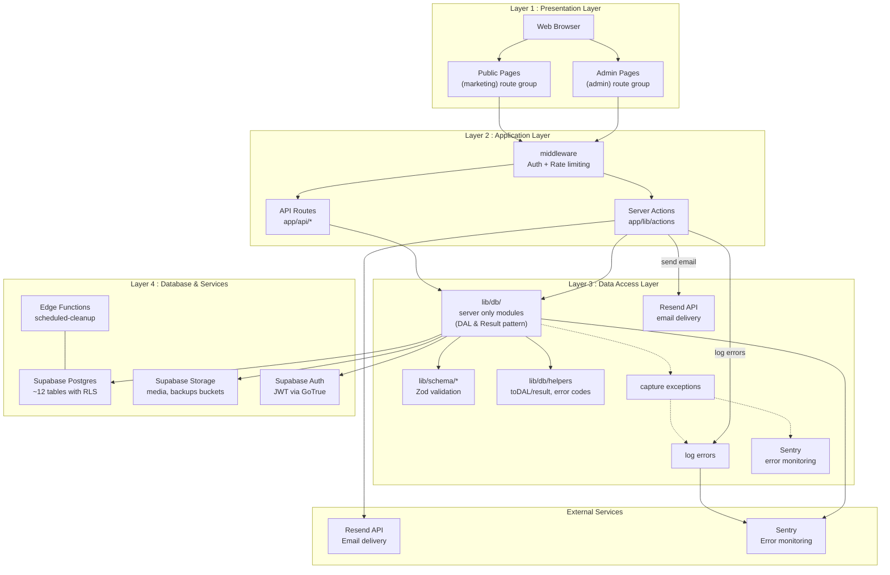

# Rouge Cardinal Company — Site web

> Plateforme web officielle de la compagnie de théâtre Rouge Cardinal : vitrine publique, médiathèque, espace presse et back‑office d'administration.

## Purpose and Scope

Rouge Cardinal Company est une application web pour une compagnie de théâtre conçue pour :

- présenter l’identité, l’équipe, les productions et partenaires
- gérer et afficher spectacles, événements et calendriers avec réordonnancement drag-and-drop
- fournir un espace presse professionnel
- gérer abonnements newsletter et formulaires de contact avec limitation de débit
- offrir une interface d’administration sécurisée avec versioning automatique
- suivre les événements analytiques et la santé via Sentry
- automatiser la rétention RGPD
- gérer une médiathèque complète avec déduplication SHA‑256, tags, dossiers et suivi d’usage.

**Le système sert trois groupes d’utilisateurs :**

- visiteurs anonymes
- utilisateurs authentifiés
- administrateurs, avec contrôle d’accès via Row Level Security (RLS) et une architecture de défense en profondeur sur sept couches.

## System Architecture

L’application suit le pattern App Router de Next.js 16 avec séparation stricte entre groupes de routes publiques (marketing) et protégées (admin).

La couche intermédiaire applique les principes de Clean Architecture avec une Data Access Layer (DAL) côté serveur, interfaçant exclusivement Supabase (PostgreSQL 17.6, Auth, Storage).

Les intégrations externes (Sentry, Resend) sont gérées au niveau des Server Actions. L’automatisation CI/CD inclut des backups hebdomadaires via GitHub Actions, audits de sécurité continus et couverture de tests (RLS, rate-limiting, CRUD).



Toutes les décisions clés incluent : rendu server-first (RSC par défaut), revalidatePath() uniquement dans Server Actions, RLS comme frontière de sécurité primaire, pattern DALResult pour gestion d’erreurs, et T3 Env pour configuration typée.

## Core Technologies

- **Frontend :** Next.js 16 (App Router), React 19, TypeScript 5.7+, Tailwind CSS 3.4, shadcn/ui (Radix).

- **Backend / BaaS :** Supabase (PostgreSQL 17.6.1.063, Auth, Storage, Edge Functions).

- **Email :** Resend avec React Email templates.

- **Validation :** Zod 3.24.1+.

- **Error monitoring :** Sentry 8.47.0.

- **Image processing :** Sharp pour thumbnails.

- **Package manager :** pnpm.

Chaque technologie est utilisée pour un but précis dans la pile (UI, stockage, authentification, envoi d’emails, monitoring, etc.).

## Application Structure

**Arborescence principale (extraits) :**

lib/dal/ — Data Access Layer.

components/features/ — composants par feature.

app/ — Next.js App Router (public-site/, admin/, api/).

Routes publiques : Home, Spectacles, Agenda, Presse, Contact, Compagnie.

Routes admin : Dashboard, Content Mgmt, Media Library, Analytics.

API routes : /api/contact, /api/newsletter, /api/webhooks/resend.

**Le pattern de mapping route → feature :** chaque page app/\[route]/page.tsx correspond à un module feature sous components/features/public-site/\[feature]/ et à un module DAL lib/dal/\[feature].ts.

## Data Architecture

La base contient 36 tables PostgreSQL organisées en groupes logiques : types de contenu, contenu homepage, gestion médias (déduplication SHA‑256, 9 dossiers de base), tables système (newsletter, contact, analytics, audit logs), configuration (toggles), versioning (9 tables suivies), et sécurité (RLS sur toutes les tables, 7 vues admin-only).

La médiathèque suit une organisation par dossiers reflétant les buckets Storage et suit l’usage des médias sur 7 types d’entités. La rétention automatisée gère la conformité RGPD (ex. logs d’audit 90 jours, messages contact 365 jours).

## Security Architecture

La sécurité est organisée en sept couches de défense en profondeur : réseau, middleware, server actions, RLS, fonctions DB, stockage, audit/monitoring. Les contrôles incluent DDoS/SSL via Vercel Edge, Next.js middleware avec getClaims() pour vérification JWT (2–5 ms), rate limiting LRU, guards requireAdmin(), Zod validation, RLS sur 36 tables avec politiques publiques/admin/restrictives, SECURITY DEFINER pour fonctions de rétention, Storage RLS (medias public read, backups service_role only), et audit triggers immuables sur 14 tables avec Sentry pour alertes P0/P1.

```mermaid
flowchart TB
  subgraph SevenLayerSecurity
    L1[Layer 1 Network Vercel Edge]
    L2[Layer 2 Middleware Next.js]
    L3[Layer 3 Server Actions Guards]
    L4[Layer 4 Database RLS]
    L5[Layer 5 Database Functions]
    L6[Layer 6 Storage RLS]
    L7[Layer 7 Audit & Monitoring]
  end
  ```

  L1 --> L2 --> L3 --> L4 --> L5 --> L6 --> L7

**🔒 Principes appliqués :**

- zero trust
- least privilege
- defense in depth
- auditabilité
- fail-secure.

## Declarative Schema Management

Le schéma est géré de manière déclarative via fichiers SQL numérotés dans supabase/schemas/ (01–62). Organisation typique :

- 01_extensions.sql (extensions pgcrypto, pg_trgm)

- 02_table_profiles.sql … 10_tables_system.sql (définitions + RLS)

- 02b_functions_core.sql (fonctions core comme is_admin())

- 02c_storage_buckets.sql (buckets Storage)

- 15_content_versioning.sql (versioning)

- 40_indexes.sql, 50_constraints.sql, 60-62_rls_*.sql (politiques legacy)

**Workflow :** modifier fichiers → supabase db diff -f migration_name → review → supabase db push.

## Container / View Pattern

**Frontend** sépare strictement Server Components (Containers) et Client Components (Views) :

**Container (Server Component) :** async, pas de "use client", appelle DAL, gère erreurs/loading, passe props sérialisables.

**View (Client Component) :** "use client", pure présentation, interactions via callbacks, pas d’accès DB direct.

Exemple de structure pour presse : PresseContainer.tsx (server) → PresseView.tsx (client).

## Email Service Architecture

Emails transactionnels via Resend et templates React Email. Architecture en couches :

**Template Layer :** composants React Email (emails/) avec wrapper email-layout.tsx.

**Action Layer :** lib/email/actions.ts (Server Actions : sendEmail(), sendNewsletterConfirmation(), sendContactNotification()).

**API Layer :** endpoints REST pour newsletter, contact, webhooks.

**Validation Layer :** Zod schemas (lib/email/schemas.ts).

**Pattern d’avertissement :** les opérations DB critiques sont effectuées en premier ; si l’envoi d’email échoue, l’opération retourne un succès avec warning plutôt que rollback complet.

## Content Versioning System

Les changements de contenu sont automatiquement versionnés via triggers DB. La table content_versions stocke des snapshots JSONB à chaque INSERT/UPDATE.

**Entités suivies (9 types) :** spectacle, article_presse, communique_presse, evenement, membre_equipe, partner, compagnie_value, compagnie_stat, compagnie_presentation_section.

**Types de changement :** create, update, publish/unpublish, restore. Fonction de restauration : SELECT public.restore_content_version(version_id); qui restaure et crée une nouvelle version avec change_type = 'restore'.

## Key Development Patterns

**DAL - SOLID :** lib/dal/* centralise les requêtes, modules server-only, 92% de conformité SOLID, retour systématique DALResult<T> (union discriminée) pour éviter exceptions non gérées.

**Server Actions + Warning Pattern :** mutations et uploads via Server Actions ; DB d’abord, notifications ensuite ; revalidatePath() uniquement dans Server Actions ; rollback de stockage si insertion metadata échoue.

**React Cache :** fonctions DAL en lecture enveloppées par cache() pour déduplication intra-request ; ISR (revalidate = 60) pour pages publiques.

**Suspense & Progressive Rendering :** utilisation de <Suspense> et fallback skeletons pour rendu progressif et streaming sur pages publiques.

Exemple de DALResult type et usage illustré dans lib/dal/presse.ts (pattern toDALResult).

## Project Status

**Fonctionnalités complétées :** site public (home, shows, press, company, agenda, contact), RLS sur 36 tables, dashboard admin avec gestion d’équipe et upload média, intégration email, système de versioning pour 9 types d’entités, gestion déclarative du schéma et migrations automatisées.

**Phase actuelle :** Phase 1 — site public et infrastructure fondationnels complétés ; extension des capacités admin pour autres types de contenu en cours (état octobre 2025). Réalisations récentes incluent résolution d’issues RLS, TASK022 Team Management, implémentation Storage bucket RLS, et simplification de l’architecture d’authentification.

## Démarrage rapide

Prérequis : Node.js 20+, pnpm, Supabase CLI (pour migrations locales)

1. installer les dépendances

```bash
pnpm install
```

2. démarrer l'environnement de développement

```bash
pnpm dev
# ou (si vous utilisez turbopack) : pnpm dev
```

3. valider les variables d'environnement (T3 Env)

```bash
pnpm exec tsx scripts/test-env-validation.ts
```

## Commandes utiles

- Linter : `pnpm lint`
- Tests unitaires / scripts : `pnpm test` ou `pnpm exec tsx scripts/<script>.ts`
- Build : `pnpm build`
- Start production (local) : `pnpm start`

## Déploiement et migrations

- Déploiement recommandé : Vercel (frontend) + Supabase (DB + Storage + Edge Functions)
- Migrations/schéma déclaratif : modifier `supabase/schemas/` puis générer migration avec :

```bash
pnpm dlx supabase db diff -f <migration_name>
pnpm dlx supabase db push
```

- Pour déployer les Edge Functions Supabase :

```bash
pnpm dlx supabase functions deploy <function-name>
```

> [!warning]
> Ne pas modifier directement `supabase/migrations/` sauf pour correctifs d'urgence. Suivre la politique déclarative décrite dans `.github/instructions/Declarative_Database_Schema.instructions.md`.

## Documentation & ressources

- Documentation interne et notes d'architecture : `memory-bank/`
- Guides et consignes opérationnelles : `doc/` (ex. `nextjs.instructions.md`)
- Migrations et SQL : `supabase/schemas/` et `supabase/migrations/`

Si vous avez besoin d'aide pour lancer le projet, exécuter une migration ou préparer un déploiement, dites‑moi ce que vous voulez faire et je vous guide pas à pas.

---

## Installation

```bash
# cloner et installer
git clone https://github.com/YanBerdin/rougecardinalcompany.git
cd rougecardinalcompany
pnpm install
```

# configurer les variables d'environnement

```bash
cp .env.example .env.local
# éditez .env.local avec vos credentials Supabase
```

> **Note (dev only)**: si vous testez les invitations localement et que votre fournisseur d'email (ex. Resend en test-mode) limite les destinataires, activez la redirection d'email de développement dans `.env.local`.

```bash
EMAIL_DEV_REDIRECT=true
EMAIL_DEV_REDIRECT_TO=your-dev-email@example.com
```

Lorsque `EMAIL_DEV_REDIRECT` est `true`, les emails d'invitation seront envoyés à l'adresse définie par `EMAIL_DEV_REDIRECT_TO` (utile pour tests locaux). Assurez-vous de désactiver cette option en production.

## Créer l'utilisateur admin initial

```bash
pnpm exec tsx scripts/create-admin-user.ts
```

## Démarrer le serveur dev

```bash
pnpm dev
```

L'application sera accessible sur http://localhost:3000

- Validation input côté serveur
- Protection XSS/CSRF/IDOR

### Performance & UX

- Suspense + Skeletons pour chargement progressif
- Images optimisées avec Next.js Image
- Accessibilité WCAG 2.5.5 (target size 44px minimum)
- SEO avec meta-tags dynamiques et sitemap

## Base de Données

- **25 tables principales** + **11 tables de liaison**
- Schéma déclaratif dans schemas
- Versioning automatique des contenus
- Triggers et fonctions pour audit et intégrité

## État du Projet

- Architecture mature avec patterns documentés
- Focus sur la sécurité et l'accessibilité
- Intégration email (Resend) et analytics
- Tests et scripts de validation

> [!NOTE]
> L'application suit les meilleures pratiques Next.js 16 avec un emphasis sur la sécurité, la performance et l'expérience utilisateur professionnelle.

## 🚀 Quick Start

### Prérequis

- Node.js 20+
- pnpm 8+
- Compte Supabase (projet remote configuré)

### Installation

```bash
# Cloner et installer
git clone https://github.com/YanBerdin/rougecardinalcompany.git
cd rougecardinalcompany
pnpm install
```

### Configuration des variables d'environnement

```bash
cp .env.example .env.local
# Éditez .env.local avec vos credentials Supabase
```

> **Note (dev only)**: si vous testez les invitations localement et que votre fournisseur d'email (ex. Resend en test-mode) limite les destinataires, activez la redirection d'email de développement dans `.env.local`.

```bash
EMAIL_DEV_REDIRECT=true
EMAIL_DEV_REDIRECT_TO=your-dev-email@example.com
```

Lorsque `EMAIL_DEV_REDIRECT` est `true`, les emails d'invitation seront envoyés à l'adresse définie par `EMAIL_DEV_REDIRECT_TO` (utile pour tests locaux). Assurez-vous de désactiver cette option en production.

### Créer l'utilisateur admin initial

```bash
pnpm exec tsx scripts/create-admin-user.ts
```

### Démarrer le serveur dev

```bash
pnpm dev
```

L'application sera accessible sur http://localhost:3000

### Gestion de la base de données

```bash
# Linker le projet remote
pnpm dlx supabase link --project-ref YOUR_PROJECT_ID

# Modifier le schéma déclaratif
code supabase/schemas/02a_policies_tables.sql

# Générer une migration
pnpm dlx supabase db diff --linked -f nom_migration

# Pousser vers remote
pnpm dlx supabase db push
```

### Authentification Admin

Si vous ne pouvez pas accéder aux pages `/admin` :

```bash
# Vérifier/créer l'utilisateur admin
pnpm exec tsx scripts/create-admin-user.ts
```

**Architecture à double couche** :

1. **JWT claims** : `app_metadata.role = 'admin'` (vérifié par middleware)
2. **Profil DB** : `public.profiles.role = 'admin'` (vérifié par RLS)

> [!IMPORTANT]
> **Les deux doivent être synchronisés** pour que l'authentification fonctionne.

---

> [!NOTE]
> Useful information that users should know, even when skimming content.

-

> [!TIP]
> Helpful advice for doing things better or more easily.

-

> [!IMPORTANT]
> Key information users need to know to achieve their goal.

-

> [!WARNING]
> Urgent info that needs immediate user attention to avoid problems.

-

> [!CAUTION]
> Advises about risks or negative outcomes of certain action.

[](https://deepwiki.com/YanBerdin/rougecardinalcompany)
