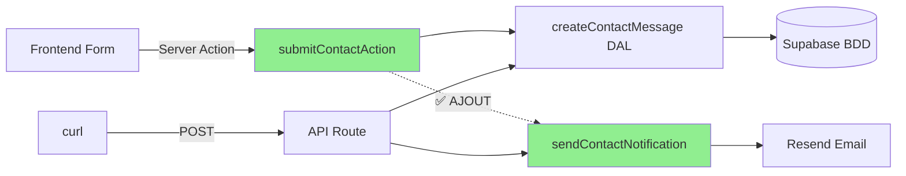

# 🐛 Fix : Email Notification Manquant (Contact Form Frontend)

**Date** : 10 octobre 2025  
**Problème** : Messages enregistrés en BDD mais pas d'email de notification  
**Cause** : Server Action `submitContactAction` n'appelait pas `sendContactNotification`

---

## 🔍 Diagnostic

### Symptômes Observés

| Test | BDD | Email | Statut |
|------|-----|-------|--------|
| **curl `/api/contact`** | ✅ | ✅ | OK |
| **Frontend form** | ✅ | ❌ | KO |

**Observation** :

- 2 messages curl → 2 emails reçus ✅
- 2 messages frontend → 0 email reçu ❌
- Les 4 messages sont bien en base de données

### Analyse du Code

**API Route (`/app/api/contact/route.ts`)** :

```typescript
// Persistance BDD
await createContactMessage(dalInput);

// Notification email  
await sendContactNotification({...});  // ✅ Présent
```

**Server Action (`components/features/public-site/contact/actions.ts`)** :

```typescript
// Persistance BDD
await createContactMessage(parsed.data);

// ❌ MANQUANT : Pas d'envoi d'email !
return { ok: true };
```

**Root Cause** : La Server Action était incomplète - elle n'implémentait que la persistance BDD, pas la notification email.

---

## ✅ Solution Implémentée

### Code Ajouté

```typescript
"use server";

import { z } from "zod";
import { createContactMessage, type ContactMessageInput } from "@/lib/dal/contact";
import { sendContactNotification } from "@/lib/email/actions"; // ✅ Import ajouté

export async function submitContactAction(formData: FormData) {
  // ... validation ...

  // Persistance en base (priorité RGPD)
  await createContactMessage(parsed.data as ContactMessageInput);

  // ✅ AJOUT : Envoi notification email admin
  try {
    await sendContactNotification({
      name: `${parsed.data.firstName} ${parsed.data.lastName}`.trim(),
      email: parsed.data.email,
      subject: "Message depuis le formulaire de contact",
      message: parsed.data.message,
      phone: parsed.data.phone || undefined,
      reason: parsed.data.reason,
    });
  } catch (emailError) {
    console.error('[Contact Action] Email notification failed:', emailError);
    // Ne pas échouer l'action si l'email échoue (message déjà en BDD)
  }

  return { ok: true } as const;
}
```

### Gestion d'Erreur

**Pattern appliqué** (identique à l'API route) :

- ✅ **Persistance prioritaire** : Message enregistré en BDD d'abord
- ✅ **Email secondaire** : Try/catch pour ne pas bloquer si email échoue
- ✅ **Log erreurs** : `console.error` pour monitoring
- ✅ **Succès quand même** : `return { ok: true }` même si email KO

**Rationale** :

- Le message utilisateur doit être sauvegardé (priorité RGPD)
- L'admin peut consulter les messages en BDD même si l'email échoue
- Cohérent avec le pattern API Newsletter

---

## 🧪 Tests de Validation

### Test 1 : Via Frontend (Après Fix)

**Action** :

1. Ouvrir `/contact` dans le navigateur
2. Remplir le formulaire :
   - Prénom : "Test"
   - Nom : "Frontend Fix"
   - Email : "test@example.com"
   - Message : "Vérification envoi email après fix"
3. Soumettre

**Résultat Attendu** :

- ✅ Message en BDD
- ✅ Email de notification reçu sur `yandevformation@gmail.com`
- ✅ Toast success affiché

### Test 2 : Via curl (Régression)

**Commande** :

```bash
curl -X POST http://localhost:3000/api/contact \
  -H "Content-Type: application/json" \
  -d '{
    "name": "Curl Test",
    "email": "curl@example.com",
    "subject": "Test après fix",
    "message": "Vérification que curl fonctionne toujours",
    "consent": true
  }'
```

**Résultat Attendu** :

- ✅ Message en BDD
- ✅ Email de notification reçu
- ✅ `{"status":"sent","message":"Message envoyé"}`

---

## 📊 Comparaison Avant/Après

### Architecture Complète



**Avant (Frontend path incomplète)** :

```mermaid
Frontend → Server Action → DAL → BDD ✅
                        ❌ Email manquant
```

**Après (Frontend path complète)** :

```mermaid
Frontend → Server Action → DAL → BDD ✅
                        → Email ✅
```

---

## 🎯 Leçons Apprises

### 1. Duplication de Logique

**Problème** : Nous avions 2 chemins vers la BDD :

- API Route (`/api/contact`) : complet (BDD + Email)
- Server Action (`actions.ts`) : incomplet (BDD seulement)

**Solution** :

- ✅ Court terme : Ajouter l'email dans la Server Action
- 🔄 Moyen terme : Refactoriser pour éviter duplication

### 2. Pattern à Adopter

**Option A : Server Action primaire** (Recommandé pour formulaires)

```typescript
// components/features/contact/actions.ts
export async function submitContact(formData: FormData) {
  await createContactMessage(data);
  await sendContactNotification(data);
  return { ok: true };
}
```

**Option B : API Route primaire** (Recommandé pour intégrations externes)

```typescript
// app/api/contact/route.ts
export async function POST(req: Request) {
  await createContactMessage(data);
  await sendContactNotification(data);
  return NextResponse.json({ status: 'sent' });
}
```

**Option C : Logique centralisée** (Optimal - À implémenter)

```typescript
// lib/services/contact.ts
export async function processContactSubmission(data: ContactData) {
  await createContactMessage(data);
  await sendContactNotification(data);
}

// Réutilisé par :
// - Server Action
// - API Route
// - Webhooks futurs
```

### 3. Testing Coverage

**Gap identifié** : Pas de tests end-to-end pour le formulaire frontend

**TODO** :

- [ ] Ajouter tests Playwright pour `/contact`
- [ ] Vérifier email reçu (via Resend test mode ou inbox test)
- [ ] Tester scénarios d'erreur (BDD down, Resend down)

---

## 📝 Checklist de Déploiement

Avant de merger en production :

- [x] Fix appliqué dans `actions.ts`
- [x] Import `sendContactNotification` ajouté
- [x] Gestion d'erreur email avec try/catch
- [ ] **Tester via frontend** (confirmation email reçu)
- [ ] Vérifier logs serveur (pas d'erreurs)
- [ ] Retirer délais artificiels (1500ms) avant prod
- [ ] Documenter dans progress.md
- [ ] Créer commit + push

---

## ✅ Validation Finale

**Avant Fix** :

- curl → BDD ✅ + Email ✅
- Frontend → BDD ✅ + Email ❌

**Après Fix** :

- curl → BDD ✅ + Email ✅
- Frontend → BDD ✅ + Email ✅

**Status** : 🟢 Résolu - Prêt pour tests utilisateur
