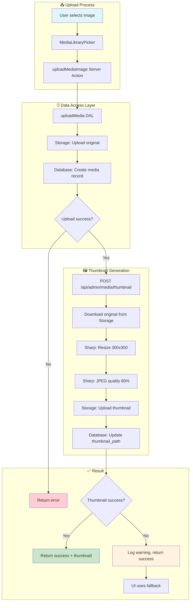

# Thumbnail Generation Flow

> Documentation du flux de génération des thumbnails dans le système Media Library

## Diagramme de flux



## Composants impliqués

### 1. Client Component - MediaLibraryPicker

**Fichier** : [components/features/admin/media/MediaLibraryPicker.tsx](../../components/features/admin/media/MediaLibraryPicker.tsx)

Déclenche l'upload via le Server Action `uploadMediaImage`.

### 2. Server Action - uploadMediaImage

**Fichier** : [lib/actions/media-actions.ts](../../lib/actions/media-actions.ts#L120-L200)

```typescript
// Ligne 164-184 : Appel API thumbnail (non-bloquant)
try {
  const response = await fetch(`${env.NEXT_PUBLIC_SITE_URL}/api/admin/media/thumbnail`, {
    method: "POST",
    headers: { "Content-Type": "application/json" },
    body: JSON.stringify({
      mediaId: parseInt(result.data.mediaId, 10),
      storagePath: result.data.storagePath,
    }),
  });

  if (!response.ok) {
    throw new Error(`Thumbnail API returned ${response.status}`);
  }

  const thumbResult = await response.json();
  console.log("[Media] Thumbnail generated:", thumbResult.thumbnailPath);
} catch (thumbError) {
  console.warn("[Media] Thumbnail generation failed (non-blocking):", thumbError);
}
```

### 3. DAL - uploadMedia

**Fichier** : [lib/dal/media.ts](../../lib/dal/media.ts#L80-L150)

- Upload fichier vers Supabase Storage
- Création enregistrement dans table `medias`
- Retourne `mediaId` et `storagePath`

### 4. API Route - Thumbnail Generation

**Fichier** : [app/api/admin/media/thumbnail/route.ts](../../app/api/admin/media/thumbnail/route.ts)

```typescript
// Paramètres Sharp
const THUMBNAIL_WIDTH = 300;
const THUMBNAIL_HEIGHT = 300;
const THUMBNAIL_QUALITY = 80;
const THUMBNAIL_FORMAT = 'jpeg';
```

**Étapes** :

1. Validation Zod : `mediaId` (number), `storagePath` (string)
2. Download original depuis Storage
3. Traitement Sharp : resize 300x300, cover, JPEG 80%
4. Upload thumbnail : `{storagePath}_thumb.jpg`
5. Update DB : `thumbnail_path`

### 5. Database Schema

**Table** : `public.medias`

| Colonne | Type | Description |
| --------- | ------ | ------------- |
| `id` | bigint | PK, auto-increment |
| `storage_path` | text | Chemin fichier original |
| `thumbnail_path` | text | Chemin thumbnail (nullable) |
| `mime_type` | text | Type MIME du fichier |
| `file_size` | integer | Taille en bytes |

### 6. UI Component - MediaCard

**Fichier** : [components/features/admin/media/MediaCard.tsx](../../components/features/admin/media/MediaCard.tsx)

**Pattern de fallback** :

```typescript
// Préférence : thumbnail > original > placeholder
const imageUrl = media.thumbnail_url || media.public_url || '/placeholder.svg';
```

## Paramètres de configuration

| Paramètre | Valeur | Description |
| ----------- | -------- | ------------- |
| `THUMBNAIL_WIDTH` | 300px | Largeur cible |
| `THUMBNAIL_HEIGHT` | 300px | Hauteur cible |
| `THUMBNAIL_QUALITY` | 80% | Qualité JPEG |
| `THUMBNAIL_FIT` | cover | Mode de redimensionnement |
| `THUMBNAIL_SUFFIX` | `_thumb.jpg` | Suffixe fichier |

## Formats supportés

### ✅ Génération de thumbnail

| Format | Extension | MIME Type |
| -------- | ----------- | ----------- |
| JPEG | .jpg, .jpeg | image/jpeg |
| PNG | .png | image/png |
| WebP | .webp | image/webp |
| GIF | .gif | image/gif |
| AVIF | .avif | image/avif |

### ⏭️ Pas de thumbnail (original utilisé)

| Format | Extension | MIME Type | Raison |
| -------- | ----------- | ----------- | -------- |
| SVG | .svg | image/svg+xml | Vectoriel, pas besoin |
| PDF | .pdf | application/pdf | Document, pas image |
| Video | .mp4, .webm | video/* | Pas supporté |

## Pattern non-bloquant

Le système utilise un **pattern non-bloquant** pour la génération de thumbnails :

1. **Upload réussit toujours** si le fichier original est uploadé
2. **Thumbnail en background** : si échec, warning logged mais pas d'erreur
3. **UI avec fallback** : affiche original si thumbnail absent

```yaml
┌──────────────────────────────────────────────────────┐
│ Upload original   ────────────────────► SUCCESS      │
│       │                                              │
│       ▼                                              │
│ Generate thumbnail ─── Success ──► thumbnail_path    │
│       │                                              │
│       └─────────── Failure ──► Warning (logged)      │
│                                UI uses original      │
└──────────────────────────────────────────────────────┘
```

## Scripts de diagnostic

| Script | Commande | Description |
| -------- | ---------- | ------------- |
| Check DB | `pnpm thumbnails:check` | Liste médias + status thumbnail |
| Check Storage | `pnpm thumbnails:check-storage` | Vérifie fichiers Storage |
| Regenerate LOCAL | `pnpm thumbnails:regenerate:local` | Régénère sur DB locale |
| Regenerate REMOTE | `pnpm thumbnails:regenerate:remote` | Dry-run production |
| Apply REMOTE | `pnpm thumbnails:regenerate:remote:apply` | Applique en production |

## Références

- [TASK029 - Media Library](../../memory-bank/tasks/tasks-completed/TASK029-media-library.md)
- [Thumbnail Debug & Fix](./THUMBNAIL-GENERATION-DEBUG-AND-FIX.md)
- [Scripts README](../../scripts/Thumbnails/README-thumbnails.md)
- [Sharp Documentation](https://sharp.pixelplumbing.com/)
