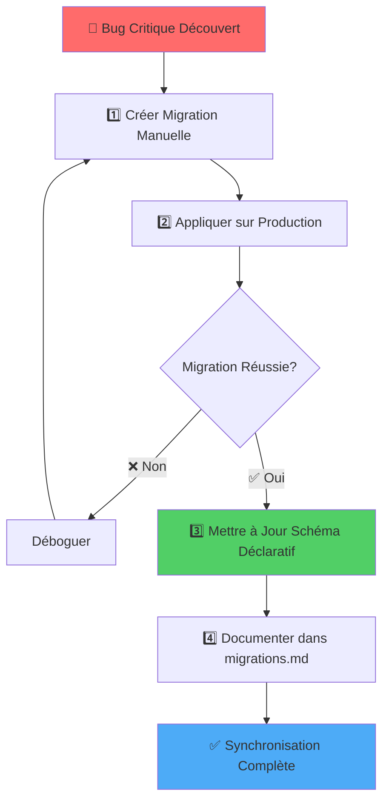

# Workflow de Synchronisation : Hotfix Migrations ↔ Schéma Déclaratif

## 🎯 Principe Fondamental

> **Le schéma déclaratif (`supabase/schemas/`) est TOUJOURS la source de vérité unique.**
>
> Les migrations manuelles de correctifs sont des **instantanés temporels** pour le déploiement rapide en production, mais doivent **toujours** être synchronisées avec le schéma déclaratif.

## 📋 Workflow Complet



## 📖 Étapes Détaillées

### 1️⃣ Création de la Migration Hotfix

**Quand ?** En cas de bug critique nécessitant un correctif immédiat en production.

```bash
# Créer migration manuelle avec timestamp
touch supabase/migrations/$(date +%Y%m%d%H%M%S)_fix_critical_bug.sql

# Éditer le fichier avec le correctif SQL
```

**Exemple réel du projet :**

```sql
-- supabase/migrations/20250918000000_fix_spectacles_versioning_trigger.sql
create or replace function public.spectacles_versioning_trigger()
returns trigger
language plpgsql
security invoker
set search_path = ''
as $$
begin
  -- FIX: Utilise 'public' au lieu de 'published_at' inexistant
  if OLD.public = false and NEW.public = true then
    -- ... logique corrigée
  end if;
  return NEW;
end;
$$;
```

### 2️⃣ Déploiement sur Production

```bash
# Appliquer la migration sur Supabase Cloud
pnpm dlx supabase db push

# Vérifier l'application
pnpm dlx supabase migration list --linked
```

**Validation :**

- ✅ Migration appliquée sans erreurs
- ✅ Bug corrigé en production
- ✅ Données intègres

### 3️⃣ Synchronisation du Schéma Déclaratif (OBLIGATOIRE)

**Pourquoi ?** Le schéma déclaratif doit refléter l'état actuel de la base de données.

**Action :** Éditer le fichier correspondant dans `supabase/schemas/`

```bash
# Identifier le fichier à modifier
# Exemple : trigger -> 15_content_versioning.sql
# Exemple : table -> 07e_table_home_about.sql

# Éditer le fichier avec les mêmes modifications que la migration
```

**Exemple réel du projet :**

```sql
-- supabase/schemas/15_content_versioning.sql
-- ✅ SYNCHRONISÉ avec migration 20250918000000

create or replace function public.spectacles_versioning_trigger()
returns trigger
language plpgsql
security invoker
set search_path = ''
as $$
begin
  -- FIX: Utilise 'public' au lieu de 'published_at' inexistant
  if OLD.public = false and NEW.public = true then
    -- ... logique corrigée
  end if;
  return NEW;
end;
$$;
```

### 4️⃣ Documentation de la Redondance

**Objectif :** Clarifier que la migration et le schéma déclaratif contiennent la même logique.

**Action :** Mettre à jour `supabase/migrations/migrations.md`

```markdown
## Corrections et fixes critiques

- `20250918000000_fix_spectacles_versioning_trigger.sql` — **FIX CRITIQUE** : Description du bug
  - ✅ **Intégré au schéma déclaratif** : `supabase/schemas/15_content_versioning.sql`
  - 📝 **Migration conservée** pour l'historique et la cohérence avec Supabase Cloud
```

## 🔄 Cas Réels du Projet

### Cas 1 : Trigger Versioning Spectacles

| Aspect | Détail |
|--------|--------|
| **Bug** | Trigger référençait `published_at` inexistant (erreur SQLSTATE 42703) |
| **Migration Hotfix** | `20250918000000_fix_spectacles_versioning_trigger.sql` |
| **Schéma Déclaratif** | `supabase/schemas/15_content_versioning.sql` |
| **Correctif** | Utilisation de `OLD.public` / `NEW.public` (boolean) |
| **État Actuel** | ✅ Migration conservée, schéma synchronisé |

### Cas 2 : Table Home About Content

| Aspect | Détail |
|--------|--------|
| **Problème** | Table absente sur Supabase Cloud |
| **Migration Hotfix** | `20250921112900_add_home_about_content.sql` |
| **Schéma Déclaratif** | `supabase/schemas/07e_table_home_about.sql` |
| **Correctif** | Création complète de la table avec RLS |
| **État Actuel** | ✅ Migration conservée, schéma existait déjà |

## ❓ Questions Fréquentes

### Faut-il supprimer les migrations hotfix après synchronisation ?

**Non, jamais.** Les migrations appliquées sur production doivent être conservées pour :

- ✅ Historique des correctifs
- ✅ Cohérence avec l'historique Supabase Cloud
- ✅ Reconstruction complète de la base depuis zéro

### Que se passe-t-il lors du prochain `supabase db diff` ?

Le diff sera généré depuis le schéma déclaratif synchronisé. Les migrations hotfix ne seront **pas** régénérées car le schéma contient déjà les corrections.

### Comment éviter les conflits entre migration et schéma ?

1. ✅ Toujours synchroniser le schéma après une migration hotfix
2. ✅ Documenter clairement la redondance dans `migrations.md`
3. ✅ Tester en local après synchronisation : `supabase db reset`

### Peut-on régénérer tout le schéma depuis zéro ?

**Oui**, mais attention :

```bash
# ⚠️ DANGEREUX en production - détruit toutes les données
supabase db reset

# Régénère migrations depuis schéma déclaratif
pnpm dlx supabase db diff -f regenerate_complete_schema

# Compare avec schéma existant
# Si différences = schéma pas synchronisé ❌
```

## ✅ Checklist de Synchronisation

Après chaque migration hotfix :

- [ ] Migration appliquée sur production avec succès
- [ ] Schéma déclaratif mis à jour avec les mêmes modifications
- [ ] Documentation `migrations.md` mise à jour
- [ ] Test local : `pnpm dlx supabase db reset` fonctionne sans erreur
- [ ] Commit Git : migration + schéma + documentation ensemble

## 🎯 Résumé

| Élément | Rôle | Durée de Vie |
|---------|------|--------------|
| **Migration Hotfix** | Déploiement rapide | Permanent (historique) |
| **Schéma Déclaratif** | Source de vérité | Permanent (évolutif) |
| **Documentation** | Clarification | Permanent (traçabilité) |

**Règle d'Or :**
> Chaque modification de schéma doit exister **une seule fois** dans le schéma déclaratif, mais peut avoir **plusieurs traces** dans l'historique des migrations pour des raisons de déploiement progressif.

---

**Dernière mise à jour :** 7 octobre 2025  
**Statut du projet :** ✅ Schéma synchronisé, 16 migrations appliquées, 36 tables en production
