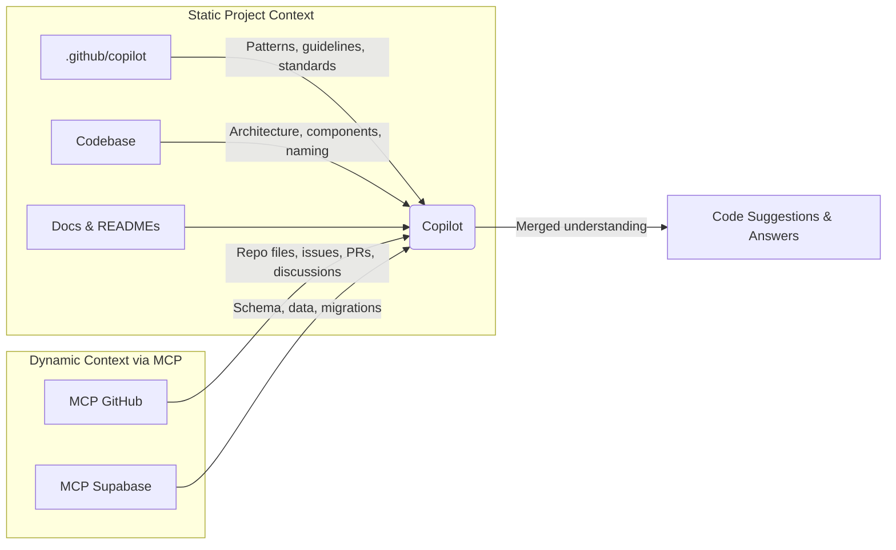

# MCP Context Flow

```mermaid

    flowchart LR
        subgraph StaticContext[Static Project Context]
            A[.github/copilot] -->|Patterns, guidelines, standards| M(Copilot)
            B[Codebase] -->|Architecture, components, naming| M
            C[Docs & READMEs] --> M
        end

        subgraph DynamicContext[Dynamic Context via MCP]
            G[MCP GitHub] -->|Repo files, issues, PRs, discussions| M
            S[MCP Supabase] -->|Schema, data, migrations| M
        end

        M(Copilot) -->|Merged understanding| Out[Code Suggestions & Answers]

```
