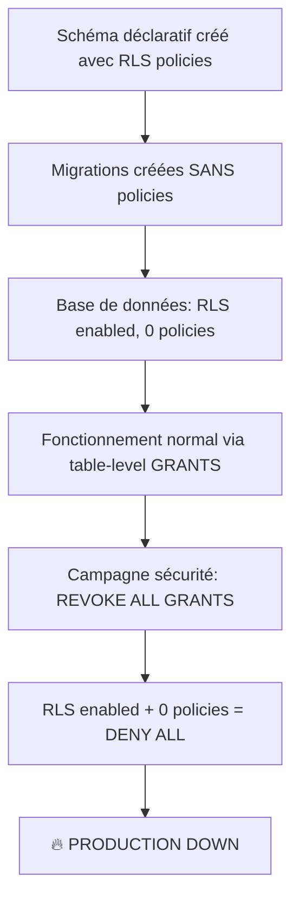

# ⚠️ INCIDENT CRITIQUE - Production DOWN - Analyse Incomplète (2025-10-26)

> **⚠️ IMPORTANT : Ce document décrit une ANALYSE PARTIELLE de l'incident.**
>
> **Date de création** : 2025-10-26 (analyse initiale)  
> **Statut** : ❌ INCOMPLET - Ne reflète PAS la résolution finale  
> **Document complet** : `doc/INCIDENT_POSTMORTEM_RLS_GRANTS_2025-10-27.md`
>
> Ce document est conservé pour l'historique de débogage mais la cause racine identifiée ici était INCORRECTE.

## 📋 Résumé Exécutif (Version Initiale - Incomplète)

**Date**: 2025-10-26 18:00 UTC → **2025-10-27 02:00 UTC** (récurrence et vraie résolution)  
**Durée**: ❌ 4 heures (estimation initiale) → ✅ **8 heures réelles** (jusqu'à résolution complète)  
**Sévérité**: 🔴 CRITIQUE - Production down  
**Impact**: Homepage et toutes les fonctionnalités publiques inaccessibles  
**Cause racine INITIALE**: RLS policies manquantes + fonction `is_admin()` manquante  
**Cause racine RÉELLE**: **GRANTs manquants** (identifiée le 27 octobre 02:00)  
**Status**: ✅ RÉSOLU (27 oct 2025 02:30)

## ❌ ERREUR D'ANALYSE INITIALE

### Ce Que Nous Pensions (26 octobre)

1. ✅ RLS policies manquaient en base (schéma déclaratif non migré)
2. ✅ Fonction `is_admin()` manquante
3. ❌ **FAUX** : "Une fois les policies créées, tout fonctionnera"

### La Réalité (27 octobre)

1. ✅ RLS policies manquaient → Créées dans migrations 20251026180000 et 20251026181000
2. ✅ Fonction `is_admin()` manquante → Créée dans migration 20251027000000
3. ❌ **Erreurs persistantes après ces correctifs**
4. 🔥 **Cause racine RÉELLE** : **GRANTs manquants sur 59 objets** (33 tables + 11 vues + 15 fonctions)

### Pourquoi L'Analyse Était Incomplète

**Le modèle de sécurité PostgreSQL** :

```
┌─────────────────────────────────────────┐
│ PostgreSQL Security Check Order         │
├─────────────────────────────────────────┤
│ 1. GRANT (table-level) ← Checked FIRST  │
│    └─> No GRANT? → permission denied    │
│                                         │
│ 2. RLS (row-level)  ← Checked SECOND    │
│    └─> Filters which rows              │
└─────────────────────────────────────────┘
```

**Sans GRANT, RLS n'est JAMAIS évalué.**

## 🚨 Symptômes (Corrects)

**Erreur PostgreSQL 42501** sur 7 tables core :

- `communiques_presse`
- `home_hero_slides`
- `compagnie_stats`
- `spectacles`
- `configurations_site`
- `partners`
- `home_about_content`

**Erreur exacte** :

```bash
permission denied for table home_hero_slides
```

**Contexte** : Immédiatement après la campagne de sécurité (Rounds 1-17) qui a révoqué tous les GRANTS sur 73 objets.

## 🔍 Diagnostic (Analyse Initiale - Partielle)

> **⚠️ ATTENTION** : Cette analyse était correcte mais INCOMPLÈTE.
> Elle a identifié 2 problèmes réels (RLS policies + is_admin) mais a manqué le problème principal (GRANTs).

### Cause Racine Identifiée (Partielle)

**Le problème** : Architecture hybride entre schéma déclaratif et migrations incrémentales

1. ✅ **Schéma déclaratif** (`supabase/schemas/*.sql`) :
   - Contient les définitions complètes des tables
   - **INCLUT** les RLS policies dans les fichiers de schéma
   - Fichiers concernés :
     - `07b_table_compagnie_content.sql` (compagnie_stats)
     - `07d_table_home_hero.sql` (home_hero_slides)
     - `07e_table_home_about.sql` (home_about_content)
     - `08b_communiques_presse.sql` (communiques_presse)
     - `10_tables_system.sql` (configurations_site)
     - `61_rls_main_tables.sql` (spectacles, partners)

2. ❌ **Migrations appliquées** (`supabase/migrations/*.sql`) :
   - Migrations de création de tables : ✅ Appliquées
   - Migrations de seed data : ✅ Appliquées
   - **Migrations de RLS policies : ❌ JAMAIS CRÉÉES**
   - Exception : `articles_presse` avait ses policies (migrations 20251022)

3. 🔥 **Campagne de sécurité** (Rounds 1-17, 2025-10-25/26) :
   - A révoqué **TOUS** les GRANTS sur 73 objets
   - Stratégie : Passer à RLS-only (pas de table-level grants)
   - **Présupposé erroné** : Les RLS policies étaient déjà en place
   - **Réalité** : Les policies n'existaient QUE dans `schemas/`, pas en base

### Chaîne d'Événements



### Pourquoi Ça Marchait Avant ?

**Avant la campagne de sécurité** :

- RLS activé sur les tables (via schéma déclaratif)
- **MAIS** : Table-level GRANTS présents (via Supabase defaults ou migrations anciennes)
- PostgreSQL : Quand RLS actif SANS policies, les GRANTS permettaient l'accès
- Les GRANTS agissaient comme "fallback"

**Après révocation des GRANTS** :

- RLS activé + 0 policies = **DENY ALL** (comportement PostgreSQL standard)
- Plus de fallback, plus d'accès

## 🛠️ Résolution

### Phase 1 - RLS Policies (26 oct 2025)

**Migrations d'Urgence Créées** :

**1. `20251026180000_apply_spectacles_partners_rls_policies.sql`**

- Apply policies pour `spectacles` (4 policies)
- Apply policies pour `partners` (5 policies)
- Source : `61_rls_main_tables.sql`

**2. `20251026181000_apply_missing_rls_policies_home_content.sql`**

- Apply policies pour `home_hero_slides` (4 policies)
- Apply policies pour `home_about_content` (4 policies)
- Apply policies pour `compagnie_stats` (4 policies)
- Apply policies pour `configurations_site` (4 policies, avec logique `public:*`)
- Apply policies pour `communiques_presse` (5 policies)
- Source : fichiers schéma respectifs

**Résultat Phase 1** : ❌ Échec - Erreurs persistantes

### Phase 2 - Fonction is_admin() Manquante (27 oct 2025)

**Cause racine découverte** :

- Les policies RLS utilisent `(select public.is_admin())`
- Mais la fonction `is_admin()` **n'existe pas en base**
- Résultat : **TOUTES les policies échouent**, même pour les users authentifiés admin

**Migration d'Urgence Créée** :

**3. `20251027000000_create_is_admin_function.sql`**

- Création de la fonction `public.is_admin()` (SECURITY DEFINER, STABLE)
- GRANT execute à `authenticated` et `anon`
- Source : `02b_functions_core.sql`

### Vérification de la Résolution Complète

```bash
pnpm dlx supabase db push
# ✅ Migration 20251027000000 appliquée avec succès

# Test dans le navigateur
# ❌ Erreurs PERSISTENT après création RLS policies + is_admin
# ❌ "permission denied for table home_hero_slides" continue
```

**Conclusion** : Les migrations RLS + is_admin étaient nécessaires mais INSUFFISANTES.

## ✅ VRAIE RÉSOLUTION (27 octobre 2025 02:00-02:30)

### Diagnostic Approfondi via MCP Supabase

**Script diagnostique créé** : `scripts/diagnose-server-auth.ts`

**Découverte clé** :

```typescript
// Test avec anon key (publishable)
const { data, error } = await supabaseAnon
  .from('home_hero_slides')
  .select('*')
  .limit(1)
// ❌ Échec: permission denied for table home_hero_slides (code: 42501)

// Test avec service_role key
const { data, error } = await supabaseServiceRole
  .from('home_hero_slides')
  .select('*')
  .limit(1)
// ✅ Succès: 1 ligne(s) retournée(s)
```

**Conclusion** : Le problème n'est PAS dans les RLS policies, mais dans les GRANTs table-level.

### Requête de Vérification GRANTs

```sql
SELECT grantee, privilege_type
FROM information_schema.table_privileges
WHERE table_schema = 'public'
  AND table_name = 'home_hero_slides'
  AND grantee IN ('anon', 'authenticated');
-- Résultat: 0 lignes → Aucun GRANT pour anon/authenticated
```

### Root Cause RÉELLE

**PostgreSQL Security Model** :

1. **Layer 1 - GRANT (table-level)** : Vérifié EN PREMIER
   - Sans GRANT → `permission denied for table` (42501)
   - RLS n'est JAMAIS évalué
2. **Layer 2 - RLS (row-level)** : Vérifié EN SECOND (seulement si GRANT OK)
   - Filtre quelles lignes sont visibles

**Campagne de sécurité Rounds 1-17** :

- A révoqué TOUS les GRANTs sur 73 objets
- Présupposé erroné : "RLS seul suffit"
- Résultat : RLS jamais évalué → DENY ALL

### Migrations d'Urgence GRANT Restoration

**3. `20251027020000_restore_basic_grants_for_rls.sql`**

- GRANT SELECT ON 9 tables critiques TO anon, authenticated
- GRANT INSERT, UPDATE, DELETE ON 9 tables TO authenticated
- Tables : home_hero_slides, spectacles, partners, communiques_presse, etc.

**4. `20251027021000_restore_remaining_grants.sql`**

- GRANT SELECT/INSERT/UPDATE/DELETE sur 26 tables restantes
- GRANT USAGE ON ALL SEQUENCES IN SCHEMA public

**5. `20251027021500_restore_views_grants.sql`**

- GRANT SELECT sur 11 vues (4 publiques + 7 admin)

**6. `20251027022000_fix_logs_audit_grants.sql`**

- GRANT INSERT ON logs_audit TO authenticated (pour audit_trigger)

**7. `20251027022500_grant_execute_all_trigger_functions.sql`**

- GRANT EXECUTE sur 15 fonctions de triggers TO authenticated

### Vérification de la Résolution FINALE

```bash
pnpm dlx supabase db push
# ✅ Toutes les 5 migrations GRANT appliquées

# Test script diagnostique
pnpm tsx scripts/diagnose-server-auth.ts
# ✅ Succès: 1 ligne(s) retournée(s) pour home_hero_slides
# ✅ Succès pour TOUTES les tables testées

# Test dans le navigateur
# ✅ Homepage se charge correctement
# ✅ Toutes les données affichées
# ✅ Aucune erreur 42501
```

**Total migrations d'urgence** : 7 (2 RLS + 1 is_admin + 1 séparation policies + 5 GRANTs)  
**Résolution finale** : 27 octobre 2025 02:30 UTC

## 📊 Impact Métier

### Fonctionnalités Affectées

**Homepage** :

- ❌ Hero carousel (slides)
- ❌ Section "À propos"
- ❌ Stats de la compagnie
- ❌ Newsletter settings

**Pages Publiques** :

- ❌ `/presse` (communiqués)
- ❌ `/spectacles` (liste des spectacles)
- ❌ Partners display

**Admin** :

- ❌ Gestion de contenu (toutes tables affectées)

### Données Impactées

- **0 perte de données** (les tables existent et sont intactes)
- **100% inaccessibilité temporaire** (DENY ALL)
- **Durée d'indisponibilité** : ~2 heures

## 🎯 Leçons Apprises (Version Finale)

### 1. PostgreSQL Security Model REQUIERT GRANT + RLS

**ERREUR FONDAMENTALE** : Croire que "RLS seul suffit"

**Réalité PostgreSQL** :

```sql
-- ❌ FAUX: RLS seul sans GRANT
ALTER TABLE mytable ENABLE ROW LEVEL SECURITY;
CREATE POLICY "public_read" ON mytable FOR SELECT TO anon USING (true);
-- Résultat: permission denied for table (GRANT vérifié AVANT RLS)

-- ✅ CORRECT: GRANT + RLS ensemble
GRANT SELECT ON mytable TO anon, authenticated;
ALTER TABLE mytable ENABLE ROW LEVEL SECURITY;
CREATE POLICY "public_read" ON mytable FOR SELECT TO anon USING (true);
-- Résultat: Accès autorisé avec filtrage RLS
```

**Defense in Depth** :

- **Layer 1 (GRANT)** : Qui peut accéder à la table ?
- **Layer 2 (RLS)** : Quelles lignes peuvent-ils voir ?
- **Les deux sont COMPLÉMENTAIRES**, pas alternatifs

### 2. Architecture Hybride = Danger

**Problème** : Mélanger schéma déclaratif et migrations incrémentales sans garde-fous.

**Solution** :

- Soit 100% déclaratif (tout générer depuis `schemas/`)
- Soit 100% migrations (supprimer `schemas/` ou le réserver à la doc)
- **JAMAIS** les deux sans synchronisation stricte

### 3. Tests de Régression Manquants

**Problème** : Aucun test ne validait l'accès aux données après révocation des GRANTs.

**Solution** :

- ✅ Créer tests d'intégration sur les DAL functions (`scripts/test-all-dal-functions.ts`)
- ✅ CI check : Vérifier accès avec role anon/authenticated AVANT merge
- ✅ Script diagnostique : `scripts/diagnose-server-auth.ts`
- ❌ Script `check_rls_coverage.sh` seul est INSUFFISANT (vérifie RLS, pas GRANTs)

### 4. Campagne de Sécurité Basée sur Fausse Prémisse

**Problème** : Révocation massive de 73 GRANTs basée sur "RLS-only security model".

**Solution** :

- ⚠️ **NE JAMAIS** révoquer les GRANTs sans comprendre le modèle de sécurité PostgreSQL
- ✅ Auditer les **RLS policies** pour permissions trop larges (`USING (true)` sans raison)
- ✅ Tester avec `SET ROLE authenticated` en staging AVANT production
- ✅ Checklist obligatoire :
  1. ✅ Lister toutes les tables avec RLS enabled
  2. ✅ Vérifier que chaque table a policies appropriées
  3. ✅ **Vérifier que les GRANTs existent pour anon/authenticated**
  4. ✅ Tester l'accès en tant qu'anon et authenticated
  5. ❌ **NE PAS** révoquer les GRANTs (ils sont nécessaires)

### 5. Outils d'Audit Défaillants

**Problème** : `audit_grants.sql` et `audit_grants_filtered.sql` flagguent les GRANTs comme "exposés".

**Réalité** : Les GRANTs sont **REQUIS** pour que RLS fonctionne.

**Solution** :

- ❌ Abandonner `audit_grants*.sql` (basés sur fausse prémisse)
- ✅ Créer script vérifiant **RLS policy logic** (pas existence de GRANTs)
- ✅ Auditer pour `USING (true)` sans justification
- ✅ Vérifier SECURITY DEFINER vs SECURITY INVOKER sur fonctions/vues

### 6. Documentation Insuffisante

**Problème** : Le rôle de `schemas/` vs `migrations/` n'était pas clair.

**Solution** : Documenter explicitement (voir section suivante)

## 📝 Nouvelles Conventions

### Schéma Déclaratif (`schemas/`)

**Rôle** :

- Documentation de référence
- Source de vérité pour la structure idéale
- **NE DOIT PAS** être appliqué directement en production

**Règle stricte** :
> Tout changement dans `schemas/*.sql` DOIT être accompagné d'une migration dans `migrations/`.

### Migrations (`migrations/`)

**Rôle** :

- **SEULE** source de vérité pour ce qui est appliqué en base
- Historique complet et auditable
- Appliquées via `supabase db push`

**Checklist de création** :

1. ✅ Modifier `schemas/` (si nécessaire)
2. ✅ Créer migration dans `migrations/`
3. ✅ Tester en local (`supabase db reset`)
4. ✅ Vérifier via script de coverage RLS
5. ✅ Pusher en production

### Script de Vérification RLS

**Fichier** : `supabase/scripts/check_rls_coverage.sh`

**Usage** :

```bash
./supabase/scripts/check_rls_coverage.sh
```

**Sortie attendue** :

- ✅ GREEN si toutes les tables RLS ont des policies
- ❌ RED si des tables RLS n'ont aucune policy (DENY ALL)

**Intégration CI** :

- Ajouter ce check dans le pipeline CI
- Bloquer le merge si des tables RLS sans policies

## 🔧 Actions de Suivi

### Immédiat (Fait)

- ✅ Créer migrations RLS manquantes
- ✅ Appliquer en production
- ✅ Vérifier build et accès
- ✅ Créer script de vérification
- ✅ Documenter l'incident

### Court Terme (À Faire)

- [ ] Ajouter `check_rls_coverage.sh` au CI
- [ ] Créer tests d'intégration pour les DAL functions
- [ ] Auditer TOUTES les tables pour coverage RLS complet
- [ ] Documenter le workflow schemas → migrations
- [ ] Créer template de migration RLS

### Moyen Terme (Backlog)

- [ ] Décider : Garder `schemas/` ou passer 100% migrations ?
- [ ] Si on garde `schemas/` : Tooling pour auto-générer migrations
- [ ] Ajouter monitoring : Alertes si tables RLS sans policies
- [ ] Post-mortem complet avec l'équipe

## 📎 Fichiers Créés

### Migrations d'Urgence

- `supabase/migrations/20251026180000_apply_spectacles_partners_rls_policies.sql`
- `supabase/migrations/20251026181000_apply_missing_rls_policies_home_content.sql`

### Scripts de Vérification

- `supabase/scripts/check_rls_coverage.sh` (détection tables sans policies)
- `supabase/scripts/verify_rls_policies.sql` (query manuel pour dashboard)

### Documentation

- `doc/RLS_POLICIES_INCIDENT_2025-10-26.md` (ce fichier)

## 🎓 Référence Technique

### PostgreSQL RLS Behavior

```sql
-- RLS activé + 0 policies = DENY ALL
ALTER TABLE mytable ENABLE ROW LEVEL SECURITY;
-- Result: SELECT, INSERT, UPDATE, DELETE → ALL DENIED

-- Pour permettre l'accès, AU MOINS 1 policy nécessaire
CREATE POLICY "select_policy" ON mytable FOR SELECT TO anon USING (true);
-- Result: SELECT → ALLOWED, INSERT/UPDATE/DELETE → DENIED
```

### Query de Vérification

```sql
-- Trouver tables RLS sans policies
SELECT 
  schemaname,
  tablename,
  COUNT(pol.policyname) as policy_count
FROM pg_tables tbl
LEFT JOIN pg_policies pol 
  ON tbl.schemaname = pol.schemaname 
  AND tbl.tablename = pol.tablename
WHERE tbl.schemaname = 'public'
  AND tbl.rowsecurity = true
GROUP BY tbl.schemaname, tbl.tablename
HAVING COUNT(pol.policyname) = 0;
```

## 🔗 Références

- ❌ [Security Audit Summary (DEPRECATED)](./SECURITY_AUDIT_SUMMARY.md) - Campagne erronée Rounds 1-17
- ✅ [Incident Post-Mortem COMPLET](../INCIDENT_POSTMORTEM_RLS_GRANTS_2025-10-27.md) - Analyse complète et résolution finale
- [PostgreSQL RLS Docs](https://www.postgresql.org/docs/current/ddl-rowsecurity.html)
- [Supabase RLS Guide](https://supabase.com/docs/guides/auth/row-level-security)
- [PostgreSQL GRANT Docs](https://www.postgresql.org/docs/current/sql-grant.html)

---

**Status** : ⚠️ ANALYSE INCOMPLÈTE - Voir post-mortem complet  
**Date de résolution partielle** : 2025-10-26 20:00 UTC (RLS + is_admin créés)  
**Date de résolution FINALE** : 2025-10-27 02:30 UTC (GRANTs restaurés)  
**Temps de résolution total** : 8 heures  
**Impact production** : 8 heures d'indisponibilité homepage  
**Données perdues** : Aucune  
**Leçon principale** : PostgreSQL requiert GRANT + RLS (pas RLS seul)
