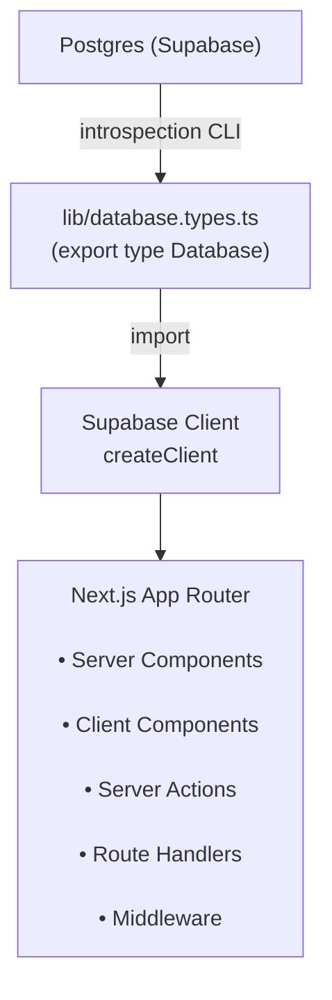

# Guide officiel : Typage TypeScript de bout en bout avec Supabase et Next.js App Router

## 1. Schéma du flux



## 2. Prérequis

- Node.js + npm/pnpm installés
- Projet Next.js (App Router) en TypeScript
- Compte et projet Supabase actifs
- Packages installés : `@supabase/supabase-js`, `@supabase/ssr`

## 3. Installation et authentification CLI

### 3.1 Connexion à Supabase CLI

```bash
npx supabase login
```

### 3.2 Génération du token d'accès

1. Accéder à l'interface Supabase
2. Naviguer vers **Settings → API / Tokens**
3. Créer un nouveau token (nom suggéré : `todo-app`)
4. Copier la valeur générée
5. Coller dans la CLI lors de la demande

## 4. Génération des types TypeScript

### 4.1 Récupérer l'ID du projet

Localiser l'ID dans **Settings → Project reference ID**

### 4.2 Commandes de génération

**Affichage direct :**

```bash
npx supabase gen types typescript --project-id <PROJECT_ID>
```

**Écriture dans un fichier :**

```bash
mkdir -p lib
npx supabase gen types typescript --project-id <PROJECT_ID> > lib/database.types.ts
```

### 4.3 Structure du fichier généré

`lib/database.types.ts` contient :

- Export principal `Database`
- Définitions de toutes les tables
- Types de colonnes (Row, Insert, Update)
- Enums et relations

## 5. Intégration dans Next.js

### 5.1 Création du client serveur typé

Créer `lib/supabase/server.ts` :

```ts
import type { Database } from '@/lib/database.types';
import { createServerClient } from '@supabase/ssr';
import { cookies } from 'next/headers';

export async function createClient() {
  const cookieStore = await cookies();

  return createServerClient<Database>(
    process.env.NEXT_PUBLIC_SUPABASE_URL!,
    process.env.NEXT_PUBLIC_SUPABASE_KEY!,
    {
      cookies: {
        getAll() {
          return cookieStore.getAll();
        },
        setAll(cookiesToSet) {
          try {
            cookiesToSet.forEach(({ name, value, options }) =>
              cookieStore.set(name, value, options)
            );
          } catch {
            // The `setAll` method was called from a Server Component.
            // This can be ignored if you have middleware refreshing
            // user sessions.
          }
        },
      },
    }
  );
}
```

**Points clés du typage :**

- `createServerClient<Database>` : Active l'autocomplétion sur les tables et colonnes
- Le type `Database` est importé avec `import type` (optimisation)
- Le client retourné est entièrement typé

### 5.2 Création du client browser typé

Créer `lib/supabase/client.ts` :

```ts
import type { Database } from '@/lib/database.types';
import { createBrowserClient } from '@supabase/ssr';

export function createClient() {
  return createBrowserClient<Database>(
    process.env.NEXT_PUBLIC_SUPABASE_URL!,
    process.env.NEXT_PUBLIC_SUPABASE_KEY!
  );
}
```

**Points clés du typage :**

- `createBrowserClient<Database>` : Client typé pour composants client
- Même type `Database` pour cohérence server/client
- Pas de gestion de cookies (automatique côté browser)

### 5.3 Extraction d'un type métier

```ts
import type { Database } from '@/lib/database.types';

type Todo = Database['public']['Tables']['todos']['Row'];
```

**Important :** Vérifier le nom exact de la table dans `database.types.ts` (peut contenir des traits d'union : `'to-dos'`)

**Types disponibles par table :**

- `Row` : Type d'une ligne complète (lecture)
- `Insert` : Type pour insertion (champs requis)
- `Update` : Type pour mise à jour (champs optionnels)

## 6. Déclaration de types globaux

### 6.1 Créer `app/global.d.ts`

```ts
import type { Database as DB } from '@/lib/database.types';

declare global {
  type Database = DB;
  type Todo = Database['public']['Tables']['todos']['Row'];
  type TodoInsert = Database['public']['Tables']['todos']['Insert'];
  type TodoUpdate = Database['public']['Tables']['todos']['Update'];
}

export {};
```

**Règles :**

- `export {}` transforme le fichier en module
- Adapter `'todos'` au nom réel de votre table
- Ajouter tous les types métier utilisés fréquemment

### 6.2 Utilisation dans l'application

Les types déclarés sont disponibles globalement sans import :

```ts
// Directement utilisable sans import
const client = await createClient();
const { data: todos } = await client.from('todos').select('*');
const todosList: Todo[] = todos ?? [];
```

## 7. Migration du code existant

### 7.1 Mise à jour des clients Supabase

**Avant (non typé) :**

```ts
import { createServerClient } from '@supabase/ssr';

const client = createServerClient(url, key, options);
```

**Après (typé) :**

```ts
import type { Database } from '@/lib/database.types';
import { createServerClient } from '@supabase/ssr';

const client = createServerClient<Database>(url, key, options);
```

### 7.2 Utilisation des utilitaires typés

Si vous avez créé les utilitaires `lib/supabase/server.ts` et `lib/supabase/client.ts`, le typage est automatique :

```ts
// Server Components, Server Actions, Route Handlers
import { createClient } from '@/lib/supabase/server';
const supabase = await createClient(); // ✅ Déjà typé <Database>

// Client Components
import { createClient } from '@/lib/supabase/client';
const supabase = createClient(); // ✅ Déjà typé <Database>
```

### 7.3 Recherche et remplacement global

Si vous utilisiez d'anciens packages :

**Remplacer :**

- `@supabase/auth-helpers-nextjs` → `@supabase/ssr`
- `createServerComponentClient` → `createServerClient`
- `createClientComponentClient` → `createBrowserClient`
- `createRouteHandlerClient` → `createServerClient`

## 8. Résolution des erreurs TypeScript courantes

### 8.1 FormDataEntryValue

**Erreur :**

```ts
// Type 'FormDataEntryValue | null' is not assignable to type 'string'
const title = formData.get('title');
```

**Solution :**

```ts
const title = String(formData.get('title'));
// ou
const title = formData.get('title') as string;
```

### 8.2 Valeurs nullable

**Erreur :**

```ts
// Type 'Todo[] | null' is not assignable to type 'Todo[]'
const { data: todos } = await supabase.from('todos').select('*');
```

**Solution :**

```ts
const { data: todos } = await supabase.from('todos').select('*');
const todosList: Todo[] = todos ?? [];
```

### 8.3 Mapping et fragments JSX

**Erreur :**

```tsx
// Multiple children without wrapper
return todosList.map((t: Todo) => <div key={t.id}>{t.title}</div>);
```

**Solution :**

```tsx
return (
  <>
    {todosList.map((t: Todo) => (
      <div key={t.id}>{t.title}</div>
    ))}
  </>
);
```

### 8.4 Type any implicite

**Erreur :**

```ts
// Parameter 'item' implicitly has an 'any' type
const handleItem = (item) => { /* ... */ };
```

**Solution :**

```ts
const handleItem = (item: Todo) => { /* ... */ };
// ou pour les réponses Supabase
const item = response.data as Todo;
```

### 8.5 Erreurs de typage sur les colonnes

**Erreur :**

```ts
// Property 'title' does not exist on type 'never'
const todo = await supabase.from('todos').select('*').single();
console.log(todo.title);
```

**Solution :**

```ts
const { data: todo } = await supabase.from('todos').select('*').single();
console.log(todo?.title); // ✅ todo est correctement typé
```

## 9. Vérification et validation

### 9.1 Vérification TypeScript

```bash
npx tsc --noEmit
```

Ou avec pnpm :

```bash
pnpm dlx -p typescript -- tsc --noEmit
```

### 9.2 Checklist de validation

- [ ] Aucune erreur TypeScript dans la sortie `tsc`
- [ ] Autocomplétion fonctionnelle sur les noms de colonnes
- [ ] Types corrects dans les queries `.select()`, `.insert()`, `.update()`
- [ ] Pas de `any` implicites dans le code
- [ ] Les Server Actions retournent des types corrects
- [ ] Les composants client utilisent le bon client typé

## 10. Résumé des fichiers et commandes

### 10.1 Fichiers créés/modifiés

| Fichier | Description |
|---------|-------------|
| `lib/database.types.ts` | Types générés depuis Postgres |
| `lib/supabase/server.ts` | Client serveur typé (Server Components, Server Actions, Route Handlers) |
| `lib/supabase/client.ts` | Client browser typé (Client Components) |
| `app/global.d.ts` | Déclarations de types globaux (optionnel) |
| `.env.local` | Variables d'environnement |

### 10.2 Commandes principales

```bash
# Authentification
npx supabase login

# Génération des types
npx supabase gen types typescript --project-id <PROJECT_ID> > lib/database.types.ts

# Vérification TypeScript
npx tsc --noEmit
```

## 11. Bonnes pratiques

### 11.1 Imports

```ts
// Préférer import type pour éviter l'import de code runtime
import type { Database } from '@/lib/database.types';
import { createClient } from '@supabase/supabase-js';
```

### 11.2 Nommage des tables

Vérifier systématiquement les noms exacts dans `database.types.ts` :

```ts
// Peut être 'todos', 'to-dos', 'to_dos', etc.
type Todo = Database['public']['Tables']['TABLE_NAME_EXACT']['Row'];
```

### 11.3 Régénération après modifications du schéma

Relancer la commande de génération après chaque modification de table/colonne :

```bash
npx supabase gen types typescript --project-id <PROJECT_ID> > lib/database.types.ts
```

### 11.4 Versionning

Committer `lib/database.types.ts` dans le repository pour cohérence d'équipe.

### 11.5 Séparation des utilitaires

Créer des utilitaires séparés pour server et client évite les erreurs :

- `lib/supabase/server.ts` : Pour Server Components, Server Actions, Route Handlers
- `lib/supabase/client.ts` : Pour Client Components uniquement

## 12. Architecture des types Supabase

### 12.1 Structure Database

```ts
type Database = {
  public: {
    Tables: {
      [table_name]: {
        Row: { /* colonnes */ }
        Insert: { /* colonnes requises pour insertion */ }
        Update: { /* colonnes modifiables */ }
      }
    }
    Views: { /* ... */ }
    Functions: { /* ... */ }
    Enums: { /* ... */ }
  }
}
```

### 12.2 Extraction sélective

```ts
// Type complet ligne
type TodoRow = Database['public']['Tables']['todos']['Row'];

// Type insertion
type TodoInsert = Database['public']['Tables']['todos']['Insert'];

// Type mise à jour
type TodoUpdate = Database['public']['Tables']['todos']['Update'];
```

### 12.3 Utilisation des types Insert et Update

```ts
// Insertion : champs requis uniquement
const newTodo: TodoInsert = {
  title: 'Nouvelle tâche',
  // id et created_at sont auto-générés
};

await supabase.from('todos').insert(newTodo);

// Mise à jour : tous les champs optionnels
const updates: TodoUpdate = {
  completed: true,
  // Seuls les champs à modifier
};

await supabase.from('todos').update(updates).eq('id', 1);
```

## 13. Dépannage avancé

### 13.1 Erreur "Cannot find module"

**Cause :** Chemin d'import incorrect

**Solution :**

```ts
// Vérifier tsconfig.json
{
  "compilerOptions": {
    "paths": {
      "@/*": ["./*"]
    }
  }
}
```

### 13.2 Types non reconnus après génération

**Solution :** Redémarrer le serveur TypeScript dans l'IDE

- VS Code : `Cmd/Ctrl + Shift + P` → "TypeScript: Restart TS Server"

### 13.3 Conflit de types entre versions

**Solution :** Vérifier cohérence des versions packages :

```bash
npm list @supabase/supabase-js
npm list @supabase/ssr
```

**Versions recommandées :**

- `@supabase/supabase-js` : ^2.39.0 ou supérieur
- `@supabase/ssr` : ^0.1.0 ou supérieur

### 13.4 Types génériques non inférés

**Problème :**

```ts
// TypeScript ne peut pas inférer le type de retour
const data = await supabase.from('todos').select('id, title');
```

**Solution :**

```ts
// Typer explicitement le retour
type TodoSubset = Pick<Todo, 'id' | 'title'>;
const { data } = await supabase.from('todos').select('id, title');
const todos: TodoSubset[] = data ?? [];
```

## 14. Exemple complet d'implémentation

### 14.1 Server Component typé

```ts
import { createClient } from '@/lib/supabase/server';
import type { Database } from '@/lib/database.types';

type Todo = Database['public']['Tables']['todos']['Row'];

export default async function TodosPage() {
  const supabase = await createClient();
  
  const { data: todos } = await supabase
    .from('todos')
    .select('*')
    .order('created_at', { ascending: false });

  const todosList: Todo[] = todos ?? [];

  return (
    <ul>
      {todosList.map((todo) => (
        <li key={todo.id}>
          {todo.title} - {todo.completed ? '✓' : '○'}
        </li>
      ))}
    </ul>
  );
}
```

### 14.2 Server Action typée

```ts
'use server';

import { createClient } from '@/lib/supabase/server';
import type { Database } from '@/lib/database.types';
import { revalidatePath } from 'next/cache';

type TodoInsert = Database['public']['Tables']['todos']['Insert'];

export async function createTodo(formData: FormData) {
  const title = String(formData.get('title'));
  const supabase = await createClient();

  const newTodo: TodoInsert = {
    title,
    completed: false,
  };

  const { error } = await supabase.from('todos').insert(newTodo);
  
  if (error) {
    throw new Error(error.message);
  }

  revalidatePath('/todos');
}

export async function updateTodo(id: number, completed: boolean) {
  const supabase = await createClient();
  
  const updates: TodoUpdate = {
    completed,
  };

  const { error } = await supabase
    .from('todos')
    .update(updates)
    .eq('id', id);
  
  if (error) {
    throw new Error(error.message);
  }

  revalidatePath('/todos');
}
```

### 14.3 Client Component typé

```tsx
'use client';

import { createClient } from '@/lib/supabase/client';
import { useEffect, useState } from 'react';
import type { Database } from '@/lib/database.types';

type Todo = Database['public']['Tables']['todos']['Row'];

export function TodoList() {
  const [todos, setTodos] = useState<Todo[]>([]);
  const supabase = createClient();

  useEffect(() => {
    async function fetchTodos() {
      const { data } = await supabase
        .from('todos')
        .select('*')
        .order('created_at', { ascending: false });

      setTodos(data ?? []);
    }

    fetchTodos();

    // Écouter les changements en temps réel
    const channel = supabase
      .channel('todos')
      .on(
        'postgres_changes',
        { event: '*', schema: 'public', table: 'todos' },
        () => {
          fetchTodos();
        }
      )
      .subscribe();

    return () => {
      supabase.removeChannel(channel);
    };
  }, [supabase]);

  return (
    <ul>
      {todos.map((todo) => (
        <li key={todo.id}>{todo.title}</li>
      ))}
    </ul>
  );
}
```

### 14.4 Route Handler typé

```ts
import { createClient } from '@/lib/supabase/server';
import { NextResponse } from 'next/server';
import type { Database } from '@/lib/database.types';

type TodoInsert = Database['public']['Tables']['todos']['Insert'];

export async function GET() {
  const supabase = await createClient();
  
  const { data: todos, error } = await supabase
    .from('todos')
    .select('*');

  if (error) {
    return NextResponse.json({ error: error.message }, { status: 500 });
  }

  return NextResponse.json({ todos });
}

export async function POST(request: Request) {
  const supabase = await createClient();
  const body = await request.json();

  const newTodo: TodoInsert = {
    title: body.title,
    completed: false,
  };

  const { data, error } = await supabase
    .from('todos')
    .insert(newTodo)
    .select()
    .single();

  if (error) {
    return NextResponse.json({ error: error.message }, { status: 500 });
  }

  return NextResponse.json({ todo: data }, { status: 201 });
}
```

## 15. Types avancés et utilitaires

### 15.1 Types helpers personnalisés

```ts
import type { Database } from '@/lib/database.types';

// Helper pour extraire tous les types Row
type Tables = Database['public']['Tables'];
type TableNames = keyof Tables;
type TableRow<T extends TableNames> = Tables[T]['Row'];

// Utilisation
type Todo = TableRow<'todos'>;
type User = TableRow<'users'>;

// Helper pour extraire les types Insert
type TableInsert<T extends TableNames> = Tables[T]['Insert'];

// Helper pour extraire les types Update
type TableUpdate<T extends TableNames> = Tables[T]['Update'];
```

### 15.2 Types avec relations

```ts
// Si vous avez des relations foreign key
type TodoWithUser = Todo & {
  user: User;
};

// Query typée avec jointure
const { data } = await supabase
  .from('todos')
  .select(`
    *,
    user:users(*)
  `);

// Type cast pour typage correct
const todosWithUsers = data as unknown as TodoWithUser[];
```

### 15.3 Types pour les enums

```ts
// Si vous avez des enums Postgres
type TodoStatus = Database['public']['Enums']['todo_status'];

// Utilisation
const status: TodoStatus = 'completed';
```

## 16. Intégration avec d'autres outils

### 16.1 Zod pour validation

```ts
import { z } from 'zod';
import type { Database } from '@/lib/database.types';

type TodoInsert = Database['public']['Tables']['todos']['Insert'];

// Schéma Zod basé sur le type TypeScript
const todoInsertSchema = z.object({
  title: z.string().min(1).max(255),
  completed: z.boolean().default(false),
}) satisfies z.ZodType<Partial<TodoInsert>>;

// Utilisation dans Server Action
export async function createTodoValidated(formData: FormData) {
  const rawData = {
    title: formData.get('title'),
    completed: formData.get('completed') === 'true',
  };

  const validatedData = todoInsertSchema.parse(rawData);
  
  const supabase = await createClient();
  await supabase.from('todos').insert(validatedData);
}
```

### 16.2 React Hook Form

```tsx
'use client';

import { useForm } from 'react-hook-form';
import type { Database } from '@/lib/database.types';

type TodoInsert = Database['public']['Tables']['todos']['Insert'];

export function TodoForm() {
  const { register, handleSubmit } = useForm<TodoInsert>();

  const onSubmit = async (data: TodoInsert) => {
    const supabase = createClient();
    await supabase.from('todos').insert(data);
  };

  return (
    <form onSubmit={handleSubmit(onSubmit)}>
      <input {...register('title')} />
      <button type="submit">Créer</button>
    </form>
  );
}
```

## 17. Référence

**Documentation officielle :**

- Supabase CLI : https://supabase.com/docs/guides/cli
- TypeScript Support : https://supabase.com/docs/reference/javascript/typescript-support
- Supabase SSR : https://supabase.com/docs/guides/auth/server-side/nextjs

**Packages NPM :**

- `@supabase/supabase-js` : Client JavaScript principal
- `@supabase/ssr` : Helpers pour SSR Next.js

**Vidéo source :** https://youtu.be/VSNgAIObBdw?si=bxugi6UQnZxrFVmT
