# Email Service Architecture - Rouge Cardinal Company

**Date de création**: 8 octobre 2025  
**Version**: 1.3.0  
**Dernière mise à jour**: 30 novembre 2025  
**Intégration**: feat-resend branch → feature/backoffice

## Vue d'Ensemble

L'architecture email du projet Rouge Cardinal Company est construite autour de l'intégration de **Resend** pour les emails transactionnels et **React Email** pour les templates. Cette architecture s'intègre harmonieusement avec l'architecture Next.js 15 existante et la Data Access Layer (DAL) Supabase.

**Mise à jour v1.3.0 (30 novembre 2025) — SOLID Refactoring:**

- **Email imports supprimés du DAL**: Conformité SOLID, l'envoi d'email se fait uniquement via Server Actions
- **Schemas email centralisés**: Schemas déplacés vers `lib/schemas/contact.ts`
- **Invitation email**: `admin-users.ts` ne fait plus d'import email, l'envoi est dans `app/(admin)/admin/users/invite/actions.ts`

## 1. Stack Technologique Email

```yaml
Email Service: Resend (API v1)
Template Engine: React Email + Tailwind CSS
Validation: Zod schemas
Integration: Next.js 15 Server Actions + API Routes
Database: Supabase PostgreSQL (logs et subscriptions)
Testing: Custom scripts + API endpoint testing
```

## 2. Architecture en Couches

### 2.1 Diagramme d'Architecture

```mermaid
flowchart TD
  subgraph EmailService[Email Service Architecture]
    direction TB
    Template["Template Layer\n(React Email)\n• EmailLayout\n• Newsletter\n• ContactNotif\n• InvitationEmail\n• Components"]
    ServerAction["Server Actions Layer\n(app/.../actions.ts)\n• sendEmail()\n• sendNewsletter\n• sendContact\n• sendInvitation"]
    API["API Layer\n(REST Endpoints)\n• POST /api/newsletter\n• POST /api/contact\n• POST /api/test-email\n• POST /api/webhooks"]
  end

  Template --> ServerAction
  API --> ServerAction
  ServerAction --> Validation["Validation Layer\n(lib/schemas/)\n• ContactEmailSchema\n• NewsletterSchema\n• InviteUserSchema"]

  Validation --> Resend["Resend API\n• Email sending\n• Tracking\n• Webhooks\n• Analytics"]
  ServerAction --> DAL["DAL Layer\n(lib/dal/)\n• NO email imports!\n• DB operations only"]
  DAL --> Supabase["Supabase DB\n• Newsletter DB\n• Contact DB\n• Logging"]
  ServerAction --> Hooks["Custom Hooks\n• useNewsletter\n• useContactForm\n• Error handling"]
```



### 2.2 Règle SOLID: Email uniquement dans Server Actions

**Important**: Suite au refactoring SOLID (30 novembre 2025), les imports email sont **interdits dans le DAL**.

```typescript
// ❌ INTERDIT dans lib/dal/*.ts
import { sendInvitationEmail } from "@/lib/email/actions";

// ✅ AUTORISÉ dans app/(admin)/admin/.../actions.ts
"use server";
import { sendInvitationEmail } from "@/lib/email/actions";
import { inviteUserDAL } from "@/lib/dal/admin-users";

export async function inviteUserAction(input: unknown) {
  const result = await inviteUserDAL(input);  // DAL call (no email)
  if (!result.success) return result;
  
  await sendInvitationEmail(result.data);     // Email in Server Action
  return { success: true };
}
```

## 3. Structure des Fichiers

### 3.1 Organisation Complète

```bash
project-root/
├── emails/                               # Templates React Email
│   ├── newsletter-confirmation.tsx       # Email confirmation newsletter
│   ├── contact-message-notification.tsx  # Notification admin contact
│   ├── invitation-email.tsx              # Email d'invitation utilisateur
│   └── utils/
│       ├── email-layout.tsx             # Layout réutilisable
│       └── components.utils.tsx         # Composants email utilitaires
│
├── lib/
│   ├── resend.ts                        # Client Resend configuré
│   ├── site-config.ts                   # Configuration email (FROM, CONTACT)
│   ├── email/
│   │   └── actions.ts                   # Server actions pour envoi email
│   ├── schemas/
│   │   └── contact.ts                   # Schémas Zod email (centralisés)
│   ├── hooks/
│   │   ├── useNewsletterSubscribe.ts    # Hook newsletter client
│   │   └── useContactForm.ts            # Hook formulaire contact
│   └── dal/
│       ├── home-newsletter.ts           # DAL newsletter (NO email imports!)
│       └── contact.ts                   # DAL contact (NO email imports!)
│
├── app/
│   ├── (admin)/admin/users/invite/
│   │   └── actions.ts                   # Server Action invitation (EMAIL here!)
│   └── api/
│       ├── newsletter/
│       │   └── route.ts                 # Endpoint subscription newsletter
│       ├── contact/
│       │   └── route.ts                 # Endpoint formulaire contact
│       ├── test-email/
│       │   └── route.ts                 # Endpoint de test (dev)
│       └── webhooks/
│       └── webhooks/
│           └── resend/
│               └── route.ts             # Handler webhooks Resend
│
├── types/
│   ├── email.d.ts                       # Types TypeScript email
│   └── database.types.ts                # Types database Supabase
│
├── scripts/
│   ├── test-email-integration.ts        # Tests d'intégration
│   ├── check-email-logs.ts              # Vérification logs DB
│   └── test-webhooks.ts                 # Tests webhooks
│
└── TESTING_RESEND.md                    # Documentation de test
```

## 4. Composants Clés

### 4.1 Client Resend (lib/resend.ts)

```typescript
import { Resend } from "resend";

if (!process.env.RESEND_API_KEY) {
  throw new Error('RESEND_API_KEY is required');
}

export const resend = new Resend(process.env.RESEND_API_KEY);
```

**Responsabilités**:

- Configuration centralisée du client Resend
- Validation de la présence de l'API key
- Export singleton pour réutilisation

### 4.2 Configuration Site (lib/site-config.ts)

```typescript
export const SITE_CONFIG = {
  SEO: {
    TITLE: "Rouge Cardinal Company",
    DESCRIPTION: "Compagnie de théâtre professionnelle",
    ICON: "/favicon.ico",
  },
  EMAIL: {
    FROM: process.env.EMAIL_FROM || "noreply@rougecardinalcompany.fr",
    CONTACT: process.env.EMAIL_CONTACT || "contact@rougecardinalcompany.fr",
  },
  SERVER: {
    PROD_URL: "https://rougecardinalcompany.fr",
    DEV_URL: process.env.NEXT_PUBLIC_SITE_URL || "http://localhost:3000",
  },
  MAKER: {
    NAME: "Rouge Cardinal Company",
    ADDRESS: "Adresse de votre compagnie",
  },
  AUTH: {
    REDIRECT_TO_DASHBOARD: "/dashboard",
    REDIRECT_TO_LOGIN: "/auth/login",
  },
} as const;

export const WEBSITE_URL = 
  process.env.NODE_ENV === "production" 
    ? SITE_CONFIG.SERVER.PROD_URL 
    : SITE_CONFIG.SERVER.DEV_URL;
```

**Responsabilités**:

- Configuration centralisée de l'application
- Gestion des URLs environnement-spécifiques
- Export des adresses email
- Configuration auth et redirections

### 4.3 Email Actions (lib/email/actions.ts)

```typescript
"use server";

import { createClient } from "@/supabase/server";
import { resend } from "@/lib/resend";
import { SITE_CONFIG, WEBSITE_URL } from "@/lib/site-config";
import NewsletterConfirmation from "@/emails/newsletter-confirmation";
import ContactMessageNotification from "@/emails/contact-message-notification";

export const sendEmail = async (
  ...params: ResendParamsTypeWithConditionalFrom
) => {
  const emailTo = params[0].to;
  const emailFrom = params[0].from || SITE_CONFIG.EMAIL.FROM;

  try {
    const result = await resend.emails.send({
      ...params[0],
      from: emailFrom,
      to: Array.isArray(emailTo) ? emailTo : [emailTo],
    });

    if (result.error) {
      console.error("[Email] Send error:", result.error);
      throw new Error(`Failed to send email: ${result.error.message}`);
    }

    console.log("[Email] Sent successfully:", result.data?.id);
    return result;
  } catch (error) {
    console.error("[Email] Send failed:", error);
    throw error;
  }
};

export async function sendNewsletterConfirmation(email: string) {
  await sendEmail({
    to: email,
    subject: `Bienvenue dans la newsletter de ${SITE_CONFIG.MAKER.NAME}`,
    react: NewsletterConfirmation({ email }),
  });
}

export async function sendContactNotification(params: {
  name: string;
  email: string;
  subject?: string;
  message: string;
  phone?: string;
  reason?: string;
}) {
  await sendEmail({
    to: SITE_CONFIG.EMAIL.CONTACT,
    subject: `Nouveau message de contact: ${params.subject || params.reason}`,
    react: ContactMessageNotification(params),
  });
}
```

**Responsabilités**:

- Envoi d'emails via Resend API
- Rendu des templates React Email
- Gestion des erreurs et logging
- Configuration FROM par défaut
- Types de notification spécifiques

**Note (dev-only redirect)**:

Le projet implémente un mécanisme de redirection en développement pour éviter d'envoyer des emails réels lors des tests locaux. La fonction `sendInvitationEmail` dans `lib/email/actions.ts` utilise les variables d'environnement `EMAIL_DEV_REDIRECT` (true|false) et `EMAIL_DEV_REDIRECT_TO` (adresse de redirection). Exemple simplifié:

```ts
// extrait (lib/email/actions.ts)
const devRedirectEnabled =
  process.env.NODE_ENV === 'development' &&
  String(process.env.EMAIL_DEV_REDIRECT).toLowerCase() === 'true';

const recipientEmail = devRedirectEnabled
  ? process.env.EMAIL_DEV_REDIRECT_TO ?? 'dev@example.com'
  : params.email;

await sendEmail({ to: recipientEmail, subject: `Invitation ...`, react: InvitationEmail({...}) });
```

> [!WARNING]
> La logique conserve l'email original dans le template (utile pour le debug), mais redirige l'envoi réel vers l'adresse de développement quand activé.

### 4.4 Schémas de Validation (lib/email/schemas.ts)

```typescript
import { z } from "zod";

export const NewsletterSubscriptionSchema = z.object({
  email: z.string().email("Email invalide"),
  consent: z.boolean().refine(v => v === true, {
    message: "Vous devez accepter de recevoir la newsletter"
  }),
  source: z.string().optional().default("website"),
});

export const ContactMessageSchema = z.object({
  name: z.string().min(2, "Le nom doit contenir au moins 2 caractères"),
  email: z.string().email("Email invalide"),
  subject: z.string().optional(),
  message: z.string().min(10, "Le message doit contenir au moins 10 caractères"),
  phone: z.string().optional(),
  reason: z.enum(["general", "booking", "press", "partnership"], {
    errorMap: () => ({ message: "Motif invalide" })
  }),
});

export type NewsletterSubscription = z.infer<typeof NewsletterSubscriptionSchema>;
export type ContactMessage = z.infer<typeof ContactMessageSchema>;
```

**Responsabilités**:

- Validation runtime avec Zod
- Messages d'erreur personnalisés
- Typage TypeScript automatique
- Contraintes métier

## 5. Templates React Email

### 5.1 Layout Email (emails/utils/email-layout.tsx)

```typescript
import { SITE_CONFIG, WEBSITE_URL } from "@/lib/site-config";
import {
  Body, Container, Head, Hr, Html, Img, Text,
} from "@react-email/components";
import { Tailwind } from "@react-email/tailwind";
import type { PropsWithChildren } from "react";

export const EmailLayout = (
  props: PropsWithChildren<{ disableTailwind?: boolean }>,
) => {
  let baseUrl = WEBSITE_URL;

  if (!baseUrl.startsWith("http")) {
    baseUrl = `https://${baseUrl}`;
  }

  const logoUrl = `${baseUrl}/logo.png`;

  const content = (
    <Html>
      <Head />
      <Body style={main}>
        <Container style={container}>
          
          {props.children}
          <Hr style={hr} />
          <Text style={footer}>
            © {new Date().getFullYear()} {SITE_CONFIG.MAKER.NAME}
            <br />
            {SITE_CONFIG.MAKER.ADDRESS}
          </Text>
        </Container>
      </Body>
    </Html>
  );

  return props.disableTailwind ? (
    content
  ) : (
    <Tailwind>{content}</Tailwind>
  );
};

// Styles inline pour compatibilité email
const main = {
  backgroundColor: "#ffffff",
  fontFamily: '-apple-system,BlinkMacSystemFont,"Segoe UI",Roboto,Oxygen-Sans,Ubuntu,Cantarell,"Helvetica Neue",sans-serif',
};

const container = {
  margin: "0 auto",
  padding: "20px 0 48px",
  maxWidth: "580px",
};

const logo = {
  margin: "0 auto",
};

const hr = {
  borderColor: "#cccccc",
  margin: "20px 0",
};

const footer = {
  color: "#8898aa",
  fontSize: "12px",
  textAlign: "center" as const,
};
```

**Responsabilités**:

- Layout réutilisable pour tous les emails
- Header avec logo
- Footer avec informations légales
- Styles inline pour compatibilité email
- Support Tailwind optionnel

### 5.2 Newsletter Confirmation (emails/newsletter-confirmation.tsx)

```typescript
import { SITE_CONFIG } from "@/lib/site-config";
import { Preview, Text } from "@react-email/components";
import { EmailLayout } from "./utils/email-layout";
import { EmailSection, EmailText } from "./utils/components.utils";

export default function NewsletterConfirmation({ email }: { email: string }) {
  return (
    <EmailLayout>
      <Preview>
        Bienvenue dans la newsletter de {SITE_CONFIG.MAKER.NAME}
      </Preview>
      <EmailSection>
        <EmailText>Bonjour,</EmailText>
        <EmailText>
          Merci de vous être inscrit(e) à notre newsletter ! Vous recevrez
          régulièrement nos actualités, nos spectacles et nos événements.
        </EmailText>
        <EmailText>
          Votre adresse email : <strong>{email}</strong>
        </EmailText>
        <EmailText>À très bientôt !</EmailText>
      </EmailSection>
    </EmailLayout>
  );
}
```

**Responsabilités**:

- Email de confirmation d'inscription newsletter
- Présentation claire et accueillante
- Affichage de l'email inscrit
- Preview text pour clients email

### 5.3 Contact Notification (emails/contact-message-notification.tsx)

```typescript
import { SITE_CONFIG } from "@/lib/site-config";
import { Preview, Text } from "@react-email/components";
import { EmailLayout } from "./utils/email-layout";
import { EmailSection, EmailText } from "./utils/components.utils";

interface ContactMessageNotificationProps {
  name: string;
  email: string;
  subject?: string;
  message: string;
  phone?: string;
  reason?: string;
}

export default function ContactMessageNotification({
  name, email, subject, message, phone, reason,
}: ContactMessageNotificationProps) {
  return (
    <EmailLayout>
      <Preview>Nouveau message de contact de {name}</Preview>
      <EmailSection>
        <EmailText>Nouveau message de contact reçu :</EmailText>
        
        <EmailText><strong>Nom :</strong> {name}</EmailText>
        <EmailText><strong>Email :</strong> {email}</EmailText>
        {phone && <EmailText><strong>Téléphone :</strong> {phone}</EmailText>}
        {reason && <EmailText><strong>Motif :</strong> {reason}</EmailText>}
        {subject && <EmailText><strong>Sujet :</strong> {subject}</EmailText>}
        
        <EmailText><strong>Message :</strong></EmailText>
        <EmailText>{message}</EmailText>
      </EmailSection>
    </EmailLayout>
  );
}
```

**Responsabilités**:

- Notification admin pour nouveau message contact
- Affichage structuré des informations
- Champs optionnels gérés
- Preview informatif

## 6. API Endpoints

### 6.1 Newsletter Subscription (app/api/newsletter/route.ts)

```typescript
import { NextRequest, NextResponse } from "next/server";
import { NewsletterSubscriptionSchema } from "@/lib/email/schemas";
import { sendNewsletterConfirmation } from "@/lib/email/actions";

export async function POST(request: NextRequest) {
  try {
    const body = await request.json();
    
    // Validation Zod
    const validatedData = NewsletterSubscriptionSchema.parse(body);
    
    // Intégration DAL existante (lib/dal/home-newsletter.ts)
    // TODO: Appeler la fonction DAL pour persister l'inscription
    
    // Envoi email de confirmation
    await sendNewsletterConfirmation(validatedData.email);
    
    return NextResponse.json({
      success: true,
      message: `Confirmation sent to ${validatedData.email}`
    });
    
  } catch (error) {
    if (error instanceof z.ZodError) {
      return NextResponse.json(
        { error: "Validation error", details: error.errors },
        { status: 400 }
      );
    }
    
    console.error("[Newsletter API] Error:", error);
    return NextResponse.json(
      { error: "Failed to process subscription" },
      { status: 500 }
    );
  }
}
```

**Responsabilités**:

- Endpoint REST pour inscription newsletter
- Validation Zod des données
- Intégration avec DAL newsletter
- Envoi email de confirmation
- Gestion d'erreurs robuste

### 6.2 Contact Form (app/api/contact/route.ts)

```typescript
import { NextRequest, NextResponse } from "next/server";
import { ContactMessageSchema } from "@/lib/email/schemas";
import { sendContactNotification } from "@/lib/email/actions";

export async function POST(request: NextRequest) {
  try {
    const body = await request.json();
    
    // Validation Zod
    const validatedData = ContactMessageSchema.parse(body);
    
    // Intégration DAL existante (lib/dal/contact.ts)
    // TODO: Appeler la fonction DAL pour persister le message
    
    // Envoi notification admin
    await sendContactNotification(validatedData);
    
    return NextResponse.json({
      success: true,
      message: "Contact message sent successfully"
    });
    
  } catch (error) {
    if (error instanceof z.ZodError) {
      return NextResponse.json(
        { error: "Validation error", details: error.errors },
        { status: 400 }
      );
    }
    
    console.error("[Contact API] Error:", error);
    return NextResponse.json(
      { error: "Failed to send contact message" },
      { status: 500 }
    );
  }
}
```

**Responsabilités**:

- Endpoint REST pour formulaire contact
- Validation Zod des données
- Intégration avec DAL contact
- Envoi notification à l'admin
- Gestion d'erreurs avec détails

### 6.3 Test Email Endpoint (app/api/test-email/route.ts)

```typescript
import { NextRequest, NextResponse } from "next/server";
import { sendNewsletterConfirmation, sendContactNotification } from "@/lib/email/actions";

export async function POST(request: NextRequest) {
  try {
    const { type, email, contactData } = await request.json();
    
    if (type === "newsletter") {
      await sendNewsletterConfirmation(email);
      return NextResponse.json({
        success: true,
        message: `Newsletter confirmation sent to ${email}`,
        type: "newsletter"
      });
    }
    
    if (type === "contact") {
      await sendContactNotification(contactData);
      return NextResponse.json({
        success: true,
        message: "Contact notification sent",
        type: "contact"
      });
    }
    
    return NextResponse.json(
      { error: "Invalid test type" },
      { status: 400 }
    );
    
  } catch (error) {
    console.error("[Test Email] Error:", error);
    return NextResponse.json(
      { 
        error: "Failed to send test email",
        details: error instanceof Error ? error.message : "Unknown error"
      },
      { status: 500 }
    );
  }
}

export async function GET() {
  return NextResponse.json({
    message: "Email testing endpoint",
    usage: "POST with { type: 'newsletter'|'contact', email?: string, contactData?: object }"
  });
}
```

**Responsabilités**:

- Endpoint de test pour développement
- Support newsletter et contact
- Documentation inline via GET
- Logging détaillé des erreurs

### 6.4 Webhook Handler (app/api/webhooks/resend/route.ts)

```typescript
import { NextRequest, NextResponse } from "next/server";
import { createClient } from "@/supabase/server";
import { z } from "zod";

const ResendWebhookSchema = z.object({
  type: z.string(),
  created_at: z.string(),
  data: z.any(),
});

export async function POST(req: NextRequest) {
  try {
    const body = await req.json();
    const event = ResendWebhookSchema.parse(body);
    
    console.log("[Resend Webhook] Event received:", event.type);
    
    // Log webhook event in database
    const supabase = await createClient();
    const { error } = await supabase
      .from("email_webhook_events")
      .insert({
        event_type: event.type,
        event_data: event.data,
        received_at: new Date().toISOString(),
      });
    
    if (error) {
      console.error("[Resend Webhook] DB error:", error);
    }
    
    // Handle specific event types
    switch (event.type) {
      case "email.sent":
        console.log("[Webhook] Email sent:", event.data.email_id);
        break;
      case "email.delivered":
        console.log("[Webhook] Email delivered:", event.data.email_id);
        break;
      case "email.delivery_delayed":
        console.warn("[Webhook] Delivery delayed:", event.data.email_id);
        break;
      case "email.complained":
        console.warn("[Webhook] Spam complaint:", event.data.email_id);
        break;
      case "email.bounced":
        console.error("[Webhook] Email bounced:", event.data.email_id);
        break;
      default:
        console.log("[Webhook] Unhandled event:", event.type);
    }
    
    return NextResponse.json({ ok: true });
    
  } catch (error) {
    console.error("[Resend Webhook] Error:", error);
    return NextResponse.json(
      { error: "Webhook processing failed" },
      { status: 500 }
    );
  }
}
```

**Responsabilités**:

- Réception des événements webhooks Resend
- Logging des événements dans Supabase
- Gestion événements spécifiques (sent, delivered, bounced, etc.)
- Validation structure webhook

## 7. Custom Hooks Client

### 7.1 useNewsletterSubscribe Hook

```typescript
// lib/hooks/useNewsletterSubscribe.ts
"use client";

import { useState } from "react";

interface UseNewsletterSubscriptionReturn {
  email: string;
  setEmail: (email: string) => void;
  isLoading: boolean;
  error: string | null;
  success: boolean;
  handleSubmit: (e: React.FormEvent) => Promise<void>;
  reset: () => void;
}

export function useNewsletterSubscribe({
  source = "website",
}: { source?: string } = {}): UseNewsletterSubscriptionReturn {
  const [email, setEmail] = useState("");
  const [isLoading, setIsLoading] = useState(false);
  const [error, setError] = useState<string | null>(null);
  const [success, setSuccess] = useState(false);

  const handleSubmit = async (e: React.FormEvent) => {
    e.preventDefault();
    
    if (!email) {
      setError("L'email est requis");
      return;
    }

    setIsLoading(true);
    setError(null);

    try {
      const response = await fetch("/api/newsletter", {
        method: "POST",
        headers: { "Content-Type": "application/json" },
        body: JSON.stringify({ email, consent: true, source }),
      });

      if (!response.ok) {
        const data = await response.json();
        throw new Error(data.error || "Erreur lors de l'inscription");
      }

      setSuccess(true);
      setEmail("");
    } catch (err) {
      setError(err instanceof Error ? err.message : "Une erreur est survenue");
    } finally {
      setIsLoading(false);
    }
  };

  const reset = () => {
    setEmail("");
    setError(null);
    setSuccess(false);
  };

  return { email, setEmail, isLoading, error, success, handleSubmit, reset };
}
```

**Responsabilités**:

- Gestion état formulaire newsletter
- Validation client-side basique
- Appel API newsletter
- Gestion loading, error, success states
- Reset après soumission réussie

### 7.2 useContactForm Hook

```typescript
// lib/hooks/useContactForm.ts
"use client";

import { useState } from "react";
import type { ContactMessage } from "@/lib/email/schemas";

interface UseContactFormReturn {
  formData: Partial<ContactMessage>;
  isLoading: boolean;
  error: string | null;
  success: boolean;
  handleChange: (
    e: React.ChangeEvent<HTMLInputElement | HTMLTextAreaElement | HTMLSelectElement>
  ) => void;
  handleSubmit: (e: React.FormEvent) => Promise<void>;
  reset: () => void;
}

export function useContactForm(): UseContactFormReturn {
  const [formData, setFormData] = useState<Partial<ContactMessage>>({
    name: "",
    email: "",
    subject: "",
    message: "",
    phone: "",
    reason: "general",
  });
  
  const [isLoading, setIsLoading] = useState(false);
  const [error, setError] = useState<string | null>(null);
  const [success, setSuccess] = useState(false);

  const handleChange = (
    e: React.ChangeEvent<HTMLInputElement | HTMLTextAreaElement | HTMLSelectElement>
  ) => {
    setFormData(prev => ({
      ...prev,
      [e.target.name]: e.target.value
    }));
  };

  const handleSubmit = async (e: React.FormEvent) => {
    e.preventDefault();
    setIsLoading(true);
    setError(null);

    try {
      const response = await fetch("/api/contact", {
        method: "POST",
        headers: { "Content-Type": "application/json" },
        body: JSON.stringify(formData),
      });

      if (!response.ok) {
        const data = await response.json();
        throw new Error(data.error || "Erreur lors de l'envoi");
      }

      setSuccess(true);
      setFormData({
        name: "",
        email: "",
        subject: "",
        message: "",
        phone: "",
        reason: "general",
      });
    } catch (err) {
      setError(err instanceof Error ? err.message : "Une erreur est survenue");
    } finally {
      setIsLoading(false);
    }
  };

  const reset = () => {
    setFormData({
      name: "",
      email: "",
      subject: "",
      message: "",
      phone: "",
      reason: "general",
    });
    setError(null);
    setSuccess(false);
  };

  return {
    formData,
    isLoading,
    error,
    success,
    handleChange,
    handleSubmit,
    reset,
  };
}
```

**Responsabilités**:

- Gestion état formulaire contact complet
- HandleChange générique pour tous les champs
- Appel API contact
- Gestion states (loading, error, success)
- Reset formulaire après succès

## 8. Intégration avec la DAL Existante

### 8.1 Newsletter DAL (lib/dal/home-newsletter.ts)

L'architecture email s'intègre avec la DAL existante pour la persistance :

```typescript
// Exemple d'intégration dans l'API route
import { createNewsletterSubscription } from "@/lib/dal/home-newsletter";

export async function POST(request: NextRequest) {
  // ... validation ...
  
  // Persister dans la base via DAL
  await createNewsletterSubscription({
    email: validatedData.email,
    source: validatedData.source,
    consent: validatedData.consent,
  });
  
  // Puis envoyer l'email de confirmation
  await sendNewsletterConfirmation(validatedData.email);
  
  // ...
}
```

**Points d'Intégration**:

- La DAL gère la persistance database
- Les email actions gèrent l'envoi email
- Séparation claire des responsabilités
- Tables Supabase : `abonnes_newsletter`

### 8.2 Contact DAL (lib/dal/contact.ts)

```typescript
// Exemple d'intégration dans l'API route
import { createContactMessage } from "@/lib/dal/contact";

export async function POST(request: NextRequest) {
  // ... validation ...
  
  // Persister le message dans la base via DAL
  await createContactMessage({
    name: validatedData.name,
    email: validatedData.email,
    subject: validatedData.subject,
    message: validatedData.message,
    phone: validatedData.phone,
    reason: validatedData.reason,
  });
  
  // Puis envoyer la notification admin
  await sendContactNotification(validatedData);
  
  // ...
}
```

**Points d'Intégration**:

- DAL gère le stockage du message
- Email action notifie l'admin
- Logs et audit trail dans Supabase
- Tables Supabase : `messages_contact`

## 9. Tests et Validation

### 9.1 Scripts de Test

#### Test Email Integration (scripts/test-email-integration.ts)

```typescript
async function testEmailIntegration() {
  console.log('🧪 Testing Resend Email Integration...\n');

  const baseUrl = process.env.NEXT_PUBLIC_SITE_URL || 'http://localhost:3000';

  try {
    // Test 1: Newsletter
    console.log('📧 Testing newsletter subscription...');
    const newsletterResponse = await fetch(`${baseUrl}/api/test-email`, {
      method: 'POST',
      headers: { 'Content-Type': 'application/json' },
      body: JSON.stringify({
        type: 'newsletter',
        email: 'test@example.com'
      })
    });

    if (newsletterResponse.ok) {
      console.log('✅ Newsletter test: PASSED');
    } else {
      console.log('❌ Newsletter test: FAILED');
    }

    // Test 2: Contact
    console.log('\n📝 Testing contact form...');
    const contactResponse = await fetch(`${baseUrl}/api/test-email`, {
      method: 'POST',
      headers: { 'Content-Type': 'application/json' },
      body: JSON.stringify({
        type: 'contact',
        contactData: {
          name: 'Test User',
          email: 'test@example.com',
          subject: 'Test Subject',
          message: 'This is a test message.'
        }
      })
    });

    if (contactResponse.ok) {
      console.log('✅ Contact test: PASSED');
    } else {
      console.log('❌ Contact test: FAILED');
    }

    console.log('\n🎉 Email integration tests completed!');
    
  } catch (error) {
    console.error('❌ Test failed:', error);
  }
}

testEmailIntegration();
```

**Commande**: `pnpm run test:email`

#### Check Email Logs (scripts/check-email-logs.ts)

```typescript
import { createClient } from '@supabase/supabase-js';

async function checkEmailLogs() {
  console.log('📊 Checking email delivery logs...\n');

  const supabaseUrl = process.env.NEXT_PUBLIC_SUPABASE_URL;
  const supabaseKey = process.env.SUPABASE_SERVICE_ROLE_KEY;

  if (!supabaseUrl || !supabaseKey) {
    console.log('❌ Missing Supabase environment variables');
    return;
  }

  const supabase = createClient(supabaseUrl, supabaseKey);

  // Check newsletter subscriptions
  const { data: newsletterData } = await supabase
    .from('abonnes_newsletter')
    .select('email, created_at')
    .order('created_at', { ascending: false })
    .limit(5);

  console.log('✅ Newsletter subscriptions (last 5):');
  newsletterData?.forEach((item, index) => {
    console.log(`   ${index + 1}. ${item.email} - ${new Date(item.created_at).toLocaleString()}`);
  });

  // Check contact messages
  const { data: contactData } = await supabase
    .from('messages_contact')
    .select('name, email, subject, created_at')
    .order('created_at', { ascending: false })
    .limit(5);

  console.log('\n✅ Contact messages (last 5):');
  contactData?.forEach((item, index) => {
    console.log(`   ${index + 1}. ${item.name} <${item.email}> - "${item.subject}"`);
  });
}

checkEmailLogs();
```

**Commande**: `pnpm run test:logs`

**Prérequis**: `SUPABASE_SERVICE_ROLE_KEY` dans `.env.local`

### 9.2 Test via cURL

```bash
# Test newsletter
curl -X POST http://localhost:3000/api/test-email \
  -H "Content-Type: application/json" \
  -d '{
    "type": "newsletter",
    "email": "test@example.com"
  }'

# Test contact
curl -X POST http://localhost:3000/api/test-email \
  -H "Content-Type: application/json" \
  -d '{
    "type": "contact",
    "contactData": {
      "name": "Test User",
      "email": "test@example.com",
      "subject": "Test Subject",
      "message": "Test message content"
    }
  }'
```

### 9.3 Render test & CI

Le projet inclut un test de rendu pour les templates email (vérifie que le HTML rendu n'est pas vide et contient les éléments clés). Fichier de test :

- `__tests__/emails/invitation-email.test.tsx` — rend `InvitationEmail` via `react-dom/server` et vérifie la présence du CTA et du lien d'invitation.

Commande locale pour exécuter le test standalone :

```bash
pnpm exec tsx __tests__/emails/invitation-email.test.tsx
```

CI : un workflow GitHub Actions ` .github/workflows/invitation-email-test.yml ` a été ajouté pour exécuter ce test sur les pushes/PRs. Il exécute la même commande et échoue si le rendu ne contient pas les éléments attendus.

Recommandation : intégrer ce test dans la suite de tests principale (Vitest/Jest) pour reporting et couverture.

## 10. Configuration et Variables d'Environnement

### 10.1 Variables Requises

```env
# Resend API
RESEND_API_KEY=re_your_api_key_here
RESEND_AUDIENCE_ID=your_audience_id  # Optionnel

# Configuration Email
EMAIL_FROM=noreply@votre-domaine.fr
EMAIL_CONTACT=contact@votre-domaine.fr

# Supabase (existant)
NEXT_PUBLIC_SUPABASE_URL=https://xxx.supabase.co
NEXT_PUBLIC_SUPABASE_PUBLISHABLE_OR_ANON_KEY=xxx
SUPABASE_SERVICE_ROLE_KEY=xxx  # Pour scripts admin

# Site
NEXT_PUBLIC_SITE_URL=http://localhost:3000
```

### 10.2 Configuration Resend Dashboard

1. **Domaine vérifié** : Vérifier le domaine d'envoi dans Resend
2. **API Keys** : Créer une clé API avec permissions d'envoi
3. **Webhooks** : Configurer webhook vers `/api/webhooks/resend`
4. **Audience** : Créer une audience si nécessaire

## 11. Sécurité

### 11.1 Validation des Entrées

- **Zod schemas** : Validation stricte côté serveur
- **Sanitization** : Nettoyage des inputs avant traitement
- **Type safety** : TypeScript pour prévenir erreurs

### 11.2 Protection Endpoints

- **Rate limiting** : Limiter les tentatives d'envoi (recommandé)
- **CORS** : Configuration stricte pour les API routes
- **CSRF** : Protection via Next.js server actions

### 11.3 Données Sensibles

- **Logs** : Ne pas logger les emails complets ou données personnelles
- **Webhooks** : Vérifier la signature Resend (recommandé)
- **Environment vars** : Jamais exposer côté client

## 12. Patterns et Best Practices

### 12.1 Séparation des Responsabilités

```bash
Template Layer ────▶ Actions Layer ────▶ API Layer
     (UI)           (Business Logic)       (HTTP)
                           │
                           ▼
                    Validation Layer
                      (Zod Schemas)
                           │
             ┌─────────────┴─────────────┐
             ▼                           ▼
        Resend API                  Supabase DAL
     (Email Delivery)            (Data Persistence)
```

### 12.2 Error Handling

```typescript
// Pattern : Try-Catch avec logging détaillé
try {
  const result = await sendEmail(params);
  console.log('[Email] Success:', result.data?.id);
  return { success: true };
} catch (error) {
  console.error('[Email] Error:', error);
  
  // Différencier les types d'erreurs
  if (error instanceof z.ZodError) {
    return { error: 'Validation failed', details: error.errors };
  }
  
  if (error.message?.includes('rate limit')) {
    return { error: 'Too many requests, please try again later' };
  }
  
  return { error: 'Failed to send email' };
}
```

### 12.3 Logging Strategy

```typescript
// Logging cohérent avec préfixes
console.log('[Email] Sending newsletter confirmation to:', email);
console.error('[Email] Send failed:', error.message);
console.warn('[Webhook] Unhandled event type:', event.type);

// Pour production : intégrer avec un service de logging
// Exemple : Sentry, LogRocket, etc.
```

### 12.4 Performance

- **Async/Await** : Toujours utiliser pour les appels API
- **Error boundaries** : Éviter que les erreurs email cassent l'UI
- **Timeouts** : Configurer des timeouts raisonnables
- **Retry logic** : Pour les erreurs transitoires (recommandé)

## 13. Évolution et Extensions

### 13.1 Fonctionnalités Futures

- **Templates supplémentaires** : Reset password, booking confirmation
- **Système de file d'attente** : Pour l'envoi en masse
- **Analytics email** : Tracking ouvertures et clics
- **A/B Testing** : Tester différentes versions d'emails
- **Personnalisation** : Templates dynamiques basés sur user data

### 13.2 Optimisations

- **Caching** : Cache des templates compilés
- **Batch sending** : Regrouper les envois
- **Priority queue** : Prioriser les emails critiques
- **Monitoring** : Alertes sur taux d'échec élevé

### 13.3 Intégrations

- **CRM** : Synchronisation avec Supabase ou CRM externe
- **Analytics** : Google Analytics events pour conversions
- **Marketing automation** : Campagnes automatisées
- **Multi-langue** : Support i18n dans les templates

## 14. Troubleshooting

### 14.1 Problèmes Communs

**Email non reçu**:

- Vérifier `RESEND_API_KEY` valide
- Vérifier domaine vérifié dans Resend dashboard
- Vérifier logs serveur (`pnpm dev`)
- Vérifier spam folder destinataire

**Erreur validation**:

- Vérifier schémas Zod sont corrects
- Vérifier format données envoyées
- Consulter logs d'erreur détaillés

**Webhook non reçu**:

- Vérifier URL webhook dans Resend dashboard
- Vérifier endpoint accessible publiquement
- Vérifier logs webhook handler

### 14.2 Debugging

```bash
# Activer les logs détaillés
NODE_DEBUG=resend pnpm dev

# Tester l'API directement
curl -X POST http://localhost:3000/api/test-email \
  -H "Content-Type: application/json" \
  -d '{"type": "newsletter", "email": "test@example.com"}'

# Vérifier les logs database
pnpm run test:logs
```

## 15. Documentation Additionnelle

- **TESTING_RESEND.md** : Guide de test complet
- **Resend Docs** : https://resend.com/docs
- **React Email Docs** : https://react.email/docs
- **.github/instructions/resend_supabase_integration.md** : Instructions d'intégration complètes

---

## 16. Pattern Warning System & RGPD Compliance (Octobre 2025)

### 16.1 Pattern Warning pour Graceful Degradation

Objectif: permettre l'insertion en BDD même si l'envoi d'email échoue, en retournant un avertissement au client.

**Pattern implémenté**:

```typescript
// API Routes avec warning pattern
export async function POST(request: NextRequest) {
  const validated = Schema.parse(await request.json());
  
  // 1. Insertion BDD toujours prioritaire (via DAL)
  await createRecord(validated);
  
  // 2. Tentative envoi email avec catch silencieux
  let emailSent = true;
  try {
    await sendEmail(validated);
  } catch (error) {
    console.error('[Email] Send failed:', error);
    emailSent = false;
  }
  
  // 3. Retour avec warning optionnel
  return NextResponse.json({
    status: 'success',
    ...(!emailSent && { warning: 'Email notification could not be sent' })
  }, { status: 201 });
}
```

**Avantages**:

- **Robustesse** : L'opération principale (BDD) n'échoue jamais à cause de l'email
- **Transparence** : Le client est informé du problème email via le warning
- **UX** : Permet d'afficher un message "Enregistré mais email non envoyé"
- **Debugging** : Les erreurs email sont loggées côté serveur

**Cas d'usage**:

- Newsletter : `{status:'subscribed', warning?:'Confirmation email could not be sent'}`
- Contact : `{status:'sent', warning?:'Admin notification could not be sent'}`
- Tout formulaire où l'email est secondaire par rapport aux données

### 16.2 RGPD Compliance Pattern

Objectif: protéger les données personnelles conformément au RGPD avec RLS Supabase et pattern d'insertion sécurisé.

**Pattern implémenté**:

```typescript
// DAL avec pattern INSERT sans SELECT
"use server";
import 'server-only';

export async function createContactMessage(input: ContactInput) {
  const supabase = await createClient();
  
  // RGPD: INSERT sans SELECT pour éviter exposition RLS
  const { error } = await supabase
    .from('messages_contact')
    .insert(payload);
    // ❌ PAS DE .select() ici
  
  if (error) {
    if (error.code === '23505') {
      return { success: true }; // Idempotence
    }
    throw new Error(`Database error: ${error.message}`);
  }
  
  return { success: true };
}
```

**RLS Policies**:

```sql
-- SELECT: Admin seulement (protection données personnelles)
CREATE POLICY "Admin can read all contact messages"
  ON messages_contact FOR SELECT
  TO authenticated
  USING ((SELECT public.is_admin()));

-- INSERT: Public (formulaire)
CREATE POLICY "Anyone can insert contact messages"
  ON messages_contact FOR INSERT
  TO anon, authenticated
  WITH CHECK (true);
```

**Principes RGPD**:

1. **Data Minimization** : Ne retourner que les données nécessaires
2. **Access Control** : RLS empêche lecture publique des données sensibles
3. **Insert-only** : Pattern `.insert()` sans `.select()` évite erreurs RLS
4. **Audit Trail** : Logs SQL pour traçabilité
5. **Idempotence** : PostgreSQL error 23505 (unique_violation) traité comme succès

**Documentation associée**:

- `doc/RGPD-Compliance-Validation.md` : Validation complète conformité RGPD
- `supabase/schemas/10_tables_system.sql` : RLS policies avec commentaires RGPD
- `.github/instructions/Create_RLS_policies.Instructions.md` : Guide RLS

### 16.3 Schema Mapping Pattern (API ↔ DAL)

Objectif: transformer les données du format API (UI-friendly) vers le format DAL (database schema).

**Exemple Contact Form**:

```typescript
// API accepte un champ 'name' unique
const ApiSchema = z.object({
  name: z.string(),
  subject: z.string(),
  message: z.string(),
  // ...
});

// DAL attend firstName/lastName séparés
const DalSchema = z.object({
  firstName: z.string(),
  lastName: z.string(),
  message: z.string(), // Avec subject intégré
  // ...
});

// Mapping dans l'API route
export async function POST(request: NextRequest) {
  const apiData = ApiSchema.parse(await request.json());
  
  // Split name en firstName/lastName
  const [firstName, ...lastNameParts] = apiData.name.trim().split(' ');
  const lastName = lastNameParts.join(' ') || firstName;
  
  // Prefix subject dans le message
  const messageWithSubject = `[${apiData.subject}]\n\n${apiData.message}`;
  
  // Appel DAL avec format attendu
  await createContactMessage({
    firstName,
    lastName,
    message: messageWithSubject,
    ...rest
  });
}
```

**Avantages**:

- **Séparation concerns** : API reste user-friendly, DAL reste database-aligned
- **Évolutivité** : Modifier API sans toucher DAL (ou inverse)
- **Type-safety** : Zod valide les deux formats indépendamment
- **Lisibilité** : Schéma clair à chaque niveau

### 16.4 Email Missing Bug Pattern (Server Actions)

**Problème identifié**: Server Action ne synchronisait pas email avec API route.

**Solution implémentée**:

```typescript
// Server Action DOIT avoir la même logique que l'API route
"use server";

export async function submitContactAction(formData: FormData) {
  const validated = FormSchema.parse(extractFromFormData(formData));
  
  // 1. BDD via DAL (identique API)
  await createContactMessage(validated);
  
  // 2. Email notification (ÉTAIT MANQUANT)
  let emailSent = true;
  try {
    await sendContactNotification(validated);
  } catch (error) {
    console.error('[Server Action] Email failed:', error);
    emailSent = false;
  }
  
  // 3. Retour avec warning (cohérent avec API)
  return {
    success: true,
    ...(!emailSent && { warning: 'Admin notification could not be sent' })
  };
}
```

**Leçon retenue**:

- Server Actions et API Routes doivent partager la même logique métier
- Factoriser les appels DAL + Email dans une fonction partagée si complexité augmente
- Toujours tester les deux chemins d'accès (API curl + frontend Server Action)

**Tests de validation**:

```bash
# Test API route (avec curl)
curl -X POST http://localhost:3000/api/contact \
  -H "Content-Type: application/json" \
  -d '{"name":"Test","email":"test@example.com","message":"Test"}'

# Test frontend (Server Action)
# → Soumettre via le formulaire UI et vérifier email reçu
```

**Documentation associée**:

- `doc/Fix-Contact-Email-Missing.md` : Analyse détaillée du bug et fix
- `doc/API-Contact-Test-Results.md` : Tests de validation complets

---

**Dernière mise à jour** : 26 octobre 2025  
**Version** : 1.1.0 (ajout Warning System, RGPD, Schema Mapping, Server Actions patterns)  
**Auteur** : Architecture Team - Rouge Cardinal Company
