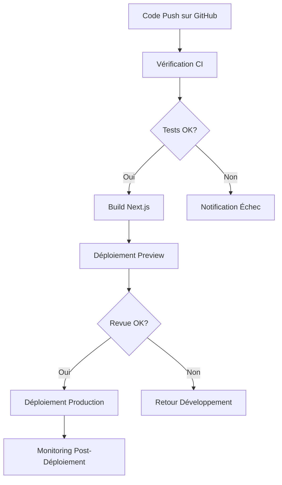

# Project Architecture Blueprint: Rouge Cardinal Company

## **Auto-generated on $(date) - Architecture analysis and design patterns documentation**

> ⚠️ **IMPORTANT - Supabase Auth Best Practices (2025)**
> 
> Ce document a été **mis à jour** pour respecter les dernières recommandations Supabase Auth :
> - ✅ Utilisation de `@supabase/ssr` (moderne) au lieu de `@supabase/auth-helpers-nextjs` (déprécié)
> - ✅ Utilisation de `getClaims()` pour une performance 100x supérieure (~2-5ms vs ~300ms)
> - ✅ Utilisation des nouvelles clés API : `NEXT_PUBLIC_SUPABASE_PUBLISHABLE_OR_ANON_KEY`
> - ✅ Pattern cookies correct : `getAll/setAll` uniquement
> 
> 📖 Pour plus de détails, consultez : `.github/instructions/nextjs-supabase-auth-2025.instructions.md`

## 1. Architecture Detection & Analysis Phase

### 1.1 Automatic Technology Stack Detection

#### Frontend Stack

```bash
Framework: Next.js 15.4.5 (App Router)
Language: TypeScript 5.0
UI Library: React 19
Styling: Tailwind CSS 3.4
UI Components: shadcn/ui (Radix UI based)
State Management: React Hooks + Context API
```

#### Backend & Data Stack

```bash
BaaS Platform: Supabase (PostgreSQL + REST API)
Authentication: Supabase Auth
Database: PostgreSQL (via Supabase)
Schema Management: SQL migrations with declarative approach
Connection Layer: Supabase JavaScript SDK
Email Service: Resend (transactional emails)
Email Templates: React Email components
```

#### Development & Deployment Stack

```bash
Package Manager: pnpm
Build Tool: Next.js native build system
Type Checking: TypeScript with strict configuration
Code Quality: ESLint + Prettier
Deployment: Vercel (inferred from Next.js setup)
Version Control: Git (GitHub repository structure detected)
```

### 1.2 Architectural Pattern Recognition

#### Primary Architectural Pattern

```bash
Feature-Based Architecture (Domain-Driven Structure)
├── Organizational Principle: Business domain separation
├── Scalability Strategy: Vertical scaling by feature
├── Code Organization: Feature folders contain complete functionality
└── Team Structure: Feature teams can work independently
```

#### Secondary Architectural Patterns

```bash
Container/View Pattern (Smart/Dumb Components)
├── Smart Components (Containers): State and logic management
├── Dumb Components (Views): Pure presentation layer
├── Separation of Concerns: Clear business/presentation boundary
└── Testing Strategy: Isolated testing of logic and UI

App Router Architecture (Next.js 15)
├── File-based Routing: Directory structure defines routes
├── Server/Client Components: Hybrid rendering strategy
├── Layout System: Nested layouts with shared components
└── Data Fetching: Server-side and client-side patterns

BaaS Integration Pattern
├── Client SDK Integration: Supabase JavaScript SDK
├── Authentication Flow: Server-side session management
├── Database Access: Direct client-to-database queries
├── Real-time Capabilities: Supabase realtime subscriptions
└── Email Service Integration: Resend API with React Email templates

Email Architecture Pattern
├── Template Layer: React Email components for visual consistency
├── Action Layer: Server actions for email sending operations
├── API Layer: REST endpoints for testing and webhooks
└── Validation Layer: Zod schemas for email data validation
```

### 1.3 Development Paradigm Analysis

#### Component Philosophy

```yaml
Component Design: Atomic Design System influenced
Composition: Higher-Order Components and Render Props
State Management: Local state + Context for global concerns
Side Effects: Custom hooks for reusable logic
Error Handling: Error boundaries and graceful degradation
```

#### Data Flow Patterns

```yaml
Client-Server: Server components for initial load, client components for interactivity
State Synchronization: Optimistic updates with server reconciliation
Caching Strategy: Next.js ISR + client-side caching
Validation: Zod schemas for runtime type checking
```

## 2. Architectural Overview & Principles

### 2.1 Core Architectural Principles

#### Separation of Concerns

```yaml
Smart Components (Containers):
  - Business logic and state management
  - Data fetching and mutations
  - Event handling and user interactions
  - Error handling and loading states

Dumb Components (Views):
  - Pure presentation layer
  - Props-based data reception
  - Event callback propagation
  - No direct external dependencies
```

#### Feature-Based Organization

```yaml
Domain Separation:
  - Business features encapsulated in dedicated folders
  - Complete functionality contained within feature boundaries
  - Minimal cross-feature dependencies
  - Independent testing and deployment capabilities

Scalability Strategy:
  - Vertical scaling by adding new features
  - Team independence through feature ownership
  - Modular development and maintenance
```

#### Performance & User Experience

```yaml
Rendering Strategy:
  - Server Components for initial load optimization
  - Client Components for interactive features
  - Progressive enhancement approach
  - Skeleton loading for perceived performance

Data Strategy:
  - Real-time capabilities via Supabase subscriptions
  - Optimistic UI updates for better UX
  - Client-side caching and state management
```

### 2.2 Architectural Boundaries

#### Client-Server Boundary

```bash
Server Side (Next.js App Router):
├── Server Components: Static content and initial data loading
├── API Routes: Server-side business logic (if needed)
├── Middleware: Authentication and request preprocessing
└── Build-time: Static generation and optimization

Client Side (React + Supabase):
├── Client Components: Interactive UI and real-time features
├── State Management: Local and global state via hooks/context
├── Data Layer: Direct Supabase client integration
└── Browser APIs: Local storage, notifications, etc.
```

#### Feature-Shared Boundary

```bash
Feature Modules:
├── Domain-specific components and logic
├── Feature-scoped types and utilities
├── Business rules and validations
├── Feature-specific hooks and services
└── Independent test suites

Shared Infrastructure:
├── UI component library (shadcn/ui)
├── Common utilities and helpers
├── Shared types and interfaces
├── Global configurations
└── Cross-cutting concerns (auth, logging, etc.)
```

### 2.3 Architecture Quality Attributes

#### Maintainability

```yaml
Code Organization: Clear separation of concerns and consistent patterns
Documentation: Inline comments, README files, and architecture docs
Testing: Unit, integration, and E2E test coverage
Standards: ESLint, Prettier, and TypeScript for code quality
```

#### Scalability

```yaml
Horizontal: Adding new features without architectural changes
Vertical: Scaling individual features independently  
Performance: Server-side rendering and client-side optimization
Team: Multiple teams can work on different features simultaneously
```

#### Reliability

```yaml
Error Handling: Graceful degradation and user-friendly error states
Type Safety: TypeScript for compile-time error prevention
Testing: Comprehensive test coverage for critical paths
Monitoring: Error tracking and performance monitoring
```

## 3. Architecture Visualization & Structure

### 3.1 System Architecture Diagram

```bash
┌─────────────────────────────────────────────────────────────────────────────┐
│                            Client Browser Layer                             │
│  ┌─────────────────┐  ┌─────────────────┐  ┌─────────────────────────────┐  │
│  │   Public Pages  │  │  Protected App  │  │     Admin Dashboard         │  │
│  │   (Marketing)   │  │   (User Area)   │  │    (Management)             │  │
│  └─────────────────┘  └─────────────────┘  └─────────────────────────────┘  │
└─────────────────────────────┬───────────────────────────────────────────────┘
                              │
┌─────────────────────────────▼───────────────────────────────────────────────┐
│                        Next.js App Router Layer                             │
│  ┌─────────────────────────────────────────────────────────────────────┐    │
│  │                     Route Structure                                 │    │
│  │  app/                                                               │    │
│  │  ├── (public)/          # Public marketing site                     │    │
│  │  ├── auth/              # Authentication flows                      │    │
│  │  │   └── callback/      # OAuth callback handler                    │    │
│  │  ├── protected/         # Authenticated user area                   │    │
│  │  ├── admin/             # Admin management interface                │    │
│  │  └── api/               # Server-side API endpoints                 │    │
│  │      ├── test-email/    # Email testing endpoint                    │    │
│  │      ├── newsletter/    # Newsletter subscription                   │    │
│  │      ├── contact/       # Contact form submission                   │    │
│  │      └── webhooks/      # Webhook handlers (Resend)                 │    │
│  └─────────────────────────────────────────────────────────────────────┘    │
│                                                                             │
│  ┌─────────────────────┐            ┌─────────────────────────────────────┐ │
│  │   Server Components │◄──────────►│        Client Components            │ │
│  │   • Static content  │            │   • Interactive features            │ │
│  │   • Initial data    │            │   • Real-time updates               │ │
│  │   • SEO metadata    │            │   • User interactions               │ │
│  └─────────────────────┘            └─────────────────────────────────────┘ │
└─────────────────────────────┬───────────────────────────────────────────────┘
                              │
┌─────────────────────────────▼───────────────────────────────────────────────┐
│                                                                             │
│                       Feature Architecture Layer                            │
│  ┌──────────────────────────────────────────────────────────────────────┐   │
│  │                    Container/View Pattern                            │   │
│  │                                                                      │   │
│  │  ┌─────────────────┐              ┌─────────────────────────────────┐│   │
│  │  │ Smart Container │◄────props────►│         Dumb View              ││   │
│  │  │                 │              │                                 ││   │
│  │  │ • State Logic   │              │ • Pure Presentation             ││   │
│  │  │ • Data Fetching │              │ • Props Interface               ││   │
│  │  │ • Business Rules│              │ • Event Callbacks               ││   │
│  │  │ • Error Handling│              │ • Styling & Layout              ││   │
│  │  └─────────────────┘              └─────────────────────────────────┘│   │
│  │           │                                        │                 │   │
│  │           ▼                                        ▼                 │   │
│  │  ┌─────────────────┐              ┌─────────────────────────────────┐│   │
│  │  │  Custom Hooks   │              │      Shared UI Library          ││   │
│  │  │                 │              │                                 ││   │
│  │  │ • useAuth       │              │ • Button, Input, Card           ││   │
│  │  │ • useData       │              │ • Form Components               ││   │
│  │  │ • useForm       │              │ • Layout Components             ││   │
│  │  │ • Feature Logic │              │ • Accessibility Features        ││   │
│  │  └─────────────────┘              └─────────────────────────────────┘│   │
│  └──────────────────────────────────────────────────────────────────────┘   │
└─────────────────────────────┬───────────────────────────────────────────────┘
                              │
┌─────────────────────────────▼───────────────────────────────────────────────┐
│                        Data Access Layer                                    │
│                                                                             │
│  ┌─────────────────────┐            ┌─────────────────────────────────────┐ │
│  │   Supabase Client   │            │        Server Actions               │ │
│  │                     │            │                                     │ │
│  │ • Authentication    │◄──────────►│  • Server-side Data Fetching        │ │
│  │ • Real-time Subs    │            │  • Mutations & Validations          │ │
│  │ • Direct DB Access  │            │  • Session Management               │ │
│  │ • File Storage      │            │  • API Route Handlers               │ │
│  └─────────────────────┘            └─────────────────────────────────────┘ │
└─────────────────────────────┬───────────────────────────────────────────────┘
                              │
┌─────────────────────────────▼───────────────────────────────────────────────┐
│                         Supabase Platform                                   │
│                                                                             │
│  ┌─────────────────────┐            ┌─────────────────────────────────────┐ │
│  │    Authentication   │            │       PostgreSQL Database           │ │
│  │                     │            │                                     │ │
│  │ • User Management   │◄──────────►│  • Application Tables               │ │
│  │ • Session Handling  │            │  • Row Level Security               │ │
│  │ • OAuth Providers   │            │  • Functions & Triggers             │ │
│  │ • Email Verification│            │  • Real-time Subscriptions          │ │
│  └─────────────────────┘            └─────────────────────────────────────┘ │
│                                                                             │
│  ┌─────────────────────────────────────────────────────────────────────┐    │
│  │                        Storage & Edge Functions                     │    │
│  │                                                                     │    │
│  │  • File Storage Buckets        • Edge Functions Runtime             │    │
│  │  • CDN Integration            • Serverless Computing                │    │
│  │  • Image Transformations      • API Extensions                      │    │
│  └─────────────────────────────────────────────────────────────────────┘    │
└─────────────────────────────────────────────────────────────────────────────┘
                              │
┌─────────────────────────────▼───────────────────────────────────────────────┐
│                         Email Service Layer (Resend)                        │
│                                                                             │
│  ┌─────────────────────┐            ┌─────────────────────────────────────┐ │
│  │  Email Templates    │            │       Email Delivery                │ │
│  │  (React Email)      │            │                                     │ │
│  │                     │◄──────────►│  • Transactional Emails             │ │
│  │ • NewsletterConfirm │            │  • Delivery Tracking                │ │
│  │ • ContactNotif      │            │  • Webhook Events                   │ │
│  │ • EmailLayout       │            │  • Bounce Management                │ │
│  │ • Reusable Comp     │            │  • Analytics & Reporting            │ │
│  └─────────────────────┘            └─────────────────────────────────────┘ │
│                                                                             │
│  ┌─────────────────────────────────────────────────────────────────────┐    │
│  │                   Email Validation & Testing                        │    │
│  │                                                                     │    │
│  │  • Zod Schema Validation       • Test Email Endpoint                │    │
│  │  • Email Format Checks         • Integration Tests                  │    │
│  │  • Content Sanitization        • Webhook Verification               │    │
│  └─────────────────────────────────────────────────────────────────────┘    │
└─────────────────────────────────────────────────────────────────────────────┘
```

### 3.2 Component Hierarchy Visualization

```bash
Application Root
│
├── Global Layout (app/layout.tsx)
│   ├── Header Navigation
│   ├── Main Content Area
│   └── Footer
│
├── Public Routes (Marketing Site)
│   ├── Home Page Container
│   │   ├── Hero Section View
│   │   ├── Services Overview View
│   │   ├── News Feed View
│   │   └── Newsletter Signup View
│   │
│   ├── About Page Container
│   ├── Contact Page Container
│   └── Shows/Events Listing Container
│
├── Authentication Routes
│   ├── Login Form Container
│   ├── Sign Up Form Container
│   ├── Password Reset Container
│   └── Email Confirmation Views
│
├── Protected Routes (User Area)
│   ├── Dashboard Container
│   ├── Profile Management Container
│   └── User-specific Features
│
└── Admin Routes (Management)
    ├── Admin Dashboard Container
    ├── Content Management Containers
    ├── User Management Views
    └── Analytics & Reports Views
```

### 3.3 Data Flow Architecture

```bash
Data Flow Patterns:

Server-Side Rendering (SSR) Flow:
Request → Next.js Server → Supabase Server Client → Database → Rendered HTML

Client-Side Interaction Flow:
User Interaction → Client Component → Supabase Client → Database → UI Update

Real-time Update Flow:
Database Change → Supabase Realtime → Client Subscription → Component Re-render

Authentication Flow:
Login → Supabase Auth → Session Cookie → Middleware Validation → Route Access
```

## 4. Core Architectural Components Analysis

### 4.1 Application Layer Components

#### Next.js App Router (app/)

**Purpose**: Defines application routes and orchestrates rendering strategy

**Key Responsibilities**:

```yaml
Route Management:
  - File-based routing system
  - Nested layouts and loading states  
  - Server and client component coordination
  - Middleware integration for auth and redirects

Rendering Strategy:
  - Server-side rendering for initial loads
  - Client-side hydration for interactivity  
  - Static generation where applicable
  - Streaming for progressive enhancement
```

**Component Structure**:

```bash
app/
├── layout.tsx              # Global layout with providers
├── page.tsx                # Home page (marketing site)
├── loading.tsx             # Global loading UI
├── error.tsx               # Global error handling
├── not-found.tsx           # 404 page
├── auth/                   # Authentication flows
│   ├── login/page.tsx      # Login form
│   ├── sign-up/page.tsx    # Registration form
│   └── confirm/route.ts    # Email confirmation handler
├── protected/              # Authenticated user area
│   ├── layout.tsx          # Protected layout with auth check
│   └── page.tsx            # Dashboard page
└── admin/                  # Admin management interface
    ├── layout.tsx          # Admin-specific layout
    └── page.tsx            # Admin dashboard
```

**Integration Patterns**:

- Imports feature containers from `components/features/`
- Uses middleware for authentication and route protection
- Implements progressive enhancement with loading states

#### Feature Components Architecture (components/features/)

**Purpose**: Implements business domain functionality using Container/View pattern

**Organizational Structure**:

```bash
components/features/
├── public-site/            # Marketing site features
│   ├── home/              
│   │   ├── hero/          # Hero section with carousel
│   │   ├── about/         # About company section
│   │   ├── services/      # Services overview
│   │   └── contact/       # Contact form
│   └── shared/            # Shared public components
├── auth/                  # Authentication features
│   ├── login/             # Login functionality
│   ├── signup/            # Registration functionality
│   └── password-reset/    # Password management
├── protected/             # Authenticated user features
│   └── dashboard/         # User dashboard
└── admin/                 # Admin management features
    ├── content/           # Content management
    └── users/             # User management
```

**Container/View Implementation Pattern**:

```typescript
// Feature structure template:
feature/
├── index.ts                    # Export container
├── [Feature]Container.tsx      # Smart component with logic
├── [Feature]View.tsx          # Dumb component for presentation  
├── [Feature]Skeleton.tsx      # Loading state component
├── hooks.ts                   # Custom hooks for logic
├── types.ts                   # TypeScript definitions
└── utils.ts                   # Utility functions
```

**Container Component Responsibilities**:

- State management and business logic
- Data fetching and caching
- Error handling and loading states
- User interaction event handling

**View Component Responsibilities**:

- Pure presentation logic
- Props-based data rendering
- Event callback delegation
- Styling and layout implementation

### 4.2 Shared Infrastructure Components

#### UI Component Library (components/ui/)

**Purpose**: Provides reusable, accessible interface components

**Component Categories**:

```yaml
Form Components:
  - Button: Multiple variants, sizes, loading states
  - Input: Text, email, password with validation
  - Checkbox: Accessible form controls
  - Label: Semantic form labeling

Layout Components:
  - Card: Consistent content containers
  - Badge: Status and category indicators
  - Dropdown: Accessible menu systems

Feedback Components:
  - Loading: Skeleton and spinner components
  - Error: User-friendly error displays
  - Toast: Notification system
```

**Design System Integration**:

- Based on shadcn/ui and Radix UI primitives
- Consistent with Tailwind CSS utility-first approach
- Accessibility features built-in (ARIA attributes, keyboard navigation)
- Dark/light theme support via CSS variables

#### Data Access Layer (lib/dal/)

**Purpose**: Provides unified interface for backend services

**Client Configuration**:

```typescript
// ✅ CORRECT: Browser client for client components
import { createBrowserClient } from '@supabase/ssr';
const supabaseClient = createBrowserClient(
  process.env.NEXT_PUBLIC_SUPABASE_URL!,
  process.env.NEXT_PUBLIC_SUPABASE_PUBLISHABLE_OR_ANON_KEY!
);

// ✅ CORRECT: Server client for server components and API routes
import { createServerClient } from '@supabase/ssr';
import { cookies } from 'next/headers';
const cookieStore = await cookies();
const supabaseServer = createServerClient(
  process.env.NEXT_PUBLIC_SUPABASE_URL!,
  process.env.NEXT_PUBLIC_SUPABASE_PUBLISHABLE_OR_ANON_KEY!,
  {
    cookies: {
      getAll() { return cookieStore.getAll(); },
      setAll(cookiesToSet) { /* ... */ }
    }
  }
);

// ✅ CORRECT: Middleware client for session management
// See "Authentication Middleware Pattern" section for complete implementation
```

**Service Boundaries**:

- Authentication and user management
- Database queries and mutations  
- Real-time subscriptions
- File storage operations

#### Email Service Layer (lib/email/)

**Purpose**: Provides transactional email capabilities via Resend integration

**Architecture Components**:

```typescript
// Email client configuration
// lib/resend.ts
import { Resend } from 'resend';
export const resend = new Resend(process.env.RESEND_API_KEY);

// Site configuration
// lib/site-config.ts
export const SITE_CONFIG = {
  EMAIL: {
    FROM: process.env.EMAIL_FROM || 'noreply@rougecardinalcompany.fr',
    CONTACT: process.env.EMAIL_CONTACT || 'contact@rougecardinalcompany.fr',
  },
  // ... other config
};
```

**Email Actions (lib/email/actions.ts)**:

- `sendEmail()`: Generic email sending with template support
- `sendNewsletterConfirmation()`: Newsletter subscription confirmation
- `sendContactNotification()`: Contact form notification to admin

**Email Templates (emails/)**:

```bash
emails/
├── newsletter-confirmation.tsx      # Newsletter welcome email
├── contact-message-notification.tsx # Admin notification for contacts
└── utils/
    ├── email-layout.tsx            # Reusable email wrapper
    └── components.utils.tsx        # Email component utilities
```

**Validation Schemas (lib/email/schemas.ts)**:

```typescript
// Zod schemas for email data validation
export const NewsletterSubscriptionSchema = z.object({
  email: z.string().email("Email invalide"),
  consent: z.boolean().refine(v => v === true),
  source: z.string().optional().default("website"),
});

export const ContactMessageSchema = z.object({
  name: z.string().min(2),
  email: z.string().email(),
  subject: z.string().optional(),
  message: z.string().min(10),
  phone: z.string().optional(),
  reason: z.enum(["general", "booking", "press", "partnership"]),
});
```

**API Endpoints**:

- `POST /api/newsletter`: Newsletter subscription with email confirmation
- `POST /api/contact`: Contact form submission with admin notification
- `POST /api/test-email`: Email testing endpoint (development)
- `POST /api/webhooks/resend`: Webhook handler for email events

**Integration with DAL**:

The email service integrates with existing DAL functions:
- `lib/dal/home-newsletter.ts`: Newsletter subscription persistence
- `lib/dal/contact.ts`: Contact message storage
- Email sending triggers after successful database operations

**Custom Hooks**:

```typescript
// lib/hooks/useNewsletterSubscribe.ts
export function useNewsletterSubscription() {
  // Newsletter subscription logic with email confirmation
}

// lib/hooks/useContactForm.ts
export function useContactForm() {
  // Contact form submission with email notification
}
```

**Testing Infrastructure**:

```bash
scripts/
├── test-email-integration.ts  # Integration tests for email sending
├── check-email-logs.ts       # Database log verification
└── test-webhooks.ts          # Webhook configuration tests
```

**Security & Validation**:

- Server-side Zod validation for all email data
- CSRF protection via Next.js server actions
- Rate limiting on email endpoints (recommended)
- Email content sanitization
- Webhook signature verification

**📖 Documentation Détaillée**:

Pour une documentation complète de l'architecture email avec diagrammes détaillés, code source complet, exemples d'utilisation et guides de troubleshooting, consultez :

**[Email_Service_Architecture.md](./Email_Service_Architecture.md)** - ~850 lignes de documentation technique incluant :
- Architecture en couches (Template/Action/API/Validation)
- Code source complet de tous les composants
- Exemples pratiques d'utilisation (hooks, API endpoints)
- Scripts de test et validation
- Configuration Resend Dashboard
- Patterns de sécurité et best practices
- Guide de troubleshooting

### 4.3 Cross-Cutting Concern Components

#### Authentication & Authorization System

**Implementation**: Supabase Auth with Next.js middleware integration

**Flow Architecture**:

```bash
Authentication Flow:
User Login → Supabase Auth → HTTP-Only Cookie → Middleware Validation → Route Access

Authorization Flow:  
Route Request → Middleware Check → Session Validation → Role-based Access → Component Render
```

**Security Patterns**:

- HTTP-only cookies for session management
- Server-side session validation
- Role-based access control (RBAC)
- Protected route middleware

#### Error Handling & Resilience

**Strategies**:

```yaml
Component Level:
  - Error boundaries for component tree isolation
  - Fallback UI components for graceful degradation
  - Loading states with skeleton components

Network Level:
  - Retry logic for failed requests
  - Offline state handling
  - Error state user feedback

Application Level:
  - Global error catching and logging
  - User-friendly error messages
  - Recovery action suggestions
```

#### Performance Optimization

**Techniques**:

```yaml
Rendering Optimization:
  - Server components for initial load performance
  - Code splitting and lazy loading
  - Image optimization with Next.js Image component

Data Optimization:
  - Client-side caching with React Query patterns
  - Optimistic updates for better UX
  - Real-time subscriptions for live data

Bundle Optimization:
  - Tree shaking for unused code elimination
  - Dynamic imports for large components
  - Asset optimization and compression
```

## 5. Architectural Layers & Dependencies

### 5.1 Layer Hierarchy & Responsibilities

#### Presentation Layer (UI/UX)

```yaml
Components: Pages, Layouts, Views, UI Components
Responsibilities:
  - User interface rendering and interaction
  - Event handling and user input collection
  - Visual feedback and loading states
  - Accessibility and responsive design

Dependencies:
  - Can depend on Business Logic Layer
  - Cannot depend directly on Data Access Layer
  - Uses shared UI components and design system

Technology Stack:
  - React 19 components and hooks
  - Next.js App Router for routing
  - Tailwind CSS for styling
  - shadcn/ui for component library
```

#### Business Logic Layer (Domain Logic)

```yaml
Components: Containers, Custom Hooks, Business Services
Responsibilities:
  - Application state management
  - Business rule implementation  
  - Data transformation and validation
  - Cross-cutting concern coordination

Dependencies:
  - Can depend on Data Access Layer
  - Cannot depend on Presentation Layer
  - Orchestrates data flow and business processes

Technology Stack:
  - React hooks for state management
  - Context API for global state
  - Zod for data validation
  - Custom business logic implementations
```

#### Data Access Layer (Persistence)

```yaml
Components: Supabase Clients, API Services, Data Models
Responsibilities:
  - External service communication
  - Data persistence operations
  - Authentication and authorization
  - Real-time data synchronization

Dependencies:
  - Independent layer with no internal dependencies
  - Interfaces with external services only
  - Provides abstraction for data operations

Technology Stack:
  - Supabase JavaScript SDK
  - PostgreSQL database via Supabase
  - Real-time subscriptions
  - HTTP-only cookie session management
```

#### Infrastructure Layer (Platform Services)

```yaml
Components: Next.js Runtime, Deployment Platform, External Services
Responsibilities:
  - Application hosting and deployment
  - Server-side rendering capabilities
  - CDN and static asset optimization
  - Monitoring and logging services

Dependencies:
  - Foundation layer supporting all other layers
  - Platform-specific optimizations and configurations
  - External service integrations

Technology Stack:
  - Next.js 15 with App Router
  - Vercel deployment platform
  - Supabase backend services
  - Node.js runtime environment
```

### 5.2 Dependency Rules & Constraints

#### Dependency Direction Rules

```bash
Higher layers can depend on lower layers, but not vice versa:

Presentation → Business Logic → Data Access → Infrastructure

Specific Rules:
1. Views cannot directly access Data Access Layer
2. UI Components remain agnostic to business logic
3. Containers orchestrate interaction between layers
4. Custom Hooks encapsulate reusable business logic
```

#### Dependency Injection Patterns

```yaml
Props Drilling:
  - Simple parent-to-child data passing
  - Appropriate for shallow component hierarchies
  - Type-safe with TypeScript interfaces

React Context:
  - Global or feature-scoped state sharing
  - Authentication state and theme preferences
  - Avoids prop drilling for deeply nested components

Custom Hooks:
  - Business logic encapsulation and reuse
  - Data fetching and state management patterns
  - Cross-component functionality sharing
```

### 5.3 Cross-Layer Communication Patterns

#### Data Flow Patterns (bis)

```yaml
Server-to-Client Hydration:
  - Server Components render initial state
  - Client Components hydrate with interactivity
  - Seamless transition between server and client

Real-time Updates:
  - Database changes trigger Supabase real-time events
  - Client subscriptions update component state
  - Optimistic UI updates for perceived performance

Form Submission Flow:
  - Client validation with Zod schemas
  - Server-side validation and processing
  - User feedback and error handling
```

#### Error Propagation Strategy

```yaml
Component Level:
  - Error boundaries catch React component errors
  - Fallback components provide recovery options
  - Local error states for component-specific issues

Service Level:
  - API errors transformed to user-friendly messages
  - Retry mechanisms for transient failures
  - Global error handlers for unexpected issues

Application Level:
  - Centralized logging and error reporting
  - User notification systems for critical errors
  - Graceful degradation strategies
```

## 6. Implementation Patterns & Best Practices

### 6.1 Container/View Pattern Implementation

#### Smart Container Component Template

```typescript
// components/features/[domain]/[feature]/[Feature]Container.tsx
'use client';

import { [Feature]View } from './[Feature]View';
import { [Feature]Skeleton } from './[Feature]Skeleton';
import { use[Feature] } from './hooks';
import type { [Feature]Data } from './types';

export function [Feature]Container() {
  const { 
    data,
    isLoading,
    error,
    actions
  } = use[Feature]();
  
  // Loading state
  if (isLoading) {
    return <[Feature]Skeleton />;
  }
  
  // Error state
  if (error) {
    return (
      <div className="error-container" role="alert">
        <p>Error: {error.message}</p>
        <button onClick={actions.retry} className="retry-button">
          Retry
        </button>
      </div>
    );
  }
  
  // Success state
  return (
    <[Feature]View
      data={data}
      onAction={actions.handleAction}
    />
  );
}
```

#### Dumb View Component Template

```typescript
// components/features/[domain]/[feature]/[Feature]View.tsx
import { Button } from '@/components/ui/button';
import { Card } from '@/components/ui/card';
import type { [Feature]Data, [Feature]ViewProps } from './types';

export function [Feature]View({ data, onAction }: [Feature]ViewProps) {
  return (
    <section className="feature-section" aria-labelledby="feature-heading">
      <h2 id="feature-heading" className="text-2xl font-semibold mb-4">
        {data.title}
      </h2>
      
      <div className="grid grid-cols-1 md:grid-cols-2 lg:grid-cols-3 gap-4">
        {data.items.map((item) => (
          <Card key={item.id} className="p-4">
            <h3 className="text-lg font-medium">{item.name}</h3>
            <p className="text-gray-600 mb-4">{item.description}</p>
            <Button 
              onClick={() => onAction(item.id)}
              variant="outline"
            >
              View Details
            </Button>
          </Card>
        ))}
      </div>
    </section>
  );
}
```

#### Custom Hook Template

```typescript
// components/features/[domain]/[feature]/hooks.ts
import { useState, useEffect, useCallback } from 'react';
import { createBrowserClient } from '@supabase/ssr';
import type { [Feature]Data, [Feature]Item } from './types';

export function use[Feature]() {
  const [data, setData] = useState<[Feature]Data | null>(null);
  const [isLoading, setIsLoading] = useState(true);
  const [error, setError] = useState<Error | null>(null);
  
  // ✅ CORRECT: Use createBrowserClient from @supabase/ssr
  const supabase = createBrowserClient(
    process.env.NEXT_PUBLIC_SUPABASE_URL!,
    process.env.NEXT_PUBLIC_SUPABASE_PUBLISHABLE_OR_ANON_KEY!
  );
  
  const fetchData = useCallback(async () => {
    try {
      setIsLoading(true);
      setError(null);
      
      const { data: result, error: fetchError } = await supabase
        .from('[table_name]')
        .select('*')
        .order('created_at', { ascending: false });
        
      if (fetchError) throw fetchError;
      
      setData({
        title: '[Feature] Data',
        items: result || []
      });
    } catch (err) {
      setError(err instanceof Error ? err : new Error('Unknown error'));
    } finally {
      setIsLoading(false);
    }
  }, [supabase]);
  
  useEffect(() => {
    fetchData();
  }, [fetchData]);
  
  const handleAction = useCallback((id: string) => {
    // Implement action logic
    console.log(`Action triggered for item: ${id}`);
  }, []);
  
  return {
    data,
    isLoading,
    error,
    actions: {
      retry: fetchData,
      handleAction
    }
  };
}
```

### 6.2 Next.js App Router Patterns

#### Server Component Data Fetching

```typescript
// app/[route]/page.tsx
import { createClient } from '@/supabase/server';
import { [Feature]Container } from '@/components/features/[domain]/[feature]';

export default async function [Route]Page() {
  // Server-side data fetching
  const supabase = await createClient();
  const { data: initialData } = await supabase
    .from('[table]')
    .select('*')
    .limit(10);
  
  return (
    <main className="container mx-auto py-8">
      <h1 className="text-3xl font-bold mb-6">Page Title</h1>
      <[Feature]Container initialData={initialData} />
    </main>
  );
}

// Metadata for SEO
export const metadata = {
  title: 'Page Title | Rouge Cardinal Company',
  description: 'Page description for SEO',
};
```

#### Authentication Middleware Pattern

> ✅ **OPTIMIZED PATTERN** : Utilise JWT Signing Keys pour une performance 100x supérieure (~2-5ms vs ~300ms)

```typescript
// middleware.ts
import { createServerClient } from '@supabase/ssr';
import { NextResponse, type NextRequest } from 'next/server';

export async function middleware(request: NextRequest) {
  // ✅ CORRECT: Create response with request
  let supabaseResponse = NextResponse.next({
    request,
  });

  // ✅ CORRECT: Use @supabase/ssr with proper cookie handling
  const supabase = createServerClient(
    process.env.NEXT_PUBLIC_SUPABASE_URL!,
    process.env.NEXT_PUBLIC_SUPABASE_PUBLISHABLE_OR_ANON_KEY!,  // ✅ New key format
    {
      cookies: {
        getAll() {
          return request.cookies.getAll();
        },
        setAll(cookiesToSet) {
          cookiesToSet.forEach(({ name, value }) => request.cookies.set(name, value));
          supabaseResponse = NextResponse.next({
            request,
          });
          cookiesToSet.forEach(({ name, value, options }) =>
            supabaseResponse.cookies.set(name, value, options)
          );
        },
      },
    }
  );

  // ⚠️ CRITICAL: Do not run code between createServerClient and authentication check
  // to avoid random logouts

  // ✅ OPTIMIZED: Use getClaims() for ~100x faster authentication (~2-5ms vs ~300ms)
  const claims = await supabase.auth.getClaims();
  
  // Define route protection logic
  const isAuthPage = request.nextUrl.pathname.startsWith('/auth');
  const isProtectedPage = request.nextUrl.pathname.startsWith('/protected');
  const isAdminPage = request.nextUrl.pathname.startsWith('/admin');
  
  // Redirect logic
  if (isProtectedPage && !claims) {
    return NextResponse.redirect(new URL('/auth/login', request.url));
  }
  
  if (isAuthPage && claims) {
    return NextResponse.redirect(new URL('/protected/dashboard', request.url));
  }
  
  if (isAdminPage && (!claims || claims.user_metadata?.role !== 'admin')) {
    return NextResponse.redirect(new URL('/protected/dashboard', request.url));
  }
  
  // ✅ IMPORTANT: Must return supabaseResponse to maintain session state
  return supabaseResponse;
}

export const config = {
  matcher: [
    /*
     * Match all request paths except:
     * - _next/static (static files)
     * - _next/image (image optimization files)
     * - favicon.ico (favicon file)
     * - api/auth (Supabase auth endpoints)
     * - images - .svg, .png, .jpg, .jpeg, .gif, .webp
     */
    '/((?!_next/static|_next/image|favicon.ico|api/auth|.*\\.(?:svg|png|jpg|jpeg|gif|webp)$).*)',
  ]
};
```

### 6.3 Data Management Patterns

#### Supabase Client Configuration

> ✅ **CORRECT PATTERNS** : Utilise `@supabase/ssr` avec les nouvelles clés API publishable/secret

```typescript
// supabase/client.ts - Browser Client
import { createBrowserClient } from '@supabase/ssr';

export function createClient() {
  return createBrowserClient(
    process.env.NEXT_PUBLIC_SUPABASE_URL!,
    process.env.NEXT_PUBLIC_SUPABASE_PUBLISHABLE_OR_ANON_KEY!  // ✅ New key format
  );
}

// supabase/server.ts - Server Client
import { createServerClient } from '@supabase/ssr';
import { cookies } from 'next/headers';

export async function createClient() {
  const cookieStore = await cookies();
  
  return createServerClient(
    process.env.NEXT_PUBLIC_SUPABASE_URL!,
    process.env.NEXT_PUBLIC_SUPABASE_PUBLISHABLE_OR_ANON_KEY!,  // ✅ New key format
    {
      cookies: {
        // ✅ CORRECT: Use getAll and setAll only
        getAll() {
          return cookieStore.getAll();
        },
        setAll(cookiesToSet) {
          try {
            cookiesToSet.forEach(({ name, value, options }) =>
              cookieStore.set(name, value, options)
            );
          } catch {
            // The `setAll` method was called from a Server Component.
            // This can be ignored if you have middleware refreshing user sessions.
          }
        },
      },
    }
  );
}
```

#### Real-time Subscription Pattern

```typescript
// hooks/useRealTimeData.ts
import { useEffect, useState } from 'react';
import { createBrowserClient } from '@supabase/ssr';

export function useRealTimeData<T>(
  table: string,
  filter?: string
) {
  const [data, setData] = useState<T[]>([]);
  // ✅ CORRECT: Use createBrowserClient from @supabase/ssr
  const supabase = createBrowserClient(
    process.env.NEXT_PUBLIC_SUPABASE_URL!,
    process.env.NEXT_PUBLIC_SUPABASE_PUBLISHABLE_OR_ANON_KEY!
  );
  
  useEffect(() => {
    // Initial data fetch
    const fetchInitialData = async () => {
      const { data: initialData } = await supabase
        .from(table)
        .select('*');
      if (initialData) setData(initialData);
    };
    
    fetchInitialData();
    
    // Real-time subscription
    const subscription = supabase
      .channel(`${table}_changes`)
      .on(
        'postgres_changes',
        {
          event: '*',
          schema: 'public',
          table: table,
          filter: filter
        },
        (payload) => {
          if (payload.eventType === 'INSERT') {
            setData(current => [...current, payload.new as T]);
          } else if (payload.eventType === 'UPDATE') {
            setData(current => 
              current.map(item => 
                (item as any).id === payload.new.id 
                  ? payload.new as T 
                  : item
              )
            );
          } else if (payload.eventType === 'DELETE') {
            setData(current => 
              current.filter(item => (item as any).id !== payload.old.id)
            );
          }
        }
      )
      .subscribe();
    
    return () => {
      subscription.unsubscribe();
    };
  }, [table, filter, supabase]);
  
  return data;
}
```

### 6.4 Testing Patterns

#### Component Testing with React Testing Library

```typescript
// __tests__/components/[feature]/[Feature]Container.test.tsx
import { render, screen, waitFor, fireEvent } from '@testing-library/react';
import { [Feature]Container } from '@/components/features/[domain]/[feature]';
import { use[Feature] } from '@/components/features/[domain]/[feature]/hooks';

// Mock the custom hook
jest.mock('@/components/features/[domain]/[feature]/hooks');

describe('[Feature]Container', () => {
  beforeEach(() => {
    jest.clearAllMocks();
  });

  it('displays skeleton during loading', () => {
    (use[Feature] as jest.Mock).mockReturnValue({
      data: null,
      isLoading: true,
      error: null,
      actions: { retry: jest.fn(), handleAction: jest.fn() }
    });
    
    render(<[Feature]Container />);
    expect(screen.getByTestId('feature-skeleton')).toBeInTheDocument();
  });

  it('displays data when loaded successfully', async () => {
    const mockData = {
      title: 'Test Feature',
      items: [
        { id: '1', name: 'Item 1', description: 'Description 1' },
        { id: '2', name: 'Item 2', description: 'Description 2' }
      ]
    };
    
    (use[Feature] as jest.Mock).mockReturnValue({
      data: mockData,
      isLoading: false,
      error: null,
      actions: { retry: jest.fn(), handleAction: jest.fn() }
    });
    
    render(<[Feature]Container />);
    
    await waitFor(() => {
      expect(screen.getByText('Test Feature')).toBeInTheDocument();
      expect(screen.getByText('Item 1')).toBeInTheDocument();
      expect(screen.getByText('Item 2')).toBeInTheDocument();
    });
  });

  it('displays error state and retry functionality', async () => {
    const mockRetry = jest.fn();
    const mockError = new Error('Test error');
    
    (use[Feature] as jest.Mock).mockReturnValue({
      data: null,
      isLoading: false,
      error: mockError,
      actions: { retry: mockRetry, handleAction: jest.fn() }
    });
    
    render(<[Feature]Container />);
    
    expect(screen.getByText('Error: Test error')).toBeInTheDocument();
    
    const retryButton = screen.getByText('Retry');
    fireEvent.click(retryButton);
    
    expect(mockRetry).toHaveBeenCalledTimes(1);
  });
});
```

## 7. Implémentation des Préoccupations Transversales

### Authentification & Autorisation

- **Implémentation**: Supabase Auth avec middleware Next.js
- **Pattern d'Application**: Routes protégées et composants conditionnels
- **Gestion des Sessions**: Cookies HTTP et state management

### Gestion des Erreurs & Résilience

- **Pattern de Capture**: Error boundaries React
- **Affichage**: Composants d'erreur contextuelle
- **Fallback**: Skelton loaders et états de chargement
- **Retry**: Politique de nouvelle tentative pour les requêtes échouées

### Logging & Monitoring

- **Client-side**: Console (développement) et analytics (production)
- **Server-side**: Logs Vercel et monitoring Supabase
- **Error Tracking**: Intégrable avec Sentry ou équivalent

### Validation

- **Input Forms**: Validation côté client avec Zod
- **API Requests**: Validation côté serveur avant traitement
- **Data Fetching**: Validation des réponses d'API

## 8. Patterns de Communication

### Définition des Frontières de Service

- **Authentication Service**: Gestion des utilisateurs et sessions
- **Content Service**: Gestion du contenu et des médias
- **Booking Service**: Gestion des réservations et billets

### Communication Client-Serveur

- **REST API**: Pour les requêtes CRUD classiques
- **Server Components**: Pour le chargement initial des données
- **Real-time**: Possible via Supabase Realtime pour les notifications

### Patterns de Résilience

- **Timeout**: Limites de temps pour les requêtes
- **Circuit Breaker**: Arrêt des requêtes en cas d'échecs répétés
- **Fallback**: Contenu de secours en cas d'indisponibilité

## 9. Patterns Spécifiques Next.js

### Routing et Navigation

- **App Router**: Utilisation du nouveau système de routage basé sur les dossiers

  ```bash
  app/
    page.tsx            # Route: /
    layout.tsx          # Layout partagé
    auth/
      login/
        page.tsx        # Route: /auth/login
      sign-up/
        page.tsx        # Route: /auth/sign-up
    protected/
      layout.tsx        # Layout protégé avec vérification d'auth
      page.tsx          # Route: /protected
  ```
  
- **Middleware pour l'Authentification**:

  ```typescript
  // middleware.ts
  // ✅ OPTIMIZED: Use getClaims() for 100x faster auth check (~2-5ms vs ~300ms)
  export async function middleware(request: NextRequest) {
    const supabase = createServerClient(/* proper config */);
    
    // ✅ CORRECT: Use getClaims() instead of getSession()
    const claims = await supabase.auth.getClaims();
    
    // Redirection si nécessaire
    if (!claims && request.nextUrl.pathname.startsWith('/protected')) {
      return NextResponse.redirect(new URL('/auth/login', request.url));
    }
    
    return supabaseResponse; // Must return response with updated cookies
  }
  
  // See "Authentication Middleware Pattern" section for complete implementation
  ```

- **Loading et Error States**: Utilisation des fichiers spéciaux pour gérer les états

  ```bash
  app/
    protected/
      loading.tsx      # Affiché pendant le chargement
      error.tsx        # Affiché en cas d'erreur
      not-found.tsx    # Affiché si la page n'existe pas
  ```

### Optimisation des Performances

- **Server Components**: Utilisation par défaut pour réduire le JavaScript côté client

  ```typescript
  // Par défaut, tous les composants sont des Server Components
  // sauf si marqués explicitement avec "use client"
  export default function ServerComponent() {
    // Aucun hook React, pas d'interactivité
    return <div>Rendu côté serveur</div>;
  }
  ```

- **Image Optimization**: Utilisation du composant `next/image` pour l'optimisation automatique

  ```tsx
  import Image from 'next/image';
  
  export function OptimizedImage() {
    return (
      <Image
        src="/images/hero.jpg"
        alt="Hero image"
        width={1200}
        height={600}
        priority
        className="w-full h-auto"
      />
    );
  }
  ```

- **Font Optimization**: Utilisation de `next/font` pour charger les polices optimisées

  ```tsx
  // app/layout.tsx
  import { Inter } from 'next/font/google';
  
  const inter = Inter({ subsets: ['latin'] });
  
  export default function RootLayout({ children }) {
    return (
      <html lang="fr" className={inter.className}>
        <body>{children}</body>
      </html>
    );
  }
  ```

- **Dynamic Imports**: Chargement à la demande des composants lourds

  ```tsx
  import dynamic from 'next/dynamic';
  
  const HeavyComponent = dynamic(() => import('../components/HeavyComponent'), {
    loading: () => <p>Chargement...</p>,
    ssr: false // Désactiver le SSR si nécessaire
  });
  ```

### Patterns de Rendu

- **Streaming**: Utilisation de Suspense pour charger progressivement les parties d'une page

  ```tsx
  import { Suspense } from 'react';
  
  export default function Page() {
    return (
      <div>
        <Header />
        <Suspense fallback={<SkeletonContent />}>
          <MainContent />
        </Suspense>
        <Suspense fallback={<SkeletonSidebar />}>
          <Sidebar />
        </Suspense>
      </div>
    );
  }
  ```

- **Parallel Data Fetching**: Chargement parallèle des données

  ```tsx
  export default async function Page() {
    // Ces requêtes s'exécutent en parallèle
    const newsPromise = getNews();
    const eventsPromise = getEvents();
    
    // Attendez toutes les promesses
    const [news, events] = await Promise.all([
      newsPromise,
      eventsPromise
    ]);
    
    return (
      <div>
        <NewsSection news={news} />
        <EventsSection events={events} />
      </div>
    );
  }
  ```

## 10. Patterns d'Implémentation

### Pattern Container/View (Smart/Dumb)

Le pattern Container/View est utilisé systématiquement pour séparer la logique de la présentation :

#### **Container (Smart Component)**

```typescript
// components/features/public-site/home/hero/HeroContainer.tsx
"use client";

import { HeroView } from './HeroView';
import { useHero } from './hooks';
import { HeroSkeleton } from './HeroSkeleton';

export function HeroContainer() {
  const { 
    slides, 
    currentSlide, 
    isLoading, 
    error, 
    handleNextSlide, 
    handlePrevSlide 
  } = useHero();
  
  if (isLoading) {
    return <HeroSkeleton />;
  }
  
  if (error) {
    return <div className="error-state">Impossible de charger les slides</div>;
  }
  
  return (
    <HeroView
      slides={slides}
      currentSlide={currentSlide}
      onNextSlide={handleNextSlide}
      onPrevSlide={handlePrevSlide}
    />
  );
}
```

#### **View (Dumb Component)**

```typescript
// components/features/public-site/home/hero/HeroView.tsx
import { Button } from '@/components/ui/button';
import { HeroSlide } from './types';

interface HeroViewProps {
  slides: HeroSlide[];
  currentSlide: number;
  onNextSlide: () => void;
  onPrevSlide: () => void;
}

export function HeroView({ 
  slides, 
  currentSlide, 
  onNextSlide, 
  onPrevSlide 
}: HeroViewProps) {
  return (
    <section className="hero-section">
      <div className="slide-container">
        {slides.map((slide, index) => (
          <div 
            key={slide.id} 
            className={`slide ${index === currentSlide ? 'active' : ''}`}
          >
            
            <h2>{slide.title}</h2>
            <p>{slide.description}</p>
          </div>
        ))}
      </div>
      <div className="controls">
        <Button onClick={onPrevSlide} variant="outline">Précédent</Button>
        <Button onClick={onNextSlide}>Suivant</Button>
      </div>
    </section>
  );
}
```

### Pattern de Custom Hook

Les custom hooks encapsulent la logique métier et la gestion d'état :

```typescript
// components/features/public-site/home/hero/hooks.ts
import { useState, useEffect } from 'react';
import { createClientComponentClient } from '@supabase/auth-helpers-nextjs';
import { HeroSlide } from './types';

export function useHero() {
  const [slides, setSlides] = useState<HeroSlide[]>([]);
  const [currentSlide, setCurrentSlide] = useState(0);
  const [isLoading, setIsLoading] = useState(true);
  const [error, setError] = useState<Error | null>(null);
  
  const supabase = createClientComponentClient();
  
  useEffect(() => {
    async function fetchSlides() {
      try {
        setIsLoading(true);
        const { data, error } = await supabase
          .from('hero_slides')
          .select('*')
          .order('order');
          
        if (error) throw error;
        
        setSlides(data || []);
      } catch (err) {
        setError(err instanceof Error ? err : new Error('Erreur inconnue'));
      } finally {
        setIsLoading(false);
      }
    }
    
    fetchSlides();
  }, [supabase]);
  
  function handleNextSlide() {
    setCurrentSlide((prev) => 
      prev === slides.length - 1 ? 0 : prev + 1
    );
  }
  
  function handlePrevSlide() {
    setCurrentSlide((prev) => 
      prev === 0 ? slides.length - 1 : prev - 1
    );
  }
  
  return {
    slides,
    currentSlide,
    isLoading,
    error,
    handleNextSlide,
    handlePrevSlide
  };
}
```

### Pattern de Type et Interface

Types et interfaces bien définis pour garantir la sécurité des types :

```typescript
// components/features/public-site/home/hero/types.ts
export interface HeroSlide {
  id: string;
  title: string;
  description: string;
  imageUrl: string;
  ctaText?: string;
  ctaUrl?: string;
  order: number;
  createdAt: string;
}

export interface HeroState {
  slides: HeroSlide[];
  currentSlide: number;
  isLoading: boolean;
  error: Error | null;
}

export interface HeroActions {
  handleNextSlide: () => void;
  handlePrevSlide: () => void;
}
```

### Pattern de Skeleton Loading

Composants de chargement qui imitent la structure de l'UI finale :

```typescript
// components/features/public-site/home/hero/HeroSkeleton.tsx
import { Skeleton } from '@/components/ui/skeleton';

export function HeroSkeleton() {
  return (
    <section className="hero-section">
      <div className="slide-container">
        <div className="slide active">
          <Skeleton className="w-full h-[400px]" />
          <Skeleton className="w-1/2 h-[40px] mt-4" />
          <Skeleton className="w-3/4 h-[20px] mt-2" />
        </div>
      </div>
      <div className="controls">
        <Skeleton className="w-[100px] h-[40px]" />
        <Skeleton className="w-[100px] h-[40px]" />
      </div>
    </section>
  );
}
```

### Pattern d'Exportation via Index

Simplification des imports par regroupement dans des fichiers index :

```typescript
// components/features/public-site/home/hero/index.ts
export { HeroContainer } from './HeroContainer';
export type { HeroSlide, HeroState, HeroActions } from './types';

// Utilisation ailleurs dans l'application
import { HeroContainer } from '@/components/features/public-site/home/hero';
```

## 11. Architecture de Test

### Niveaux de Test

#### 1. Tests Unitaires (Jest + React Testing Library)

Les tests unitaires se concentrent sur l'isolation des composants individuels et la vérification de leur comportement :

```typescript
// __tests__/components/ui/button.test.tsx
import { render, screen, fireEvent } from '@testing-library/react';
import { Button } from '@/components/ui/button';

describe('Button Component', () => {
  it('renders correctly with default props', () => {
    render(<Button>Click me</Button>);
    const button = screen.getByRole('button', { name: /click me/i });
    expect(button).toBeInTheDocument();
    expect(button).toHaveClass('bg-primary');
  });

  it('calls onClick handler when clicked', () => {
    const handleClick = jest.fn();
    render(<Button onClick={handleClick}>Click me</Button>);
    fireEvent.click(screen.getByRole('button'));
    expect(handleClick).toHaveBeenCalledTimes(1);
  });
  
  it('renders with different variants', () => {
    render(<Button variant="outline">Outline Button</Button>);
    expect(screen.getByRole('button')).toHaveClass('border-input bg-background');
  });
});
```

#### 2. Tests d'Intégration

Les tests d'intégration vérifient l'interaction entre plusieurs composants ou avec des services externes :

```typescript
// __tests__/features/auth/login-form.test.tsx
import { render, screen, fireEvent, waitFor } from '@testing-library/react';
import { LoginForm } from '@/components/login-form';
import { createBrowserClient } from '@supabase/ssr';

// ✅ CORRECT: Mock @supabase/ssr instead of deprecated auth-helpers
jest.mock('@supabase/ssr', () => ({
  createBrowserClient: jest.fn(),
}));

describe('LoginForm Integration', () => {
  beforeEach(() => {
    // Configuration du mock
    const mockSupabase = {
      auth: {
        signInWithPassword: jest.fn(),
      },
    };
    (createBrowserClient as jest.Mock).mockReturnValue(mockSupabase);
  });

  it('submits the form with user credentials', async () => {
    const mockSignIn = jest.fn().mockResolvedValue({ 
      data: { user: { id: '123' } }, 
      error: null 
    });
    
    const supabase = createBrowserClient(
      process.env.NEXT_PUBLIC_SUPABASE_URL!,
      process.env.NEXT_PUBLIC_SUPABASE_PUBLISHABLE_OR_ANON_KEY!
    );
    supabase.auth.signInWithPassword = mockSignIn;
    
    render(<LoginForm />);
    
    // Remplir le formulaire
    fireEvent.change(screen.getByLabelText(/email/i), {
      target: { value: 'user@example.com' },
    });
    fireEvent.change(screen.getByLabelText(/mot de passe/i), {
      target: { value: 'password123' },
    });
    
    // Soumettre le formulaire
    fireEvent.click(screen.getByRole('button', { name: /connexion/i }));
    
    // Vérifier que Supabase a été appelé avec les bons paramètres
    await waitFor(() => {
      expect(mockSignIn).toHaveBeenCalledWith({
        email: 'user@example.com',
        password: 'password123',
      });
    });
  });
});
```

#### 3. Tests End-to-End (Cypress/Playwright)

Les tests E2E simulent des interactions utilisateur complètes dans un navigateur réel :

```typescript
// cypress/e2e/authentication.cy.ts
describe('Authentication Flow', () => {
  it('allows a user to login', () => {
    // Visite de la page de connexion
    cy.visit('/auth/login');
    
    // Interaction avec le formulaire
    cy.get('[data-testid="email-input"]').type('test@example.com');
    cy.get('[data-testid="password-input"]').type('password123');
    cy.get('[data-testid="login-button"]').click();
    
    // Vérification de la redirection après connexion
    cy.url().should('include', '/protected');
    
    // Vérification de l'état connecté
    cy.get('[data-testid="user-menu"]').should('be.visible');
  });
  
  it('displays error messages for invalid credentials', () => {
    cy.visit('/auth/login');
    
    // Tentative de connexion avec des identifiants invalides
    cy.get('[data-testid="email-input"]').type('invalid@example.com');
    cy.get('[data-testid="password-input"]').type('wrongpassword');
    cy.get('[data-testid="login-button"]').click();
    
    // Vérification du message d'erreur
    cy.get('[data-testid="auth-error"]')
      .should('be.visible')
      .and('contain.text', 'Identifiants invalides');
  });
});
```

### Patterns de Test

#### Arrangement-Action-Assertion (AAA)

Ce pattern structure les tests en trois phases distinctes :

1. **Arrangement** : Préparation des données et de l'environnement
2. **Action** : Exécution de l'action à tester
3. **Assertion** : Vérification des résultats attendus

```typescript
it('updates user profile successfully', async () => {
  // Arrangement
  const user = { id: '123', name: 'Old Name', email: 'old@example.com' };
  const updatedProfile = { name: 'New Name', email: 'new@example.com' };
  const mockUpdateProfile = jest.fn().mockResolvedValue({ data: { ...user, ...updatedProfile }, error: null });
  
  // Action
  const result = await updateUserProfile(user.id, updatedProfile);
  
  // Assertion
  expect(mockUpdateProfile).toHaveBeenCalledWith(user.id, updatedProfile);
  expect(result.name).toBe('New Name');
  expect(result.email).toBe('new@example.com');
});
```

#### Page Object Model (POM)

Pour les tests E2E, le pattern POM encapsule les sélecteurs et actions spécifiques à chaque page :

```typescript
// cypress/support/pages/LoginPage.ts
export class LoginPage {
  visit() {
    cy.visit('/auth/login');
    return this;
  }
  
  fillEmail(email: string) {
    cy.get('[data-testid="email-input"]').type(email);
    return this;
  }
  
  fillPassword(password: string) {
    cy.get('[data-testid="password-input"]').type(password);
    return this;
  }
  
  submit() {
    cy.get('[data-testid="login-button"]').click();
    return this;
  }
  
  assertErrorMessage(message: string) {
    cy.get('[data-testid="auth-error"]')
      .should('be.visible')
      .and('contain.text', message);
    return this;
  }
}

// Utilisation dans les tests
it('displays error for invalid credentials', () => {
  const loginPage = new LoginPage();
  loginPage
    .visit()
    .fillEmail('invalid@example.com')
    .fillPassword('wrongpassword')
    .submit()
    .assertErrorMessage('Identifiants invalides');
});
```

#### Mocking des Services Externes

Isolation des tests des dépendances externes :

```typescript
// __tests__/services/data.test.ts
import { fetchShowData } from '@/services/data';
import { createClient } from '@/supabase/server';

// Mock de Supabase
jest.mock('@/supabase/server', () => ({
  createClient: jest.fn(),
}));

describe('Data Service', () => {
  beforeEach(() => {
    jest.clearAllMocks();
  });
  
  it('fetches show data correctly', async () => {
    // Configurer le mock pour retourner des données de test
    const mockSupabase = {
      from: jest.fn().mockReturnThis(),
      select: jest.fn().mockReturnThis(),
      order: jest.fn().mockReturnThis(),
      returns: jest.fn().mockResolvedValue({
        data: [{ id: '1', title: 'Show 1' }, { id: '2', title: 'Show 2' }],
        error: null,
      }),
    };
    
    (createClient as jest.Mock).mockResolvedValue(mockSupabase);
    
    // Appeler la fonction à tester
    const result = await fetchShowData();
    
    // Vérifier les résultats
    expect(result).toHaveLength(2);
    expect(result[0].title).toBe('Show 1');
  });
});
```

## 12. Architecture de Déploiement

### Pipeline de Déploiement

L'application utilise un pipeline de déploiement continu avec Vercel et GitHub :



#### Étapes du Pipeline

1. **Intégration Continue (CI)**
   - Exécution des tests
   - Vérification de la qualité du code (linting, type checking)
   - Analyse des vulnérabilités des dépendances

2. **Build**
   - Construction de l'application Next.js optimisée
   - Génération des fichiers statiques et routes
   - Analyse des performances et optimisations

3. **Déploiement**
   - Déploiement automatique des environnements de prévisualisation
   - Déploiement manuel ou automatique de la production
   - Rollback automatique en cas d'erreur détectée

4. **Monitoring**
   - Surveillance des performances et erreurs
   - Alertes en cas de problème
   - Analyse du comportement utilisateur

### Configuration des Environnements

L'application utilise trois environnements distincts avec des configurations spécifiques :

#### Environnement de Développement

```env
# .env.development
NEXT_PUBLIC_SUPABASE_URL=https://dev-project.supabase.co
# ✅ CORRECT: Use new publishable key format
NEXT_PUBLIC_SUPABASE_PUBLISHABLE_OR_ANON_KEY=your-dev-publishable-key
NEXT_PUBLIC_SITE_URL=http://localhost:3000
NODE_ENV=development

# Email configuration
RESEND_API_KEY=your-dev-resend-api-key
EMAIL_FROM=noreply@dev.rougecardinalcompany.fr
EMAIL_CONTACT=contact@dev.rougecardinalcompany.fr
```

Caractéristiques :

- Mode développement de Next.js activé
- Serveur de développement avec hot reloading
- Base de données Supabase de développement
- Logging détaillé

#### Environnement de Staging

```env
# .env.staging
NEXT_PUBLIC_SUPABASE_URL=https://staging-project.supabase.co
# ✅ CORRECT: Use new publishable key format
NEXT_PUBLIC_SUPABASE_PUBLISHABLE_OR_ANON_KEY=your-staging-publishable-key
NEXT_PUBLIC_SITE_URL=https://staging.rougecardinalcompany.com

# Email configuration
RESEND_API_KEY=your-staging-resend-api-key
EMAIL_FROM=noreply@staging.rougecardinalcompany.fr
EMAIL_CONTACT=contact@staging.rougecardinalcompany.fr
NODE_ENV=production
```

Caractéristiques :

- Configuration identique à la production
- Données de test ou miroir de la production
- Accès restreint par authentification
- Utilisé pour les tests avant déploiement en production

#### Environnement de Production

```env
# .env.production
NEXT_PUBLIC_SUPABASE_URL=https://production-project.supabase.co
# ✅ CORRECT: Use new publishable key format
NEXT_PUBLIC_SUPABASE_PUBLISHABLE_OR_ANON_KEY=your-production-publishable-key
NEXT_PUBLIC_SITE_URL=https://rougecardinalcompany.com
NODE_ENV=production

# Email configuration (production)
RESEND_API_KEY=your-production-resend-api-key
EMAIL_FROM=noreply@rougecardinalcompany.fr
EMAIL_CONTACT=contact@rougecardinalcompany.fr

# Security (production only)
SUPABASE_SERVICE_ROLE_KEY=your-production-service-role-key
```

Caractéristiques :

- Optimisations de production activées
- Caching agressif
- Monitoring et alertes
- Configuration sécurisée

### Stratégie de Déploiement

#### Déploiement Progressif

L'application utilise une stratégie de déploiement progressif pour minimiser les risques :

1. **Déploiement Automatique en Staging**
   - À chaque merge sur la branche `main`
   - Tests automatiques complets
   - Vérification manuelle des fonctionnalités

2. **Déploiement Canary en Production**
   - Déploiement initial à un sous-ensemble d'utilisateurs
   - Surveillance des métriques de performance et d'erreur
   - Extension progressive à tous les utilisateurs

3. **Rollback Automatique**
   - Détection automatique des erreurs critiques
   - Retour à la version précédente en cas de problème
   - Alertes pour intervention humaine si nécessaire

### Monitoring et Observabilité

L'application intègre plusieurs niveaux de monitoring :

1. **Performances Applicatives**
   - Next.js Analytics pour les métriques Web Vitals
   - Suivi des temps de chargement et d'interaction
   - Optimisation continue basée sur les données réelles

2. **Erreurs et Exceptions**
   - Captation des erreurs côté client et serveur
   - Agrégation et analyse des patterns d'erreur
   - Alertes en temps réel pour les problèmes critiques

3. **Infrastructure**
   - Métriques de performance serveur via Vercel
   - Monitoring de la base de données via Supabase
   - Vérification de disponibilité des services externes

## 13. Points d'Extension

### Extension des Composants

L'architecture a été conçue pour permettre plusieurs façons d'étendre les composants existants :

#### Higher-Order Components (HOC)

Les HOC permettent d'enrichir des composants existants avec des fonctionnalités supplémentaires :

```tsx
// lib/hocs/withAuth.tsx
import { useRouter } from 'next/navigation';
import { useEffect } from 'react';
import { createClientComponentClient } from '@supabase/auth-helpers-nextjs';

export function withAuth<P extends object>(
  Component: React.ComponentType<P>
): React.FC<P> {
  return function AuthenticatedComponent(props: P) {
    const router = useRouter();
    const supabase = createClientComponentClient();
    
    useEffect(() => {
      const checkAuth = async () => {
        const { data } = await supabase.auth.getSession();
        if (!data.session) {
          router.push('/auth/login');
        }
      };
      
      checkAuth();
    }, [router, supabase]);
    
    return <Component {...props} />;
  };
}

// Utilisation
const ProtectedComponent = withAuth(ProfileComponent);
```

#### Render Props

Le pattern Render Props permet une composition flexible des composants :

```tsx
// components/features/shared/data-fetcher/DataFetcher.tsx
import { useState, useEffect } from 'react';

interface DataFetcherProps<T> {
  fetchFunction: () => Promise<T>;
  children: (state: {
    data: T | null;
    isLoading: boolean;
    error: Error | null;
    refetch: () => void;
  }) => React.ReactNode;
}

export function DataFetcher<T>({ 
  fetchFunction, 
  children 
}: DataFetcherProps<T>) {
  const [data, setData] = useState<T | null>(null);
  const [isLoading, setIsLoading] = useState(true);
  const [error, setError] = useState<Error | null>(null);
  
  const fetchData = async () => {
    try {
      setIsLoading(true);
      const result = await fetchFunction();
      setData(result);
    } catch (err) {
      setError(err instanceof Error ? err : new Error('Erreur inconnue'));
    } finally {
      setIsLoading(false);
    }
  };
  
  useEffect(() => {
    fetchData();
  }, []);
  
  return <>{children({ data, isLoading, error, refetch: fetchData })}</>;
}

// Utilisation
function ShowsList() {
  return (
    <DataFetcher fetchFunction={fetchShows}>
      {({ data, isLoading, error, refetch }) => {
        if (isLoading) return <ShowsListSkeleton />;
        if (error) return <ErrorDisplay message={error.message} onRetry={refetch} />;
        return <ShowsListView shows={data} />;
      }}
    </DataFetcher>
  );
}
```

#### Custom Hooks

Les hooks personnalisés permettent d'extraire et réutiliser la logique à travers différents composants :

```tsx
// hooks/useForm.ts
import { useState, ChangeEvent, FormEvent } from 'react';

interface UseFormProps<T> {
  initialValues: T;
  onSubmit: (values: T) => void | Promise<void>;
  validate?: (values: T) => Partial<Record<keyof T, string>>;
}

export function useForm<T extends Record<string, any>>({
  initialValues,
  onSubmit,
  validate
}: UseFormProps<T>) {
  const [values, setValues] = useState<T>(initialValues);
  const [errors, setErrors] = useState<Partial<Record<keyof T, string>>>({});
  const [isSubmitting, setIsSubmitting] = useState(false);
  
  const handleChange = (e: ChangeEvent<HTMLInputElement | HTMLTextAreaElement | HTMLSelectElement>) => {
    const { name, value } = e.target;
    setValues({ ...values, [name]: value });
  };
  
  const handleSubmit = async (e: FormEvent) => {
    e.preventDefault();
    
    if (validate) {
      const validationErrors = validate(values);
      if (Object.keys(validationErrors).length > 0) {
        setErrors(validationErrors);
        return;
      }
    }
    
    setIsSubmitting(true);
    try {
      await onSubmit(values);
    } finally {
      setIsSubmitting(false);
    }
  };
  
  return { values, errors, isSubmitting, handleChange, handleSubmit, setValues };
}

// Utilisation
function ContactForm() {
  const { values, errors, isSubmitting, handleChange, handleSubmit } = useForm({
    initialValues: { name: '', email: '', message: '' },
    validate: (values) => {
      const errors: Record<string, string> = {};
      if (!values.name) errors.name = 'Le nom est requis';
      if (!values.email) errors.email = 'L\'email est requis';
      return errors;
    },
    onSubmit: async (values) => {
      await submitContactForm(values);
    }
  });
  
  return (
    <form onSubmit={handleSubmit}>
      {/* Champs du formulaire utilisant values, errors, et handleChange */}
    </form>
  );
}
```

### Extension des Services

L'architecture permet d'étendre les services existants de différentes manières :

#### Adapters pour Sources de Données

Les adapters permettent d'utiliser différentes sources de données tout en maintenant une interface cohérente :

```tsx
// lib/adapters/dataSource.ts
export interface DataSource<T> {
  getAll: () => Promise<T[]>;
  getById: (id: string) => Promise<T | null>;
  create: (data: Omit<T, 'id'>) => Promise<T>;
  update: (id: string, data: Partial<T>) => Promise<T>;
  delete: (id: string) => Promise<void>;
}

// Adapter pour Supabase
export class SupabaseAdapter<T extends { id: string }> implements DataSource<T> {
  constructor(
    private supabase: any,
    private table: string
  ) {}
  
  async getAll(): Promise<T[]> {
    const { data, error } = await this.supabase.from(this.table).select('*');
    if (error) throw error;
    return data;
  }
  
  async getById(id: string): Promise<T | null> {
    const { data, error } = await this.supabase
      .from(this.table)
      .select('*')
      .eq('id', id)
      .single();
    if (error) throw error;
    return data;
  }
  
  // Autres méthodes implémentées de façon similaire
}

// Adapter pour API REST
export class RestApiAdapter<T extends { id: string }> implements DataSource<T> {
  constructor(
    private baseUrl: string
  ) {}
  
  async getAll(): Promise<T[]> {
    const response = await fetch(this.baseUrl);
    if (!response.ok) throw new Error('Erreur lors de la récupération des données');
    return response.json();
  }
  
  // Autres méthodes implémentées de façon similaire
}
```

#### Middleware Personnalisé

Des middlewares personnalisés peuvent être ajoutés pour traiter les requêtes de manière spécifique :

```tsx
// middleware.ts
import { NextRequest, NextResponse } from 'next/server';
import { createMiddlewareClient } from '@supabase/auth-helpers-nextjs';

export async function middleware(request: NextRequest) {
  const response = NextResponse.next();
  const supabase = createMiddlewareClient({ req: request, res: response });
  
  // Middleware d'authentification
  const { data: { session } } = await supabase.auth.getSession();
  const isAuthPage = request.nextUrl.pathname.startsWith('/auth');
  const isProtectedPage = request.nextUrl.pathname.startsWith('/protected');
  
  if (isProtectedPage && !session) {
    return NextResponse.redirect(new URL('/auth/login', request.url));
  }
  
  if (isAuthPage && session) {
    return NextResponse.redirect(new URL('/protected', request.url));
  }
  
  // Middleware de localisation
  const locale = request.cookies.get('locale')?.value || 'fr';
  response.cookies.set('locale', locale);
  
  // Middleware de sécurité
  response.headers.set('X-Frame-Options', 'SAMEORIGIN');
  response.headers.set('X-Content-Type-Options', 'nosniff');
  response.headers.set('Referrer-Policy', 'strict-origin-when-cross-origin');
  
  return response;
}
```

#### Plugins pour Fonctionnalités Additionnelles

Le système peut être étendu avec des plugins modulaires :

```tsx
// lib/plugins/analyticsPlugin.ts
export interface AnalyticsPlugin {
  trackPageView: (url: string) => void;
  trackEvent: (name: string, properties?: Record<string, any>) => void;
}

// Implémentation Google Analytics
export class GoogleAnalyticsPlugin implements AnalyticsPlugin {
  trackPageView(url: string) {
    // Logique d'envoi à GA
    window.gtag('config', 'G-XXXXXXXXXX', { page_path: url });
  }
  
  trackEvent(name: string, properties?: Record<string, any>) {
    window.gtag('event', name, properties);
  }
}

// Implémentation Matomo
export class MatomoAnalyticsPlugin implements AnalyticsPlugin {
  trackPageView(url: string) {
    // Logique d'envoi à Matomo
    window._paq.push(['setCustomUrl', url]);
    window._paq.push(['trackPageView']);
  }
  
  trackEvent(name: string, properties?: Record<string, any>) {
    window._paq.push(['trackEvent', 'Action', name, properties]);
  }
}

// Utilisation
const analyticsPlugin = process.env.NEXT_PUBLIC_ANALYTICS_PROVIDER === 'GA' 
  ? new GoogleAnalyticsPlugin() 
  : new MatomoAnalyticsPlugin();

export function useAnalytics() {
  return analyticsPlugin;
}
```

## 14. Gouvernance Architecturale

### Maintenance de la Cohérence

Pour maintenir la cohérence architecturale, le projet utilise plusieurs outils et pratiques :

#### Linting et Formatage Automatisé

```tsx
// eslint.config.mjs
import process from "node:process";
import nextPlugin from "@next/eslint-plugin-next";
import tsPlugin from "@typescript-eslint/eslint-plugin";
import tsParser from "@typescript-eslint/parser";
import reactPlugin from "eslint-plugin-react";
import reactHooksPlugin from "eslint-plugin-react-hooks";
import reactRefreshPlugin from "eslint-plugin-react-refresh";
import tailwindcssPlugin from "eslint-plugin-tailwindcss";

export default [
  {
    plugins: {
      "@next": nextPlugin,
      "@typescript-eslint": tsPlugin,
      react: reactPlugin,
      "react-hooks": reactHooksPlugin,
      "react-refresh": reactRefreshPlugin,
      tailwindcss: tailwindcssPlugin,
    },
    languageOptions: {
      parser: tsParser,
      parserOptions: {
        ecmaFeatures: { jsx: true },
        ecmaVersion: "latest",
        sourceType: "module",
      },
    },
    settings: {
      react: { version: "detect" },
      tailwindcss: { callees: ["cn", "cva"] },
    },
    rules: {
      // Règles spécifiques au projet...
    },
  },
];
```

#### Vérification des Types TypeScript

Le projet utilise un `tsconfig.json` strict pour garantir la qualité du code :

```json
// tsconfig.json
{
  "compilerOptions": {
    "target": "es2017",
    "lib": ["dom", "dom.iterable", "esnext"],
    "allowJs": true,
    "skipLibCheck": true,
    "strict": true,
    "noEmit": true,
    "esModuleInterop": true,
    "module": "esnext",
    "moduleResolution": "bundler",
    "resolveJsonModule": true,
    "isolatedModules": true,
    "jsx": "preserve",
    "incremental": true,
    "plugins": [
      {
        "name": "next"
      }
    ],
    "baseUrl": ".",
    "paths": {
      "@/*": ["./*"]
    }
  },
  "include": ["next-env.d.ts", "**/*.ts", "**/*.tsx", ".next/types/**/*.ts"],
  "exclude": ["node_modules"]
}
```

#### Revues de Code Systématiques

Les revues de code suivent une liste de contrôle standardisée :

1. **Vérification Architecturale**
   - Respect du pattern Container/View
   - Organisation correcte des fichiers
   - Respect des frontières architecturales

2. **Vérification Qualitative**
   - Typage correct
   - Tests adéquats
   - Performance des requêtes et rendu

3. **Vérification d'Accessibilité**
   - Contraste et lisibilité
   - Support du clavier
   - Labels et ARIA

4. **Vérification de Sécurité**
   - Validation des entrées
   - Protection contre les injections
   - Gestion sécurisée des tokens

#### Audits Architecturaux Périodiques

Des audits sont programmés régulièrement pour évaluer :

- La cohérence de l'implémentation
- Les dérives par rapport au blueprint
- Les opportunités d'amélioration
- La dette technique

### Documentation

La documentation du projet est organisée à plusieurs niveaux :

#### Documentation au Niveau du Code

##### JSDoc pour les Composants et Fonctions

```tsx
/**
 * Bouton personnalisable qui prend en charge plusieurs variantes et tailles.
 *
 * @component
 * @example
 * ```tsx
 * <Button variant="primary" size="lg" onClick={handleClick}>
 *   Cliquez-moi
 * </Button>
 * ```
 *
 * @param {object} props - Les propriétés du composant Button
 * @param {ReactNode} props.children - Le contenu du bouton
 * @param {string} [props.variant="default"] - La variante du bouton (default, primary, outline, etc.)
 * @param {string} [props.size="md"] - La taille du bouton (sm, md, lg)
 * @param {function} [props.onClick] - Fonction appelée au clic sur le bouton
 * @param {string} [props.className] - Classes CSS additionnelles
 * @param {boolean} [props.disabled] - Si le bouton est désactivé
 * @returns {JSX.Element} Le composant Button
 */
export const Button = React.forwardRef<HTMLButtonElement, ButtonProps>(
  // ...implémentation
);
```

#### Documentation au Niveau du Dossier

Chaque dossier clé contient un fichier README.md expliquant son but et son organisation :

```md
# Components UI

Ce dossier contient les composants UI réutilisables de l'application.

## Organisation

- `atoms/`: Composants de base (Button, Input, etc.)
- `molecules/`: Combinaisons de composants atomiques (SearchBox, Card, etc.)
- `organisms/`: Sections UI complexes (Header, Footer, etc.)

## Utilisation

Les composants suivent le pattern de composition et peuvent être personnalisés via les props.

```

#### Documentation d'Architecture

En plus de ce blueprint, d'autres documents architecturaux sont maintenus :

1. **ADRs (Architecture Decision Records)**: Documentation des décisions architecturales importantes
2. **Guide de Style**: Documentation du design system
3. **Guide de Contribution**: Instructions pour les nouveaux contributeurs

#### Documentation Interactive (Storybook)

Les composants UI sont documentés et testables via Storybook :

```tsx
// components/ui/button.stories.tsx
import type { Meta, StoryObj } from '@storybook/react';
import { Button } from './button';

const meta: Meta<typeof Button> = {
  title: 'UI/Button',
  component: Button,
  parameters: {
    layout: 'centered',
  },
  tags: ['autodocs'],
  argTypes: {
    variant: {
      control: 'select',
      options: ['default', 'primary', 'outline', 'ghost'],
    },
    size: {
      control: 'select',
      options: ['sm', 'md', 'lg'],
    },
  },
};

export default meta;
type Story = StoryObj<typeof Button>;

export const Default: Story = {
  args: {
    children: 'Bouton',
    variant: 'default',
  },
};

export const Primary: Story = {
  args: {
    children: 'Bouton Primaire',
    variant: 'primary',
  },
};

export const Small: Story = {
  args: {
    children: 'Petit Bouton',
    size: 'sm',
  },
};

export const Disabled: Story = {
  args: {
    children: 'Bouton Désactivé',
    disabled: true,
  },
};
```

## 15. Guide de Développement

### Workflow de Développement

Le workflow de développement standardisé pour ce projet suit ces étapes :

#### 1. Création de Ticket

- Création d'un ticket dans le système de suivi (GitHub Issues, Jira, etc.)
- Documentation claire des exigences et critères d'acceptation
- Estimation de l'effort et de la complexité

#### 2. Création de Branche

```bash
# Création d'une branche à partir de main
git checkout main
git pull
git checkout -b feature/nom-de-la-fonctionnalité

# OU pour une correction de bug
git checkout -b fix/description-du-bug
```

#### 3. Implémentation avec TDD

1. Écrire les tests d'abord
2. Implémenter la fonctionnalité pour faire passer les tests
3. Refactoriser le code tout en maintenant les tests au vert

```bash
# Exécution des tests
npm run test

# Exécution des tests avec watch mode
npm run test:watch
```

#### 4. Validation Locale

```bash
# Vérification du linting
npm run lint

# Vérification des types
npm run type-check

# Build local
npm run build

# Tests de l'application en mode production
npm run start
```

#### 5. Pull Request et Revue de Code

- Création d'une pull request détaillée avec description des changements
- Association au ticket correspondant
- Demande de revue à au moins un autre développeur
- Résolution des commentaires et suggestions

#### 6. Intégration et Déploiement

- Merge dans la branche principale après approbation
- Vérification du déploiement en environnement de staging
- Tests manuels en environnement de staging
- Promotion en production via le pipeline CI/CD

### Templates d'Implémentation

Pour maintenir la cohérence, les développeurs doivent suivre ces templates pour les différents types de composants.

#### Template de Feature

```bash
components/features/[domaine]/[feature]/
├── index.ts                  # Point d'entrée exportant le Container
├── [Feature]Container.tsx    # Smart component avec logique
├── [Feature]View.tsx         # Dumb component pour la présentation
├── [Feature]Skeleton.tsx     # État de chargement
├── hooks.ts                  # Hooks personnalisés
├── types.ts                  # Types et interfaces
└── utils.ts                  # Fonctions utilitaires
```

#### Template de Page

```tsx
// app/[route]/page.tsx
import { Metadata } from 'next';
import { FeatureContainer } from '@/components/features/domain/feature';

export const metadata: Metadata = {
  title: 'Titre de la Page | Rouge Cardinal Company',
  description: 'Description SEO de la page',
};

export default function Page() {
  return (
    <main className="container mx-auto py-8">
      <h1 className="text-3xl font-bold mb-6">Titre de la Page</h1>
      <FeatureContainer />
    </main>
  );
}
```

#### Template de Container Component

```tsx
// components/features/domain/feature/FeatureContainer.tsx
'use client';

import { useState, useEffect } from 'react';
import { FeatureView } from './FeatureView';
import { FeatureSkeleton } from './FeatureSkeleton';
import { useFeature } from './hooks';
import type { FeatureData } from './types';

export function FeatureContainer() {
  const { 
    data,
    isLoading,
    error,
    actions
  } = useFeature();
  
  if (isLoading) {
    return <FeatureSkeleton />;
  }
  
  if (error) {
    return (
      <div className="error-container">
        <p>Une erreur est survenue: {error.message}</p>
        <button onClick={actions.retry}>Réessayer</button>
      </div>
    );
  }
  
  return (
    <FeatureView
      data={data}
      onAction={actions.handleAction}
    />
  );
}
```

#### Template de View Component

```tsx
// components/features/domain/feature/FeatureView.tsx
import { Button } from '@/components/ui/button';
import { Card } from '@/components/ui/card';
import type { FeatureData } from './types';

interface FeatureViewProps {
  data: FeatureData;
  onAction: (id: string) => void;
}

export function FeatureView({ data, onAction }: FeatureViewProps) {
  return (
    <div className="feature-container">
      <h2 className="text-2xl font-semibold mb-4">{data.title}</h2>
      
      <div className="grid grid-cols-1 md:grid-cols-2 lg:grid-cols-3 gap-4">
        {data.items.map((item) => (
          <Card key={item.id} className="p-4">
            <h3 className="text-lg font-medium">{item.name}</h3>
            <p className="text-gray-600 mb-4">{item.description}</p>
            <Button onClick={() => onAction(item.id)}>
              Voir les détails
            </Button>
          </Card>
        ))}
      </div>
    </div>
  );
}
```

#### Template de Custom Hook

```tsx
// components/features/domain/feature/hooks.ts
import { useState, useEffect, useCallback } from 'react';
import { createClientComponentClient } from '@supabase/auth-helpers-nextjs';
import type { FeatureData, FeatureItem } from './types';

export function useFeature() {
  const [data, setData] = useState<FeatureData | null>(null);
  const [isLoading, setIsLoading] = useState(true);
  const [error, setError] = useState<Error | null>(null);
  
  const supabase = createClientComponentClient();
  
  const fetchData = useCallback(async () => {
    try {
      setIsLoading(true);
      setError(null);
      
      // Récupération des données
      const { data: title } = await supabase
        .from('feature_settings')
        .select('title')
        .single();
        
      const { data: items, error } = await supabase
        .from('feature_items')
        .select('*')
        .order('order');
        
      if (error) throw error;
      
      setData({
        title: title?.title || 'Titre par défaut',
        items: items || []
      });
    } catch (err) {
      setError(err instanceof Error ? err : new Error('Erreur inconnue'));
    } finally {
      setIsLoading(false);
    }
  }, [supabase]);
  
  useEffect(() => {
    fetchData();
  }, [fetchData]);
  
  const handleAction = useCallback((id: string) => {
    // Logique pour l'action
    console.log(`Action sur l'item ${id}`);
  }, []);
  
  return {
    data,
    isLoading,
    error,
    actions: {
      retry: fetchData,
      handleAction
    }
  };
}
```

#### Template de Test

```tsx
// __tests__/components/features/domain/feature/FeatureContainer.test.tsx
import { render, screen, waitFor } from '@testing-library/react';
import userEvent from '@testing-library/user-event';
import { FeatureContainer } from '@/components/features/domain/feature';
import { useFeature } from '@/components/features/domain/feature/hooks';

// Mock du hook
jest.mock('@/components/features/domain/feature/hooks', () => ({
  useFeature: jest.fn()
}));

describe('FeatureContainer', () => {
  it('affiche le skeleton pendant le chargement', () => {
    // Configuration du mock
    (useFeature as jest.Mock).mockReturnValue({
      data: null,
      isLoading: true,
      error: null,
      actions: {
        retry: jest.fn(),
        handleAction: jest.fn()
      }
    });
    
    render(<FeatureContainer />);
    
    // Vérification que le skeleton est affiché
    expect(screen.getByTestId('feature-skeleton')).toBeInTheDocument();
  });
  
  it('affiche les données quand elles sont chargées', () => {
    // Configuration du mock avec des données
    (useFeature as jest.Mock).mockReturnValue({
      data: {
        title: 'Titre Test',
        items: [
          { id: '1', name: 'Item 1', description: 'Description 1' },
          { id: '2', name: 'Item 2', description: 'Description 2' }
        ]
      },
      isLoading: false,
      error: null,
      actions: {
        retry: jest.fn(),
        handleAction: jest.fn()
      }
    });
    
    render(<FeatureContainer />);
    
    // Vérification que les données sont affichées
    expect(screen.getByText('Titre Test')).toBeInTheDocument();
    expect(screen.getByText('Item 1')).toBeInTheDocument();
    expect(screen.getByText('Item 2')).toBeInTheDocument();
  });
  
  // Tests supplémentaires pour les états d'erreur et les interactions
});
```

### Règles de Gestion de Performance

1. **Lazy Loading**: Utiliser `dynamic` de Next.js pour charger les composants lourds à la demande
2. **Optimisation des Images**: Toujours utiliser le composant `Image` de Next.js
3. **Chunking**: Préférer de petits composants modulaires pour un meilleur tree-shaking
4. **Memoization**: Utiliser `React.memo`, `useMemo` et `useCallback` pour les composants ou calculs coûteux
5. **Parallel Data Fetching**: Utiliser `Promise.all` pour le chargement parallèle des données
6. **Streaming**: Utiliser `Suspense` pour le chargement progressif du contenu

## 7. Extension Guidelines & Scalability

### 7.1 Adding New Features

#### Feature Creation Checklist

```yaml
Directory Structure:
  - Create feature folder in appropriate domain
  - Follow Container/View/Hooks/Types pattern
  - Add index.ts for clean exports
  - Include Skeleton component for loading states

Implementation Requirements:
  - TypeScript interfaces and types
  - Error handling and loading states
  - Accessibility considerations (ARIA, keyboard nav)
  - Responsive design with Tailwind CSS

Testing Requirements:
  - Unit tests for components and hooks
  - Integration tests for user flows
  - E2E tests for critical paths
  - Accessibility testing with axe-core

Documentation Requirements:
  - JSDoc comments for complex functions
  - README for feature-specific patterns
  - Storybook stories for UI components
  - Update architecture documentation
```

#### Scaling Strategies

```yaml
Horizontal Scaling (New Features):
  - Independent feature modules
  - Minimal cross-feature dependencies
  - Shared infrastructure reuse
  - Team ownership boundaries

Vertical Scaling (Feature Enhancement):
  - Component composition patterns
  - Hook extraction for reusability
  - Service layer abstraction
  - Performance optimization

Database Scaling:
  - Supabase automatic scaling
  - Query optimization strategies
  - Real-time subscription management
  - Row Level Security policies
```

### 7.2 Technology Migration Paths

#### Frontend Technology Evolution

```yaml
React Version Upgrades:
  - Gradual migration strategy
  - Compatibility testing
  - Performance benchmarking
  - Feature parity validation

Next.js Updates:
  - App Router migration (completed)
  - Server Actions integration
  - Edge Runtime optimization
  - Middleware enhancements

UI Library Evolution:
  - shadcn/ui component updates
  - Design system refinements
  - Accessibility improvements
  - Theme customization expansion
```

#### Backend Service Evolution

```yaml
Supabase Feature Adoption:
  - Edge Functions for serverless logic
  - Advanced authentication providers
  - Database function optimization
  - Storage and CDN enhancements

Alternative Backend Considerations:
  - GraphQL layer addition
  - Microservices architecture
  - Event-driven patterns
  - Caching strategies
```

### 7.3 Performance Optimization Paths

#### Client-Side Optimization

```yaml
Bundle Optimization:
  - Dynamic imports for code splitting
  - Tree shaking configuration
  - Bundle analyzer monitoring
  - Preload critical resources

Runtime Optimization:
  - React.memo for component memoization
  - useCallback/useMemo for expensive computations
  - Intersection Observer for lazy loading
  - Virtual scrolling for large lists
```

#### Server-Side Optimization

```yaml
Rendering Strategy:
  - Static Generation where possible
  - Incremental Static Regeneration
  - Server-side streaming
  - Edge runtime deployment

Data Fetching Optimization:
  - Query result caching
  - Database index optimization
  - Connection pooling
  - Batch operations
```

## 8. Architecture Decision Records (ADRs)

### 8.1 Major Architectural Decisions

#### ADR-001: Adoption of Next.js App Router

```yaml
Status: Accepted
Date: 2024-08-15
Decision: Migrate from Pages Router to App Router
Rationale:
  - Better developer experience with colocation
  - Improved performance with Server Components
  - Streamlined data fetching patterns
  - Future-proof architecture alignment

Consequences:
  - Improved server-side performance
  - Better SEO capabilities
  - Learning curve for development team
  - Migration effort for existing pages
```

#### ADR-002: Supabase as Backend-as-a-Service

```yaml
Status: Accepted
Date: 2024-07-20
Decision: Use Supabase for backend services
Rationale:
  - PostgreSQL with real-time capabilities
  - Built-in authentication and authorization
  - Row Level Security for data protection
  - Reduced backend development complexity

Consequences:
  - Faster development velocity
  - Vendor lock-in considerations
  - Cost implications at scale
  - Limited custom backend logic
```

#### ADR-003: Container/View Pattern Implementation

```yaml
Status: Accepted
Date: 2024-08-01
Decision: Enforce Container/View pattern for all features
Rationale:
  - Clear separation of concerns
  - Improved testability
  - Better code organization
  - Team development consistency

Consequences:
  - More predictable codebase structure
  - Easier component testing
  - Initial development overhead
  - Strict pattern enforcement required
```

### 8.2 Technology Choice Rationale

#### Frontend Technology Stack

```yaml
React 19 Selection:
  - Latest features and performance improvements
  - Server Components support
  - Enhanced concurrent features
  - Long-term ecosystem support

TypeScript Integration:
  - Type safety and developer experience
  - Better IDE support and refactoring
  - Documentation through types
  - Reduced runtime errors

Tailwind CSS Choice:
  - Utility-first CSS approach
  - Rapid prototyping capabilities
  - Consistent design system
  - Minimal CSS bundle size
```

## 9. Governance & Evolution Strategy

### 9.1 Architecture Review Process

#### Regular Architecture Reviews

```yaml
Monthly Reviews:
  - Code quality metrics assessment
  - Performance benchmarking
  - Technical debt evaluation
  - Architecture compliance audit

Quarterly Planning:
  - Technology roadmap updates
  - Scaling strategy adjustments
  - Team skill development planning
  - Tool and service evaluations

Annual Assessment:
  - Architecture effectiveness review
  - Technology stack evaluation
  - Industry best practice adoption
  - Long-term strategic planning
```

#### Change Management Process

```yaml
Architecture Change Request:
  - Problem statement and context
  - Proposed solution alternatives
  - Impact analysis and timeline
  - Resource requirements estimation

Review and Approval:
  - Technical review by architecture team
  - Stakeholder impact assessment
  - Implementation planning
  - Approval and communication

Implementation and Monitoring:
  - Phased rollout strategy
  - Progress tracking and metrics
  - Issue resolution and adjustments
  - Documentation updates
```

### 9.2 Knowledge Management

#### Documentation Standards

```yaml
Code Documentation:
  - JSDoc for complex functions
  - README files for feature modules
  - Architecture decision rationale
  - API documentation and examples

Process Documentation:
  - Development workflow guides
  - Deployment procedures
  - Troubleshooting runbooks
  - Best practice guidelines

Knowledge Sharing:
  - Regular team technical sessions
  - Architecture lunch-and-learns
  - External conference participation
  - Open source contribution
```

#### Continuous Learning

```yaml
Team Development:
  - Technology training programs
  - Conference and workshop attendance
  - Internal knowledge sharing sessions
  - Mentorship and pair programming

Industry Engagement:
  - Open source community participation
  - Technical blog writing and sharing
  - Professional network building
  - Technology trend monitoring
```

---

## Document Metadata

**Document Type**: Architecture Blueprint  
**Last Updated**: August 28, 2025  
**Version**: 2.0  
**Next Review Date**: September 30, 2025  

**Change History**:

- v2.0 (Aug 28, 2025): Complete restructure following architecture-blueprint-generator template
- v1.0 (Aug 24, 2025): Initial version with basic architectural documentation

**Maintainers**: Development Team  
**Stakeholders**: Product Team, Engineering Management  
**Status**: Active Development
