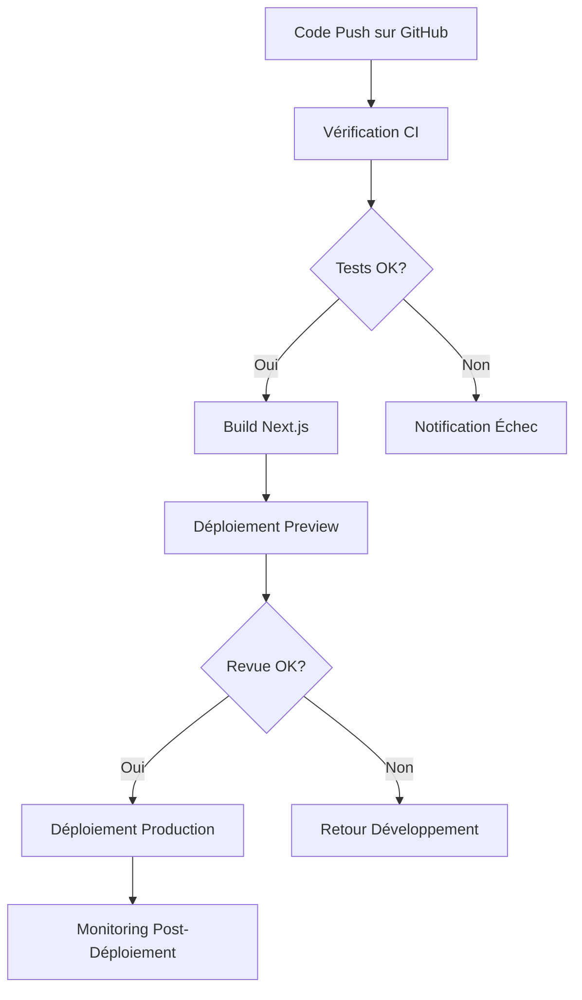

# Blueprint d'Architecture du Projet Rouge Cardinal Company

> Généré automatiquement le 24 août 2025

## 1. Détection et Analyse de l'Architecture

### Stack Technologique

- **Framework Frontend**: Next.js 15.4.5 avec App Router
- **Langage & Framework UI**: React 19 + TypeScript 5
- **Base de données & Backend**: Supabase (PostgreSQL + API REST)
- **Authentification**: Supabase Auth
- **UI/Styling**:
  - Tailwind CSS 3.4 pour le styling utilitaire
  - shadcn/ui (basé sur Radix UI) pour les composants accessibles
  - Design system personnalisé
- **State Management**: React Hooks + Context API
- **Validation**: Zod pour la validation des données
- **Déploiement**: Vercel (implicite par configuration)

### Pattern Architectural

Le projet suit une architecture hybride combinant :

- **Feature-Based Architecture** comme pattern principal d'organisation
- **Container/View Pattern** (Smart/Dumb Components) pour séparer logique et présentation
- **App Router de Next.js** pour le routage et le rendu mixte client/serveur
- **Microservices Légers** via Supabase pour l'authentification et les données

## 2. Vue d'Ensemble de l'Architecture

### Principes Directeurs

1. **Séparation des Préoccupations**
   - Composants "Smart" (Containers) pour la logique métier
   - Composants "Dumb" (Views) pour la présentation pure
   - Hooks personnalisés pour la logique réutilisable
   - Types bien définis pour garantir la cohérence des données

2. **Organisation par Feature**
   - Regroupement des composants par domaine fonctionnel
   - Encapsulation des responsabilités dans des modules distincts
   - Évolutivité verticale par feature plutôt qu'horizontale par type

3. **Réutilisabilité et Maintien**
   - Composants UI partagés pour la cohérence visuelle
   - Types partagés pour la cohérence des données
   - Patterns récurrents pour faciliter la compréhension

4. **Optimisation des Performances**
   - Server Components pour le contenu statique
   - Client Components pour l'interactivité
   - Chargement progressif avec Skeleton Components

### Frontières Architecturales

- **Client/Server**: Délimité par l'utilisation du directive "use client"
- **UI/Logique**: Délimité par le pattern Container/View
- **Feature/Shared**: Délimité par l'organisation des dossiers
- **App/Data**: Délimité par l'utilisation des services Supabase

## 3. Visualisation de l'Architecture

```bash
┌─────────────────────────────────────────────────────────────┐
│                      Client Browser                         │
└───────────────────────────────┬─────────────────────────────┘
                                │
┌───────────────────────────────▼─────────────────────────────┐
│                    Next.js App Router                       │
│  ┌─────────────────────┐     ┌─────────────────────────┐    │
│  │   Server Components │     │   Client Components     │    │
│  │   ┌─────────────┐   │     │   ┌─────────────┐       │    │
│  │   │ Layout      │   │     │   │ Interactive │       │    │
│  │   │ Page        │   │     │   │ Components  │       │    │
│  │   └─────────────┘   │     │   └─────────────┘       │    │
│  └─────────────────────┘     └─────────────────────────┘    │
└───────────────────────────────┬─────────────────────────────┘
                                │
┌───────────────────────────────▼─────────────────────────────┐
│                    Feature Architecture                      │
│  ┌─────────────────────┐     ┌─────────────────────────┐    │
│  │   Smart Components  │     │   Dumb Components       │    │
│  │   (Containers)      │     │   (Views)               │    │
│  │   ┌─────────────┐   │     │   ┌─────────────┐       │    │
│  │   │ State       │   │     │   │ Presentation│       │    │
│  │   │ Logic       │◄─────────────► UI         │       │    │
│  │   │ Data        │   │     │   │ Events      │       │    │
│  │   └─────────────┘   │     │   └─────────────┘       │    │
│  └─────────────┬───────┘     └─────────────────────────┘    │
│                │                                             │
│  ┌─────────────▼───────┐     ┌─────────────────────────┐    │
│  │   Custom Hooks      │     │   Shared UI Components  │    │
│  │   ┌─────────────┐   │     │   ┌─────────────┐       │    │
│  │   │ State Logic │   │     │   │ Button      │       │    │
│  │   │ Effects     │   │     │   │ Card        │       │    │
│  │   │ Data Fetch  │   │     │   │ Input       │       │    │
│  │   └─────────────┘   │     │   └─────────────┘       │    │
│  └─────────────────────┘     └─────────────────────────┘    │
└───────────────────────────────┬─────────────────────────────┘
                                │
┌───────────────────────────────▼─────────────────────────────┐
│                    Data Access Layer                         │
│  ┌─────────────────────┐     ┌─────────────────────────┐    │
│  │   Supabase Client   │     │   Server-Side API       │    │
│  │   ┌─────────────┐   │     │   ┌─────────────┐       │    │
│  │   │ Auth        │   │     │   │ Data Fetch  │       │    │
│  │   │ Data        │   │     │   │ Mutations   │       │    │
│  │   └─────────────┘   │     │   └─────────────┘       │    │
│  └─────────────────────┘     └─────────────────────────┘    │
└───────────────────────────────┬─────────────────────────────┘
                                │
┌───────────────────────────────▼─────────────────────────────┐
│                      Supabase Backend                        │
│  ┌─────────────────────┐     ┌─────────────────────────┐    │
│  │   Authentication    │     │   Database (Postgres)   │    │
│  └─────────────────────┘     └─────────────────────────┘    │
└─────────────────────────────────────────────────────────────┘
```

## 4. Composants Architecturaux Principaux

### Pages et Routing (app/)

**Objectif**: Définir les routes de l'application et orchestrer les composants.

**Structure Interne**:

- `app/page.tsx`: Page d'accueil, point d'entrée principal
- `app/layout.tsx`: Layout global avec header, footer et providers
- `app/auth/`: Routes d'authentification (login, signup, etc.)
- `app/protected/`: Routes nécessitant une authentification

**Pattern d'Interaction**:

- Pages importent des Containers (Smart Components) de features
- Layouts définissent la structure commune
- Middleware gère l'authentification et les redirections

**Exemple**:

```tsx
// app/page.tsx
export default function Home() {
  return (
    <main className="space-y-0">
      <HeroContainer />
      <NewsContainer />
      <AboutContainer />
      <ShowsContainer />
      <NewsletterContainer />
      <PartnersContainer />
      {/* ... */}
    </main>
  );
}
```

### Feature Components (components/features/)

**Objectif**: Implémenter les fonctionnalités métier spécifiques de l'application.

**Structure Interne**:

- Organisation par domaine fonctionnel (`public-site`, `admin`, etc.)
- Chaque feature a sa propre structure en Container/View/hooks/types
- Points d'entrée via index.ts pour simplifier les imports

**Pattern d'Interaction**:

- `*Container.tsx`: Gère la logique, l'état et les données
- `*View.tsx`: Rendu pur, reçoit les données via props
- `hooks.ts`: Logique réutilisable et gestion d'état
- `types.ts`: Types et interfaces TypeScript

**Exemple**:

```tsx
// components/features/public-site/home/hero/HeroContainer.tsx
"use client";

export function HeroContainer() {
    const { slides, currentSlide, /* ... */ } = useHero();
    
    if (isLoading) {
        return <HeroSkeleton />;
    }

    return (
        <HeroView
            slides={slides}
            currentSlide={currentSlide}
            /* ... */
        />
    );
}
```

### UI Components (components/ui/)

**Objectif**: Fournir des composants d'interface réutilisables et cohérents.

**Structure Interne**:

- Composants atomiques (button, input, card, etc.)
- Basés sur shadcn/ui et Radix UI pour l'accessibilité
- Stylisés avec Tailwind CSS pour une personnalisation flexible

**Pattern d'Interaction**:

- Utilisés par les composants View pour construire l'interface
- Acceptent des props pour la personnalisation
- Implémentent des patterns de design communs

**Exemple**:

```tsx
// components/ui/button.tsx
const Button = React.forwardRef<HTMLButtonElement, ButtonProps>(
  ({ className, variant, size, asChild = false, ...props }, ref) => {
    const Comp = asChild ? Slot : "button";
    return (
      <Comp
        className={cn(buttonVariants({ variant, size, className }))}
        ref={ref}
        {...props}
      />
    );
  }
);
```

### Data Access Layer (lib/supabase/)

**Objectif**: Fournir une interface unifiée pour l'accès aux données et l'authentification.

**Structure Interne**:

- `client.ts`: Configuration du client Supabase côté navigateur
- `server.ts`: Configuration du client Supabase côté serveur
- `middleware.ts`: Gestion des sessions et de l'authentification

**Pattern d'Interaction**:

- Utilisé par les Containers et Hooks pour accéder aux données
- Fournit des méthodes pour l'authentification
- Isole l'application des détails d'implémentation de Supabase

**Exemple**:

```typescript
// lib/supabase/server.ts
export async function createClient() {
  const cookieStore = await cookies();
  return createServerClient(
    process.env.NEXT_PUBLIC_SUPABASE_URL!,
    process.env.NEXT_PUBLIC_SUPABASE_PUBLISHABLE_OR_ANON_KEY!,
    // ...
  );
}
```

## 5. Couches Architecturales et Dépendances

### Hiérarchie des Couches

1. **UI Layer**: Components, Pages, Layouts
   - Responsable du rendu et de l'interaction utilisateur
   - Utilise les données et callbacks fournis par la couche Business

2. **Business Logic Layer**: Containers, Hooks, Services
   - Gère l'état de l'application et la logique métier
   - Coordonne les interactions avec la couche Data

3. **Data Access Layer**: Supabase Clients, API
   - Fournit une interface pour l'accès aux données
   - Isole les détails de l'implémentation du stockage

4. **Infrastructure Layer**: Next.js, Supabase, Vercel
   - Fournit les capacités fondamentales (routing, auth, etc.)
   - Gère le déploiement et l'exécution

### Règles de Dépendance

- **Règle 1**: Les couches supérieures peuvent dépendre des couches inférieures, mais pas l'inverse
- **Règle 2**: Les Views ne peuvent pas dépendre directement de la couche Data
- **Règle 3**: Les composants UI ne connaissent pas le concept de features
- **Règle 4**: Les Containers orchestrent les interactions entre les couches

### Patterns d'Injection de Dépendances

- **Props Drilling**: Pour les hiérarchies de composants peu profondes
- **Context API**: Pour l'état global ou partagé entre plusieurs composants
- **Custom Hooks**: Pour encapsuler la logique réutilisable

## 6. Architecture des Données

### Structure du Modèle de Domaine

- **Utilisateurs**: Authentification et profils
- **Spectacles**: Programmation artistique
- **Actualités**: News et événements
- **Agenda**: Calendrier des représentations
- **Pages**: Contenu statique (à propos, compagnie, etc.)

### Patterns d'Accès aux Données

- **Server Components**: Récupération des données côté serveur
- **SWR/React Query**: Cache et revalidation côté client
- **Custom Hooks**: Encapsulation des requêtes et de la gestion d'état

### Patterns de Transformation des Données

- **Types forts**: Validation des données avec TypeScript
- **Schemas Zod**: Validation structurelle et transformation
- **Mappers**: Conversion entre DTO et modèles domaine

## 7. Implémentation des Préoccupations Transversales

### Authentification & Autorisation

- **Implémentation**: Supabase Auth avec middleware Next.js
- **Pattern d'Application**: Routes protégées et composants conditionnels
- **Gestion des Sessions**: Cookies HTTP et state management

### Gestion des Erreurs & Résilience

- **Pattern de Capture**: Error boundaries React
- **Affichage**: Composants d'erreur contextuelle
- **Fallback**: Skelton loaders et états de chargement
- **Retry**: Politique de nouvelle tentative pour les requêtes échouées

### Logging & Monitoring

- **Client-side**: Console (développement) et analytics (production)
- **Server-side**: Logs Vercel et monitoring Supabase
- **Error Tracking**: Intégrable avec Sentry ou équivalent

### Validation

- **Input Forms**: Validation côté client avec Zod
- **API Requests**: Validation côté serveur avant traitement
- **Data Fetching**: Validation des réponses d'API

## 8. Patterns de Communication

### Définition des Frontières de Service

- **Authentication Service**: Gestion des utilisateurs et sessions
- **Content Service**: Gestion du contenu et des médias
- **Booking Service**: Gestion des réservations et billets

### Communication Client-Serveur

- **REST API**: Pour les requêtes CRUD classiques
- **Server Components**: Pour le chargement initial des données
- **Real-time**: Possible via Supabase Realtime pour les notifications

### Patterns de Résilience

- **Timeout**: Limites de temps pour les requêtes
- **Circuit Breaker**: Arrêt des requêtes en cas d'échecs répétés
- **Fallback**: Contenu de secours en cas d'indisponibilité

## 9. Patterns Spécifiques Next.js

### Routing et Navigation

- **App Router**: Utilisation du nouveau système de routage basé sur les dossiers

  ```text
  app/
    page.tsx            # Route: /
    layout.tsx          # Layout partagé
    auth/
      login/
        page.tsx        # Route: /auth/login
      sign-up/
        page.tsx        # Route: /auth/sign-up
    protected/
      layout.tsx        # Layout protégé avec vérification d'auth
      page.tsx          # Route: /protected
  ```
  
- **Middleware pour l'Authentification**:

  ```typescript
  // middleware.ts
  export async function middleware(request: NextRequest) {
    // Vérification de la session
    const { data: { session } } = await supabase.auth.getSession();
    
    // Redirection si nécessaire
    if (!session && request.nextUrl.pathname.startsWith('/protected')) {
      return NextResponse.redirect(new URL('/auth/login', request.url));
    }
    
    return NextResponse.next();
  }
  ```

- **Loading et Error States**: Utilisation des fichiers spéciaux pour gérer les états

  ```bash
  app/
    protected/
      loading.tsx      # Affiché pendant le chargement
      error.tsx        # Affiché en cas d'erreur
      not-found.tsx    # Affiché si la page n'existe pas
  ```

### Optimisation des Performances

- **Server Components**: Utilisation par défaut pour réduire le JavaScript côté client

  ```typescript
  // Par défaut, tous les composants sont des Server Components
  // sauf si marqués explicitement avec "use client"
  export default function ServerComponent() {
    // Aucun hook React, pas d'interactivité
    return <div>Rendu côté serveur</div>;
  }
  ```

- **Image Optimization**: Utilisation du composant `next/image` pour l'optimisation automatique

  ```tsx
  import Image from 'next/image';
  
  export function OptimizedImage() {
    return (
      <Image
        src="/images/hero.jpg"
        alt="Hero image"
        width={1200}
        height={600}
        priority
        className="w-full h-auto"
      />
    );
  }
  ```

- **Font Optimization**: Utilisation de `next/font` pour charger les polices optimisées

  ```tsx
  // app/layout.tsx
  import { Inter } from 'next/font/google';
  
  const inter = Inter({ subsets: ['latin'] });
  
  export default function RootLayout({ children }) {
    return (
      <html lang="fr" className={inter.className}>
        <body>{children}</body>
      </html>
    );
  }
  ```

- **Dynamic Imports**: Chargement à la demande des composants lourds

  ```tsx
  import dynamic from 'next/dynamic';
  
  const HeavyComponent = dynamic(() => import('../components/HeavyComponent'), {
    loading: () => <p>Chargement...</p>,
    ssr: false // Désactiver le SSR si nécessaire
  });
  ```

### Patterns de Rendu

- **Streaming**: Utilisation de Suspense pour charger progressivement les parties d'une page

  ```tsx
  import { Suspense } from 'react';
  
  export default function Page() {
    return (
      <div>
        <Header />
        <Suspense fallback={<SkeletonContent />}>
          <MainContent />
        </Suspense>
        <Suspense fallback={<SkeletonSidebar />}>
          <Sidebar />
        </Suspense>
      </div>
    );
  }
  ```

- **Parallel Data Fetching**: Chargement parallèle des données

  ```tsx
  export default async function Page() {
    // Ces requêtes s'exécutent en parallèle
    const newsPromise = getNews();
    const eventsPromise = getEvents();
    
    // Attendez toutes les promesses
    const [news, events] = await Promise.all([
      newsPromise,
      eventsPromise
    ]);
    
    return (
      <div>
        <NewsSection news={news} />
        <EventsSection events={events} />
      </div>
    );
  }
  ```

## 10. Patterns d'Implémentation

### Pattern Container/View (Smart/Dumb)

Le pattern Container/View est utilisé systématiquement pour séparer la logique de la présentation :

**Container (Smart Component)**

```typescript
// components/features/public-site/home/hero/HeroContainer.tsx
"use client";

import { HeroView } from './HeroView';
import { useHero } from './hooks';
import { HeroSkeleton } from './HeroSkeleton';

export function HeroContainer() {
  const { 
    slides, 
    currentSlide, 
    isLoading, 
    error, 
    handleNextSlide, 
    handlePrevSlide 
  } = useHero();
  
  if (isLoading) {
    return <HeroSkeleton />;
  }
  
  if (error) {
    return <div className="error-state">Impossible de charger les slides</div>;
  }
  
  return (
    <HeroView
      slides={slides}
      currentSlide={currentSlide}
      onNextSlide={handleNextSlide}
      onPrevSlide={handlePrevSlide}
    />
  );
}
```

**View (Dumb Component)**

```typescript
// components/features/public-site/home/hero/HeroView.tsx
import { Button } from '@/components/ui/button';
import { HeroSlide } from './types';

interface HeroViewProps {
  slides: HeroSlide[];
  currentSlide: number;
  onNextSlide: () => void;
  onPrevSlide: () => void;
}

export function HeroView({ 
  slides, 
  currentSlide, 
  onNextSlide, 
  onPrevSlide 
}: HeroViewProps) {
  return (
    <section className="hero-section">
      <div className="slide-container">
        {slides.map((slide, index) => (
          <div 
            key={slide.id} 
            className={`slide ${index === currentSlide ? 'active' : ''}`}
          >
            
            <h2>{slide.title}</h2>
            <p>{slide.description}</p>
          </div>
        ))}
      </div>
      <div className="controls">
        <Button onClick={onPrevSlide} variant="outline">Précédent</Button>
        <Button onClick={onNextSlide}>Suivant</Button>
      </div>
    </section>
  );
}
```

### Pattern de Custom Hook

Les custom hooks encapsulent la logique métier et la gestion d'état :

```typescript
// components/features/public-site/home/hero/hooks.ts
import { useState, useEffect } from 'react';
import { createClientComponentClient } from '@supabase/auth-helpers-nextjs';
import { HeroSlide } from './types';

export function useHero() {
  const [slides, setSlides] = useState<HeroSlide[]>([]);
  const [currentSlide, setCurrentSlide] = useState(0);
  const [isLoading, setIsLoading] = useState(true);
  const [error, setError] = useState<Error | null>(null);
  
  const supabase = createClientComponentClient();
  
  useEffect(() => {
    async function fetchSlides() {
      try {
        setIsLoading(true);
        const { data, error } = await supabase
          .from('hero_slides')
          .select('*')
          .order('order');
          
        if (error) throw error;
        
        setSlides(data || []);
      } catch (err) {
        setError(err instanceof Error ? err : new Error('Erreur inconnue'));
      } finally {
        setIsLoading(false);
      }
    }
    
    fetchSlides();
  }, [supabase]);
  
  function handleNextSlide() {
    setCurrentSlide((prev) => 
      prev === slides.length - 1 ? 0 : prev + 1
    );
  }
  
  function handlePrevSlide() {
    setCurrentSlide((prev) => 
      prev === 0 ? slides.length - 1 : prev - 1
    );
  }
  
  return {
    slides,
    currentSlide,
    isLoading,
    error,
    handleNextSlide,
    handlePrevSlide
  };
}
```

### Pattern de Type et Interface

Types et interfaces bien définis pour garantir la sécurité des types :

```typescript
// components/features/public-site/home/hero/types.ts
export interface HeroSlide {
  id: string;
  title: string;
  description: string;
  imageUrl: string;
  ctaText?: string;
  ctaUrl?: string;
  order: number;
  createdAt: string;
}

export interface HeroState {
  slides: HeroSlide[];
  currentSlide: number;
  isLoading: boolean;
  error: Error | null;
}

export interface HeroActions {
  handleNextSlide: () => void;
  handlePrevSlide: () => void;
}
```

### Pattern de Skeleton Loading

Composants de chargement qui imitent la structure de l'UI finale :

```typescript
// components/features/public-site/home/hero/HeroSkeleton.tsx
import { Skeleton } from '@/components/ui/skeleton';

export function HeroSkeleton() {
  return (
    <section className="hero-section">
      <div className="slide-container">
        <div className="slide active">
          <Skeleton className="w-full h-[400px]" />
          <Skeleton className="w-1/2 h-[40px] mt-4" />
          <Skeleton className="w-3/4 h-[20px] mt-2" />
        </div>
      </div>
      <div className="controls">
        <Skeleton className="w-[100px] h-[40px]" />
        <Skeleton className="w-[100px] h-[40px]" />
      </div>
    </section>
  );
}
```

### Pattern d'Exportation via Index

Simplification des imports par regroupement dans des fichiers index :

```typescript
// components/features/public-site/home/hero/index.ts
export { HeroContainer } from './HeroContainer';
export type { HeroSlide, HeroState, HeroActions } from './types';

// Utilisation ailleurs dans l'application
import { HeroContainer } from '@/components/features/public-site/home/hero';
```

## 11. Architecture de Test

### Niveaux de Test

#### 1. Tests Unitaires (Jest + React Testing Library)

Les tests unitaires se concentrent sur l'isolation des composants individuels et la vérification de leur comportement :

```typescript
// __tests__/components/ui/button.test.tsx
import { render, screen, fireEvent } from '@testing-library/react';
import { Button } from '@/components/ui/button';

describe('Button Component', () => {
  it('renders correctly with default props', () => {
    render(<Button>Click me</Button>);
    const button = screen.getByRole('button', { name: /click me/i });
    expect(button).toBeInTheDocument();
    expect(button).toHaveClass('bg-primary');
  });

  it('calls onClick handler when clicked', () => {
    const handleClick = jest.fn();
    render(<Button onClick={handleClick}>Click me</Button>);
    fireEvent.click(screen.getByRole('button'));
    expect(handleClick).toHaveBeenCalledTimes(1);
  });
  
  it('renders with different variants', () => {
    render(<Button variant="outline">Outline Button</Button>);
    expect(screen.getByRole('button')).toHaveClass('border-input bg-background');
  });
});
```

#### 2. Tests d'Intégration

Les tests d'intégration vérifient l'interaction entre plusieurs composants ou avec des services externes :

```typescript
// __tests__/features/auth/login-form.test.tsx
import { render, screen, fireEvent, waitFor } from '@testing-library/react';
import { LoginForm } from '@/components/login-form';
import { createClientComponentClient } from '@supabase/auth-helpers-nextjs';

// Mock de Supabase
jest.mock('@supabase/auth-helpers-nextjs', () => ({
  createClientComponentClient: jest.fn(),
}));

describe('LoginForm Integration', () => {
  beforeEach(() => {
    // Configuration du mock
    const mockSupabase = {
      auth: {
        signInWithPassword: jest.fn(),
      },
    };
    (createClientComponentClient as jest.Mock).mockReturnValue(mockSupabase);
  });

  it('submits the form with user credentials', async () => {
    const mockSignIn = jest.fn().mockResolvedValue({ 
      data: { user: { id: '123' } }, 
      error: null 
    });
    
    const supabase = createClientComponentClient();
    supabase.auth.signInWithPassword = mockSignIn;
    
    render(<LoginForm />);
    
    // Remplir le formulaire
    fireEvent.change(screen.getByLabelText(/email/i), {
      target: { value: 'user@example.com' },
    });
    fireEvent.change(screen.getByLabelText(/mot de passe/i), {
      target: { value: 'password123' },
    });
    
    // Soumettre le formulaire
    fireEvent.click(screen.getByRole('button', { name: /connexion/i }));
    
    // Vérifier que Supabase a été appelé avec les bons paramètres
    await waitFor(() => {
      expect(mockSignIn).toHaveBeenCalledWith({
        email: 'user@example.com',
        password: 'password123',
      });
    });
  });
});
```

#### 3. Tests End-to-End (Cypress/Playwright)

Les tests E2E simulent des interactions utilisateur complètes dans un navigateur réel :

```typescript
// cypress/e2e/authentication.cy.ts
describe('Authentication Flow', () => {
  it('allows a user to login', () => {
    // Visite de la page de connexion
    cy.visit('/auth/login');
    
    // Interaction avec le formulaire
    cy.get('[data-testid="email-input"]').type('test@example.com');
    cy.get('[data-testid="password-input"]').type('password123');
    cy.get('[data-testid="login-button"]').click();
    
    // Vérification de la redirection après connexion
    cy.url().should('include', '/protected');
    
    // Vérification de l'état connecté
    cy.get('[data-testid="user-menu"]').should('be.visible');
  });
  
  it('displays error messages for invalid credentials', () => {
    cy.visit('/auth/login');
    
    // Tentative de connexion avec des identifiants invalides
    cy.get('[data-testid="email-input"]').type('invalid@example.com');
    cy.get('[data-testid="password-input"]').type('wrongpassword');
    cy.get('[data-testid="login-button"]').click();
    
    // Vérification du message d'erreur
    cy.get('[data-testid="auth-error"]')
      .should('be.visible')
      .and('contain.text', 'Identifiants invalides');
  });
});
```

### Patterns de Test

#### Arrangement-Action-Assertion (AAA)

Ce pattern structure les tests en trois phases distinctes :

1. **Arrangement** : Préparation des données et de l'environnement
2. **Action** : Exécution de l'action à tester
3. **Assertion** : Vérification des résultats attendus

```typescript
it('updates user profile successfully', async () => {
  // Arrangement
  const user = { id: '123', name: 'Old Name', email: 'old@example.com' };
  const updatedProfile = { name: 'New Name', email: 'new@example.com' };
  const mockUpdateProfile = jest.fn().mockResolvedValue({ data: { ...user, ...updatedProfile }, error: null });
  
  // Action
  const result = await updateUserProfile(user.id, updatedProfile);
  
  // Assertion
  expect(mockUpdateProfile).toHaveBeenCalledWith(user.id, updatedProfile);
  expect(result.name).toBe('New Name');
  expect(result.email).toBe('new@example.com');
});
```

#### Page Object Model (POM)

Pour les tests E2E, le pattern POM encapsule les sélecteurs et actions spécifiques à chaque page :

```typescript
// cypress/support/pages/LoginPage.ts
export class LoginPage {
  visit() {
    cy.visit('/auth/login');
    return this;
  }
  
  fillEmail(email: string) {
    cy.get('[data-testid="email-input"]').type(email);
    return this;
  }
  
  fillPassword(password: string) {
    cy.get('[data-testid="password-input"]').type(password);
    return this;
  }
  
  submit() {
    cy.get('[data-testid="login-button"]').click();
    return this;
  }
  
  assertErrorMessage(message: string) {
    cy.get('[data-testid="auth-error"]')
      .should('be.visible')
      .and('contain.text', message);
    return this;
  }
}

// Utilisation dans les tests
it('displays error for invalid credentials', () => {
  const loginPage = new LoginPage();
  loginPage
    .visit()
    .fillEmail('invalid@example.com')
    .fillPassword('wrongpassword')
    .submit()
    .assertErrorMessage('Identifiants invalides');
});
```

#### Mocking des Services Externes

Isolation des tests des dépendances externes :

```typescript
// __tests__/services/data.test.ts
import { fetchShowData } from '@/services/data';
import { createClient } from '@/lib/supabase/server';

// Mock de Supabase
jest.mock('@/lib/supabase/server', () => ({
  createClient: jest.fn(),
}));

describe('Data Service', () => {
  beforeEach(() => {
    jest.clearAllMocks();
  });
  
  it('fetches show data correctly', async () => {
    // Configurer le mock pour retourner des données de test
    const mockSupabase = {
      from: jest.fn().mockReturnThis(),
      select: jest.fn().mockReturnThis(),
      order: jest.fn().mockReturnThis(),
      returns: jest.fn().mockResolvedValue({
        data: [{ id: '1', title: 'Show 1' }, { id: '2', title: 'Show 2' }],
        error: null,
      }),
    };
    
    (createClient as jest.Mock).mockResolvedValue(mockSupabase);
    
    // Appeler la fonction à tester
    const result = await fetchShowData();
    
    // Vérifier les résultats
    expect(result).toHaveLength(2);
    expect(result[0].title).toBe('Show 1');
  });
});
```

## 12. Architecture de Déploiement

### Pipeline de Déploiement

L'application utilise un pipeline de déploiement continu avec Vercel et GitHub :



#### Étapes du Pipeline

1. **Intégration Continue (CI)**
   - Exécution des tests
   - Vérification de la qualité du code (linting, type checking)
   - Analyse des vulnérabilités des dépendances

2. **Build**
   - Construction de l'application Next.js optimisée
   - Génération des fichiers statiques et routes
   - Analyse des performances et optimisations

3. **Déploiement**
   - Déploiement automatique des environnements de prévisualisation
   - Déploiement manuel ou automatique de la production
   - Rollback automatique en cas d'erreur détectée

4. **Monitoring**
   - Surveillance des performances et erreurs
   - Alertes en cas de problème
   - Analyse du comportement utilisateur

### Configuration des Environnements

L'application utilise trois environnements distincts avec des configurations spécifiques :

#### Environnement de Développement

```env
# .env.development
NEXT_PUBLIC_SUPABASE_URL=https://dev-project.supabase.co
NEXT_PUBLIC_SUPABASE_ANON_KEY=your-dev-anon-key
NEXT_PUBLIC_SITE_URL=http://localhost:3000
NODE_ENV=development
```

Caractéristiques :

- Mode développement de Next.js activé
- Serveur de développement avec hot reloading
- Base de données Supabase de développement
- Logging détaillé

#### Environnement de Staging

```env
# .env.staging
NEXT_PUBLIC_SUPABASE_URL=https://staging-project.supabase.co
NEXT_PUBLIC_SUPABASE_ANON_KEY=your-staging-anon-key
NEXT_PUBLIC_SITE_URL=https://staging.rougecardinalcompany.com
NODE_ENV=production
```

Caractéristiques :

- Configuration identique à la production
- Données de test ou miroir de la production
- Accès restreint par authentification
- Utilisé pour les tests avant déploiement en production

#### Environnement de Production

```env
# .env.production
NEXT_PUBLIC_SUPABASE_URL=https://production-project.supabase.co
NEXT_PUBLIC_SUPABASE_ANON_KEY=your-production-anon-key
NEXT_PUBLIC_SITE_URL=https://rougecardinalcompany.com
NODE_ENV=production
```

Caractéristiques :

- Optimisations de production activées
- Caching agressif
- Monitoring et alertes
- Configuration sécurisée

### Stratégie de Déploiement

#### Déploiement Progressif

L'application utilise une stratégie de déploiement progressif pour minimiser les risques :

1. **Déploiement Automatique en Staging**
   - À chaque merge sur la branche `main`
   - Tests automatiques complets
   - Vérification manuelle des fonctionnalités

2. **Déploiement Canary en Production**
   - Déploiement initial à un sous-ensemble d'utilisateurs
   - Surveillance des métriques de performance et d'erreur
   - Extension progressive à tous les utilisateurs

3. **Rollback Automatique**
   - Détection automatique des erreurs critiques
   - Retour à la version précédente en cas de problème
   - Alertes pour intervention humaine si nécessaire

### Monitoring et Observabilité

L'application intègre plusieurs niveaux de monitoring :

1. **Performances Applicatives**
   - Next.js Analytics pour les métriques Web Vitals
   - Suivi des temps de chargement et d'interaction
   - Optimisation continue basée sur les données réelles

2. **Erreurs et Exceptions**
   - Captation des erreurs côté client et serveur
   - Agrégation et analyse des patterns d'erreur
   - Alertes en temps réel pour les problèmes critiques

3. **Infrastructure**
   - Métriques de performance serveur via Vercel
   - Monitoring de la base de données via Supabase
   - Vérification de disponibilité des services externes

## 13. Points d'Extension

### Extension des Composants

L'architecture a été conçue pour permettre plusieurs façons d'étendre les composants existants :

#### Higher-Order Components (HOC)

Les HOC permettent d'enrichir des composants existants avec des fonctionnalités supplémentaires :

```tsx
// lib/hocs/withAuth.tsx
import { useRouter } from 'next/navigation';
import { useEffect } from 'react';
import { createClientComponentClient } from '@supabase/auth-helpers-nextjs';

export function withAuth<P extends object>(
  Component: React.ComponentType<P>
): React.FC<P> {
  return function AuthenticatedComponent(props: P) {
    const router = useRouter();
    const supabase = createClientComponentClient();
    
    useEffect(() => {
      const checkAuth = async () => {
        const { data } = await supabase.auth.getSession();
        if (!data.session) {
          router.push('/auth/login');
        }
      };
      
      checkAuth();
    }, [router, supabase]);
    
    return <Component {...props} />;
  };
}

// Utilisation
const ProtectedComponent = withAuth(ProfileComponent);
```

#### Render Props

Le pattern Render Props permet une composition flexible des composants :

```tsx
// components/features/shared/data-fetcher/DataFetcher.tsx
import { useState, useEffect } from 'react';

interface DataFetcherProps<T> {
  fetchFunction: () => Promise<T>;
  children: (state: {
    data: T | null;
    isLoading: boolean;
    error: Error | null;
    refetch: () => void;
  }) => React.ReactNode;
}

export function DataFetcher<T>({ 
  fetchFunction, 
  children 
}: DataFetcherProps<T>) {
  const [data, setData] = useState<T | null>(null);
  const [isLoading, setIsLoading] = useState(true);
  const [error, setError] = useState<Error | null>(null);
  
  const fetchData = async () => {
    try {
      setIsLoading(true);
      const result = await fetchFunction();
      setData(result);
    } catch (err) {
      setError(err instanceof Error ? err : new Error('Erreur inconnue'));
    } finally {
      setIsLoading(false);
    }
  };
  
  useEffect(() => {
    fetchData();
  }, []);
  
  return <>{children({ data, isLoading, error, refetch: fetchData })}</>;
}

// Utilisation
function ShowsList() {
  return (
    <DataFetcher fetchFunction={fetchShows}>
      {({ data, isLoading, error, refetch }) => {
        if (isLoading) return <ShowsListSkeleton />;
        if (error) return <ErrorDisplay message={error.message} onRetry={refetch} />;
        return <ShowsListView shows={data} />;
      }}
    </DataFetcher>
  );
}
```

#### Custom Hooks

Les hooks personnalisés permettent d'extraire et réutiliser la logique à travers différents composants :

```tsx
// hooks/useForm.ts
import { useState, ChangeEvent, FormEvent } from 'react';

interface UseFormProps<T> {
  initialValues: T;
  onSubmit: (values: T) => void | Promise<void>;
  validate?: (values: T) => Partial<Record<keyof T, string>>;
}

export function useForm<T extends Record<string, any>>({
  initialValues,
  onSubmit,
  validate
}: UseFormProps<T>) {
  const [values, setValues] = useState<T>(initialValues);
  const [errors, setErrors] = useState<Partial<Record<keyof T, string>>>({});
  const [isSubmitting, setIsSubmitting] = useState(false);
  
  const handleChange = (e: ChangeEvent<HTMLInputElement | HTMLTextAreaElement | HTMLSelectElement>) => {
    const { name, value } = e.target;
    setValues({ ...values, [name]: value });
  };
  
  const handleSubmit = async (e: FormEvent) => {
    e.preventDefault();
    
    if (validate) {
      const validationErrors = validate(values);
      if (Object.keys(validationErrors).length > 0) {
        setErrors(validationErrors);
        return;
      }
    }
    
    setIsSubmitting(true);
    try {
      await onSubmit(values);
    } finally {
      setIsSubmitting(false);
    }
  };
  
  return { values, errors, isSubmitting, handleChange, handleSubmit, setValues };
}

// Utilisation
function ContactForm() {
  const { values, errors, isSubmitting, handleChange, handleSubmit } = useForm({
    initialValues: { name: '', email: '', message: '' },
    validate: (values) => {
      const errors: Record<string, string> = {};
      if (!values.name) errors.name = 'Le nom est requis';
      if (!values.email) errors.email = 'L\'email est requis';
      return errors;
    },
    onSubmit: async (values) => {
      await submitContactForm(values);
    }
  });
  
  return (
    <form onSubmit={handleSubmit}>
      {/* Champs du formulaire utilisant values, errors, et handleChange */}
    </form>
  );
}
```

### Extension des Services

L'architecture permet d'étendre les services existants de différentes manières :

#### Adapters pour Sources de Données

Les adapters permettent d'utiliser différentes sources de données tout en maintenant une interface cohérente :

```tsx
// lib/adapters/dataSource.ts
export interface DataSource<T> {
  getAll: () => Promise<T[]>;
  getById: (id: string) => Promise<T | null>;
  create: (data: Omit<T, 'id'>) => Promise<T>;
  update: (id: string, data: Partial<T>) => Promise<T>;
  delete: (id: string) => Promise<void>;
}

// Adapter pour Supabase
export class SupabaseAdapter<T extends { id: string }> implements DataSource<T> {
  constructor(
    private supabase: any,
    private table: string
  ) {}
  
  async getAll(): Promise<T[]> {
    const { data, error } = await this.supabase.from(this.table).select('*');
    if (error) throw error;
    return data;
  }
  
  async getById(id: string): Promise<T | null> {
    const { data, error } = await this.supabase
      .from(this.table)
      .select('*')
      .eq('id', id)
      .single();
    if (error) throw error;
    return data;
  }
  
  // Autres méthodes implémentées de façon similaire
}

// Adapter pour API REST
export class RestApiAdapter<T extends { id: string }> implements DataSource<T> {
  constructor(
    private baseUrl: string
  ) {}
  
  async getAll(): Promise<T[]> {
    const response = await fetch(this.baseUrl);
    if (!response.ok) throw new Error('Erreur lors de la récupération des données');
    return response.json();
  }
  
  // Autres méthodes implémentées de façon similaire
}
```

#### Middleware Personnalisé

Des middlewares personnalisés peuvent être ajoutés pour traiter les requêtes de manière spécifique :

```tsx
// middleware.ts
import { NextRequest, NextResponse } from 'next/server';
import { createMiddlewareClient } from '@supabase/auth-helpers-nextjs';

export async function middleware(request: NextRequest) {
  const response = NextResponse.next();
  const supabase = createMiddlewareClient({ req: request, res: response });
  
  // Middleware d'authentification
  const { data: { session } } = await supabase.auth.getSession();
  const isAuthPage = request.nextUrl.pathname.startsWith('/auth');
  const isProtectedPage = request.nextUrl.pathname.startsWith('/protected');
  
  if (isProtectedPage && !session) {
    return NextResponse.redirect(new URL('/auth/login', request.url));
  }
  
  if (isAuthPage && session) {
    return NextResponse.redirect(new URL('/protected', request.url));
  }
  
  // Middleware de localisation
  const locale = request.cookies.get('locale')?.value || 'fr';
  response.cookies.set('locale', locale);
  
  // Middleware de sécurité
  response.headers.set('X-Frame-Options', 'SAMEORIGIN');
  response.headers.set('X-Content-Type-Options', 'nosniff');
  response.headers.set('Referrer-Policy', 'strict-origin-when-cross-origin');
  
  return response;
}
```

#### Plugins pour Fonctionnalités Additionnelles

Le système peut être étendu avec des plugins modulaires :

```tsx
// lib/plugins/analyticsPlugin.ts
export interface AnalyticsPlugin {
  trackPageView: (url: string) => void;
  trackEvent: (name: string, properties?: Record<string, any>) => void;
}

// Implémentation Google Analytics
export class GoogleAnalyticsPlugin implements AnalyticsPlugin {
  trackPageView(url: string) {
    // Logique d'envoi à GA
    window.gtag('config', 'G-XXXXXXXXXX', { page_path: url });
  }
  
  trackEvent(name: string, properties?: Record<string, any>) {
    window.gtag('event', name, properties);
  }
}

// Implémentation Matomo
export class MatomoAnalyticsPlugin implements AnalyticsPlugin {
  trackPageView(url: string) {
    // Logique d'envoi à Matomo
    window._paq.push(['setCustomUrl', url]);
    window._paq.push(['trackPageView']);
  }
  
  trackEvent(name: string, properties?: Record<string, any>) {
    window._paq.push(['trackEvent', 'Action', name, properties]);
  }
}

// Utilisation
const analyticsPlugin = process.env.NEXT_PUBLIC_ANALYTICS_PROVIDER === 'GA' 
  ? new GoogleAnalyticsPlugin() 
  : new MatomoAnalyticsPlugin();

export function useAnalytics() {
  return analyticsPlugin;
}
```

## 14. Gouvernance Architecturale

### Maintenance de la Cohérence

Pour maintenir la cohérence architecturale, le projet utilise plusieurs outils et pratiques :

#### Linting et Formatage Automatisé

```json
// eslint.config.mjs
import process from "node:process";
import nextPlugin from "@next/eslint-plugin-next";
import tsPlugin from "@typescript-eslint/eslint-plugin";
import tsParser from "@typescript-eslint/parser";
import reactPlugin from "eslint-plugin-react";
import reactHooksPlugin from "eslint-plugin-react-hooks";
import reactRefreshPlugin from "eslint-plugin-react-refresh";
import tailwindcssPlugin from "eslint-plugin-tailwindcss";

export default [
  {
    plugins: {
      "@next": nextPlugin,
      "@typescript-eslint": tsPlugin,
      react: reactPlugin,
      "react-hooks": reactHooksPlugin,
      "react-refresh": reactRefreshPlugin,
      tailwindcss: tailwindcssPlugin,
    },
    languageOptions: {
      parser: tsParser,
      parserOptions: {
        ecmaFeatures: { jsx: true },
        ecmaVersion: "latest",
        sourceType: "module",
      },
    },
    settings: {
      react: { version: "detect" },
      tailwindcss: { callees: ["cn", "cva"] },
    },
    rules: {
      // Règles spécifiques au projet...
    },
  },
];
```

#### Vérification des Types TypeScript

Le projet utilise un `tsconfig.json` strict pour garantir la qualité du code :

```json
// tsconfig.json
{
  "compilerOptions": {
    "target": "es2017",
    "lib": ["dom", "dom.iterable", "esnext"],
    "allowJs": true,
    "skipLibCheck": true,
    "strict": true,
    "noEmit": true,
    "esModuleInterop": true,
    "module": "esnext",
    "moduleResolution": "bundler",
    "resolveJsonModule": true,
    "isolatedModules": true,
    "jsx": "preserve",
    "incremental": true,
    "plugins": [
      {
        "name": "next"
      }
    ],
    "baseUrl": ".",
    "paths": {
      "@/*": ["./*"]
    }
  },
  "include": ["next-env.d.ts", "**/*.ts", "**/*.tsx", ".next/types/**/*.ts"],
  "exclude": ["node_modules"]
}
```

#### Revues de Code Systématiques

Les revues de code suivent une liste de contrôle standardisée :

1. **Vérification Architecturale**
   - Respect du pattern Container/View
   - Organisation correcte des fichiers
   - Respect des frontières architecturales

2. **Vérification Qualitative**
   - Typage correct
   - Tests adéquats
   - Performance des requêtes et rendu

3. **Vérification d'Accessibilité**
   - Contraste et lisibilité
   - Support du clavier
   - Labels et ARIA

4. **Vérification de Sécurité**
   - Validation des entrées
   - Protection contre les injections
   - Gestion sécurisée des tokens

#### Audits Architecturaux Périodiques

Des audits sont programmés régulièrement pour évaluer :

- La cohérence de l'implémentation
- Les dérives par rapport au blueprint
- Les opportunités d'amélioration
- La dette technique

### Documentation

La documentation du projet est organisée à plusieurs niveaux :

#### Documentation au Niveau du Code

##### JSDoc pour les Composants et Fonctions

```tsx
/**
 * Bouton personnalisable qui prend en charge plusieurs variantes et tailles.
 *
 * @component
 * @example
 * ```tsx
 * <Button variant="primary" size="lg" onClick={handleClick}>
 *   Cliquez-moi
 * </Button>
 * ```
 *
 * @param {object} props - Les propriétés du composant Button
 * @param {ReactNode} props.children - Le contenu du bouton
 * @param {string} [props.variant="default"] - La variante du bouton (default, primary, outline, etc.)
 * @param {string} [props.size="md"] - La taille du bouton (sm, md, lg)
 * @param {function} [props.onClick] - Fonction appelée au clic sur le bouton
 * @param {string} [props.className] - Classes CSS additionnelles
 * @param {boolean} [props.disabled] - Si le bouton est désactivé
 * @returns {JSX.Element} Le composant Button
 */
export const Button = React.forwardRef<HTMLButtonElement, ButtonProps>(
  // ...implémentation
);
```

#### Documentation au Niveau du Dossier

Chaque dossier clé contient un fichier README.md expliquant son but et son organisation :

```markdown
# Components UI

Ce dossier contient les composants UI réutilisables de l'application.

## Organisation

- `atoms/`: Composants de base (Button, Input, etc.)
- `molecules/`: Combinaisons de composants atomiques (SearchBox, Card, etc.)
- `organisms/`: Sections UI complexes (Header, Footer, etc.)

## Utilisation

Les composants suivent le pattern de composition et peuvent être personnalisés via les props.

```

#### Documentation d'Architecture

En plus de ce blueprint, d'autres documents architecturaux sont maintenus :

1. **ADRs (Architecture Decision Records)**: Documentation des décisions architecturales importantes
2. **Guide de Style**: Documentation du design system
3. **Guide de Contribution**: Instructions pour les nouveaux contributeurs

#### Documentation Interactive (Storybook)

Les composants UI sont documentés et testables via Storybook :

```tsx
// components/ui/button.stories.tsx
import type { Meta, StoryObj } from '@storybook/react';
import { Button } from './button';

const meta: Meta<typeof Button> = {
  title: 'UI/Button',
  component: Button,
  parameters: {
    layout: 'centered',
  },
  tags: ['autodocs'],
  argTypes: {
    variant: {
      control: 'select',
      options: ['default', 'primary', 'outline', 'ghost'],
    },
    size: {
      control: 'select',
      options: ['sm', 'md', 'lg'],
    },
  },
};

export default meta;
type Story = StoryObj<typeof Button>;

export const Default: Story = {
  args: {
    children: 'Bouton',
    variant: 'default',
  },
};

export const Primary: Story = {
  args: {
    children: 'Bouton Primaire',
    variant: 'primary',
  },
};

export const Small: Story = {
  args: {
    children: 'Petit Bouton',
    size: 'sm',
  },
};

export const Disabled: Story = {
  args: {
    children: 'Bouton Désactivé',
    disabled: true,
  },
};
```

## 15. Guide de Développement

### Workflow de Développement

Le workflow de développement standardisé pour ce projet suit ces étapes :

#### 1. Création de Ticket

- Création d'un ticket dans le système de suivi (GitHub Issues, Jira, etc.)
- Documentation claire des exigences et critères d'acceptation
- Estimation de l'effort et de la complexité

#### 2. Création de Branche

```bash
# Création d'une branche à partir de main
git checkout main
git pull
git checkout -b feature/nom-de-la-fonctionnalité

# OU pour une correction de bug
git checkout -b fix/description-du-bug
```

#### 3. Implémentation avec TDD

1. Écrire les tests d'abord
2. Implémenter la fonctionnalité pour faire passer les tests
3. Refactoriser le code tout en maintenant les tests au vert

```bash
# Exécution des tests
npm run test

# Exécution des tests avec watch mode
npm run test:watch
```

#### 4. Validation Locale

```bash
# Vérification du linting
npm run lint

# Vérification des types
npm run type-check

# Build local
npm run build

# Tests de l'application en mode production
npm run start
```

#### 5. Pull Request et Revue de Code

- Création d'une pull request détaillée avec description des changements
- Association au ticket correspondant
- Demande de revue à au moins un autre développeur
- Résolution des commentaires et suggestions

#### 6. Intégration et Déploiement

- Merge dans la branche principale après approbation
- Vérification du déploiement en environnement de staging
- Tests manuels en environnement de staging
- Promotion en production via le pipeline CI/CD

### Templates d'Implémentation

Pour maintenir la cohérence, les développeurs doivent suivre ces templates pour les différents types de composants.

#### Template de Feature

```text
components/features/[domaine]/[feature]/
├── index.ts                  # Point d'entrée exportant le Container
├── [Feature]Container.tsx    # Smart component avec logique
├── [Feature]View.tsx         # Dumb component pour la présentation
├── [Feature]Skeleton.tsx     # État de chargement
├── hooks.ts                  # Hooks personnalisés
├── types.ts                  # Types et interfaces
└── utils.ts                  # Fonctions utilitaires
```

#### Template de Page

```tsx
// app/[route]/page.tsx
import { Metadata } from 'next';
import { FeatureContainer } from '@/components/features/domain/feature';

export const metadata: Metadata = {
  title: 'Titre de la Page | Rouge Cardinal Company',
  description: 'Description SEO de la page',
};

export default function Page() {
  return (
    <main className="container mx-auto py-8">
      <h1 className="text-3xl font-bold mb-6">Titre de la Page</h1>
      <FeatureContainer />
    </main>
  );
}
```

#### Template de Container Component

```tsx
// components/features/domain/feature/FeatureContainer.tsx
'use client';

import { useState, useEffect } from 'react';
import { FeatureView } from './FeatureView';
import { FeatureSkeleton } from './FeatureSkeleton';
import { useFeature } from './hooks';
import type { FeatureData } from './types';

export function FeatureContainer() {
  const { 
    data,
    isLoading,
    error,
    actions
  } = useFeature();
  
  if (isLoading) {
    return <FeatureSkeleton />;
  }
  
  if (error) {
    return (
      <div className="error-container">
        <p>Une erreur est survenue: {error.message}</p>
        <button onClick={actions.retry}>Réessayer</button>
      </div>
    );
  }
  
  return (
    <FeatureView
      data={data}
      onAction={actions.handleAction}
    />
  );
}
```

#### Template de View Component

```tsx
// components/features/domain/feature/FeatureView.tsx
import { Button } from '@/components/ui/button';
import { Card } from '@/components/ui/card';
import type { FeatureData } from './types';

interface FeatureViewProps {
  data: FeatureData;
  onAction: (id: string) => void;
}

export function FeatureView({ data, onAction }: FeatureViewProps) {
  return (
    <div className="feature-container">
      <h2 className="text-2xl font-semibold mb-4">{data.title}</h2>
      
      <div className="grid grid-cols-1 md:grid-cols-2 lg:grid-cols-3 gap-4">
        {data.items.map((item) => (
          <Card key={item.id} className="p-4">
            <h3 className="text-lg font-medium">{item.name}</h3>
            <p className="text-gray-600 mb-4">{item.description}</p>
            <Button onClick={() => onAction(item.id)}>
              Voir les détails
            </Button>
          </Card>
        ))}
      </div>
    </div>
  );
}
```

#### Template de Custom Hook

```tsx
// components/features/domain/feature/hooks.ts
import { useState, useEffect, useCallback } from 'react';
import { createClientComponentClient } from '@supabase/auth-helpers-nextjs';
import type { FeatureData, FeatureItem } from './types';

export function useFeature() {
  const [data, setData] = useState<FeatureData | null>(null);
  const [isLoading, setIsLoading] = useState(true);
  const [error, setError] = useState<Error | null>(null);
  
  const supabase = createClientComponentClient();
  
  const fetchData = useCallback(async () => {
    try {
      setIsLoading(true);
      setError(null);
      
      // Récupération des données
      const { data: title } = await supabase
        .from('feature_settings')
        .select('title')
        .single();
        
      const { data: items, error } = await supabase
        .from('feature_items')
        .select('*')
        .order('order');
        
      if (error) throw error;
      
      setData({
        title: title?.title || 'Titre par défaut',
        items: items || []
      });
    } catch (err) {
      setError(err instanceof Error ? err : new Error('Erreur inconnue'));
    } finally {
      setIsLoading(false);
    }
  }, [supabase]);
  
  useEffect(() => {
    fetchData();
  }, [fetchData]);
  
  const handleAction = useCallback((id: string) => {
    // Logique pour l'action
    console.log(`Action sur l'item ${id}`);
  }, []);
  
  return {
    data,
    isLoading,
    error,
    actions: {
      retry: fetchData,
      handleAction
    }
  };
}
```

#### Template de Test

```tsx
// __tests__/components/features/domain/feature/FeatureContainer.test.tsx
import { render, screen, waitFor } from '@testing-library/react';
import userEvent from '@testing-library/user-event';
import { FeatureContainer } from '@/components/features/domain/feature';
import { useFeature } from '@/components/features/domain/feature/hooks';

// Mock du hook
jest.mock('@/components/features/domain/feature/hooks', () => ({
  useFeature: jest.fn()
}));

describe('FeatureContainer', () => {
  it('affiche le skeleton pendant le chargement', () => {
    // Configuration du mock
    (useFeature as jest.Mock).mockReturnValue({
      data: null,
      isLoading: true,
      error: null,
      actions: {
        retry: jest.fn(),
        handleAction: jest.fn()
      }
    });
    
    render(<FeatureContainer />);
    
    // Vérification que le skeleton est affiché
    expect(screen.getByTestId('feature-skeleton')).toBeInTheDocument();
  });
  
  it('affiche les données quand elles sont chargées', () => {
    // Configuration du mock avec des données
    (useFeature as jest.Mock).mockReturnValue({
      data: {
        title: 'Titre Test',
        items: [
          { id: '1', name: 'Item 1', description: 'Description 1' },
          { id: '2', name: 'Item 2', description: 'Description 2' }
        ]
      },
      isLoading: false,
      error: null,
      actions: {
        retry: jest.fn(),
        handleAction: jest.fn()
      }
    });
    
    render(<FeatureContainer />);
    
    // Vérification que les données sont affichées
    expect(screen.getByText('Titre Test')).toBeInTheDocument();
    expect(screen.getByText('Item 1')).toBeInTheDocument();
    expect(screen.getByText('Item 2')).toBeInTheDocument();
  });
  
  // Tests supplémentaires pour les états d'erreur et les interactions
});
```

### Règles de Gestion de Performance

1. **Lazy Loading**: Utiliser `dynamic` de Next.js pour charger les composants lourds à la demande
2. **Optimisation des Images**: Toujours utiliser le composant `Image` de Next.js
3. **Chunking**: Préférer de petits composants modulaires pour un meilleur tree-shaking
4. **Memoization**: Utiliser `React.memo`, `useMemo` et `useCallback` pour les composants ou calculs coûteux
5. **Parallel Data Fetching**: Utiliser `Promise.all` pour le chargement parallèle des données
6. **Streaming**: Utiliser `Suspense` pour le chargement progressif du contenu

## Évolution de l'Architecture

Ce blueprint doit être considéré comme un document vivant. Il sera mis à jour à mesure que l'architecture évolue pour refléter les meilleures pratiques et les leçons apprises.

### Processus de Changement Architectural

1. **Proposition**: Documentation de la proposition de changement avec justification
2. **Revue**: Évaluation par l'équipe des impacts et bénéfices
3. **Validation**: Approbation des principales parties prenantes
4. **Mise à jour du Blueprint**: Documentation des changements
5. **Implémentation**: Application progressive des changements

### Architecture Decision Records (ADRs)

Les décisions architecturales importantes sont documentées dans des ADRs pour conserver l'historique et le contexte des choix effectués.

## Mise à Jour

Ce blueprint a été généré le 24 août 2025. Il doit être mis à jour à chaque changement architectural majeur.
