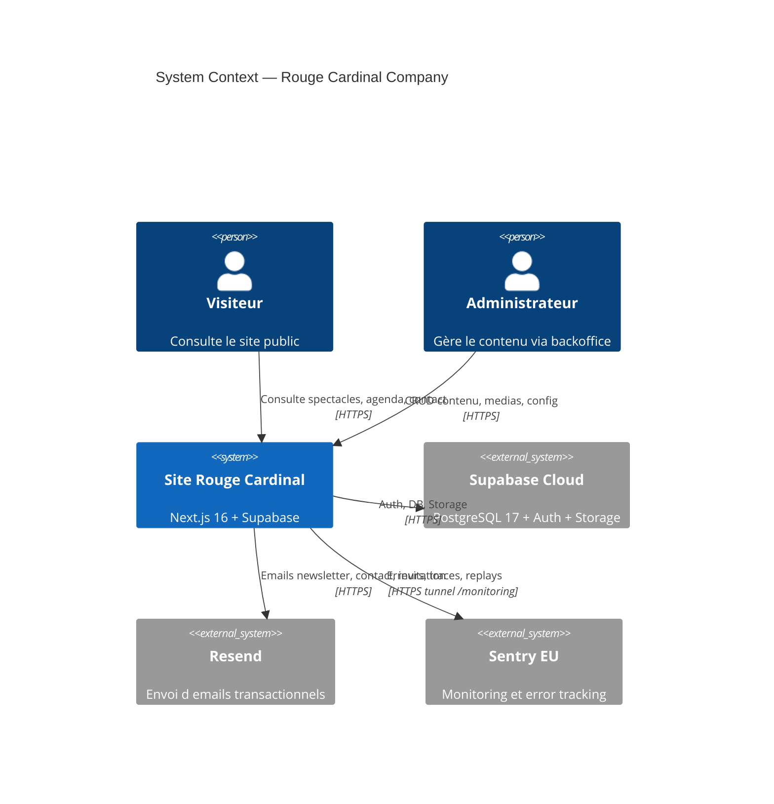
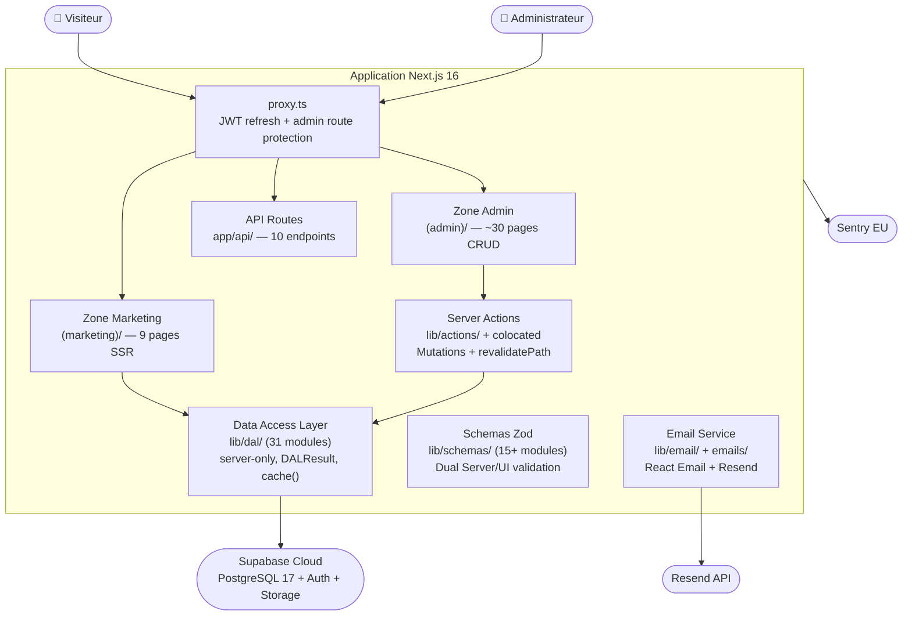
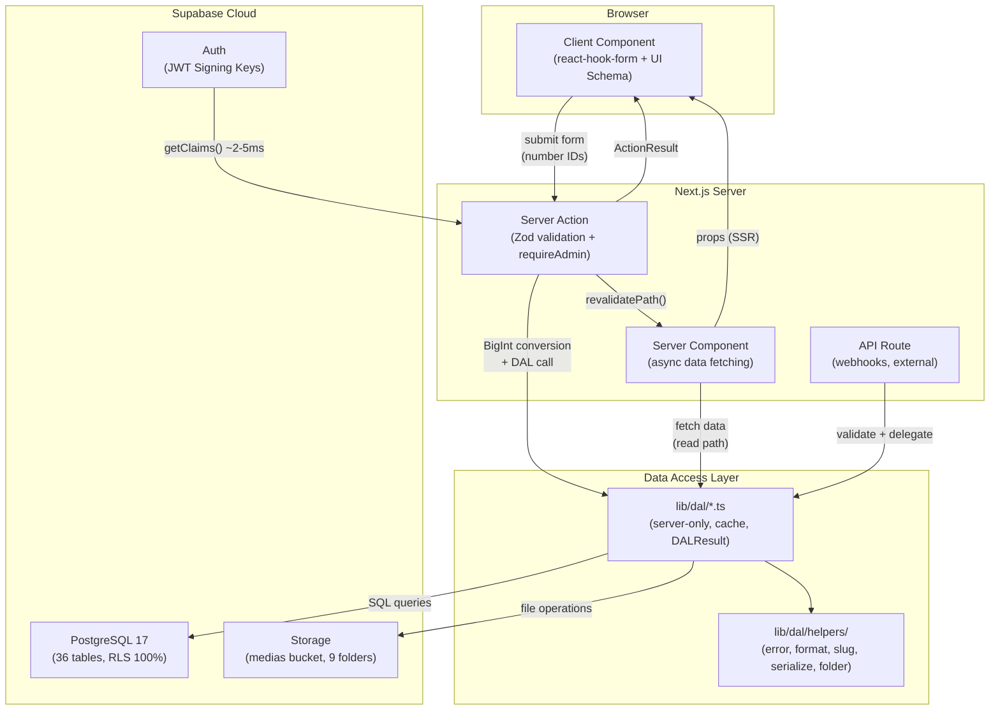
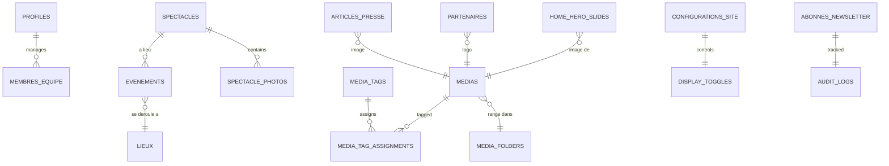

# Project Architecture Blueprint - Rouge Cardinal Company

**Généré le :** 2026-02-07
**Version :** 4.0 (Comprehensive Edition)
**Type de projet :** Application web Next.js 16 + Supabase
**Pattern architectural :** Clean Architecture + Feature-Based Organization + SOLID DAL

---

## Table des matières

1. [Architecture Detection & Analysis](#1-architecture-detection--analysis)
2. [Vue d'ensemble architecturale](#2-vue-densemble-architecturale)
3. [Visualisation architecturale (C4)](#3-visualisation-architecturale-c4)
4. [Composants architecturaux](#4-composants-architecturaux)
5. [Couches et dépendances](#5-couches-et-dépendances)
6. [Architecture des données](#6-architecture-des-données)
7. [Préoccupations transversales](#7-préoccupations-transversales)
8. [Communication & APIs](#8-communication--apis)
9. [Patterns React / Next.js](#9-patterns-react--nextjs)
10. [Patterns d'implémentation](#10-patterns-dimplémentation)
11. [Architecture de test](#11-architecture-de-test)
12. [Architecture de déploiement](#12-architecture-de-déploiement)
13. [Extensibilité & évolution](#13-extensibilité--évolution)
14. [Exemples de code](#14-exemples-de-code)
15. [Architectural Decision Records](#15-architectural-decision-records)
16. [Governance architecturale](#16-governance-architecturale)
17. [Guide pour nouveaux développements](#17-guide-pour-nouveaux-développements)

---

## 1. Architecture Detection & Analysis

### 1.1 Technologies détectées

| Couche | Technologies | Version |
| -------- | ------------- | --------- |
| **Framework** | Next.js (App Router, Turbopack dev) | 16.1.5 |
| **Runtime** | React + React DOM | 19.2.0 |
| **Langage** | TypeScript (strict mode) | 5.x |
| **Validation** | Zod | 4.1.0 |
| **Base de données** | Supabase PostgreSQL (Cloud) | 17.6.1.063 |
| **Auth** | Supabase Auth (JWT Signing Keys, `getClaims()` ~2-5ms) | @supabase/ssr |
| **UI Framework** | Tailwind CSS + tailwindcss-animate + touch-hitbox plugin | 3.4.1 |
| **Composants UI** | shadcn/ui (33 composants), Radix UI (13+ primitives) | — |
| **Forms** | react-hook-form + @hookform/resolvers | 7.65.0 + 5.2.2 |
| **Email** | React Email + Resend SDK | v4 |
| **Images** | Sharp (thumbnails 300×300 JPEG) | 0.34.5 |
| **DnD** | @dnd-kit/core + @dnd-kit/sortable | — |
| **Carousel** | embla-carousel-react + embla-carousel-autoplay | ^8.5.1 |
| **Charts** | Recharts | 2.15.4 |
| **Icons** | Lucide React | — |
| **Dates** | date-fns | 4.1.0 |
| **Env** | T3 Env (@t3-oss/env-nextjs) | 0.13.10 |
| **Monitoring** | Sentry (client + server + edge + instrumentation) | @sentry/nextjs 10 |
| **Package Manager** | pnpm | 9+ |
| **Linting** | ESLint 9 + markdownlint-cli2 | — |
| **E2E Testing** | Playwright | — |

### 1.2 Extensions PostgreSQL

`pgcrypto`, `unaccent`, `pg_trgm`, `citext` - installées dans le schéma `extensions`.

### 1.3 Pattern architectural détecté

**Clean Architecture + Feature-Based Organization + SOLID DAL Pattern :**

- **4 couches strictes** : Présentation → Application (Server Actions) → DAL → Database
- **Feature-based** : Composants, DAL, schémas organisés par domaine métier
- **SOLID DAL** : 92% compliance, `DALResult<T>`, fonctions &lt; 30 lignes, aucune dépendance Next.js
- **Server-first** : Server Components par défaut, Client Components uniquement pour l'interactivité
- **Warning Pattern** : Échecs email/SMS ne rollback jamais les opérations DB

---

## 2. Vue d'ensemble architecturale

### 2.1 Résumé exécutif

| Dimension | Détail |
| ----------- | -------- |
| **Routes** | 14 sections admin (~30+ pages), 9 pages publiques, 10 API Routes |
| **DAL** | 31 modules (`lib/dal/`) + 5 helpers |
| **Server Actions** | 11 fichiers colocalisés + 5 fichiers centralisés (`lib/actions/`) |
| **Schemas Zod** | 15+ modules dual Server (bigint) / UI (number) |
| **Tables DB** | 36 tables, 100% RLS, 45 fichiers de schéma déclaratif |
| **Migrations** | 93 fichiers SQL (sept 2025 → fév 2026) |
| **Composants UI** | 33 shadcn/ui + 12 features admin + 6 features publiques |
| **Scripts** | 87 scripts de test/audit/maintenance |
| **Sentry** | Multi-runtime (client/server/edge/instrumentation) |
| **Security Headers** | CSP + HSTS + X-Frame-Options + 3 autres (OWASP A05) |

### 2.2 Principes directeurs

1. **Server Components par défaut** — Client uniquement pour interactivité
2. **Mutations → Server Actions** — `revalidatePath()` uniquement ici, jamais dans le DAL
3. **DAL = server-only** — Retourne `DALResult<T>`, aucune dépendance Next.js/email
4. **Dual Zod Schemas** — Server (bigint) vs UI (number) pour éviter sérialisation BigInt
5. **Three-Layer BigInt** — UI (number) → Transport (string) → DAL (bigint)
6. **Type-safe env** — T3 Env, jamais `process.env` direct
7. **RLS + Auth guards** — Defense in depth (DB + application)
8. **Clean Code** — Max 30 lignes/fonction, 300 lignes/fichier, 5 params/fonction
9. **Warning Pattern** — Échecs email ne cassent jamais les opérations DB
10. **React `cache()`** — Deduplication intra-request sur toutes les fonctions DAL read

---

## 3. Visualisation architecturale (C4)

### 3.1 Niveau 1 - System Context



### 3.2 Niveau 2 — Container



### 3.3 Niveau 3 — Component (Data Flow)



### 3.4 Architecture High-Level (ASCII)

```bash
+---------------------------------------------------------------------+
|                           BROWSER                                   |
+---------------------------------------------------------------------+
                                |
                                v
+---------------------------------------------------------------------+
|  PROXY MIDDLEWARE (proxy.ts)                                        |
|  JWT claims validation via getClaims() (~2-5ms)                     |
|  Admin route protection (/admin/*, /api/admin/*)                    |
|  Delegates to supabase/middleware.ts (session refresh)              |
+---------------------------------------------------------------------+
                                |
        +-----------------------+----------------------
        v                       v                       v
+---------------+   +-------------------+   +-------------------+
|  (marketing)  |   |     (admin)       |   |      api/         |
|  Public pages |   |   Backoffice      |   |   API Routes      |
|  9 pages SSR  |   |   14 sections     |   |   10 endpoints    |
|  Suspense     |   |   ~30+ pages      |   |   newsletter,     |
|  streaming    |   |   11 actions.ts   |   |   contact, media  |
+---------------+   +-------------------+   +-------------------+
        |                       |                       |
        +-----------------------+-----------------------+
                                |
                                v
+---------------------------------------------------------------------+
|  SERVER ACTIONS (lib/actions/ + app/(admin)/admin/*/actions.ts)     |
|  Zod validation -> requireAdmin() -> DAL call -> revalidatePath()   |
|  Returns ActionResult<T> (NO BigInt in return)                      |
+---------------------------------------------------------------------+
                                |
                                v
+---------------------------------------------------------------------+
|  DATA ACCESS LAYER (lib/dal/, 31 modules + helpers/)                |
|  "use server" + import "server-only" + React cache()                | 
|  requireAdmin() -> Supabase Client -> DB Query -> DALResult<T>      |
|  NO revalidatePath   NO email imports   NO throws                   |
|  Helpers: error.ts, format.ts, slug.ts, serialize.ts, folder.ts     |
+---------------------------------------------------------------------+
                                |
                                v
+---------------------------------------------------------------------+
|  SUPABASE CLOUD (PostgreSQL 17.6.1.063)                             |
|  36 tables (100% RLS) - 45 schema files - 93 migrations             |
|  11 public views (SECURITY INVOKER) - 7 admin views (isolated)      |
|  Storage bucket "medias" - 9 base folders                           |
|  Extensions: pgcrypto, unaccent, pg_trgm, citext                    |
+---------------------------------------------------------------------+
```

---

## 4. Composants architecturaux

### 4.1 Structure des routes

#### Zone Admin — `app/(admin)/admin/`

| Section | Route | Server Actions colocalisées |
| --------- | ------- | ----------------------------- |
| Dashboard | `/admin` | — |
| Home Hero | `/admin/home/hero` | `home-hero-actions.ts` |
| Home About | `/admin/home/about` | `home-about-actions.ts` |
| Équipe | `/admin/team` (+`/new`, `/[id]/edit`) | `actions.ts` |
| Spectacles | `/admin/spectacles` (+`/new`, `/[id]/edit`) | `actions.ts` |
| Agenda | `/admin/agenda` | `actions.ts` |
| Lieux | `/admin/lieux` (+`/new`, `/[id]/edit`) | `actions.ts` |
| Presse | `/admin/presse` | `actions.ts` |
| Partenaires | `/admin/partners` | `actions.ts` |
| Médias | `/admin/media` | — (uses `lib/actions/`) |
| Utilisateurs | `/admin/users` | `actions.ts` |
| Config Site | `/admin/site-config` | — (uses `lib/actions/`) |
| Analytics | `/admin/analytics` | — |
| Debug Auth | `/admin/debug-auth` | — |

#### Zone Marketing - `app/(marketing)/`

| Page | Route | Dynamic |
| ------ | ------- | --------- |
| Homepage | `/` | `force-dynamic` (ISR `revalidate=60`) |
| Spectacles | `/spectacles` | `force-dynamic` |
| Spectacle détail | `/spectacles/[slug]` | Dynamic segment |
| Agenda | `/agenda` | `force-dynamic` |
| Compagnie | `/compagnie` | `force-dynamic` |
| Presse | `/presse` | `force-dynamic` |
| Contact | `/contact` | — |
| Mentions légales | `/mentions-legales` | Static |
| CGU | `/cgu` | Static |

#### API Routes — `app/api/`

| Endpoint | Méthode | Usage |
| ---------- | --------- | ------- |
| `/api/contact` | POST | Formulaire contact public |
| `/api/newsletter` | POST | Inscription newsletter |
| `/api/newsletter/unsubscribe` | GET | Désinscription |
| `/api/admin/media/search` | GET | Recherche interactive médias |
| `/api/admin/media/thumbnail` | GET | Génération thumbnail (Sharp) |
| `/api/admin/spectacles/[id]/photos` | POST/DELETE | Photos spectacles |
| `/api/webhooks/stripe` | POST | Webhooks (réservé) |
| `/api/sentry-example-api` | GET | Test Sentry |
| `/api/debug-auth` | GET | Diagnostics auth |
| `/api/test-connection` | GET | Test connexion DB |

### 4.2 Layouts (3 niveaux)

```text
app/layout.tsx                    <- Root: HTML shell + ThemeProvider + Toaster + RootErrorBoundary
  |-- app/(admin)/layout.tsx      <- Admin: requireAdmin() + SidebarProvider + AppSidebar + Breadcrumb
  +-- app/(marketing)/layout.tsx  <- Public: Header + Footer + skip-link + landmarks
```

### 4.3 Structure des composants features

#### Pattern Admin systématique (12 domaines)

```text
components/features/admin/{feature}/
  |-- {Feature}Container.tsx       <- Server Component (data fetching via DAL)
  |-- {Feature}View.tsx            <- Client Component (state + useEffect sync)
  |-- {Feature}Form.tsx            <- Client form (react-hook-form, max 300 lignes)
  |-- {Feature}FormFields.tsx      <- Extracted: text fields (si form > 300 lignes)
  |-- {Feature}ImageSection.tsx    <- Extracted: image picker
  |-- types.ts                     <- Props interfaces colocalisées
  +-- index.ts                     <- Barrel exports
```

**Domaines admin :** `agenda`, `analytics`, `audit-logs`, `home`, `lieux`, `media` (16 fichiers), `partners`, `presse`, `site-config`, `spectacles`, `team` (6 fichiers), `users`

#### Pattern Public systématique (6 domaines)

Chaque feature publique suit un pattern uniforme de **5 fichiers** :

```bash
components/features/public-site/{feature}/
  |-- {Feature}Container.tsx          <- Server (async, DAL fetch)
  |-- {Feature}View.tsx               <- Dumb (présentation pure)
  |-- hooks.ts                        <- Client-side hooks
  |-- types.ts                        <- Props interfaces
  +-- index.ts                        <- Barrel
```

**Homepage — 6 sous-sections :** `hero/`, `about/`, `newsletter/`, `partners/`, `shows/`, `news/` — chacune suit ce pattern.

**Autres pages :** `agenda/`, `compagnie/`, `contact/`, `presse/`, `spectacles/`

### 4.4 Data Access Layer (31 modules)

**Admin (14 modules) :**

| Module | Domaine | Fonctions types |
| -------- | --------- | ----------------- |
| `admin-agenda.ts` | Événements | `fetchEventsAdmin`, `createEvent`, `updateEvent`, `deleteEvent` |
| `admin-home-hero.ts` | Hero Slides | `fetchAllHeroSlides`, `createHeroSlide`, `reorderHeroSlides` |
| `admin-home-about.ts` | About sections | `fetchAboutSections`, `updateAboutSection` |
| `admin-lieux.ts` | Lieux | `fetchAllLieuxAdmin`, `createLieu`, `updateLieu`, `deleteLieu` |
| `admin-partners.ts` | Partenaires | CRUD complet |
| `admin-press-articles.ts` | Articles presse | CRUD |
| `admin-press-contacts.ts` | Contacts presse | CRUD |
| `admin-press-releases.ts` | Communiqués | CRUD |
| `admin-users.ts` | Utilisateurs | CRUD + invitation |
| `audit-logs.ts` | Logs d'audit | `fetchAuditLogs`, `createAuditLog` |
| `dashboard.ts` | Dashboard | `fetchDashboardStats` |
| `data-retention.ts` | RGPD | `fetchRetentionPolicies`, `executeRetention` |
| `site-config.ts` | Display Toggles | `fetchDisplayToggle`, `updateDisplayToggle` |
| `analytics.ts` | Analytics | `fetchAnalyticsData` |

**Public (13 modules) :**

`agenda.ts`, `compagnie.ts`, `compagnie-presentation.ts`, `contact.ts`, `home-about.ts`, `home-hero.ts`, `home-news.ts`, `home-newsletter.ts`, `home-partners.ts`, `home-shows.ts`, `presse.ts`, `spectacles.ts`, `team.ts`

**Media Library (4 modules) :**

`media.ts` (CRUD centralisé, SHA-256 dedup), `media-folders.ts` (9 folders, `getFolderIdFromPath()`), `media-tags.ts` (junction table), `media-usage.ts` (tracking 7 tables)

**DAL Helpers (`lib/dal/helpers/`, 5 fichiers) :**

| Fichier | Exports |
| -------- | -------- |
| `error.ts` | `DALResult<T>`, `dalSuccess()`, `dalError()`, `toDALResult()` |
| `format.ts` | Formatage dates, strings |
| `slug.ts` | `generateUniqueSlug()` |
| `serialize.ts` | BigInt vers number (DTO conversion) |
| `folder.ts` | `getFolderIdFromPath()` (Storage/Folders sync) |

### 4.5 Schemas Zod (15+ modules)

Chaque feature dispose de schemas duaux :

- **Server Schema** : `z.coerce.bigint()` pour IDs PostgreSQL
- **UI Schema** : `z.number().int().positive()` pour react-hook-form
- **Transport Type** (si BigInt) : `string` pour Server Actions

Modules : `admin-events.ts`, `admin-lieux.ts`, `admin-users.ts`, `agenda.ts`, `compagnie.ts`, `contact.ts`, `dashboard.ts`, `home-content.ts`, `media.ts`, `presse.ts`, `spectacles.ts`, `team.ts`, `index.ts` (barrel)

### 4.6 Hooks (`lib/hooks/`, 9 hooks)

| Hook | Lignes | Fonction |
| ------ | -------- | ---------- |
| `useHeroSlideForm.ts` | 53 | Form state + submission |
| `useHeroSlideFormSync.ts` | 38 | Props/form sync via useEffect |
| `useHeroSlidesDnd.ts` | 73 | Drag and drop @dnd-kit |
| `useHeroSlidesDelete.ts` | 61 | Delete confirmation dialog |
| `use-debounce.ts` | — | Value debouncing |
| `use-mobile.ts` | — | Mobile viewport detection |
| `useContactForm.ts` | — | Contact form logic |
| `useMediaUpload.ts` | — | Media upload state |
| `useNewsletterSubscribe.ts` | — | Newsletter inscription |

### 4.7 API Helpers (`lib/api/helpers.ts`, 136 lignes)

| Export | Rôle |
| -------- | ------ |
| `HttpStatus` | Constantes HTTP (200, 201, 400, 401, 403, 404, 409, 422, 500) |
| `PostgresError` | Codes erreur PG (unique/foreign key/not null violation) |
| `ApiResponse.success/error/validationError` | Wrappers `NextResponse.json()` typés |
| `parseNumericId(id)` | Validation ID numérique positif |
| `parseBoolean(value)` | Parse booléen multi-format |
| `withAdminAuth(handler)` | Wrapper auth admin pour API Routes |
| `parseFullName(name)` | Split nom complet en prénom/nom |
| `isUniqueViolation(error)` | Type guard erreur unicité PG |

### 4.8 Action Result Types (`lib/actions/types.ts`)

```typescript
type ActionResult<T = unknown> =
  | { success: true; data?: T }
  | { success: false; error: string; status?: number; details?: unknown };
```

Type guards exportés : `isActionSuccess()`, `isActionError()`

---

## 5. Couches et dépendances

```bash
PRESENTATION (app/, components/)
    |  imports
APPLICATION (lib/actions/, app/*/actions.ts)
    |  imports
DATA ACCESS (lib/dal/)
    |  imports
INFRASTRUCTURE (supabase/, lib/email/)
```

**Règles de dépendance strictes :**

| Règle | Enforcement |
| ------- | ------------- |
| DAL ne dépend pas de Next.js | `import "server-only"` + code review |
| DAL ne fait pas de `revalidatePath()` | Convention + instructions Copilot |
| DAL ne fait pas d'imports email | Single Responsibility |
| Server Actions = seul endroit pour `revalidatePath()` | Convention CRUD pattern |
| Composants Client n'importent jamais le DAL | `"use server"` boundary |
| Env vars toujours via `lib/env.ts` (T3 Env) | Convention + instructions |

### ActionResult vs DALResult

| Type | Couche | BigInt autorisé | `revalidatePath()` |
| ------ | -------- | ----------------- | --------------------- |
| `DALResult<T>` | DAL | Oui | Non |
| `ActionResult<T>` | Server Actions | Non (sérialisé) | Oui |

---

## 6. Architecture des données

### 6.1 Modèle de domaine



### 6.2 Tables principales (36, 100% RLS)

| Catégorie | Tables |
| ----------- | -------- |
| **Auth** | `profiles` |
| **Contenu** | `spectacles`, `home_hero_slides`, `sections_apropos`, `sections_compagnie`, `compagnie_presentation_sections` |
| **Événements** | `agenda_evenements`, `lieux`, `evenement_recurrences` |
| **Presse** | `articles_presse`, `communiques_presse`, `contacts_presse`, `media_kit` |
| **Partenaires** | `partenaires` |
| **Équipe** | `membres_equipe` |
| **Médias** | `medias`, `media_tags`, `media_folders`, `media_tag_assignments` |
| **Newsletter** | `abonnes_newsletter` |
| **Contact** | `messages_contact` |
| **Système** | `configurations_site`, `analytics_events`, `audit_logs`, `content_versions`, `data_retention_policies`, `seo_metadata` |

### 6.3 Schémas déclaratifs (45 fichiers)

Organisés par préfixe numérique dans `supabase/schemas/` :

| Plage | Domaine |
| ------- | --------- |
| `01-02` | Extensions, profiles, fonctions core, storage |
| `03-04` | Médias, tags, équipe |
| `05-09` | Contenu principal (lieux, spectacles, événements, compagnie, presse, partenaires) |
| `10-16` | Système, relations, récurrence, analytics, versioning, SEO |
| `20-22` | Audit logs, rétention RGPD |
| `30-42` | Triggers, index, vues |
| `50-63` | Contraintes, RLS policies, fonctions spécialisées |

### 6.4 Vues PostgreSQL

| Type | Nombre | Security Mode | Accès |
| ------ | -------- | --------------- | ------- |
| **Vues publiques** | 11 | `SECURITY INVOKER` explicite | `anon`, `authenticated` |
| **Vues admin** | 7 | Owner `admin_views_owner` | `service_role` uniquement |

### 6.5 BigInt Three-Layer Serialization

```bash
UI Layer (Client)          Transport Layer (Actions)     DAL Layer (Server)
─────────────────          ────────────────────────      ──────────────────
zod: z.number()            zod: z.string()               zod: z.coerce.bigint()
type: number               type: string                  type: bigint

EventFormValues            EventDataTransport            EventInput
{ lieu_id: 42 }            { lieu_id: "42" }             { lieu_id: 42n }

react-hook-form            Server Action receives         DAL converts:
submits number             string (JSON-safe)             BigInt(validated.lieu_id)
```

---

## 7. Préoccupations transversales

### 7.1 Authentification & Autorisation

| Mécanisme | Usage | Latence |
| ----------- | ------- | --------- |
| `getClaims()` | Vérification JWT locale (middleware, Server Components) | ~2-5ms |
| `getUser()` | Données utilisateur complètes (profil) | ~300ms |
| `requireAdmin()` | Guard dans DAL + Server Actions | ~2-5ms |
| `is_admin()` (SQL) | Fonction DB pour RLS policies | inline |
| Cookies `getAll/setAll` | Pattern `@supabase/ssr` exclusif | — |

**4 clients Supabase :**

| Client | Fichier | Usage |
| -------- | -------- | ------- |
| Server | `supabase/server.ts` | Server Components, Server Actions (user-scoped) |
| Client | `supabase/client.ts` | Client Components (browser) |
| Middleware | `supabase/middleware.ts` | Session refresh dans `proxy.ts` |
| Admin | `supabase/admin.ts` | Service role (scripts, fonctions admin) |

### 7.2 Error Handling & Resilience

**3 niveaux d'Error Boundaries :**

| Niveau | Fichier | Scope |
| -------- | -------- | ------- |
| Root | `components/error-boundaries/RootErrorBoundary.tsx` | App entière |
| Page | `components/error-boundaries/PageErrorBoundary.tsx` | Par page |
| Component | `components/error-boundaries/ComponentErrorBoundary.tsx` | Par composant |

**Pattern Error :**

- DAL : retourne `dalError()` (jamais throw)
- Server Actions : `try/catch` puis `ActionResult<T>`
- API Routes : `ApiResponse.error()` avec codes HTTP
- Client : `toast.error()` (Sonner) + error boundaries

**Warning Pattern (email) :**

```typescript
const contactId = await createContactMessage(data);
try {
  await sendEmail(data);
} catch (emailError) {
  console.error("Email failed:", emailError);
}
return { success: true, id: contactId };
```

### 7.3 Monitoring — Sentry Multi-Runtime

| Runtime | Config | Particularités |
| -------- | -------- | ---------------- |
| **Client** | `sentry.client.config.ts` | Supabase integration (tracing + breadcrumbs), Browser Tracing, Session Replay (10% sessions, 100% erreurs), masquage texte + blocage média |
| **Server** | `sentry.server.config.ts` | `beforeSend` supprime headers sensibles (`authorization`, `cookie`, `x-api-key`) |
| **Edge** | `sentry.edge.config.ts` | Minimal |
| **Instrumentation** | `instrumentation.ts` | `onRequestError` enrichi (routerKind, routePath, URL, method) + tag runtime |

**Tunnel anti ad-blockers** : route `/monitoring` dans `next.config.ts`

**Filtrage client** : Ignore `ResizeObserver`, erreurs hydratation dev, bug Turbopack `transformAlgorithm`

### 7.4 Validation - Zod partout

| Couche | Validation |
| -------- | ----------- |
| **Env vars** | T3 Env (`lib/env.ts`) — Zod runtime au démarrage |
| **Form (client)** | UI Schema + `zodResolver` (react-hook-form) |
| **Server Action** | Transport Schema (string IDs) |
| **DAL** | Server Schema (bigint IDs) — defense in depth |
| **API Route** | Zod parse body/params + `ApiResponse.validationError()` |

### 7.5 Configuration Management

| Source | Fichier | Contenu |
| -------- | -------- | --------- |
| **T3 Env** | `lib/env.ts` | 14 server + 4 client vars, Zod validated |
| **Site Config** | `lib/site-config.ts` | SEO, email, server URL, maker info, auth redirects |
| **Constants** | `lib/constants/hero-slides.ts` | Limites, défauts, animation config, DnD config |
| **Display Toggles** | Table `configurations_site` | 10 toggles (home x6, agenda x1, contact x1, presse x2) |
| **TypeScript** | `tsconfig.json` | Strict mode, path aliases (`@/*`) |
| **Tailwind** | `tailwind.config.ts` | HSL CSS variables (shadcn/ui), custom plugins |

### 7.6 Security Headers (OWASP A05)

Configurés dans `next.config.ts`, appliqués sur `/:path*` :

| Header | Valeur | Protection |
| -------- | -------- | ------------ |
| **Content-Security-Policy** | `default-src 'self'`; script/style/img/connect-src whitelistés | XSS, injection |
| **Strict-Transport-Security** | `max-age=63072000; includeSubDomains; preload` | Downgrade HTTPS |
| **X-Frame-Options** | `DENY` | Clickjacking |
| **X-Content-Type-Options** | `nosniff` | MIME sniffing |
| **Referrer-Policy** | `strict-origin-when-cross-origin` | Fuite referrer |
| **Permissions-Policy** | `camera=(), microphone=(), geolocation=()` | APIs browser |

**CSP connect-src** : `'self'`, domaine Supabase, `*.ingest.de.sentry.io`

> **Note** : `script-src` contient encore `'unsafe-inline' 'unsafe-eval'` — TODO pour production : utiliser nonces ou hashes.

---

## 8. Communication & APIs

### 8.1 Communication interne

| Pattern | Usage |
| -------- | ------- |
| **Server Actions** | Mutations (POST/PUT/DELETE) depuis le frontend Next.js |
| **Server Components** | Lectures (GET) avec accès DAL direct |
| **`router.refresh()`** | Re-fetch Server Component après mutation |
| **`revalidatePath()`** | Invalidation cache ISR |
| **`revalidateTag()`** | Invalidation sélective par tag |

### 8.2 Communication externe

| Endpoint | Direction | Protocole |
| -------- | --------- | --------- |
| Supabase DB | Out | HTTPS (PostgREST) |
| Supabase Auth | Out | HTTPS (GoTrue) |
| Supabase Storage | Out | HTTPS (S3-compatible) |
| Resend API | Out | HTTPS |
| Sentry | Out | HTTPS (tunnel `/monitoring`) |
| API Routes | In | HTTPS (webhooks, external clients) |

### 8.3 Handler Factorization Pattern

Pour les endpoints contactables par API Route ET Server Action, la logique est factorisée :

```bash
app/api/newsletter/route.ts     --+
                                  +--> lib/actions/newsletter-server.ts --> lib/dal/
app/actions/newsletter.actions.ts --+
```

Fichiers factorisés : `newsletter-server.ts`, `contact-server.ts`, `uploads-server.ts`

---

## 9. Patterns React / Next.js

### 9.1 Server Components (défaut)

- Fonctions `async` avec accès DAL direct
- `Suspense` + skeletons pour streaming
- Pages admin : `export const dynamic = 'force-dynamic'` + `export const revalidate = 0`
- Homepage : ISR `revalidate = 60` avec 5 conteneurs Suspense

### 9.2 Client Components

- Marqués `'use client'`
- Synchronisation props vers state via `useEffect` (post `router.refresh()`)
- **Hydration pattern** : `next/dynamic` + `ssr: false` pour forms complexes (DANS Client Components uniquement)

### 9.3 Container/View Split

Chaque feature suit `Smart Container -> Dumb View` :

```typescript
// Container (Server)
export async function TeamContainer() {
  const result = await fetchTeamMembers();
  if (!result.success) return <ErrorState />;
  return <TeamView initialMembers={result.data} />;
}

// View (Client)
"use client";
export function TeamView({ initialMembers }: Props) {
  const [members, setMembers] = useState(initialMembers);
  useEffect(() => setMembers(initialMembers), [initialMembers]);
  // ...handlers calling Server Actions + router.refresh()
}
```

### 9.4 Homepage Streaming Architecture

```text
app/(marketing)/page.tsx (revalidate=60)
  +-- Suspense fallback={<HeroSkeleton />}
  |     +-- HeroContainer -> HeroView -> HeroClient (carrousel interactif)
  +-- Suspense fallback={<AboutSkeleton />}
  |     +-- AboutContainer -> AboutView
  +-- Suspense fallback={<ShowsSkeleton />}
  |     +-- ShowsContainer -> ShowsView
  +-- Suspense fallback={<NewsSkeleton />}
  |     +-- NewsContainer -> NewsView
  +-- Suspense fallback={<PartnersSkeleton />}
  |     +-- PartnersContainer -> PartnersView
  +-- NewsletterClientContainer -> NewsletterView
```

### 9.5 Display Toggles Pattern

10 toggles centralisés dans `configurations_site` contrôlent la visibilité des sections publiques :

```typescript
const toggle = await fetchDisplayToggle("display_toggle_hero");
const showHero = toggle.success && toggle.data?.value?.enabled !== false;

const heroData = showHero
  ? await fetchHeroSlides()
  : { success: true, data: [] };
```

---

## 10. Patterns d'implémentation

### 10.1 DAL Standard

```typescript
"use server";
import "server-only";
import { cache } from "react";
import { createClient } from "@/supabase/server";
import { requireAdmin } from "@/lib/auth/is-admin";
import { dalSuccess, dalError } from "@/lib/dal/helpers";
import type { DALResult } from "@/lib/dal/helpers";

export const fetchAllItems = cache(
  async (): Promise<DALResult<ItemDTO[]>> => {
    await requireAdmin();
    const supabase = await createClient();
    const { data, error } = await supabase
      .from("items")
      .select("*")
      .order("created_at", { ascending: false });

    if (error) {
      console.error("[ERR_ITEMS_001] Fetch failed:", error);
      return dalError("[ERR_ITEMS_001] Fetch failed");
    }
    return dalSuccess(data ?? []);
  }
);
```

### 10.2 Server Action Standard

```typescript
"use server";
import "server-only";
import { revalidatePath } from "next/cache";

export async function createItemAction(
  input: unknown
): Promise<ActionResult> {
  try {
    const validated = ItemInputSchema.parse(input);
    const result = await createItem(validated);
    if (!result.success) return { success: false, error: result.error };
    revalidatePath("/admin/items");
    return { success: true };
  } catch (err: unknown) {
    return {
      success: false,
      error: err instanceof Error ? err.message : "Unknown",
    };
  }
}
```

### 10.3 Form avec UI Schema

```typescript
"use client";
const form = useForm<ItemFormValues>({
  resolver: zodResolver(ItemFormSchema),
});

const onSubmit = async (data: ItemFormValues) => {
  const result = await createItemAction(data);
  if (result.success) {
    toast.success("Créé");
    onSuccess();
  } else {
    toast.error(result.error);
  }
};
```

### 10.4 Clean Code Enforced

| Règle | Limite |
| ------- | ------- |
| Lignes par fonction | Max 30 |
| Paramètres par fonction | Max 5 |
| Lignes par fichier | Max 300 |
| Sous-fichiers par dossier | Max 10 |
| Responsabilité par fichier | Une seule |

### 10.5 Naming Conventions

| Type | Convention | Exemple |
| ------ | ----------- | --------- |
| Container | `{Feature}Container.tsx` | `TeamManagementContainer.tsx` |
| View | `{Feature}View.tsx` | `TeamMemberList.tsx` |
| Form | `{Feature}Form.tsx` | `TeamMemberForm.tsx` |
| Form fields | `{Feature}FormFields.tsx` | `HeroSlideFormFields.tsx` |
| DAL admin | `admin-{feature}.ts` | `admin-lieux.ts` |
| DAL public | `{feature}.ts` | `spectacles.ts` |
| Actions | `{feature}-actions.ts` ou `actions.ts` | `home-hero-actions.ts` |
| Schema | `{feature}.ts` | `admin-events.ts` |
| Hook | `use{Feature}{Action}.ts` | `useHeroSlidesDnd.ts` |
| Error codes | `[ERR_{ENTITY}_{NNN}]` | `[ERR_LIEUX_003]` |

---

## 11. Architecture de test

### 11.1 Scripts de test autonomes (87 fichiers)

Exécutés via `pnpm exec tsx scripts/<name>.ts` :

| Catégorie | Exemples | Nombre |
| ----------- | ---------- | -------- |
| **Sécurité / Audit** | `audit-cookie-flags.ts`, `audit-secrets-management.ts`, `check-security-audit.sh`, `test-ssrf-validation.ts` | ~15 |
| **RLS / Policies** | `check-rls-policies.ts`, `test-rls-cloud.ts`, `test-views-security-*.ts` | ~6 |
| **DAL / CRUD** | `test-all-dal-functions.ts`, `test-spectacles-crud.ts`, `test-team-server-actions.ts` | ~8 |
| **Email** | `test-email-integration.ts`, `check-email-logs.ts` | ~4 |
| **Media / Thumbnails** | `generate-missing-thumbnails.ts`, `regenerate-all-thumbnails*.ts`, `validate-media-folders.ts` | ~10 |
| **Database admin** | `backup-database.ts`, `seed-admin.ts`, `set-admin-role.ts` | ~8 |
| **Performance** | `test-dashboard-stats.ts`, `test-data-retention.ts` | ~5 |
| **Monitoring** | `test-sentry-api.ts`, `test-rate-limit*.ts`, `test-env-validation.ts` | ~6 |
| **Toggles** | `check-display-toggles.ts`, `toggle-presse.ts` (4 modes) | 3 |
| **Utilitaires** | `diagnose-admin-views.js`, `inspect-user.ts` | ~5 |

### 11.2 Tests E2E

- Framework : Playwright (`e2e-tests/`)
- Guide rapide : `E2E_Tests_QuickReference_RCC.md`

### 11.3 Tests unitaires

- Email templates : `__tests__/emails/invitation-email.test.tsx`
- Exécution : `pnpm exec tsx` (pas de test runner global configuré)

### 11.4 Recommandations

- Intégrer Vitest/Jest pour tests unitaires DAL + Server Actions
- CI matrix : `tsc --noEmit` + `lint` + `test`
- Tests d'intégration DAL via Supabase local (déjà possible avec `supabase start`)

---

## 12. Architecture de déploiement

### 12.1 Environnements

| Env | Database | Build |
| ----- | ---------- | ------- |
| **Local** | Supabase CLI (`supabase start`) | `pnpm dev` (Turbopack) |
| **Production** | Supabase Cloud (PostgreSQL 17.6.1.063) | `pnpm build` |

### 12.2 Workflow migrations

```bash
# Normal
supabase stop
# Editer supabase/schemas/*.sql
supabase db diff -f migration_name
supabase start

# Hotfix production
touch supabase/migrations/$(date +%Y%m%d%H%M%S)_fix.sql
supabase db push
# PUIS mettre a jour supabase/schemas/ (source of truth)
```

### 12.3 Configuration runtime

- `proxy.ts` : Middleware Next.js 16 (renommé depuis `middleware.ts`)
- `instrumentation.ts` : Hook Next.js `register()` pour Sentry
- `SKIP_ENV_VALIDATION=1` : Pour builds Docker/CI sans env vars

---

## 13. Extensibilité & évolution

### 13.1 Ajouter une nouvelle feature CRUD

1. **Schema** : `lib/schemas/{feature}.ts` (Server + UI + DTO)
2. **DAL** : `lib/dal/{feature}.ts` (`server-only`, `cache()`, `DALResult<T>`)
3. **Actions** : `app/(admin)/admin/{feature}/actions.ts` (`revalidatePath()`)
4. **Composants** : `components/features/admin/{feature}/` (Container, View, Form)
5. **Route** : `app/(admin)/admin/{feature}/page.tsx` (`force-dynamic`)
6. **DB** : `supabase/schemas/XX_{feature}.sql` + `supabase db diff`
7. **Tests** : `scripts/test-{feature}-*.ts`

### 13.2 Ajouter une page publique

1. **DAL** : `lib/dal/{page}.ts` (read-only, `cache()`)
2. **Composants** : `components/features/public-site/{page}/` (Container + View + hooks + types + index)
3. **Route** : `app/(marketing)/{page}/page.tsx` (`force-dynamic` si Supabase)
4. **Display Toggle** : Ajouter dans `configurations_site` si visibilité contrôlable

### 13.3 Ajouter un Display Toggle

1. Migration seed dans `configurations_site` avec `key`, `value: { enabled: true }`, `category`
2. Fetch dans Server Component via `fetchDisplayToggle(key)`
3. Conditionner le data fetching ET le rendering
4. Ajouter switch dans `/admin/site-config`

### 13.4 Ajouter une vue PostgreSQL

```sql
-- Vue publique
create view public.new_public_view
with (security_invoker = true)
as select * from some_table where published_at is not null;
grant select on public.new_public_view to anon, authenticated;

-- Vue admin
create view public.new_admin_view
with (security_invoker = true)
as select * from some_table where (select public.is_admin()) = true;
alter view public.new_admin_view owner to admin_views_owner;
revoke all on public.new_admin_view from anon, authenticated;
grant select on public.new_admin_view to service_role;
```

---

## 14. Exemples de code

### 14.1 Server Action complet (avec BigInt handling)

```typescript
"use server";
import "server-only";
import { revalidatePath } from "next/cache";
import { z } from "zod";
import { createEvent } from "@/lib/dal/admin-agenda";
import type { ActionResult } from "@/lib/actions/types";

const TransportSchema = z.object({
  titre: z.string().min(1),
  lieu_id: z.string().regex(/^\d+$/),
});

export async function createEventAction(
  input: unknown
): Promise<ActionResult> {
  try {
    const validated = TransportSchema.parse(input);
    const eventData = {
      ...validated,
      lieu_id: BigInt(validated.lieu_id),
    };
    const result = await createEvent(eventData);
    if (!result.success)
      return { success: false, error: result.error };
    revalidatePath("/admin/agenda");
    return { success: true };
  } catch (err: unknown) {
    return {
      success: false,
      error: err instanceof Error ? err.message : "Unknown",
    };
  }
}
```

### 14.2 Client View avec useEffect sync

```typescript
"use client";
import { useState, useCallback, useEffect } from "react";
import { useRouter } from "next/navigation";
import { toast } from "sonner";

interface ItemViewProps {
  initialItems: ItemDTO[];
}

export function ItemView({ initialItems }: ItemViewProps) {
  const router = useRouter();
  const [items, setItems] = useState(initialItems);

  useEffect(() => {
    setItems(initialItems);
  }, [initialItems]);

  const handleDelete = useCallback(
    async (id: bigint) => {
      const result = await deleteItemAction(String(id));
      if (result.success) {
        toast.success("Supprimé");
        router.refresh();
      } else {
        toast.error(result.error);
      }
    },
    [router]
  );

  return <div>{/* ...UI */}</div>;
}
```

### 14.3 Media Upload avec SHA-256 dedup

```typescript
// lib/dal/media.ts (extrait)
const fileHash = await computeSHA256(buffer);
const { data: existing } = await supabase
  .from("medias")
  .select("id")
  .eq("file_hash", fileHash)
  .single();

if (existing) return dalSuccess(existing);

const { error: uploadError } = await supabase.storage
  .from("medias")
  .upload(storagePath, buffer, { contentType: mimeType });
```

### 14.4 Display Toggle conditionnel

```typescript
// Server Component
const toggle = await fetchDisplayToggle("display_toggle_media_kit");
const showMediaKit =
  toggle.success && toggle.data?.value?.enabled !== false;

const mediaKitResult = showMediaKit
  ? await fetchMediaKit()
  : { success: true, data: [] };
```

---

## 15. Architectural Decision Records

### ADR-001 : Next.js 16 App Router + Server Components

**Contexte :** Besoin SSR, SEO, performance pour site théâtral.
**Décision :** Next.js 16 avec App Router, Server Components par défaut.
**Conséquences :** SSR natif, streaming via Suspense, mais complexité BigInt serialization.

### ADR-002 : Séparation Server Actions / DAL (Nov 2025)

**Contexte :** `revalidatePath()` dans API Routes ne déclenchait pas de re-render.
**Décision :** Server Actions pour mutations + `revalidatePath()`, DAL pour DB uniquement.
**Conséquences :** Re-render fiable, mais nécessite `useEffect` sync dans Client Components.

### ADR-003 : Dual Zod Schemas (Nov 2025)

**Contexte :** `bigint` non sérialisable par `JSON.stringify()`.
**Décision :** Schemas Server (bigint) / UI (number) / Transport (string).
**Conséquences :** Type safety préservée, mais 3 types par feature avec IDs.

### ADR-004 : T3 Env (Déc 2025)

**Contexte :** Accès `process.env` non typé, erreurs runtime silencieuses.
**Décision :** `@t3-oss/env-nextjs` avec validation Zod au démarrage.
**Conséquences :** Fail fast si variables manquantes, 100 lignes de code supprimées.

### ADR-005 : JWT Signing Keys + getClaims()

**Contexte :** `getUser()` ~300ms par appel, problème de latence en middleware.
**Décision :** Migration vers JWT Signing Keys, utilisation de `getClaims()` (~2-5ms).
**Conséquences :** Auth 100x plus rapide, dépendance réseau réduite.

### ADR-006 : Admin Views Security Hardening (Jan 2026)

**Contexte :** Vues `SECURITY DEFINER` (défaut PG) bypassaient les RLS.
**Décision :** Role dédié `admin_views_owner`, `SECURITY INVOKER` explicite sur toutes les vues.
**Conséquences :** 18 vues sécurisées, aucun bypass possible.

### ADR-007 : Media Library Architecture (Déc 2025)

**Contexte :** Besoin de gestion médias avec tags, folders, thumbnails, dedup.
**Décision :** 4 tables, 4 DAL modules, SHA-256 dedup, 9 folders synchronisés avec Storage.
**Conséquences :** Système complet, 15 RLS policies, WCAG 2.1 AA.

### ADR-008 : Display Toggles (Jan 2026)

**Contexte :** Besoin de contrôler la visibilité des sections sans code deploy.
**Décision :** 10 toggles en table `configurations_site` avec admin UI.
**Conséquences :** Contrôle granulaire, fetch conditionnel, zero downtime.

### ADR-009 : Sentry Multi-Runtime (Production)

**Contexte :** Monitoring erreurs / performance sur tous les runtimes Next.js.
**Décision :** Configuration 4 runtimes (client/server/edge/instrumentation), tunnel anti-adblock.
**Conséquences :** Couverture complète, headers sensibles supprimés côté serveur.

### ADR-010 : Next.js 16 Migration (Déc 2025)

**Contexte :** Upgrade Next.js 15 vers 16 pour Turbopack stable et fixes sécurité.
**Décision :** Migration avec `middleware.ts` vers `proxy.ts`, `export const dynamic` sur pages Supabase.
**Conséquences :** Résolution CVE-2025-57822, CVE-2025-64718, Turbopack default.

### ADR-011 : Embla Carousel Gallery (Fév 2026)

**Contexte :** Affichage d'une galerie de photos par spectacle avec carousel interactif (navigation, autoplay, mobile).
**Décision :** `embla-carousel-react` + `Autoplay` plugin, branching 0/1/2+ images, scale tween `TWEEN_FACTOR_BASE = 0.40`, keyboard scopé au conteneur. Vue SQL dédiée `spectacles_gallery_photos_public` + vue admin avec guard `is_admin()`.
**Conséquences :** Carousel WCAG 2.2, performance `prefers-reduced-motion` JS-native, helper `buildMediaPublicUrl` centralisé dans `lib/dal/helpers/media-url.ts`.

---

## 16. Governance architecturale

### 16.1 Vérification automatisée

| Outil | Scope |
| ------- | ------- |
| TypeScript `strict` | Types, nullability, imports |
| ESLint 9 | Code style, patterns |
| markdownlint-cli2 | Documentation |
| T3 Env | Variables d'environnement au démarrage |
| RLS policies | Sécurité DB (100% coverage) |

### 16.2 Instructions Copilot (17 fichiers)

`.github/instructions/` contient les règles pour tous les agents IA :
Clean Code, TypeScript, CRUD patterns, DAL SOLID, Supabase Auth, RLS, migrations, accessibilité, sécurité OWASP, edge functions, etc.

### 16.3 Checklist PR

- [ ] RLS policies pour nouvelles tables
- [ ] Schéma déclaratif mis à jour
- [ ] Migration générée via `supabase db diff`
- [ ] `DALResult<T>` pour tout nouveau module DAL
- [ ] `revalidatePath()` uniquement dans Server Actions
- [ ] Fichiers &lt; 300 lignes
- [ ] Types Zod Server + UI si IDs bigint

---

## 17. Guide pour nouveaux développements

### 17.1 Workflow recommandé

```bash
# 1. Schema DB
supabase/schemas/XX_new_feature.sql

# 2. Schemas Zod
lib/schemas/new-feature.ts

# 3. DAL
lib/dal/new-feature.ts

# 4. Server Actions
app/(admin)/admin/new-feature/actions.ts

# 5. Composants
components/features/admin/new-feature/
  Container.tsx
  View.tsx
  Form.tsx
  types.ts

# 6. Route
app/(admin)/admin/new-feature/page.tsx

# 7. Migration
supabase stop && supabase db diff -f add_new_feature && supabase start

# 8. Tests
scripts/test-new-feature-crud.ts
```

### 17.2 Commandes de développement

```bash
pnpm dev                           # Dev server (Turbopack)
pnpm build                         # Build production
pnpm lint                          # ESLint
pnpm lint:md                       # Markdown lint
pnpm exec tsx scripts/<name>.ts    # Executer un script
supabase start                     # DB locale
supabase db diff -f <name>         # Generer migration
```

### 17.3 Anti-patterns à éviter

| Anti-pattern | Solution |
| -------------- | ---------- |
| `revalidatePath()` dans DAL | Déplacer dans Server Action |
| `useState(props)` sans `useEffect` | Ajouter `useEffect(() => setState(props), [props])` |
| UI schema avec `bigint` | Utiliser `z.number()` pour forms |
| `as unknown as Resolver<>` | Utiliser UI schema matching |
| Form > 300 lignes | Split en sous-composants |
| API Route pour mutation interne | Utiliser Server Action |
| `process.env.*` direct | Utiliser `import { env } from '@/lib/env'` |
| `throw` dans DAL | Retourner `dalError()` |
| `getUser()` pour simple auth check | Utiliser `getClaims()` |
| Vue sans `SECURITY INVOKER` | Toujours ajouter `with (security_invoker = true)` |

---

## Historique des versions

| Version | Date | Changements majeurs |
| --------- | ------ | --------------------- |
| 4.0 | 2026-02-07 | Réécriture complète : C4 Mermaid diagrams, 17 sections template, Sentry multi-runtime, 87 scripts, security headers, 31 DAL modules, ADR complets, Next.js 16.1.5 |
| 3.1 | 2026-01-26 | BigInt Pattern Edition |
| 2.9 | 2026-01-07 | Admin Views Security Hardening (TASK037) |
| 2.8 | 2026-01-01 | Display Toggles System (TASK030) |
| 2.7 | 2025-12-30 | Media Library Storage/Folders Sync |
| 2.6 | 2025-12-29 | TASK029 Media Library |
| 2.5 | 2025-12-22 | React Hook Form Hydration Fixes |
| 2.4 | 2025-12-20 | SOLID et Server Actions Refactoring |
| 2.3 | 2025-12-20 | T3 Env Integration |
| 2.0 | 2025-11-30 | SOLID DAL Refactoring (17 modules, 92% compliance) |
| 1.0 | 2025-11-30 | Version initiale |

---

Maintenir ce document a jour lors de chaque refonte structurelle (nouveau route group, changement DAL/Server Actions majeur, migration de provider critique).

**Source :** `doc/prompts-github/architecture-blueprint-generator.prompt.md`
**Branche :** `master`
