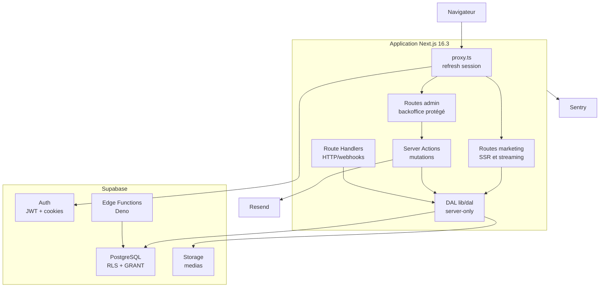
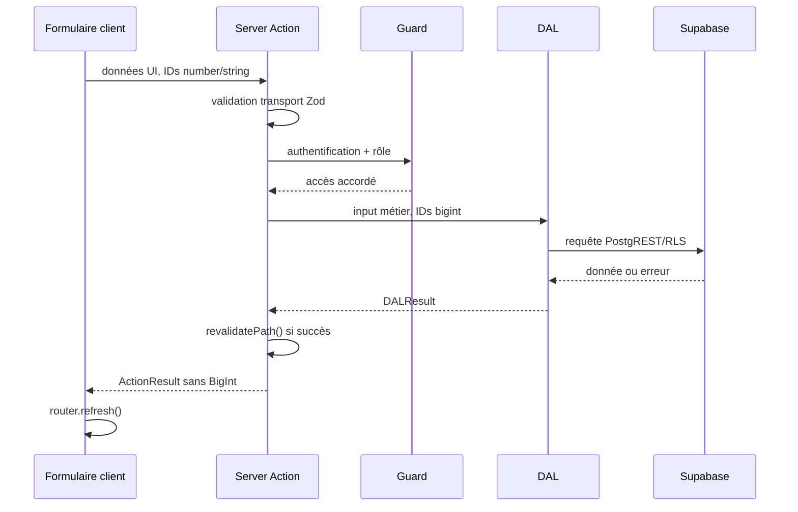
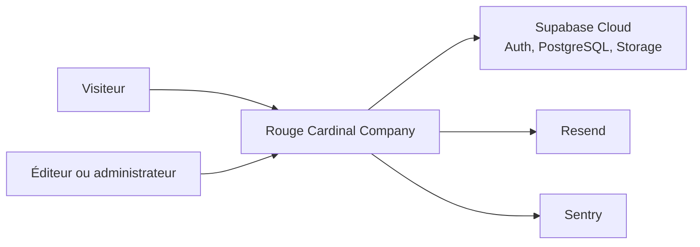
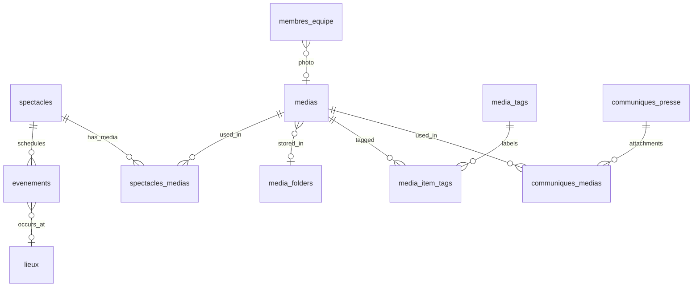

# Blueprint d'architecture - Rouge Cardinal Company

**Version :** 6.0
**Généré le :** 2026-08-20
**Type :** application web full-stack monolithique
**Architecture :** Next.js server-first, feature-based, Clean Architecture légère et DAL SOLID

> **Changelog v6.0 (2026-08-20)** : réécriture complète et compaction du document. Next.js 16.3.0, guards de rôle `user < editor < admin`, `is_admin()` / `has_min_role()` en `SECURITY INVOKER` sur `app_metadata`, suppression de `lib/auth/is-admin.ts`, ajout de `lib/api/` et `lib/env-validation.ts`, suite E2E Playwright `e2e/`, métriques recalculées. Historique complet en fin de document.

> Ce document décrit l'architecture effectivement implémentée. Les métriques sont un instantané du dépôt et doivent être recalculées après une évolution structurelle.

## Table des matières

1. [Détection et résumé](#1-détection-et-résumé)
2. [Vue architecturale](#2-vue-architecturale)
3. [Visualisation C4 et flux](#3-visualisation-c4-et-flux)
4. [Composants et frontières](#4-composants-et-frontières)
5. [Couches et dépendances](#5-couches-et-dépendances)
6. [Architecture des données](#6-architecture-des-données)
7. [Préoccupations transversales](#7-préoccupations-transversales)
8. [Communication et APIs](#8-communication-et-apis)
9. [Patterns Next.js et React](#9-patterns-nextjs-et-react)
10. [Patterns d'implémentation](#10-patterns-dimplémentation)
11. [Architecture de test](#11-architecture-de-test)
12. [Déploiement et exploitation](#12-déploiement-et-exploitation)
13. [Extensibilité](#13-extensibilité)
14. [Décisions et limites](#14-décisions-et-limites)
15. [Gouvernance](#15-gouvernance)

## 1. Détection et résumé

### 1.1 Stack vérifiée

| Couche | Technologie | Version ou état |
| --- | --- | --- |
| Framework | Next.js App Router, Turbopack | 16.3.0 |
| UI/runtime | React, React DOM | 19.2.0 |
| Langage | TypeScript strict, ESM | TypeScript 5.x |
| Style/UI | Tailwind CSS, shadcn/ui, Radix UI | Tailwind 3.4.x |
| Validation | Zod, react-hook-form | Zod 4.1.x |
| Données | Supabase PostgreSQL, PostgREST | PostgreSQL 17.6.1.063 |
| Auth | Supabase Auth, `@supabase/ssr` | JWT Signing Keys, `getClaims()` |
| Stockage | Supabase Storage | bucket médias |
| Images | Sharp (thumbnails 300×300 JPEG) | 0.35.3 |
| Email | React Email, Resend | Resend 6.x |
| Monitoring | Sentry Next.js | client/server/edge |
| Tests | Vitest, Playwright, axe-core | Playwright 1.57.0 |
| Déploiement | Vercel + GitHub Actions | dev/staging/production |

### 1.2 Empreinte du dépôt

Comptage recalculé dans le checkout utilisé pour cette génération :

- 119 fichiers TypeScript/TSX dans `app/` ;
- 350 dans `components/` ;
- 136 dans `lib/` ;
- 48 modules DAL dans `lib/dal/` ;
- 26 modules de schémas Zod selon l'inventaire v6.1 ;
- 47 fichiers SQL dans `supabase/schemas/` ;
- 163 migrations SQL dans `supabase/migrations/` ;
- 11 Route Handlers sous `app/api/` ;
- 120 fichiers de tests dans `__tests__/`, `e2e/` et `e2e-tests/`.

Ces chiffres ont un périmètre explicite : les anciens documents peuvent compter les fichiers différemment.

### 1.3 Pattern architectural

Le système est un monolithe modulaire server-first :

1. **Présentation** : routes App Router et composants React.
2. **Application** : Server Actions et Route Handlers.
3. **Accès aux données** : DAL server-only et DTOs.
4. **Infrastructure** : Supabase, Storage, Resend, Sentry, Sharp et Edge Functions.

Le découpage feature-based traverse ces couches (`agenda`, `spectacles`, `team`, `media`, `presse`, `compagnie`, etc.). Il ne s'agit pas d'une architecture microservices : le déploiement applicatif reste une unité Next.js.

## 2. Vue architecturale

### 2.1 Principes directeurs

1. Les Server Components portent les lectures initiales et l'accès aux secrets.
2. Les Client Components sont limités à l'état, aux événements, aux effets et aux APIs navigateur.
3. Les mutations internes passent par des Server Actions validées et autorisées.
4. Le DAL est la frontière normale vers Supabase.
5. Les permissions sont défendues par GRANT, RLS, guards TypeScript et contrôles SQL.
6. Les IDs `bigint` ne traversent jamais directement la frontière client.
7. Zod valide les frontières UI, transport, action, DAL et environnement.
8. Les erreurs techniques sont journalisées avec un code ; les erreurs utilisateur restent compréhensibles.
9. Le schéma déclaratif est dans `supabase/schemas/` ; les migrations appliquées restent historisées.
10. Les contraintes Clean Code sont de 30 lignes par fonction, 300 lignes par fichier et 5 paramètres maximum.

### 2.2 Topologie générale


```mermaid
flowchart TB
    browser["Navigateur"]
    subgraph next["Application Next.js 16.3"]
        proxy["proxy.ts\nrefresh session"]
        marketing["Routes marketing\nSSR et streaming"]
        admin["Routes admin\nbackoffice protégé"]
        actions["Server Actions\nmutations"]
        handlers["Route Handlers\nHTTP/webhooks"]
        dal["DAL lib/dal\nserver-only"]
    end
    subgraph supa["Supabase"]
        auth["Auth\nJWT + cookies"]
        postgres["PostgreSQL\nRLS + GRANT"]
        storage["Storage\nmedias"]
        edge["Edge Functions\nDeno"]
    end
    resend["Resend"]
    sentry["Sentry"]
    browser --> proxy
    proxy --> marketing
    proxy --> admin
    marketing --> dal
    admin --> actions --> dal
    handlers --> dal
    proxy --> auth
    dal --> postgres
    dal --> storage
    actions --> resend
    next --> sentry
    edge --> postgres
```

### 2.3 Flux de mutation


```mermaid
sequenceDiagram
    participant UI as Formulaire client
    participant A as Server Action
    participant G as Guard
    participant D as DAL
    participant S as Supabase
    UI->>A: données UI, IDs number/string
    A->>A: validation transport Zod
    A->>G: authentification + rôle
    G-->>A: accès accordé
    A->>D: input métier, IDs bigint
    D->>S: requête PostgREST/RLS
    S-->>D: donnée ou erreur
    D-->>A: DALResult
    A->>A: revalidatePath() si succès
    A-->>UI: ActionResult sans BigInt
    UI->>UI: router.refresh()
```

## 3. Visualisation C4 et flux

### 3.1 Contexte système


```mermaid
flowchart LR
    visitor[Visiteur] --> site[Rouge Cardinal Company]
    editor[Éditeur ou administrateur] --> site
    site --> supabase[Supabase Cloud\nAuth, PostgreSQL, Storage]
    site --> resend[Resend]
    site --> sentry[Sentry]
```

### 3.2 Conteneurs

| Conteneur | Responsabilité | Entrées |
| --- | --- | --- |
| `proxy.ts` | actualiser la session et déléguer au client middleware | requête HTTP |
| `(marketing)` | pages publiques, SEO et contenus | DAL de lecture |
| `(admin)` | CMS protégé et layouts | guards, DAL, actions |
| `app/actions`, `lib/actions` | mutations internes | formulaires |
| `app/api` | endpoints HTTP, webhooks | clients externes |
| `lib/dal` | accès données et DTOs | clients Supabase |
| `supabase/functions` | tâches planifiées | scheduler Supabase |

### 3.3 Flux média

1. Le formulaire valide type, taille et métadonnées.
2. La Server Action valide `FormData`, rôle et dossier.
3. Le pipeline vérifie magic bytes, nom et limite de débit.
4. Sharp compresse ou génère une miniature côté serveur.
5. Storage reçoit le fichier et `medias` reçoit les métadonnées.
6. Le suivi d'usage empêche les suppressions qui casseraient une référence.

Sharp 0.35.3 est externalisé dans `next.config.ts` et ses binaires natifs sont inclus explicitement par `outputFileTracingIncludes`. Le retrait de ce workaround est suivi par TASK200 et exige une validation Vercel.

## 4. Composants et frontières

### 4.1 Routes

Le groupe `app/(admin)/admin/` couvre notamment dashboard, agenda, analytics, audit logs, compagnie, footer, home, lieux, media, partners, presse, site-config, spectacles, team et users. Les CRUDs suivent généralement `page.tsx`, `new/page.tsx`, `[id]/edit/page.tsx`, `loading.tsx` et des actions colocalisées.

Le groupe `app/(marketing)/` expose accueil, agenda, compagnie, contact, presse, spectacles et détail d'un spectacle. Les pages légales restent statiques. `app/auth/` contient les parcours login, inscription, confirmation et récupération de mot de passe. `sitemap.ts`, `robots.ts` et `manifest.ts` sont des Metadata Routes.

Le layout admin centralise navigation et sidebar, mais ne constitue jamais une frontière de sécurité suffisante : les actions et le DAL vérifient à nouveau l'accès.

### 4.2 Composants

```text
components/
  ui/                          # primitives shadcn/ui et Radix
  features/admin/{feature}/    # écrans CMS
  features/public-site/{page}/ # sections publiques
  admin/                       # composants backoffice transverses
  layout/                      # header et footer
  error-boundaries/            # limites d'erreur
  skeletons/                   # chargement
```

Le pattern dominant est `Container` serveur -> `View` ou Client Container -> présentation. Les features complexes utilisent des compound components : un Provider expose `{ state, actions, meta }`, puis les sous-composants consomment le contexte via React 19 `use()`.

### 4.3 Domaines fonctionnels

- contenu : home, compagnie, spectacles, agenda, lieux, équipe, partenaires ;
- presse : articles, contacts, communiqués, media kit ;
- médias : bibliothèque, dossiers, tags, usages, thumbnails ;
- système : configuration, display toggles, analytics, audit, rétention ;
- communication : contact, newsletter et emails transactionnels.

## 5. Couches et dépendances

```text
app/ + components/
        |
Server Actions / Route Handlers
        |
lib/schemas/ + lib/auth/
        |
lib/dal/ + lib/utils/
        |
Supabase PostgreSQL / Storage / Auth
```

| Règle | Contrôle |
| --- | --- |
| Le DAL est server-only | `import "server-only"` |
| Le DAL ne revalide pas les routes | `revalidatePath()` réservé aux actions |
| Le DAL ne dépend pas de l'email | séparation données/effets |
| Les lectures ne passent pas par une Server Action | Server Components + DAL |
| Les secrets ne passent pas au client | DTOs minimaux |
| Les env vars applicatives passent par `lib/env.ts` | T3 Env, exceptions documentées |
| Les actions vérifient auth et rôle | invocables par POST direct |

`DALResult<T>` est interne et peut contenir des `bigint`. `ActionResult<T>` est sérialisable et ne doit pas en retourner.

## 6. Architecture des données

### 6.1 Persistance et relations


```mermaid
erDiagram
    spectacles ||--o{ evenements : schedules
    evenements }o--o| lieux : occurs_at
    spectacles ||--o{ spectacles_medias : has_media
    medias ||--o{ spectacles_medias : used_in
    medias }o--o| media_folders : stored_in
    medias ||--o{ media_item_tags : tagged
    media_tags ||--o{ media_item_tags : labels
    membres_equipe }o--o| medias : photo
    communiques_presse ||--o{ communiques_medias : attachments
    medias ||--o{ communiques_medias : used_in
```

Supabase PostgreSQL contient profils, contenus, événements, presse, équipe, médias, configuration, analytics, audit et rétention. Les schémas SQL sont ordonnés par préfixe numérique afin de respecter les dépendances.

### 6.2 RLS, GRANTs et vues

- Toutes les tables applicatives doivent avoir RLS activé.
- Les GRANTs sont nécessaires en plus des policies RLS.
- Les policies sont séparées par opération et rôle, sans `FOR ALL`.
- Elles utilisent `auth.uid()` et les fonctions SQL qualifiées.
- Les vues publiques utilisent `security_invoker` et un accès minimal `anon`/`authenticated`.
- Les vues admin sont isolées, contrôlent le rôle côté SQL et ne donnent pas un accès large à `authenticated`.
- Une vue recréée doit réappliquer `REVOKE ALL` puis les `GRANT` attendus.

### 6.3 BigInt et cache

```text
UI number  --->  transport string  --->  DAL bigint
```

Les schémas UI utilisent `z.number().int().positive()`. Les actions transportent les IDs sous forme de chaînes validées, convertissent avec `BigInt()` puis appellent le DAL. Les DTOs clients restent sérialisables.

`cache()` de React déduplique les lectures DAL lorsque le module l'utilise. Les pages admin restent fraîches avec `force-dynamic` et `revalidate = 0` selon le pattern. Après mutation, l'action appelle `revalidatePath()` puis le client appelle `router.refresh()`.

## 7. Préoccupations transversales

### 7.1 Authentification et autorisation

Les clients `supabase/server.ts`, `supabase/client.ts`, `supabase/middleware.ts` et `supabase/admin.ts` couvrent respectivement serveur, navigateur, middleware et service-role. Les cookies SSR utilisent exclusivement `getAll()` et `setAll()`.

`proxy.ts` délègue à `updateSession()`. Les contrôles rapides utilisent `getClaims()` ; `getUser()` est réservé aux attributs complets et au rafraîchissement d'un rôle absent d'un JWT déjà émis (fallback dans `getCurrentUserRole()`). Les guards de `lib/auth/roles.ts` complètent middleware et layouts : `requireMinRole()`, `requireBackofficeAccess()` et `requireAdminOnly()` lèvent une erreur (DAL, Server Actions), tandis que `requireBackofficePageAccess()` et `requireAdminPageAccess()` redirigent vers `/auth/login` (pages). Le modèle de rôle est `user < editor < admin`.

### 7.2 Validation et sécurité

- Zod valide formulaires, transport, paramètres HTTP et environnement.
- Les uploads vérifient magic bytes, taille, nom et dossier.
- Les URLs externes sont allowlistées contre SSRF et open redirects.
- Les requêtes passent par le client Supabase paramétré.
- `next.config.ts` définit CSP, HSTS, `X-Frame-Options`, `X-Content-Type-Options`, `Referrer-Policy` et `Permissions-Policy`.
- La CSP conserve encore `unsafe-inline` et `unsafe-eval` ; le remplacement par nonce/hash est ouvert.
- Le rate limiting en mémoire doit être remplacé ou complété avant une montée en charge multi-instance.

### 7.3 Erreurs et observabilité

Le DAL retourne `DALResult<T>` ; les factories `dalSuccess()` / `dalError()` avec codes d'erreur sont le pattern recommandé, en cours d'adoption (certains modules retournent encore les littéraux directement). Les Server Actions retournent `ActionResult`, les Route Handlers utilisent `ApiResponse`, et l'UI combine toasts et error boundaries.

Sentry est configuré client, serveur, edge et instrumentation. `instrumentation.ts` enrichit les erreurs de requête. Le tunnel `/monitoring` limite le blocage par les extensions navigateur. Les error boundaries couvrent root, page et composant.

### 7.4 Configuration

`lib/env.ts` est la façade T3 Env. `lib/env-validation.ts` contrôle la cohérence Supabase au runtime. `lib/site-config.ts` regroupe la configuration éditoriale et email. Les display toggles sont stockés dans `configurations_site` et doivent conditionner le fetch et le rendu.

## 8. Communication et APIs

| Besoin | Mécanisme |
| --- | --- |
| Lecture pour rendu | Server Component -> DAL |
| Mutation interne | Server Action |
| Endpoint public ou tiers | Route Handler |
| Webhook Resend | Route Handler sous `app/api/webhooks/` |
| Tâche planifiée | Supabase Edge Function |
| Email | Resend côté serveur |
| Traces | Sentry |

Les workflows contact/newsletter/upload partagés entre action et API sont factorisés dans `lib/actions/*-server.ts`. Les handlers valident chaque paramètre, utilisent des statuts HTTP adaptés et n'exposent pas les erreurs internes sensibles.

## 9. Patterns Next.js et React

### 9.1 Server-first

Pages, layouts et Containers sont des Server Components par défaut. Les frontières `'use client'` sont réservées aux formulaires, carrousels, DnD, dialogs, listeners d'authentification et APIs navigateur.

### 9.2 Container/View

Le Container récupère un DTO sûr puis rend une View. La View initialise son état avec les props et le resynchronise dans `useEffect` après `router.refresh()`. Les handlers appellent directement les actions, affichent le résultat, ferment le formulaire et demandent le refresh.

### 9.3 Performance et accessibilité

Le streaming `Suspense` et les skeletons réduisent le blocage visuel. Les animations respectent `prefers-reduced-motion`. Les pages publiques utilisent landmarks, skip link, titres hiérarchisés, labels explicites, focus visible et alternatives textuelles.

## 10. Patterns d'implémentation

### 10.1 DAL

```typescript
"use server";
import "server-only";
import { cache } from "react";
import { createClient } from "@/supabase/server";
import { dalError, dalSuccess, type DALResult } from "@/lib/dal/helpers";

export const fetchItems = cache(async (): Promise<DALResult<ItemDTO[]>> => {
  const supabase = await createClient();
  const { data, error } = await supabase.from("items").select("id, title");
  if (error) return dalError("[ERR_ITEMS_001] Fetch failed");
  return dalSuccess(data ?? []);
});
```

Le code réel doit ajouter le guard et le DTO propres au domaine.

### 10.2 Server Action

```typescript
"use server";
import "server-only";
import { revalidatePath } from "next/cache";

export async function updateItemAction(id: string, input: unknown): Promise<ActionResult> {
  const transport = ItemTransportSchema.parse({ id, input });
  const result = await updateItem(BigInt(transport.id), transport.input);
  if (!result.success) return { success: false, error: result.error };
  revalidatePath("/admin/items");
  return { success: true };
}
```

En production, l'action ajoute l'autorisation et la gestion des erreurs inattendues.

### 10.3 Média et PostgreSQL

Le pipeline média sépare validation MIME, compression Sharp, Storage et métadonnées. `buildMediaPublicUrl()` centralise les URLs ; `media-usage` vérifie les références avant suppression.

Les fonctions PostgreSQL `SECURITY DEFINER` documentent leur modèle de sécurité, imposent `set search_path = ''`, qualifient les objets et limitent les grants. Toute recréation de vue réapplique explicitement ses privilèges.

### 10.4 Conventions de nommage

| Type | Convention | Exemple |
| --- | --- | --- |
| Container | `{Feature}Container.tsx` | `TeamManagementContainer.tsx` |
| View | `{Feature}View.tsx` | `TeamMemberList.tsx` |
| Form | `{Feature}Form.tsx` | `TeamMemberForm.tsx` |
| Champs de formulaire | `{Feature}FormFields.tsx` | `HeroSlideFormFields.tsx` |
| DAL admin | `admin-{feature}.ts` | `admin-lieux.ts` |
| DAL public | `{feature}.ts` | `spectacles.ts` |
| Server Actions | `{feature}-actions.ts` ou `actions.ts` colocalisé | `home-hero-actions.ts` |
| Schema Zod | `{feature}.ts` | `admin-events.ts` |
| Hook | `use{Feature}{Action}.ts` | `useHeroSlidesDnd.ts` |
| Codes d'erreur | `[ERR_{ENTITY}_{NNN}]` | `[ERR_LIEUX_003]` |

### 10.5 Anti-patterns à éviter

| Anti-pattern | Solution |
| --- | --- |
| `revalidatePath()` dans le DAL | Déplacer dans la Server Action |
| `useState(props)` sans `useEffect` | Ajouter `useEffect(() => setState(props), [props])` |
| Schema UI avec `bigint` | Utiliser `z.number()` pour les formulaires |
| `as unknown as Resolver<>` | Utiliser un schema UI aligné |
| Formulaire > 300 lignes | Splitter en sous-composants |
| API Route pour une mutation interne | Utiliser une Server Action |
| `process.env.*` direct | Utiliser `import { env } from '@/lib/env'` |
| `throw` dans le DAL | Retourner `dalError()` |
| `getUser()` pour un simple check d'auth | Utiliser `getClaims()` |
| Vue sans `SECURITY INVOKER` | Ajouter `with (security_invoker = true)` |
| Vue recréée sans `REVOKE ALL` + `GRANT` | Réappliquer les privilèges explicitement |

## 11. Architecture de test

```text
Unitaires Vitest
  -> schemas, utils, env validation, email, compression
Intégration
  -> DAL, permissions, RLS, vues, Supabase local/cloud
E2E Playwright
  -> auth, public, admin, CRUD, navigation, accessibilité
```

Vitest couvre les fonctions pures et frontières ciblées. Les scripts `tsx` auditent Supabase, RLS, DAL, email, rate limiting, médias, backups et environnement. Playwright utilise fixtures, Page Object Models sous `e2e/pages/`, setup global et projets d'authentification.

Règles E2E : attendre l'hydratation, utiliser `expect().toPass()` pour les états asynchrones, prendre en compte le Sheet mobile et utiliser des données uniques pour les endpoints rate-limités.

Commandes de validation usuelles :

```bash
pnpm type-check
pnpm lint
pnpm test:unit:image-compress
pnpm test:dal:permissions
pnpm test:rls:local
pnpm e2e:cross:public
pnpm build
```

## 12. Déploiement et exploitation

- **Local** : Next dev/Turbopack et Supabase CLI local.
- **Preview/staging** : Vercel avec variables et projet Supabase dédiés.
- **Production** : Vercel, Supabase Cloud PostgreSQL 17.6.1.063, Storage, Auth et Resend.
- **CI/CD** : GitHub Actions pour build, tests, E2E, backups, contrôles de rôles, migrations et sécurité.

### 12.1 Sharp et tracing Vercel

`serverExternalPackages: ["sharp"]` et `outputFileTracingIncludes` ciblent les paquets physiques pnpm `@img/sharp-*`. Aucun hoisting de ces paquets natifs ne doit être ajouté sans validation Vercel. TASK200 exige une validation preview/production, cold start, upload et thumbnail.

### 12.2 Workflow Supabase

1. Modifier `supabase/schemas/`.
2. Arrêter Supabase local avant `db diff` selon le guide projet.
3. Générer et relire la migration.
4. Vérifier RLS, GRANTs, vues et fonctions.
5. Exécuter les tests SQL/DAL.
6. Pousser après revue.

Les hotfixes manuels restent historisés et doivent être synchronisés dans le schéma déclaratif lorsqu'ils représentent l'état final.

## 13. Extensibilité

### 13.1 Nouvelle feature CRUD

1. Identifier domaine et permissions.
2. Ajouter schéma SQL et migration.
3. Créer `lib/schemas/{feature}.ts` avec variantes UI/transport/server.
4. Créer `lib/dal/{feature}.ts` et des DTOs minimaux.
5. Ajouter les actions avec validation, guard, DAL et `revalidatePath()`.
6. Créer Container serveur, View client et sous-composants.
7. Ajouter la route admin avec `force-dynamic` et `revalidate = 0`.
8. Ajouter tests unitaires, DAL/RLS et E2E proportionnels au risque.

### 13.2 Nouvelle page publique

Créer le DAL read-only, les composants sous `components/features/public-site/`, la route marketing, les metadata et un display toggle si nécessaire. Ne pas créer de Server Action pour une lecture.

### 13.3 Bibliothèque média

Réutiliser `ImageField`, les actions d'upload génériques, la validation magic bytes, les helpers d'URL et le suivi d'usage. Toute référence média doit être incluse dans le calcul d'utilisation.

## 14. Décisions et limites

Les ADR ci-dessous sont des enregistrements historiques : leur numérotation est stable et n'est jamais réattribuée.

### ADR-001 - Next.js App Router + Server Components

**Contexte :** besoin de SSR, SEO et performance pour un site théâtral.
**Décision :** Next.js avec App Router, Server Components par défaut.
**Conséquences :** SSR natif, streaming via Suspense, complexité de sérialisation BigInt.

### ADR-002 - Séparation Server Actions / DAL (Nov 2025)

**Contexte :** `revalidatePath()` dans les API Routes ne déclenchait pas de re-render.
**Décision :** Server Actions pour les mutations + `revalidatePath()`, DAL pour la DB uniquement.
**Conséquences :** re-render fiable, mais nécessite la synchronisation `useEffect` dans les Client Components.

### ADR-003 - Dual Zod Schemas (Nov 2025)

**Contexte :** `bigint` non sérialisable par `JSON.stringify()`.
**Décision :** schemas Server (bigint) / UI (number) / Transport (string).
**Conséquences :** type safety préservée, mais 3 types par feature avec IDs.

### ADR-004 - T3 Env (Déc 2025)

**Contexte :** accès `process.env` non typé, erreurs runtime silencieuses.
**Décision :** `@t3-oss/env-nextjs` avec validation Zod au démarrage.
**Conséquences :** fail fast si variables manquantes, code de vérification manuelle supprimé.

### ADR-005 - JWT Signing Keys + getClaims()

**Contexte :** `getUser()` ~300ms par appel, problème de latence en middleware.
**Décision :** migration vers JWT Signing Keys, utilisation de `getClaims()` (~2-5ms).
**Conséquences :** authentification ~100x plus rapide, dépendance réseau réduite ; `getUser()` reste utilisé en fallback de rafraîchissement de rôle.

### ADR-006 - Admin Views Security Hardening (Jan 2026)

**Contexte :** les vues `SECURITY DEFINER` (défaut PostgreSQL) bypassaient les RLS.
**Décision :** rôle dédié `admin_views_owner`, `SECURITY INVOKER` explicite sur toutes les vues.
**Conséquences :** vues sécurisées, aucun bypass possible.

### ADR-007 - Media Library Architecture (Déc 2025)

**Contexte :** besoin de gestion des médias avec tags, dossiers, thumbnails, déduplication.
**Décision :** tables dédiées, modules DAL spécialisés, déduplication SHA-256, dossiers synchronisés avec Storage.
**Conséquences :** système complet avec RLS granulaire et accessibilité WCAG.

### ADR-008 - Display Toggles (Jan 2026)

**Contexte :** besoin de contrôler la visibilité des sections sans déploiement.
**Décision :** toggles dans la table `configurations_site` avec UI admin.
**Conséquences :** contrôle granulaire, fetch conditionnel, zéro downtime.

### ADR-009 - Sentry Multi-Runtime

**Contexte :** monitoring des erreurs et performances sur tous les runtimes Next.js.
**Décision :** configuration 4 runtimes (client/server/edge/instrumentation), tunnel `/monitoring` anti-adblock.
**Conséquences :** couverture complète, headers sensibles supprimés côté serveur.

### ADR-010 - Migration Next.js 16 (Déc 2025)

**Contexte :** upgrade Next.js 15 vers 16 pour Turbopack stable et correctifs de sécurité.
**Décision :** migration avec renommage `middleware.ts` vers `proxy.ts`, `export const dynamic` sur les pages Supabase.
**Conséquences :** résolution des CVE concernées, Turbopack par défaut.

### ADR-011 - Embla Carousel Gallery (Fév 2026)

**Contexte :** affichage d'une galerie de photos par spectacle avec carousel interactif.
**Décision :** `embla-carousel-react` + plugin `Autoplay`, branching 0/1/2+ images, clavier scopé au conteneur. Vue SQL `spectacles_gallery_photos_public` + vue admin gardée par `has_min_role('editor')`.
**Conséquences :** carousel WCAG, respect de `prefers-reduced-motion`, helper `buildMediaPublicUrl()` centralisé dans `lib/dal/helpers/media-url.ts`.

### ADR-012 - Monolithe Next.js + Supabase

**Décision :** une application Next.js, données/auth/Storage dans Supabase.
**Raison :** cohérence server-first, déploiement simple et RLS centralisée.
**Conséquence :** les frontières modulaires doivent rester explicites.

### ADR-013 - DAL server-only

**Décision :** centraliser l'accès aux données dans `lib/dal/`.
**Raison :** contrôler autorisation, DTOs et erreurs.
**Conséquence :** les composants n'appellent pas Supabase directement pour les données métier.

### ADR-014 - BigInt en trois couches

**Décision :** `number` UI, `string` transport, `bigint` DAL.
**Raison :** éviter les erreurs de sérialisation des Server Actions.

### ADR-015 - RLS et GRANTs

**Décision :** appliquer les deux mécanismes.
**Raison :** RLS filtre les lignes ; les grants contrôlent l'accès relationnel et les vues.

### 14.1 Limites ouvertes

- **TASK200** : retirer le workaround Sharp/nft seulement après preuve de packaging et cold start Vercel.
- **TASK107** : poursuivre la validation du sitemap et des URLs canoniques.
- La CSP contient encore des directives permissives à remplacer par nonce/hash.
- Le rate limiting en mémoire n'est pas distribué entre instances Vercel.
- Le rapport Graphify est construit depuis le commit `79621761`, alors que le HEAD courant est plus récent ; il n'est pas une photographie complète du dépôt.

## 15. Gouvernance

### 15.1 Avant modification

- Lire `AGENTS.md`, `.github/copilot-instructions.md` et les instructions spécialisées.
- Lire `memory-bank/activeContext.md`, `systemPatterns.md`, `techContext.md` et le blueprint des dossiers.
- Rechercher les usages existants avant d'ajouter une abstraction.
- Vérifier `git status` et préserver les changements utilisateur.

### 15.2 Revue architecturale

Une revue doit vérifier :

1. le sens des dépendances entre couches ;
2. la minimisation et la sérialisation des données client ;
3. auth, rôle, validation et revalidation de chaque mutation ;
4. la couverture du risque principal, notamment RLS/GRANT, accessibilité ou upload.

### 15.3 Checklist PR

- [ ] RLS policies pour toute nouvelle table, séparées par opération et rôle ;
- [ ] schéma déclaratif mis à jour et migration générée via `supabase db diff` ;
- [ ] `REVOKE ALL` + `GRANT` explicites après toute recréation de vue ;
- [ ] `DALResult<T>` pour tout nouveau module DAL, sans `revalidatePath()` ni `throw` ;
- [ ] `revalidatePath()` uniquement dans les Server Actions ;
- [ ] fichiers < 300 lignes, fonctions < 30 lignes ;
- [ ] schemas Zod Server + UI si IDs bigint ;
- [ ] guards d'autorisation dans l'action ET le DAL.

### 15.4 Documentation et contrôle

Mettre à jour ce blueprint après un changement de frontière, stack, flux de données, sécurité ou déploiement. Les détails de progression restent dans `memory-bank/tasks/` et `progress.md`.

```bash
git diff --check
pnpm type-check
pnpm lint
```

## Historique des versions

| Version | Date | Changements majeurs |
| --- | --- | --- |
| 6.0 | 2026-08-20 | Réécriture et compaction complètes. Next.js 16.3.0, hiérarchie `user < editor < admin`, `is_admin()` / `has_min_role()` en `SECURITY INVOKER` sur `app_metadata`, suppression de `lib/auth/is-admin.ts`, ajout de `lib/api/` et `lib/env-validation.ts`, suite E2E `e2e/`, métriques recalculées, ADR-012 à ADR-015 |
| 5.0 | 2026-07-24 | Mise à jour des données : 37 modules DAL, 23 schemas Zod, 10 hooks, 103 migrations, 98 scripts, catégorisation DAL, media-folders/tags migrés vers Server Actions |
| 4.0 | 2026-02-07 | Réécriture : diagrammes C4 Mermaid, 17 sections, Sentry multi-runtime, security headers, ADR complets, Next.js 16.1.5 |
| 3.1 | 2026-01-26 | BigInt Pattern Edition |
| 2.9 | 2026-01-07 | Admin Views Security Hardening (TASK037) |
| 2.8 | 2026-01-01 | Display Toggles System (TASK030) |
| 2.7 | 2025-12-30 | Media Library Storage/Folders Sync |
| 2.6 | 2025-12-29 | TASK029 Media Library |
| 2.5 | 2025-12-22 | React Hook Form Hydration Fixes |
| 2.4 | 2025-12-20 | SOLID et Server Actions Refactoring |
| 2.3 | 2025-12-20 | T3 Env Integration |
| 2.0 | 2025-11-30 | SOLID DAL Refactoring (17 modules) |
| 1.0 | 2025-11-30 | Version initiale |

Le contenu détaillé des versions antérieures reste consultable dans l'historique Git de ce fichier.
