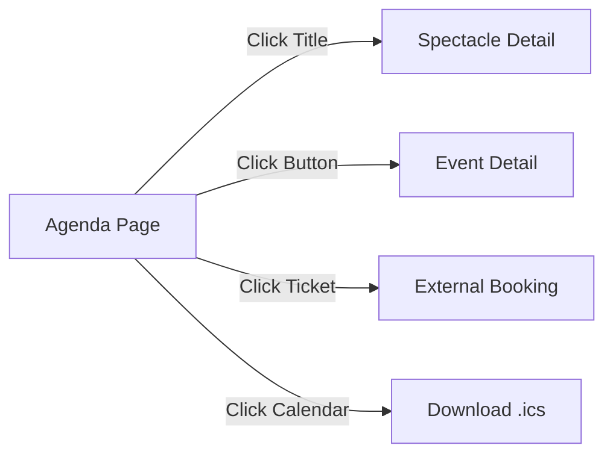

# Progress

## TASK063 — Media Admin Audit Violations Fix (2026-02-28)

### Summary

✅ **COMPLET** — Refactoring complet de `components/features/admin/media/` selon 12 étapes. 28 fichiers modifiés (18 créés + 10 modifiés). 0 erreur ESLint, build compilé. Commit `5db3b25` sur branche `refactor/media-admin-audit-violations`.

| Livrable | Statut | Détails |
| ---------- | ------ | -------- |
| `formatFileSize` → `lib/utils/format.ts` | ✅ | DRY, suppression duplication |
| `MediaFolderFormDialog.tsx` créé | ✅ | Dialog création/édition dossier |
| `MediaTagFormDialog.tsx` créé | ✅ | Dialog création/édition tag |
| `BulkTagSelector` + `TagActionBadge` extraits | ✅ | DRY depuis `MediaBulkActions` |
| `aria-required` + `aria-label` | ✅ | WCAG 2.2 AA |
| `constants.ts` — plus de magic numbers | ✅ | `MAX_VISIBLE_TAGS`, débounces |
| `MediaDetailsPanel` split → `details/` | ✅ | 4 sous-composants |
| `ImageFieldGroup` split → `image-field/` | ✅ | 3 sous-composants |
| `MediaCard` split → Thumbnail + Footer | ✅ | `MediaCardThumbnail` + `MediaCardFooter` |
| `useMediaLibraryState` hook (135L) | ✅ | Extrait de `MediaLibraryView` |
| `index.ts` barrel mis à jour | ✅ | Nouveaux exports ajoutés |
| React Hooks lint bugs corrigés (2) | ✅ | useCallback→async, derived state |
| `BulkDeleteDialog.tsx` extrait | ✅ | MediaBulkActions 324→267 lignes |
| `pnpm lint` 0 erreurs | ✅ | Confirmé |
| `pnpm build` compilé | ✅ | `✓ Compiled successfully` |
| Commit `5db3b25` (28 fichiers) | ✅ | Branche `refactor/media-admin-audit-violations` |

### Fichiers créés

```bash
lib/utils/format.ts
components/features/admin/media/constants.ts
components/features/admin/media/MediaFolderFormDialog.tsx
components/features/admin/media/MediaTagFormDialog.tsx
components/features/admin/media/BulkTagSelector.tsx
components/features/admin/media/BulkDeleteDialog.tsx           # Extrait en étape 12
components/features/admin/media/TagActionBadge.tsx
components/features/admin/media/MediaCardThumbnail.tsx         # 166L
components/features/admin/media/MediaCardFooter.tsx            # 76L
components/features/admin/media/details/MediaPreview.tsx       # 26L
components/features/admin/media/details/MediaFileInfo.tsx      # 46L
components/features/admin/media/details/MediaEditForm.tsx      # 174L
components/features/admin/media/details/MediaDetailActions.tsx # 107L
components/features/admin/media/hooks/useMediaLibraryState.ts  # 135L
components/features/admin/media/image-field/ImageSourceActions.tsx   # 96L
components/features/admin/media/image-field/ImagePreviewSection.tsx  # 94L
components/features/admin/media/image-field/ImageAltTextField.tsx    # 55L
.github/prompts/plan-fixAdminMediaAuditViolations.prompt.md
```

---

## Audit conformité admin/lieux — 7 corrections (2026-02-28)

### Summary

✅ **COMPLET** — Audit + fix de `components/features/admin/lieux`. 7 violations corrigées, 0 erreur TypeScript/ESLint.

| Livrable | Statut | Détails |
| -------- | ------ | ------- |
| `Record<string, any>` → `unknown` | ✅ | `LieuDTO` + `LieuClientDTO` dans schemas |
| `LieuClientDTO` dupliqué supprimé | ✅ | Import unique depuis `lib/schemas/admin-lieux` |
| `ActionResult<T>` dupliqué supprimé | ✅ | Import depuis `lib/actions/types` |
| `toClientDTO()` centralisé | ✅ | Exporté par schemas, 3 usages refactorisés (Container, edit/page, actions) |
| Types sort dupliqués | ✅ | Source unique dans `lieu-table-helpers.ts`, import dans Table + View |
| Imports inutilisés Container | ✅ | `Suspense`/`Skeleton`/`LieuClientDTO` supprimés, `role="alert"` ajouté |
| `aria-required="true"` champ nom | ✅ | WCAG 2.2 AA conformité formulaire |
| TypeScript 0 erreurs | ✅ | Confirmé |
| ESLint 0 erreurs (11 warnings pré-existants) | ✅ | Confirmé |

### Fichiers modifiés

```bash
lib/schemas/admin-lieux.ts                              # any→unknown, toClientDTO() exporté
app/(admin)/admin/lieux/actions.ts                      # Suppression duplicata ActionResult + LieuClientDTO + toClientDTO
components/features/admin/lieux/LieuxContainer.tsx      # Import toClientDTO, suppression imports inutilisés, role="alert"
app/(admin)/admin/lieux/[id]/edit/page.tsx               # Import toClientDTO, mapping inline supprimé
components/features/admin/lieux/LieuxTable.tsx           # Import sort types depuis helpers
components/features/admin/lieux/LieuxView.tsx            # Import sort types depuis helpers
components/features/admin/lieux/LieuFormFields.tsx       # aria-required="true" sur champ nom
```

---

## TASK031-FIX Analytics — Audit qualité + Bugfixes complets (2026-02-27)

### Summary

✅ **COMPLET** — Audit qualité 7 corrections + 2 bugfixes additionnels + infrastructure tracking déployée.

| Livrable | Statut | Détails |
| -------- | ------ | ------- |
| `types.ts` : `import type { ReactNode }` | ✅ | Suppression `React.ReactNode` |
| `SentryErrorsCard.tsx` : `cn` local → `@/lib/utils` | ✅ | DRY |
| `AdminActivityCard.tsx` : clé stable | ✅ | `tableName-operation-timestamp` |
| `AnalyticsDashboard.tsx` : `handleExport(format)` | ✅ | CSV + JSON factorisés |
| `AnalyticsDashboard.tsx` : `useTransition` | ✅ | Remplace `useState` + `setTimeout` |
| Icônes décoratives : `aria-hidden="true"` | ✅ | Tous les composants analytics |
| `PageviewsChart.tsx` : `role="img"` + suppression import mort | ✅ | WCAG 2.2 AA |
| Bugfix export JSON client-side | ✅ | Commit `d71163b` |
| Bugfix DAL `uniqueVisitors` : `session_id` | ✅ | 3 fonctions DAL corrigées |
| `PageViewTracker` + `trackPageView` Server Action | ✅ | Infrastructure tracking |
| Migration RLS `20260227210418` | ✅ | `page_view` + `entity_type IS NULL` |
| `pnpm lint` 0 erreurs | ✅ | Confirmé |

### Fichiers Modifiés

```bash
components/features/admin/analytics/types.ts
components/features/admin/analytics/SentryErrorsCard.tsx
components/features/admin/analytics/AdminActivityCard.tsx
components/features/admin/analytics/AnalyticsDashboard.tsx   # + export JSON client-side
components/features/admin/analytics/MetricCard.tsx
components/features/admin/analytics/PageviewsChart.tsx
lib/dal/analytics.ts                                          # user_id → session_id
app/(marketing)/layout.tsx                                    # PageViewTracker ajouté
components/features/analytics/PageViewTracker.tsx             # NOUVEAU
app/actions/analytics.actions.ts                              # NOUVEAU (trackPageView)
supabase/migrations/20260227210418_fix_analytics_events_insert_policy.sql  # NOUVEAU
```

---

## Bugfix Analytics Export JSON — génération côté client (2026-02-27)

### Summary

✅ **BUGFIX NON PLANIFIÉ** — L'export JSON du dashboard analytics produisait un fichier vide. Root cause : sérialisation RSC défaillante via Server Action. Fix : génération JSON côté client depuis l'état React existant.

| Livrable | Statut | Détails |
| -------- | ------ | ------- |
| `exportAnalyticsJSON` Server Action supprimée | ✅ | Fonction obsolète retirée de `actions.ts` |
| `triggerDownload()` helper ajouté | ✅ | Gestion propre des téléchargements + `URL.revokeObjectURL` |
| `handleExportJSON()` côté client | ✅ | Construit le JSON depuis l'état React — aucun re-fetch |
| `handleExport()` refactorisé | ✅ | Délègue JSON à `handleExportJSON`, CSV reste via Server Action |
| `useTransition` pour le refresh | ✅ | Remplace `setIsRefreshing` — `isPending` automatique via React 19 |
| TypeScript 0 erreurs | ✅ | Confirmé |

### Root Cause

`exportAnalyticsJSON` était une Server Action qui re-fetchait toutes les données et retournait une grande string JSON. La couche de sérialisation RSC (ou les objets `Date` dans le spread `...timeSeriesResult.data` incluant `startDate`/`endDate`) causait l'arrivée du résultat vide/corrompu côté client.

### Solution

JSON généré **client-side** depuis l'état React déjà disponible — aucun aller-retour serveur nécessaire. Helper `toISO()` gère à la fois `Date` et `string` (RSC peut sérialiser `Date` en `string`).

### Fichiers Modifiés

```bash
app/(admin)/admin/analytics/actions.ts              # Suppression exportAnalyticsJSON (dead code)
components/features/admin/analytics/AnalyticsDashboard.tsx  # triggerDownload + handleExportJSON client-side
```

### Commit

- [`fix(analytics): move JSON export client-side to fix empty file bug`](https://github.com)

---

## fix/audit-logs-violations — 7 corrections qualité code TASK033 (2026-02-26)

### Summary

✅ **7 CORRECTIONS** sur 6 fichiers + 2 scripts de test corrigés, branche `fix/audit-logs-violations`, 4 commits.

| Livrable | Statut |
| -------- | ------ |
| `lib/utils/audit-log-filters.ts` créé (parsing searchParams) | ✅ |
| `AuditLogsContainer.tsx` simplifié (20 lignes → 1 appel) | ✅ |
| `AuditLogsView.tsx` : fake loading supprimé (800ms + 2×500ms setTimeout) | ✅ |
| `AuditLogsTable.tsx` : accessibilité clavier WCAG 2.2 | ✅ |
| `AuditLogDetailModal.tsx` : non-null assertions → `?? {}` | ✅ |
| `AuditLogsSkeleton.tsx` : clés sémantiques | ✅ |
| Scripts test-audit-logs corrigés (T3 Env + RPC) | ✅ |
| `pnpm lint` 0 erreurs | ✅ |

### Fichiers Clés

```bash
lib/utils/audit-log-filters.ts                          # NOUVEAU — util parsing
components/features/admin/audit-logs/AuditLogsContainer.tsx
components/features/admin/audit-logs/AuditLogsView.tsx
components/features/admin/audit-logs/AuditLogsTable.tsx
components/features/admin/audit-logs/AuditLogDetailModal.tsx
components/features/admin/audit-logs/AuditLogsSkeleton.tsx
scripts/test-audit-logs-cloud.ts                        # Fix RPC + dotenv
scripts/test-audit-logs-schema.ts                       # Fix T3 Env + RPC
package.json                                            # +3 scripts npm
```

---

## Bugfix URL images Unsplash — contrainte DB + allowlist SSRF (2026-02-21)

### Summary

✅ **DEUX CORRECTIFS** — Contrainte PostgreSQL trop stricte + hostname `plus.unsplash.com` manquant dans l'allowlist SSRF.

| Livrable | Statut | Détails |
| --------- | ------ | ------- |
| Contrainte `membres_equipe_image_url_format` relaxée | ✅ | Extension de fichier rendue facultative dans le regex |
| Migration `20260221100000` appliquée | ✅ | Remote via `supabase db push --linked` |
| `lib/utils/validate-image-url.ts` mis à jour | ✅ | `plus.unsplash.com` dans `ALLOWED_HOSTNAMES` |
| `next.config.ts` mis à jour | ✅ | `plus.unsplash.com` dans `images.remotePatterns` |
| `doc/guide-url-images-externes.md` enrichi | ✅ | Procédure complète d'ajout de domaine |
| Commits | ✅ | `803cd21` + `99a1383` |

### Fichiers Clés

```bash
supabase/schemas/50_constraints.sql                    # Regex contrainte relaxé
supabase/migrations/20260221100000_fix_membres_equipe_image_url_constraint.sql
lib/utils/validate-image-url.ts                        # + plus.unsplash.com
next.config.ts                                         # + plus.unsplash.com
doc/guide-url-images-externes.md                       # Procédure + liste domaines
```

### Problèmes Résolus

**Erreur 1** : `new row for relation "membres_equipe" violates check constraint "membres_equipe_image_url_format"`

- URLs Unsplash CDN (ex. `photo-xxx?w=800&q=80`) sans extension rejetées par le regex DB
- La validation d'extension est faite au niveau app (magic bytes) — la contrainte DB était redondante

**Erreur 2** : `Hostname not allowed: plus.unsplash.com. Only Supabase Storage URLs are permitted.`

- `plus.unsplash.com` (Unsplash Premium) absent de l'allowlist SSRF
- Fix aligné sur le pattern CodeQL-compliant existant

---

## Embla Carousel Spectacle Gallery + Security Fix admin views (2026-02-20)

### Summary

✅ **FEATURE COMPLÈTE + HOTFIX SÉCURITÉ** — Carousel gallery Embla sur les pages spectacles (scale tween, autoplay, WCAG), gestion admin drag-drop, migration sécurité `is_admin()` sur vues admin spectacles.

| Livrable | Statut | Détails |
| --------- | ------ | ------- |
| Vue SQL `spectacles_gallery_photos_public` | ✅ | SECURITY INVOKER, ordre ASC |
| Vue SQL `spectacles_gallery_photos_admin` | ✅ | Guard `is_admin()` + REVOKE anon |
| Vue SQL `spectacles_landscape_photos_admin` | ✅ | Guard `is_admin()` ajouté (hotfix) |
| Helper `buildMediaPublicUrl` | ✅ | `lib/dal/helpers/media-url.ts` sync, T3 Env |
| Schémas Zod gallery | ✅ | `GalleryPhotoDTOSchema`, `GalleryPhotoTransport`, `AddGalleryPhotoInputSchema` |
| DAL `fetchSpectacleGalleryPhotos` | ✅ | cache(), graceful degradation |
| DAL CRUD admin gallery | ✅ | add / delete / reorder functions |
| `SpectacleCarousel.tsx` | ✅ | 389 lignes — 0/1/2+ branching, scale tween 0.40 |
| `SpectacleDetailView.tsx` étendu | ✅ | Section galerie après awards |
| Page `[slug]/page.tsx` | ✅ | Fetch gallery dans Promise.all |
| `SpectacleGalleryManager.tsx` | ✅ | Admin drag-drop reorder @dnd-kit |
| API Route gallery admin | ✅ | GET `/api/admin/spectacles/[id]/gallery-photos` |
| Server Actions gallery | ✅ | add / delete / reorder actions |
| Migration `20260220130000` | ✅ | Applied remote 2026-02-20 |
| TypeScript 0 erreurs | ✅ | Confirmé |

### Fichiers Clés

```bash
supabase/schemas/42_views_spectacle_gallery.sql
supabase/migrations/20260220120000_add_gallery_photos_views.sql
supabase/migrations/20260220130000_fix_spectacle_admin_views_security.sql
lib/dal/helpers/media-url.ts
lib/dal/helpers/index.ts                          # + export buildMediaPublicUrl
lib/schemas/spectacles.ts                         # + gallery Zod schemas
lib/dal/spectacle-photos.ts                       # + gallery functions
components/features/public-site/spectacles/SpectacleCarousel.tsx
components/features/public-site/spectacles/SpectacleDetailView.tsx
app/(marketing)/spectacles/[slug]/page.tsx
components/features/admin/spectacles/SpectacleGalleryManager.tsx
app/api/admin/spectacles/[id]/gallery-photos/route.ts
app/(admin)/admin/spectacles/actions.ts           # + gallery Server Actions
```

### Divergences plan v3 (D1–D8)

| ID | Description | Impact |
| ---- | ------------- | -------- |
| D1 | `addSpectacleGalleryPhoto` prend `number` pas `bigint` | Supabase client accepte — pas d'impact |
| D2 | `deleteSpectacleGalleryPhoto` prend `string` (conversion `Number()` interne) | Conforme BigInt 3-layer |
| D3 | Counter X/Y non implémenté | Supprimé — jugé superflu |
| D4 | Slide width `flex-[0_0_72%]` | Design actuel |
| D5 | `TWEEN_FACTOR_BASE = 0.40` (plan: 0.28) | Résultat visuel supérieur |
| D6 | `<h2>Galerie</h2>` commenté | Décision design post-implémentation |
| D7 | 6 fichiers modifiés (plan disait 5) | `actions.ts` manquait dans décompte plan |
| D8 | Slot 42 : `42_rpc_audit_logs.sql` + `42_views_spectacle_gallery.sql` coexistent | Cosmétique, pas d'impact |

---

## Upload Pipeline Security Hardening + Format Expansion (2026-02-18)

### Summary

✅ **SECURITY HARDENING COMPLET** — Validation upload côté serveur robuste, magic bytes, 10MB, sanitisation filename, 7 formats (GIF/SVG/PDF ajoutés)

| Livrable | Statut | Détails |
| --------- | ------ | ------- |
| Magic bytes MIME | ✅ | `verifyFileMime()` — 7 formats, 64 octets |
| Taille max 10MB | ✅ | `MAX_FILE_SIZE = 10 * 1024 * 1024` |
| Sanitisation filename | ✅ | `sanitizeFilename()` — path traversal + chars + 100 chars |
| Formats GIF / SVG / PDF | ✅ | Extension de JPEG/PNG/WebP/AVIF |
| Cohérence URL externe | ✅ | AVIF ajouté dans `validate-image-url.ts` |
| Types TypeScript | ✅ | `AllowedUploadMimeType`, `ALLOWED_UPLOAD_MIME_TYPES`, `isAllowedUploadMimeType` |
| UI MediaUploadDialog | ✅ | Labels 10MB, 7 formats, `accept` élargi |
| Documentation | ✅ | `actions_readme.md` section Validation mise à jour |
| TypeScript 0 erreurs | ✅ | `get_errors` confirmé |
| Commits | ✅ | `3a64cdb` — 14 files changed |

### Problèmes Résolus

**Audit initial (3 points)**:

1. **MIME spoofing** : `file.type` client-contrôlé accepté sans vérification réelle → corrigé par magic bytes
2. **Taille** : 5MB en code vs 10MB autorisé par bucket Supabase → aligné à 10MB
3. **Filename** : `input.file.name` brut en BDD (path traversal + chars spéciaux) → `sanitizeFilename()`

**Incohérence formats** :

- Upload : JPEG/PNG/WebP/AVIF (4 types)
- URL externe : JPEG/PNG/WebP/SVG/GIF (5 types, sans AVIF)
- Après : 7 types alignés dans upload + AVIF ajouté URL externe

### Fichiers Clés

```bash
lib/utils/mime-verify.ts          # NOUVEAU — magic bytes 7 formats
lib/actions/media-actions.ts      # validateFile async, 10MB, magic bytes
lib/dal/media.ts                  # sanitizeFilename() + utilisation BDD
lib/schemas/media.ts              # 3 constantes, 2 nouveaux types, type guard
lib/schemas/index.ts              # Exports étendus
lib/utils/validate-image-url.ts   # + image/avif
components/features/admin/media/types.ts         # Re-exports étendus
components/features/admin/media/MediaUploadDialog.tsx  # UI 10MB + 7 formats
lib/actions/actions_readme.md     # Documentation mise à jour
```

---

### Summary (2)

✅ **CRITICAL FILTER BUGFIX DEPLOYED** — Archived spectacles no longer appear in homepage "Prochains Spectacles" section

| Deliverable | Status | Details |
| ----------- | ------ | ------- |
| Bug Identified | ✅ | "La Danse des Ombres" (archived) displayed on homepage |
| Root Cause Analysis | ✅ | Missing `.neq("status", "archived")` filter in DAL |
| Filter Implementation | ✅ | Added archive status check to `fetchFeaturedShows()` |
| Type Definition Updated | ✅ | Added `status` field to `SupabaseShowRow` type |
| Logic Alignment | ✅ | Homepage now matches spectacles page filter |
| Committed | ✅ | `6beb68a` - 1 file changed, 43 insertions(+), 41 deletions(-) |

### Problem

**User Report**: "Pourquoi dans ShowsView le spectacle 'La Danse des Ombres' est affiché alors qu'il fait partie des spectacles archivés ?"

**Investigation**:

- Spectacle "La Danse des Ombres" has `public = true` AND `status = 'archived'`
- Homepage DAL (`fetchFeaturedShows()`) only filtered: `.eq("public", true)` ❌
- Spectacles page (`SpectaclesContainer.tsx`) correctly filtered: `s.public && s.status !== "archived"` ✅
- Result: Inconsistent display (archived show visible on homepage but not on spectacles page)

### Root Cause

> **Incomplete Filter in Homepage DAL**

The `fetchFeaturedShows()` function in `lib/dal/home-shows.ts` was missing the archive status filter:

```typescript
// ❌ BEFORE: Only public flag filter
const { data: shows, error } = await supabase
  .from("spectacles")
  .select("id, title, slug, short_description, image_url, premiere, public")
  .eq("public", true)  // ❌ No status filter!
  .order("premiere", { ascending: false })
  .limit(limit);

// Consequence: All public spectacles returned, including archived ones
```

**Why Homepage and Spectacles Page Diverged**:

- **Homepage DAL**: Filtered at database level (incomplete)
- **Spectacles Page**: Filtered at component level (correct) via `.filter((s) => s.public && s.status !== "archived")`

### Solution

**File Modified**: `lib/dal/home-shows.ts`

**1. Type Definition Update**:

```typescript
type SupabaseShowRow = {
  id: number;
  title: string;
  slug?: string | null;
  short_description?: string | null;
  image_url?: string | null;
  premiere?: string | null;
  public?: boolean | null;
  status?: string | null;  // ✅ NEW: Added to support archive filter
};
```

**2. Query Enhancement**:

```typescript
// ✅ AFTER: Complete filter with archive status
const { data: shows, error } = await supabase
  .from("spectacles")
  .select("id, title, slug, short_description, image_url, premiere, public, status")
  .eq("public", true)
  .neq("status", "archived")  // ✅ NEW: Excludes archived spectacles
  .order("premiere", { ascending: false })
  .limit(limit);
```

**Key Changes**:

1. Added `status` field to type definition
2. Included `status` in `.select()` query
3. Added `.neq("status", "archived")` filter to exclude archived shows

### Validation Results

| Test Case | Before | After |
| ----------- | -------- | ------- |
| "La Danse des Ombres" (archived) on homepage | ❌ Displayed | ✅ Hidden |
| Current spectacles on homepage | ✅ Displayed | ✅ Displayed |
| Archived spectacles on homepage | ❌ Some visible | ✅ All hidden |
| Filter logic consistency (homepage vs spectacles page) | ❌ Different | ✅ Identical |
| TypeScript compilation | 0 errors | 0 errors ✅ |

### Business Logic Alignment

**Before**: Inconsistent filtering across pages  
**After**: Unified filter logic for public spectacles

| Page | Section | Filter Logic |
| ------ | --------- | -------------- |
| Homepage | "Prochains Spectacles" | `public = true AND status != 'archived'` ✅ |
| Spectacles | "À l'Affiche" (current) | `public = true AND status != 'archived'` ✅ |
| Spectacles | "Nos Créations Passées" (archived) | `status = 'archived'` ✅ |

**Archive Display Strategy**:

- ✅ Archived spectacles hidden from homepage "Prochains Spectacles"
- ✅ Archived spectacles hidden from spectacles page "À l'Affiche"
- ✅ Archived spectacles shown in dedicated "Nos Créations Passées" section

### Files Modified

```typescript
lib/dal/home-shows.ts
  - Updated SupabaseShowRow type (+1 field: status)
  - Enhanced fetchFeaturedShows() query (+2 changes: select status, filter archived)
  - 1 file changed, 43 insertions(+), 41 deletions(-)
```

### Commit

```bash
commit 6beb68a9c71f50722324e920a6c99d8f3b3bf323
fix(home-shows): exclude archived shows from featured shows section

- Add .neq('status', 'archived') filter to prevent archived shows from appearing in 'Prochains Spectacles'
- Add status field to SupabaseShowRow type and select query
- Fixes issue where 'La Danse des Ombres' appeared on homepage despite being archived
```

### Impact

**User Experience**:

- Homepage now consistently displays only current/upcoming spectacles
- No confusion from archived shows appearing as "upcoming"
- Clear separation between current and past productions

**Data Integrity**:

- Archive status properly respected across all public-facing pages
- Filter logic centralized in DAL (single source of truth)
- Consistent behavior between homepage and spectacles page

**Maintenance**:

- Filter logic moved to DAL level (database query) for better performance
- Component-level filters can be removed from SpectaclesContainer if desired
- Type safety ensures status field is always available

---

## Agenda Navigation Enhancement - Spectacle & Event Detail Links (2026-02-12)

### Summary

✅ **CRITICAL BUGFIX + NAVIGATION FEATURES DEPLOYED** — Many-to-one Supabase relations corrected, spectacle and event detail links added

| Deliverable | Status | Details |
| ----------- | ------ | ------- |
| Many-to-one Bug Identified | ✅ | Spectacles/lieux treated as arrays instead of objects |
| Type Correction | ✅ | `SupabaseEventRow` updated (removed array notation) |
| Mapping Fix | ✅ | Removed all `[0]` array access from spectacle/lieu fields |
| Spectacle Slug Added | ✅ | `spectacleSlug` field added to EventSchema |
| Title Link Implemented | ✅ | Event title links to `/spectacles/:slug` |
| Event Button Added | ✅ | "Détails de l'événement" button links to `/agenda/:id` |
| UI Enhancements | ✅ | Badge shows type, hero styling improved |
| Committed | ✅ | 2 commits (fdcb983 + a80dbc0), 12 files changed |

### Problem

**User Report**: "Dans AgendaView, event.title renvoie 'Événement' plutôt que de renvoyer le titre du spectacle lié à l'événement"

**Investigation**:

- In Supabase, many-to-one relations (`evenement → spectacle`, `evenement → lieu`) return **a single object**, not an array
- Code was incorrectly treating these as arrays: `spectacles?.[0]?.title`
- This caused the title to always be `undefined`, falling back to "Événement"
- Same issue affected venue name

### Root Cause

**Incorrect Type Definition**:

```typescript
// ❌ BEFORE: Wrong array type for many-to-one
type SupabaseEventRow = {
  spectacles?: { title?: string | null; image_url?: string | null }[] | null;
  //                                                                  ^^ Wrong!
  lieux?: { nom?: string | null; ... }[] | null;
  //                                     ^^ Wrong!
};

// Code attempted array access
title: row.spectacles?.[0]?.title ?? "Événement"  // Always undefined!
                    // ^^^ Array access on object → undefined
```

**Supabase Behavior**:

- **Many-to-one**: Returns single object (e.g., `{ title: "Le Drapier" }`)
- **One-to-many**: Returns array (e.g., `[{ name: "Actor 1" }, { name: "Actor 2" }]`)

### Solution

**1. Type Correction** (`lib/dal/agenda.ts`):

```typescript
// ✅ AFTER: Correct object type
type SupabaseEventRow = {
  spectacles?: { 
    title?: string | null; 
    slug?: string | null;      // NEW: Added for navigation
    image_url?: string | null 
  } | null;  // Object, not array!
  
  lieux?: {
    nom?: string | null;
    adresse?: string | null;
    ville?: string | null;
    code_postal?: string | null;
  } | null;  // Object, not array!
};
```

**2. Mapping Correction** (`lib/dal/agenda.ts`):

```typescript
// Helper function
function buildAddress(lieu?: SupabaseEventRow["lieux"]): string {
  if (!lieu) return "";  // Changed from !lieu?.[0]
  const { adresse, code_postal, ville } = lieu;  // Direct access
  // ...
}

// Event mapping
const rawEvent = {
  title: row.spectacles?.title ?? "Événement",      // No [0]!
  spectacleSlug: row.spectacles?.slug ?? null,       // NEW
  venue: row.lieux?.nom ?? "Lieu à venir",           // No [0]!
  image: row.image_url || row.spectacles?.image_url || "/opengraph-image.png",
};
```

**3. Query Update** (`lib/dal/agenda.ts`):

```typescript
const { data, error } = await supabase
  .from("evenements")
  .select(
    `id, date_debut, start_time, status, ticket_url, image_url, type_array,
     spectacles (title, slug, image_url),  // Added slug
     lieux (nom, adresse, ville, code_postal)`
  )
```

**4. Schema Enhancement** (`lib/schemas/agenda.ts`):

```typescript
export const EventSchema = z.object({
  id: z.number(),
  title: z.string(),
  spectacleSlug: z.string().nullable(),  // NEW: For spectacle navigation
  date: z.string(),
  time: z.string(),
  venue: z.string(),
  address: z.string(),
  type: z.string(),
  status: z.string(),
  ticketUrl: z.string().nullable(),
  image: z.string(),
});
```

**5. UI Implementation** (`components/features/public-site/agenda/AgendaView.tsx`):

**Spectacle Link**:

```tsx
{event.spectacleSlug ? (
  <Link
    href={`/spectacles/${event.spectacleSlug}`}
    className="text-xl font-bold hover:text-primary transition-colors card-title group"
  >
    {event.title}
    <ExternalLink className="inline-block ml-2 h-4 w-4 opacity-0 group-hover:opacity-100 transition-opacity" />
  </Link>
) : (
  <h3 className="text-xl font-bold card-title">
    {event.title}
  </h3>
)}
```

**Event Detail Button**:

```tsx
<Button variant="outline" asChild>
  <Link href={`/agenda/${event.id}`}>
    <Info className="mr-2 h-4 w-4" />
    Détails de l'événement
  </Link>
</Button>
```

### Files Modified

**Core Changes**:

- `lib/dal/agenda.ts` (+5/-5 lines) - Type fix, slug fetch, mapping correction
- `lib/schemas/agenda.ts` (+1 line) - Added `spectacleSlug` field
- `components/features/public-site/agenda/AgendaView.tsx` (+38/-24 lines) - Title link, event button, UI refinements

**Minor UI Updates**:

- `components/LogoCloud/LogoCloud.tsx` - Hero gradient styling
- `components/features/public-site/compagnie/CompagnieView.tsx` - Text color
- `components/features/public-site/contact/ContactPageView.tsx` - Hero gradient
- `components/features/public-site/home/about/AboutView.tsx` - Hero gradient
- `components/features/public-site/home/shows/ShowsView.tsx` - Hero gradient
- `components/features/public-site/presse/PresseView.tsx` - Hero gradient
- `components/features/public-site/spectacles/SpectaclesView.tsx` - Hero gradient

### Validation Results

| Test Case | Before | After |
| ----------- | -------- | ------- |
| Event title field | "Événement" (generic) | Actual spectacle title ✅ |
| Venue name field | "Lieu à venir" (fallback) | Actual venue name ✅ |
| Click event title | No link | Navigates to `/spectacles/:slug` ✅ |
| Event detail button | Not present | Links to `/agenda/:id` ✅ |
| Badge content | Event status | Event type ✅ |
| TypeScript build | N/A | 0 errors ✅ |

### Navigation Flow



### UX Improvements

1. **Correct Information Display**
   - Event titles show actual spectacle names
   - Venue names show actual locations

2. **Enhanced Navigation**
   - Click title → Spectacle detail page (cast, description, media)
   - Click button → Event detail page (specific date/time, venue info)

3. **Visual Feedback**
   - ExternalLink icon appears on title hover
   - Button with Info icon for event details

4. **Better Context**
   - Badge shows event type (Spectacle, Première, Atelier, Rencontre)
   - Helps users filter visually

### Commits

**Commit 1** - Type fix:

```bash
commit fdcb983
fix(dal/agenda): correct many-to-one relation types for spectacles and lieux

- Change SupabaseEventRow type: spectacles and lieux are objects, not arrays
- Fix buildAddress() to access lieu properties directly
- Fix mapRowToEventDTO() to access spectacles.title without array indexing
- Resolves issue where event.title displayed 'Événement' instead of actual show title

1 file changed, 7 insertions(+), 7 deletions(-)
```

**Commit 2** - Navigation features:

```bash
commit a80dbc0
feat(agenda): add spectacle detail link and event detail button

- Add spectacleSlug field to Event schema for navigation
- Update DAL to fetch spectacle slug from database
- Make event title clickable link to spectacle detail page
- Add 'Détails de l'événement' button linking to /agenda/:id
- Update event badge to display event type instead of status
- Improve hero section styling (py-16, text-chart-6)
- Minor UI refinements across multiple view components

11 files changed, 48 insertions(+), 32 deletions(-)
```

### Architecture Pattern Established

**Supabase Relation Type Mapping**:

| Database Relation | Supabase Returns | TypeScript Type |
| ------------------- | ------------------ | ------------------ |
| Many-to-one (`evenement → spectacle`) | Single object | `{ ... } \| null` |
| Many-to-one (`evenement → lieu`) | Single object | `{ ... } \| null` |
| One-to-many (`spectacle → evenements`) | Array | `{ ... }[] \| null` |

**Access Pattern**:

```typescript
// ✅ Many-to-one: Direct property access
row.spectacle?.title
row.lieu?.nom

// ✅ One-to-many: Array iteration
row.evenements?.map(e => e.date)
```

### Next Steps

- [ ] Create event detail page at `/app/(marketing)/agenda/[id]/page.tsx`
- [ ] Implement event detail view with full information
- [ ] Consider adding spectacle preview card on hover
- [ ] Add breadcrumb navigation on detail pages

---

## Spectacles Slug Bugfix - Auto-generation & Manual Entry (2026-02-12)

### Summary

✅ **CRITICAL BUGFIX DEPLOYED** - Slug auto-generation on update + improved manual slug normalization

| Deliverable | Status | Details |
| ----------- | ------ | ------- |
| Bug 1 Identified | ✅ | Missing auto-generation in `updateSpectacle()` |
| Bug 2 Identified | ✅ | Incomplete slug normalization in `transformSlugField()` |
| DAL Helper Created | ✅ | `prepareUpdateDataWithSlug()` (19 lines) |
| Normalization Enhanced | ✅ | Multiple dashes + empty string handling |
| Form Description Updated | ✅ | Clarified behavior in SpectacleFormFields.tsx |
| Tests Validated | ✅ | Empty slug, manual slug, special chars |
| Committed | ✅ | `a60f3bb` - 6 files changed, 50 insertions(+) |

### Problem

**User Report**: "Lorsque je modifie un titre de spectacle et que je vide le champ Slug, un nouveau slug n'est pas généré automatiquement. Si j'essaie de le faire manuellement, le nouveau slug n'est pas enregistré."

**Investigation**:

- `createSpectacle()` had auto-generation: `slug: generateSlug(validatedData.title)`
- `updateSpectacle()` lacked this logic → empty slug saved as NULL
- Manual slugs normalized partially but kept empty strings and multiple dashes

### Root Causes

1. **No Auto-generation on Update**: `updateSpectacle()` had no logic to generate slug when empty, unlike `createSpectacle()`

2. **Incomplete Normalization**: `transformSlugField()` cleaned spaces/special chars but didn't handle multiple dashes or convert empty results to `undefined`

### Solution

**DAL Helper** (`lib/dal/spectacles.ts`):

```typescript
function prepareUpdateDataWithSlug(
  updateData: Partial<CreateSpectacleInput>,
  existing: SpectacleDb
): Partial<CreateSpectacleInput> {
  const hasEmptySlug = !updateData.slug || updateData.slug.trim() === "";
  
  if (!hasEmptySlug) return updateData; // Keep manual slug
  
  const titleForSlug = updateData.title || existing.title;
  return { ...updateData, slug: generateSlug(titleForSlug) };
}
```

**Enhanced Normalization** (`lib/forms/spectacle-form-helpers.ts`):

```typescript
const normalized = cleanData.slug
  .toLowerCase().trim()
  .replace(/\s+/g, "-")
  .replace(/[^a-z0-9-]/g, "")
  .replace(/-+/g, "-")              // NEW: Multiple dashes → single
  .replace(/^-+|-+$/g, "");         // NEW: Remove leading/trailing

cleanData.slug = normalized === "" ? undefined : normalized;
```

### Files Modified

- `lib/dal/spectacles.ts` (+38 lines) - `prepareUpdateDataWithSlug()` helper + updated `updateSpectacle()`
- `lib/forms/spectacle-form-helpers.ts` (+9 lines) - Enhanced `transformSlugField()`
- `components/features/admin/spectacles/SpectacleFormFields.tsx` (+2 lines) - Clarified description

### Validation Results

| Test Case | Before | After |
| ----------- | -------- | ------- |
| Clear slug field | ❌ Saved NULL | ✅ Auto-generated from title |
| Enter "Mon Slug" | ❌ Not saved | ✅ Saved as "mon-slug" |
| Enter "Mon--Slug---Test" | ❌ "mon--slug---test" | ✅ "mon-slug-test" |
| Update title + clear slug | ❌ NULL | ✅ Generated from new title |

### Commit

```bash
commit a60f3bb9c71f50722324e920a6c99d8f3b3bf323
fix(spectacles): auto-generate slug on update when empty + improve manual slug normalization
6 files changed, 50 insertions(+), 9 deletions(-)
```

---

## Audit Trigger Bugfix - tg_op + auth.uid() (2026-02-11)

### Summary

✅ **CRITICAL BUGFIX DEPLOYED** - Two bugs causing all audit logs to show "Système" instead of user email

| Deliverable | Status | Details |
| ----------- | ------ | ------- |
| Bug 1 Identified | ✅ | tg_op case sensitivity (lowercase vs UPPERCASE) |
| Bug 2 Identified | ✅ | auth.uid() type mismatch (nullif uuid/text) |
| Migration Created | ✅ | `20260211005525_fix_audit_trigger_tg_op_case.sql` |
| Schema Updated | ✅ | `02b_functions_core.sql` synchronized |
| Local Deployed | ✅ | `supabase db reset` |
| Cloud Deployed | ✅ | MCP `apply_migration` (2 calls) |
| User Validated | ✅ | "parfait l'adresse email est affichée" |

### Problem

**User Report**: All audit logs showed "Système" in the Utilisateur column instead of the user's email.

**Investigation**: 146+ logs had `user_id = NULL` but IP was captured → trigger was firing but user capture was broken.

### Root Causes

1. **tg_op Case**: PostgreSQL `tg_op` returns `'INSERT'` (UPPERCASE) but code compared `'insert'` (lowercase) → conditional never matched → `record_id` and `new_values` always NULL

2. **auth.uid() Type**: `nullif(auth.uid(), '')::uuid` compares `uuid` type with `text ''` → PostgreSQL throws `invalid input syntax for type uuid: ""` → caught by `exception when others` → `user_id := null`

### Solution

```sql
-- FIX 1: Uppercase comparisons
if tg_op in ('INSERT', 'UPDATE') then ...

-- FIX 2: Direct uuid assignment  
user_id_uuid := auth.uid();  -- auth.uid() returns uuid natively
```

### Files Modified

- `supabase/migrations/20260211005525_fix_audit_trigger_tg_op_case.sql` (new)
- `supabase/schemas/02b_functions_core.sql` (updated)
- `supabase/migrations/migrations.md` (documented)

---

## TASK038 Responsive Testing - Plan Review (2026-02-10)

### Summary

✅ **PLAN REVIEWED** - Gaps identified, Phase 0 added

| Deliverable | Status | Details |
| ----------- | ------ | ------- |
| Plan Analysis | ✅ | Compared plan vs actual codebase |
| Gap Identification | ✅ | 5 critical gaps found |
| Phase 0 Added | ✅ | Instrumentation (4h) prepended |
| Timeline Updated | ✅ | 20h → 24h |
| Task File Updated | ✅ | Subtasks table + progress log |

### Key Findings

**Current State:**

- `@playwright/test ^1.57.0` installed in devDependencies
- No `tests/` directory or `playwright.config.ts`
- 0 `data-testid` attributes in components (15 in docs only)
- Responsive patterns exist: `overflow-x-auto`, grids, padding

**Gaps Identified:**

1. No `data-testid` selectors for Playwright tests
2. No `tests/` directory structure
3. Auth setup for Supabase not planned
4. CI workflow missing
5. Timeline underestimated

### Plan Updates

1. **Added Phase 0** (Instrumentation, 4h) - Add data-testid attributes
2. **Timeline**: 20h → 24h (3 days)
3. **Priority**: Start with public pages (more stable than admin)

### Files Modified

- `.github/prompts/Plan-TASK038-responsive-testing-&-validation.prompt.md`
- `memory-bank/tasks/TASK038-responsive-testing.md`
- `memory-bank/tasks/_index.md`
- `memory-bank/activeContext.md`

---

## Image URL Validation Refactor - Async Correction (2026-02-05)

### Summary

✅ **ASYNC VALIDATION FIX COMPLETE** - 17 functions corrected across 11 files

| Deliverable | Status | Details |
| ----------- | ------ | ------- |
| Error Diagnosis | ✅ | "Encountered Promise" error analyzed |
| DAL Corrections | ✅ | 6 functions: `.parse()` → `.parseAsync()` |
| Actions Corrections | ✅ | 11 functions: `.parse()` → `.parseAsync()` |
| TypeScript Validation | ✅ | 0 errors after all corrections |
| Documentation | ✅ | Refactor plan updated with troubleshooting |

### Problem

After implementing `addImageUrlValidation()` with async refinements, all forms using image URL validation threw runtime error: **"Encountered Promise during synchronous parse. Use .parseAsync() instead."**

**Root Cause**: Zod schemas with `.superRefine()` async callbacks require async parsing methods, but many functions still used synchronous `.parse()` or `.safeParse()`.

### Solution

Systematic conversion to async parsing for all affected schemas:

**Pattern**:

```typescript
// ❌ BEFORE (synchronous)
const validated = Schema.parse(input);
const validated = Schema.safeParse(input);

// ✅ AFTER (asynchronous)
const validated = await Schema.parseAsync(input);
const validated = await Schema.safeParseAsync(input);
```

### Files Modified

**17 functions across 11 files**:

- **6 DAL functions**: `spectacles.ts` (2), `team.ts` (1), `admin-home-hero.ts` (2), `admin-home-about.ts` (1)
- **11 Server Actions**: `presse/actions.ts` (4), `team/actions.ts` (2), `home-about-actions.ts` (1), `home-hero-actions.ts` (2), `partners/actions.ts` (2)

### Testing Process

User manually tested each admin form:

1. Spectacles edit → Fixed spectacles DAL
2. Press releases edit → Fixed presse actions
3. Team new page → Fixed team actions
4. Proactive fixes → home hero/about, partners

All TypeScript compilations: ✅ `pnpm tsc --noEmit` → 0 errors

### Documentation

Updated `.github/prompts/image-validation-refactor.md`:

- Added troubleshooting section
- Listed all 17 corrected functions
- Added migration guide for async validation

---

## TASK029 Phase 3: Thumbnail Remote Testing (2026-01-30)

### Summary

✅ **REMOTE THUMBNAIL TESTS COMPLETE** - 4/4 tests passing (local + cloud)

| Deliverable | Status | Details |
| ----------- | ------ | ------- |
| Local Tests | ✅ | 2 scripts: generation + direct |
| Remote Tests | ✅ | **NEW**: 2 scripts for Supabase Cloud |
| Security | ✅ | Auto-validation remote URL, cleanup guarantees |
| Documentation | ✅ | README.md + phase3-test-results.md updated |

### Scripts Created

**Remote Testing Scripts** (2026-01-30):

1. **`test-thumbnail-generation-remote.ts`**
   - Target: Supabase Cloud (production)
   - Tests: Happy Path + Pattern Warning
   - Security: Validates remote URL, blocks localhost
   - Cleanup: Automatic deletion of test data

2. **`test-thumbnail-direct-remote.ts`**
   - Target: Supabase Cloud (production)
   - Method: Direct DAL function testing
   - Duration: ~3 seconds
   - Results: 74% size reduction (3120 → 809 bytes)

### Test Results

**All 4 Tests Passing**:

| Test Script | Environment | Status | Duration |
| ------------ | ------------- | -------- | -------- |
| `test-thumbnail-generation.ts` | Local | ✅ | ~2s |
| `test-thumbnail-direct.ts` | Local | ✅ | ~2s |
| `test-thumbnail-generation-remote.ts` | Cloud | ✅ | ~3s |
| `test-thumbnail-direct-remote.ts` | Cloud | ✅ | ~3s |

### Features Validated

**Local Environment**:

- ✅ Thumbnail generation 300x300 JPEG
- ✅ Storage: uploads/ → thumbnails/
- ✅ Database: thumbnail_path update
- ✅ Pattern Warning (non-blocking)
- ✅ Automatic cleanup

**Production Environment**:

- ✅ Same results on Supabase Cloud
- ✅ Security validation (blocks localhost)
- ✅ Remote storage upload successful
- ✅ Remote database update successful
- ✅ Complete cleanup guaranteed

### Technical Details

**Environment Variables**:

| Environment | URL Variable | Key Variable |
| ------------ | -------------- | ------------- |
| Local | `SUPABASE_LOCAL_URL` | `SUPABASE_LOCAL_SERVICE_KEY` |
| Remote | `NEXT_PUBLIC_SUPABASE_URL` | `SUPABASE_SECRET_KEY` |

**Security Measures**:

- Auto-detection of environment (local vs remote)
- Explicit warnings when running remote tests
- Validation prevents accidental remote operations
- Systematic cleanup of all test data

### Impact

**Testing Coverage**: Phase 3 thumbnails now validated on both environments (100% coverage)

**Quality Assurance**: Identical behavior confirmed between local dev and production

**Documentation**: Complete guide in `scripts/README.md` for both environments

---

## TASK055 Phase 2: Lieux Management CRUD (2026-01-26)

### Summary

✅ **LIEUX CRUD COMPLETE** - 5 DAL functions, dedicated pages, BigInt serialization fix

| Deliverable | Status | Details |
| ----------- | ------ | ------- |
| DAL Lieux | ✅ | 5 functions: fetchAll, fetchById, create, update, delete |
| Schemas | ✅ | Server (bigint) + UI (number) separation |
| Server Actions | ✅ | 5 actions with ActionResult<T> simplified |
| Admin Pages | ✅ | List + /new + /\[id]/edit |
| Components | ✅ | 6 files (Container, View, Form, FormFields, LieuSelect, types) |
| BigInt Fix | ✅ | **CRITICAL** - EventDataTransport pattern established |
| Sidebar | ✅ | MapPin icon added |
| Scripts | ✅ | test-admin-agenda-crud.ts + test-agenda-query.ts |
| Documentation | ✅ | 3 files updated |

### Critical Fix: BigInt Serialization

**Problem**: "Do not know how to serialize a BigInt" error when updating events without changes.

**Root Cause**: `z.coerce.bigint()` in Server Actions created BigInt during validation, React couldn't serialize.

**Solution**:

- Validate with `EventFormSchema` (number IDs) not `EventInputSchema` (bigint)
- Create `EventDataTransport` type with string IDs for Action→DAL communication
- DAL converts string→bigint internally (server-only context)
- `ActionResult` simplified to `{success: true/false}` only (never return data)
- Use `router.refresh()` to fetch updated data via Server Component

**Pattern Established** (Project-Wide):

```typescript
Form (number) → Action (FormSchema) → DataTransport (string) → 
  DAL (bigint) → ActionResult {success only} → router.refresh()
```

### Files Created/Modified

| Type | Count | Key Files |
| ---- | ----- | --------- |
| DAL | 2 | `admin-lieux.ts` (new), `admin-agenda.ts` (fixed) |
| Schemas | 2 | `admin-lieux.ts` (new), `admin-agenda.ts` (fixed) |
| Actions | 2 | `/lieux/actions.ts` (new), `/agenda/actions.ts` (fixed) |
| Pages | 3 | `/admin/lieux/**` (list, new, edit) |
| Components | 6 | Lieux UI + LieuSelect integration |
| Types | 1 | `admin-agenda-client.ts` (EventClientDTO, etc.) |
| Scripts | 2 | CRUD validation + query testing |

### Impact

**Architecture**: Established project-wide pattern for handling bigint IDs in Server Actions

**SOLID Compliance**: DAL functions < 30 lines, error codes `[ERR_LIEUX_*]`, `DALResult<T>` pattern

**Type Safety**: Strict separation Server (bigint) vs UI (number) vs Transport (string)

---

## Admin User Scripts Update (2026-01-22)

### Summary

✅ **LOCAL ADMIN USER SETUP COMPLETE** - Scripts séparés remote/local + documentation tests

| Action | Script | Status |
| -------- | -------- | -------- |
| Admin user remote | `create-admin-user.ts` | ✅ Existant |
| Admin user local | `create-admin-user-local.ts` | ✅ **Nouveau** |
| Test DAL functions | `test-all-dal-functions-doc.ts` | ✅ 27/27 |
| Test views security | `test-views-security-authenticated*.ts` | ✅ RPC fix |

### Key Deliverables

**Scripts créés** :

- `scripts/create-admin-user-local.ts` — Création admin sur base locale
  - Credentials hardcodés : `http://127.0.0.1:54321`
  - Service key local standard Supabase
  - Pattern upsert pour éviter conflits

**Scripts corrigés** :

- `scripts/test-all-dal-functions-doc.ts` — Total 21 → **27 fonctions**
- `scripts/test-views-security-authenticated.ts` — RPC pour dashboard function
- `scripts/test-views-security-authenticated-cloud.ts` — RPC pour dashboard function

### Admin User Local

**Utilisateur créé** :

```yaml
Email: yandevformation@gmail.com
User ID: e8866033-6ac3-4626-a6cf-c197a42ee828
Role: admin
Display Name: Administrateur
Studio URL: http://127.0.0.1:54323/project/default/auth/users
```

**Problème résolu** :

- ❌ Avant : Script créait user en **remote** au lieu de local
- ✅ Après : 2 scripts distincts (remote vs local)

### Files Created/Modified

| Type | Count | Files |
| ------ | ------- | ------- |
| Scripts nouveaux | 1 | `create-admin-user-local.ts` |
| Scripts modifiés | 3 | `test-all-dal-functions-doc.ts`, `test-views-security-authenticated*.ts` |
| Documentation | 1 | `scripts/README.md` (à mettre à jour) |

---

## Security Fixes Session (2026-01-22)

### Summary

✅ **ALL SECURITY ISSUES RESOLVED** - RLS, SECURITY INVOKER, Whitelists

| Fix | Migration | Status |
| --- | --------- | ------ |
| RLS `home_hero_slides` | `20260122142356` | ✅ Applied |
| SECURITY INVOKER press views | `20260122143405` | ✅ Applied |
| INSERT policies restoration | `20260122150000` | ✅ Applied |
| Entity type whitelist (manual) | Dashboard SQL | ✅ Applied |

### Test Results

| Test Suite | Before | After |
| ---------- | ------ | ----- |
| RLS Cloud Tests | 12/13 | **13/13** ✅ |

### Whitelists Implemented

| Field | Allowed Values |
| ----- | -------------- |
| `event_type` | `view`, `click`, `share`, `download` |
| `entity_type` | `spectacle`, `article`, `communique`, `evenement`, `media`, `partner`, `team` |

### Files Modified

| File | Change |
| ---- | ------ |
| `supabase/migrations/20260122142356_enable_rls_home_hero_slides.sql` | New migration |
| `supabase/migrations/20260122143405_fix_press_views_security_invoker.sql` | New migration |
| `supabase/migrations/20260122150000_final_restore_insert_policies.sql` | Updated with whitelist |
| `supabase/schemas/62_rls_advanced_tables.sql` | Schema sync |

---

## TASK024 COMPLETE - Press Management (2026-01-21)

### Implementation Summary

✅ **ALL COMPONENTS COMPLETE** - CRUD complet gestion presse avec 3 modules

| Component | Description | Status |
| --------- | ----------- | ------ |
| Schemas | 3 files (Server + UI separation) | ✅ |
| DAL Admin | 3 files (21 functions) | ✅ |
| Server Actions | 11 actions | ✅ |
| Routes Admin | 10 pages (CRUD + preview) | ✅ |
| Components | 13 files (Container/View/Form) | ✅ |
| Migration | PDF support medias bucket | ✅ |

### Key Deliverables

- **Admin URL**: `/admin/presse`
- **Modules**: Communiqués (+ preview), Articles, Contacts
- **Features**: CRUD, publish/unpublish, toggle active, relations spectacle/événement
- **Sidebar**: Newspaper icon added

### Corrections Session (2026-01-21)

| Fix | Files | Issue |
| --- | ----- | ----- |
| PressContact column names | DAL, Actions, Forms, View | `nom_media` → `media`, `active` → `actif` |
| Preview page properties | `preview/page.tsx` | `titre` → `title`, `extrait` → `description` |

### Validation Fixes (2026-01-21)

**Problème** : Erreurs Zod lors de création communiqués/articles avec champs optionnels vides

**Symptômes** :

- "Too small: expected string to have >=1 characters" sur `slug`, `image_url`, `description`
- "`ERR_PRESS_RELEASE_001` record 'new' has no field 'name'" lors création communiqué

**Solutions appliquées** :

| Composant | Correction | Fichier |
| --------- | ---------- | ------- |
| **Zod PressRelease** | `.transform(val => val === "" ? null : val)` | `lib/schemas/press-release.ts` |
| Champs modifiés | `slug`, `description`, `image_url` | - |
| **Zod Article** | `.transform(val => val === "" ? null : val)` | `lib/schemas/press-article.ts` |
| Champs modifiés | `slug`, `author`, `chapo`, `excerpt`, `source_publication`, `source_url` | - |
| **Trigger slug** | Ajout case `communiques_presse` avec `NEW.title` | `supabase/schemas/16_seo_metadata.sql` |
| **Migration** | Trigger fix + vues recréées | `20260121205257_fix_communiques_slug_trigger.sql` |

**Validation** :

- ✅ TypeScript: 0 erreurs
- ✅ Local: `db reset` appliqué
- ✅ Remote: `db push` appliqué
- ✅ Test création: communiqué + article fonctionnels

### Files Created/Modified

| Type | Count | Files |
| ---- | ----- | ----- |
| Schemas | 3 | `press-release.ts`, `press-article.ts`, `press-contact.ts` |
| DAL | 3 | `admin-press-releases.ts`, `admin-press-articles.ts`, `admin-press-contacts.ts` |
| Actions | 1 | `app/(admin)/admin/presse/actions.ts` |
| Routes | 10 | Main + CRUD routes for 3 modules + preview |
| Components | 13 | Containers, Views, Forms |

### Documentation

- **Summary**: `doc/TASK024-press-management-summary.md`
- **Plan**: `.github/prompts/plan-TASK024-pressManagement.prompt.md`

---

## TASK053-P1: LCP Optimization Phase 1 (2026-01-21)

### Problem

Homepage LCP ~3200ms due to CSS `background-image` on Hero (not optimized by Next.js).

### Solution

| Fix | Description |
| ----- | ------------- |
| `next/image` | Replace CSS background with `<Image>` component |
| `priority={index === 0}` | First slide gets preload automatically |
| `fetchPriority="high"` | Browser hint for early download |
| Remove manual preload | `next/image` handles it (was causing warning) |

### Performance Results (Production)

| Metric | Before | After | Change |
| -------- | -------- | ------- | -------- |
| **LCP** | 3200ms | 1650ms | **-48%** ⚡ |
| **TTFB** | 298ms | 46-61ms | **-80%** ⚡ |
| **CLS** | 0.00 | 0.00 | ✅ |

### Files Modified

| File | Change |
| ------ | -------- |
| `components/features/public-site/home/hero/HeroView.tsx` | CSS → next/image + priority |
| `components/features/public-site/home/hero/HeroContainer.tsx` | Removed manual preload |

### Related

- **TASK054**: Phase 2 optional improvements (CDN caching, BlurHash, srcset)

---

## HOTFIX: RLS Spectacles + Display Toggles Fallback (2026-01-20)

### Issue Report

- **Reporter**: User
- **Browser**: Chrome (anonymous) vs Edge (admin session)
- **Pages Affected**: `/spectacles` (archived shows), Homepage (Hero section)

### Root Cause

| Issue | Cause | Impact |
| ----- | ----- | ------ |
| Archived spectacles not showing | RLS `status = 'published'` excluded `'archived'` | "0 créations depuis 2008" on Chrome |
| Homepage Hero missing | `display_toggle_home_hero` RLS blocked anon users | Empty homepage |

### Resolution

| Fix | File | Status |
| --- | ---- | ------ |
| RLS policy include archived | `20260120183000_fix_spectacles_rls_include_archived.sql` | ✅ Applied |
| DAL fallback for toggles | `lib/dal/site-config.ts` | ✅ Applied |
| Schema update | `61_rls_main_tables.sql` | ✅ Synced |

### Deployment

- ✅ Local: `pnpm dlx supabase db reset --yes`
- ✅ Remote: `pnpm dlx supabase db push`
- ✅ Verification: Chrome incognito shows 11 spectacles + Hero

### Cleanup

- ✅ Debug route `/api/debug/home` supprimée (créée pendant investigation)

---

## TASK023 COMPLETE - Partners Management (2026-01-19)

### Implementation Summary

✅ **ALL COMPONENTS COMPLETE** - CRUD admin partenaires avec drag-and-drop et Media Library

| Component | Description | Status |
| --------- | ----------- | ------ |
| Migration | Media folder `partners` | ✅ |
| DAL Admin | 6 functions (CRUD + reorder) | ✅ |
| DAL Public | Media Library join | ✅ |
| Schemas | Server + UI (bigint→number) | ✅ |
| Server Actions | Validation + revalidatePath | ✅ |
| Admin Pages | List + New + Edit | ✅ |
| Drag-and-Drop | @dnd-kit/core | ✅ |
| Dashboard | partnersCount (5 cards) | ✅ |
| Test Scripts | 3 scripts updated | ✅ |

### Key Deliverables

- **Admin URL**: `/admin/partners`
- **Features**: CRUD, drag-and-drop reorder, Media Library logos, dashboard stats
- **Migration**: `20260118234945_add_partners_media_folder.sql`
- **Sidebar**: Handshake icon added

### Files Created/Modified

| Type | Count | Files |
| ---- | ----- | ----- |
| DAL | 2 | `admin-partners.ts`, `home-partners.ts` |
| Schemas | 1 | `partners.ts` |
| Pages | 3 | `page.tsx`, `new/page.tsx`, `[id]/edit/page.tsx` |
| Components | 3 | `PartnersContainer`, `PartnersView`, `PartnerForm` |
| Actions | 1 | `app/(admin)/admin/partners/actions.ts` |
| Migration | 1 | `20260118234945_add_partners_media_folder.sql` |
| Dashboard | 2 | `dashboard.ts`, `DashboardStatsContainer.tsx` |
| Scripts | 3 | `test-dashboard-stats.ts`, `test-all-dal-functions.ts`, `check-cloud-data.ts` |

### Commit

```bash
feat(admin): implement Partners Management CRUD (TASK023)
Closes #3
```

---

## TASK053 COMPLETE - Data Retention Automation (2026-01-18)

### Implementation Summary

✅ **ALL COMPONENTS COMPLETE** - Système de rétention automatique RGPD entièrement implémenté

| Component | Description | Status |
| --------- | ----------- | ------ |
| SQL Tables | `data_retention_config` + `data_retention_audit` | ✅ |
| SQL Functions | 4 SECURITY DEFINER functions | ✅ |
| Monitoring Views | 2 admin views | ✅ |
| DAL | 12 functions | ✅ |
| Zod Schemas | 8 schemas (Server + UI) | ✅ |
| Edge Function | `scheduled-cleanup` | ✅ |
| Migration | 698 lines generated | ✅ |
| Tests | 8/8 passed | ✅ |
| RGPD Doc | Complete | ✅ |

### Key Deliverables

- **Tables**: 5 configured with retention policies
- **Functions**: `cleanup_expired_data()`, `cleanup_unsubscribed_newsletter()`, `cleanup_old_contact_messages()`, `check_retention_health()`
- **Edge Function**: First Edge Function in project (Deno runtime)
- **Migration**: `20260117234007_task053_data_retention.sql`

### Files Created

| Type | Count | Files |
| ---- | ----- | ----- |
| SQL Schema | 3 | `21_data_retention_tables.sql`, `22_data_retention_functions.sql`, `41_views_retention.sql` |
| DAL | 1 | `lib/dal/data-retention.ts` |
| Schemas | 1 | `lib/schemas/data-retention.ts` |
| Edge Function | 2 | `supabase/functions/scheduled-cleanup/index.ts`, `deno.json` |
| Tests | 1 | `scripts/test-data-retention.ts` |
| Docs | 1 | `doc/rgpd-data-retention-policy.md` |
| Migration | 1 | `20260117234007_task053_data_retention.sql` |

### Test Results

| Test | Description | Result |
| ------ | ------------- | -------- |
| 1 | Configuration tables | ✅ 5 tables configured |
| 2 | Test data insertion | ✅ Logs audit inserted |
| 3 | Manual cleanup | ✅ 2 rows deleted, 1ms |
| 4 | Audit trail | ✅ Complete logging |
| 5 | Health check | ✅ 4 tables never_run |
| 6 | Monitoring views | ✅ 5 tables visible |
| 7 | Specific functions | ✅ Newsletter + contact |
| 8 | Configuration updates | ✅ Toggle enabled |

### Pending: Production Deployment

```bash
pnpm dlx supabase functions deploy scheduled-cleanup
# Configure CRON_SECRET + schedule: 0 2 * * * (daily 2:00 AM UTC)
```

---

## TASK031 COMPLETE - Analytics Dashboard Admin (2026-01-17)

### Implementation Summary

✅ **ALL 8 STEPS COMPLETE** - Dashboard analytique admin entièrement implémenté

| Step | Description | Status |
| ---- | ----------- | ------ |
| 1 | shadcn Chart component | ✅ Installed |
| 2 | SQL Migration 90d view | ✅ Applied (local + cloud) |
| 3 | Zod schemas | ✅ 12+ schemas created |
| 4 | DAL analytics | ✅ 5 cached functions |
| 5 | Sentry API integration | ✅ Working (14d limit) |
| 6 | Components (8 files) | ✅ Complete |
| 7 | Export Server Actions | ✅ CSV + JSON |
| 8 | Sidebar navigation | ✅ Added |

### Key Deliverables

- **Dashboard URL**: `/admin/analytics`
- **Features**: Pageviews chart, Top pages, Metrics summary, Sentry errors, Admin activity
- **Export**: CSV (multi-section) + JSON (full metadata)
- **Date Filters**: 7d, 30d, 90d (Sentry limited to 14d)
- **Granularity**: Auto (hour ≤7d, day >7d)

### Files Created/Modified

| Type | Count | Files |
| ---- | ----- | ----- |
| Migration | 1 | `20260116232648_analytics_summary_90days.sql` |
| Schema | 1 | `lib/schemas/analytics.ts` |
| DAL | 1 | `lib/dal/analytics.ts` |
| Service | 1 | `lib/services/sentry-api.ts` |
| Page | 1 | `app/(admin)/admin/analytics/page.tsx` |
| Actions | 1 | `app/(admin)/admin/analytics/actions.ts` |
| Components | 9 | `components/features/admin/analytics/*` |
| Script | 1 | `scripts/test-sentry-api.ts` |
| Schema update | 1 | `supabase/schemas/13_analytics_events.sql` |

---

## TASK034 COMPLETE - Full Performance Optimization (2026-01-16)

### Statut Global

✅ **ALL 8 PHASES COMPLETE** - Optimisation performance complète du site

| Phase | Description | Impact | Statut |
| ------- | ------------- | -------- | -------- |
| 1 | Délais artificiels | 🔥 Très élevé (5-8s) | ✅ Complet |
| 2 | SELECT optimisé | 🔶 Élevé (30-50% BP) | ✅ Complet |
| 3 | ISR pages publiques | 🔶 Élevé (cache 60s) | ✅ Complet |
| 4 | Index partiel slug | 🔷 Moyen (20% lookup) | ✅ Complet |
| 5 | Streaming Presse | 🔷 Moyen (TTI) | ✅ Complet |
| 6 | Bundle analyzer | 🔷 Moyen (identification) | ✅ Complet |
| 7 | revalidateTag | 🔶 Élevé (granular) | ✅ Complet |
| 8 | React cache() | 🔶 Élevé (déduplication) | ✅ Complet |

---

## TASK034 Phase 8 - React cache() DAL Performance (2026-01-16)

### Objectif

Phase 8 de TASK034 Performance Optimization : Wrapper les fonctions DAL de lecture publiques avec React `cache()` pour la déduplication intra-request.

### Résultats

| Composant | État |
| --------- | ---- |
| React cache() wrapper | ✅ 100% (21 fonctions) |
| DAL files modified | ✅ 100% (12 fichiers) |
| Test script | ✅ 100% |
| TypeScript validation | ✅ 100% |

### Détails de l'Implémentation

#### **Fonctions Wrappées (21 total)**

**site-config.ts** (2):

- `fetchDisplayToggle` - Toggle configuration lookup
- `fetchDisplayTogglesByCategory` - Category-based toggle filtering

**compagnie.ts** (2):

- `fetchCompagnieValues` - Company values for public display
- `fetchTeamMembers` - Active team members (legacy export)

**home-about.ts** (2):

- `fetchCompanyStats` - Company statistics (years, shows, etc.)
- `fetchHomeAboutContent` - Homepage about section content

**home-shows.ts** (1):

- `fetchFeaturedShows` - Featured spectacles for homepage

**home-news.ts** (1):

- `fetchFeaturedPressReleases` - Featured press releases for homepage

**home-partners.ts** (1):

- `fetchActivePartners` - Active partner logos

**home-hero.ts** (1):

- `fetchActiveHomeHeroSlides` - Homepage hero carousel slides

**spectacles.ts** (4):

- `fetchAllSpectacles` - All public spectacles
- `fetchSpectacleById` - Single spectacle by ID
- `fetchSpectacleBySlug` - Single spectacle by slug (SEO)
- `fetchDistinctGenres` - Unique spectacle genres for filters

**presse.ts** (3):

- `fetchPressReleases` - Public press releases
- `fetchMediaArticles` - Media articles from public view
- `fetchMediaKit` - Media kit items (logos, photos, press kits)

**agenda.ts** (2):

- `fetchUpcomingEvents` - Upcoming events from agenda
- `fetchEventTypes` - Distinct event types for filters

**team.ts** (2):

- `fetchAllTeamMembers` - All team members (with inactive filter)
- `fetchTeamMemberById` - Single team member by ID

**compagnie-presentation.ts** (1):

- `fetchCompagniePresentationSections` - Company presentation sections

#### **Pattern Appliqué**

```typescript
import { cache } from 'react';

// Before
export async function fetchFunction(args) {
  // ... DAL logic
}

// After
export const fetchFunction = cache(async (args) => {
  // ... same DAL logic unchanged
});
```

**JSDoc Updated:**

```typescript
/**
 * Fetches data from database
 *
 * Wrapped with React cache() for intra-request deduplication.
 * ISR (revalidate=60) on marketing pages provides cross-request caching.
 * ...
 */
```

#### **Test Script Created**

**Fichier**: `scripts/test-all-dal-functions.ts`

**Fonctionnalités**:

- Tests all 21 wrapped functions
- Validates return types (DALResult, Array, Object, null)
- Reports duration per function
- Exit code 1 on failure

**Usage**:

```bash
pnpm exec tsx scripts/test-all-dal-functions.ts
```

**Output Example**:

```bash
✅ PASS fetchDisplayToggle('display_toggle_hero')      45ms [Object]
✅ PASS fetchAllSpectacles()                           120ms [Array(8)]
❌ FAIL fetchSpectacleById(999)                        35ms [null]
   ⚠️  Error: Not found

📊 Test Results:
✅ Passed: 21/21
⏱️  Total duration: 2847ms
⏱️  Average duration: 135ms
```

### Impact

**Performance**:

- ✅ Intra-request deduplication: Multiple calls with same args = 1 DB query
- ✅ Combined with ISR (revalidate=60): Cross-request caching on public pages
- ✅ Homepage optimization: `fetchDisplayToggle` called 6+ times → deduped per unique key

**Code Quality**:

- ✅ Zero breaking changes - wrapper is transparent
- ✅ TypeScript compilation clean
- ✅ Comprehensive test coverage

**Developer Experience**:

- ✅ Easy to apply pattern to new DAL functions
- ✅ Self-documenting with JSDoc
- ✅ Test script for validation

**Remaining TASK034 Phases**: 7/8 pending

---

## Architecture Documentation & Partners UI - Updates Complete (2026-01-16)

### Objectif

Mettre à jour la documentation d'architecture (blueprints v6) et refactoriser l'UI des partenaires pour une meilleure performance et accessibilité.

### Résultats

| Composant | État |
| --------- | ---- |
| Project Folders Structure Blueprint v6 | ✅ 100% |
| Architecture Blueprint enrichment | ✅ 100% |
| file-tree.md consolidation | ✅ 100% |
| LogoCloud refactoring | ✅ 100% |

### Détails de l'Implémentation

#### **1. Architecture Blueprints v6**

**Project_Folders_Structure_Blueprint_v6.md** (+208 lignes):

- Structure complète incluant TASK029-TASK051
- Patterns DAL SOLID, Server Actions, Media Library documentés
- Organisation composants features/admin et features/public-site

**Project_Architecture_Blueprint.md** (+97 lignes):

- **T3 Env Pattern**: Validation type-safe avec `@t3-oss/env-nextjs`
- **Sentry Error Monitoring Pattern**: 4 runtimes, 3 levels boundaries, alerting P0/P1
- **JSON Operator Safe Field Access Pattern**: Support tables hétérogènes (id/key/uuid)
- **Admin Views Security Hardening Pattern**: Isolation admin views

**file-tree.md** (-345 lignes):

- Suppression contenu obsolète
- Ajout scripts TASK030 Phase 11 (check-presse-toggles.ts, toggle-presse.ts)
- Synchronisation avec structure réelle

#### **2. Partners LogoCloud Refactoring**

**Migration**: 3D Flip Cards → Infinite Scroll Marquee

**Nouveaux composants**:

- `components/LogoCloud/` — Generic reusable component
  - `LogoCloud.tsx` — Main component with two-row marquee
  - `types.ts` — TypeScript types for logos
  - `README.md` — Component documentation
  - `index.ts` — Barrel exports

- `components/LogoCloudModel/` — Partners-specific model
  - `LogoCloudModel.tsx` — Consumes LogoCloud with BrandLogos data
  - `BrandLogos.tsx` — Partners logos static data

**Améliorations techniques**:

- ✅ Animation CSS pure (no JavaScript overhead)
- ✅ Two-row marquee with infinite scroll
- ✅ Performance: suppression 3D transforms lourds
- ✅ Accessibilité: motion-safe media queries
- ✅ Responsive: design fluide mobile/desktop

**Commits**:

- `ea86302` — feat(partners): refactor LogoCloud component with two-row marquee animation
- `0d75c61` — refactor(partners): replace 3D flip cards with LogoCloud infinite scroll
- `114e2e5` — chore(style): move animation to css file
- `987d2ee` — fix(logocloudmodel): change naming

### Fichiers Modifiés/Créés

**Architecture Blueprints** (4):

- `memory-bank/architecture/Project_Folders_Structure_Blueprint_v6.md` (new)
- `memory-bank/architecture/Project_Architecture_Blueprint.md` (updated)
- `memory-bank/architecture/Project_Folders_Structure_Blueprint_v5.md` (updated)
- `memory-bank/architecture/file-tree.md` (consolidated)

**LogoCloud Components** (7):

- `components/LogoCloud/LogoCloud.tsx` (new)
- `components/LogoCloud/types.ts` (new)
- `components/LogoCloud/README.md` (new)
- `components/LogoCloud/index.ts` (new)
- `components/LogoCloudModel/LogoCloudModel.tsx` (new)
- `components/LogoCloudModel/BrandLogos.tsx` (new)
- `components/features/public-site/home/PartnersSection.tsx` (refactored)

**Documentation** (1):

- `.github/prompts/plan-TASK034-performanceOptimization.prompt.md` (new)

### Impact

**Documentation**:

- ✅ Blueprint v6 reflète l'état complet du projet (TASK029-TASK051)
- ✅ Patterns récents documentés (T3 Env, Sentry, JSON Operators)
- ✅ Source de vérité synchronisée avec codebase

**Performance & UX**:

- ✅ Animation fluide sans lag (CSS-only marquee)
- ✅ Design moderne et professionnel
- ✅ Meilleure accessibilité (reduced-motion support)
- ✅ Component générique réutilisable

**Type de milestone**: Documentation + UX improvement

---

## Database Backup & Recovery - TASK050 Complete (2026-01-14)

### Objectif

Mettre en place une stratégie complète de sauvegarde et récupération de la base de données avant le déploiement en production.

### Résultats

| Composant | État |
| --------- | ---- |
| Script de backup | ✅ 100% |
| Bucket Storage `backups` | ✅ 100% |
| GitHub Actions workflow | ✅ 100% |
| PITR Runbook | ✅ 100% |
| Secrets GitHub configurés | ✅ 100% |

### Détails de l'Implémentation

#### **1. Script de Backup (`scripts/backup-database.ts`)**

- pg_dump format custom avec compression gzip (level 9)
- Upload vers bucket Supabase Storage `backups`
- Rotation automatique (conserve 4 derniers backups)
- Compatible Node.js 18+ (Buffer au lieu de Stream)
- Validation manuelle des env vars (pas de dépendance T3 Env)

#### **2. Bucket Storage**

- Bucket privé (service_role only)
- Limite: 500 MB par fichier
- 3 politiques RLS (upload, read, delete)
- Migration: `20260114152153_add_backups_storage_bucket.sql`

#### **3. Workflow GitHub Actions**

- Schedule: Dimanche 03:00 AM UTC (`0 3 * * 0`)
- Trigger manuel disponible
- 3 secrets configurés:
  - `SUPABASE_DB_URL` (connection pooler port 6543)
  - `SUPABASE_SECRET_KEY`
  - `NEXT_PUBLIC_SUPABASE_URL`

#### **4. Runbook PITR**

- Procédures pg_restore documentées
- Niveaux de sévérité P0-P3
- Validation dry-run complète
- Fichier: `memory-bank/tasks/TASK050_RUNBOOK_PITR_restore.md`

### Validations Passées

**GitHub Actions**:

- ✅ Workflow exécuté avec succès (2026-01-14)
- ✅ Connexion via pooler (port 6543)
- ✅ pg_dump réussi
- ✅ Upload Storage réussi
- ✅ Backup créé: `backup-20260114-HHMMSS.dump.gz`

**Fixes Appliqués**:

1. **T3 Env Validation Error**
   - Problème: Script importait `lib/env.ts` → validation de toutes les env vars Next.js requises
   - Solution: Validation manuelle avec `process.env` directement

2. **duplex: 'half' Error**
   - Problème: Node.js 18+ fetch API nécessite option duplex pour Stream
   - Solution: `readFileSync` (Buffer) au lieu de `createReadStream` (Stream)

3. **Network Unreachable**
   - Problème: GitHub Actions ne peut pas se connecter à `db.xxx.supabase.co:5432`
   - Solution: Utiliser connection pooler `aws-0-eu-west-3.pooler.supabase.com:6543`

4. **Migration Idempotency**
   - Problème: Contrainte `medias_folder_id_fkey` existait déjà
   - Solution: Wrapped in DO block avec existence check

### Fichiers Modifiés/Créés

**Script** (1):

- `scripts/backup-database.ts`

**Workflow** (1):

- `.github/workflows/backup-database.yml`

**Migration** (1):

- `supabase/migrations/20260114152153_add_backups_storage_bucket.sql`

**Schema Déclaratif** (1):

- `supabase/schemas/02c_storage_buckets.sql` (bucket 'backups' ajouté)

**Documentation** (7):

- `.github/prompts/plan-TASK050-DatabaseBackupRecovery.prompt.md`
- `.github/prompts/plan-TASKS-order.prompt.md`
- `memory-bank/tasks/TASK050-database-backup-recovery.md`
- `memory-bank/tasks/TASK050_RUNBOOK_PITR_restore.md`
- `scripts/README.md`
- `supabase/migrations/migrations.md`
- `supabase/schemas/README.md`

**Memory Bank** (3):

- `memory-bank/tasks/_index.md` (TASK050 marked Complete)
- `memory-bank/tasks/_preview_backoffice_tasks.md` (TASK050 added)
- `memory-bank/activeContext.md` (new section)

### Impact Production

- ✅ Recovery Time Objective (RTO): <1 hour
- ✅ Recovery Point Objective (RPO): 1 week maximum
- ✅ Automated weekly backups (Sunday 03:00 UTC)
- ✅ 4 weeks retention (4 backups)
- ✅ PITR capability documented

**Type de milestone**: Infrastructure critique → Production ready

---

## Error Monitoring & Alerting - TASK051 Complete (2026-01-14)

### Objectif

Mettre en place un système complet de monitoring des erreurs et d'alertes automatiques avant le déploiement en production.

### Résultats

| Phase | État |
| ----- | ---- |
| Phase 1: Sentry Integration | ✅ 100% |
| Phase 2: Error Boundaries | ✅ 100% |
| Phase 3: Alert Configuration | ✅ 100% |
| Phase 4: Incident Response | ✅ 100% |
| SENTRY_AUTH_TOKEN configured | ✅ 100% |

### Détails de l'Implémentation

>**Phase 1: Sentry Integration (2026-01-13)**

- DSN configuré dans T3 Env
- 4 fichiers de configuration créés (client, server, edge, instrumentation)
- Intégration Supabase avec déduplication des spans
- Upload source maps via next.config.ts

>**Phase 2: Error Boundaries (2026-01-13)**

- 3 niveaux de boundaries (Root/Page/Component)
- Pages d'erreur Next.js (error.tsx, global-error.tsx)
- Custom error context (user ID, route, action)

>**Phase 3: Alert Configuration (2026-01-14)**

- Alerte P0: >10 errors/min → Email Critical
- Test réussi: 15 erreurs → email reçu en <2min
- Configuration email-only (pas Slack par choix utilisateur)
- Daily Digest configuré avec Low severity

>**Phase 4: Incident Response (2026-01-13)**

- Runbook complet créé
- Niveaux de sévérité P0-P3 définis
- Procédures d'escalation documentées

>**GitHub Secrets (2026-01-14)**

- `SENTRY_AUTH_TOKEN` généré dans Sentry Dashboard
- Ajouté aux secrets GitHub pour CI/CD
- Scopes: `project:releases`, `org:read`

### Validations Passées

**Sentry Dashboard**:

- ✅ 3 erreurs capturées (2 tests + 1 bug Turbopack)
- ✅ Backend test error: `SentryExampleAPIError`
- ✅ Frontend test error: `SentryExampleFrontendError`
- ⚠️ Turbopack known bug: `TypeError: transformAlgorithm is not a function`

**Alertes**:

- ✅ P0 configurée: >10 errors/min
- ✅ Test: `curl "http://localhost:3000/api/test-error?count=15&severity=critical"`
- ✅ Email reçu: "🔴 P0 - Erreurs Critiques (Alerte Immédiate)"
- ✅ Délai: <2 minutes

**CI/CD**:

- ✅ `SENTRY_AUTH_TOKEN` configuré dans GitHub
- ✅ Workflow `.github/workflows/deploy.yml` prêt pour release tracking

### Fichiers Modifiés/Créés

**Config Sentry** (4):

- `sentry.client.config.ts`
- `sentry.server.config.ts`
- `sentry.edge.config.ts`
- `instrumentation.ts`

**Error Boundaries** (4):

- `components/error-boundaries/RootErrorBoundary.tsx`
- `components/error-boundaries/PageErrorBoundary.tsx`
- `components/error-boundaries/ComponentErrorBoundary.tsx`
- `components/error-boundaries/index.ts`

**Utils** (2):

- `lib/sentry/capture-error.ts`
- `lib/sentry/index.ts`

**Pages** (2):

- `app/error.tsx`
- `app/global-error.tsx`

**Test Endpoint** (1):

- `app/api/test-error/route.ts`

**Documentation** (3):

- `doc/sentry/sentry-alerts-configuration.md`
- `doc/sentry/sentry-testing-guide.md`
- `doc/sentry/incident-response-runbook.md`

**Memory Bank** (3):

- `memory-bank/tasks/TASK051-error-monitoring-alerting.md` (updated)
- `memory-bank/tasks/_index.md` (TASK051 marked Complete)
- `memory-bank/activeContext.md` (new section)

### Impact Production

- ✅ TASK039 (Production Deployment) débloqué
- ✅ MTTR (Mean Time To Recovery) suivi via Sentry
- ✅ Incidents détectés en <10s, alertes P0 en <1min
- 🧹 TODO: Retirer `/api/test-error` avant production
- 🧹 TODO: Filtrer erreurs de test (`tag:test=true`) dans Inbound Filters

**Type de milestone**: Infrastructure critique → Production ready

---

## Database Reset Fix - medias.folder_id Restoration (2026-01-11)

### Objectif

Corriger l'erreur `column medias.folder_id does not exist` qui cassait la page Media Library après tout `db reset`.

### Résultats

| Phase | État |
| ----- | ---- |
| Root cause identifiée | ✅ 100% |
| Migration créée | ✅ 100% |
| Schema déclaratif mis à jour | ✅ 100% |
| Test db reset local | ✅ 100% |
| Cloud push | ⏳ En attente |

### Root Cause

La migration `20260103183217_audit_logs_retention_and_rpc.sql` (générée par `db pull`) contenait :

```sql
-- ❌ Code problématique
alter table "public"."medias" drop column "folder_id";
```

Cette migration s'exécutait APRÈS les migrations qui ajoutaient `folder_id`, le supprimant systématiquement.

### Solution Appliquée

1. **Nouvelle migration** : `20260111120000_restore_medias_folder_id_final.sql`
   - Ajoute `folder_id` avec `ADD COLUMN IF NOT EXISTS`
   - Recrée la FK vers `media_folders`
   - Recrée l'index `medias_folder_id_idx`
   - Auto-assigne `folder_id` basé sur `storage_path` prefix

2. **Schéma déclaratif mis à jour** :
   - `03_table_medias.sql` : Ajout `folder_id bigint` dans CREATE TABLE
   - `04_table_media_tags_folders.sql` : Ajout FK + index après création de `media_folders`

### Validations Passées

**Local** :

- ✅ `pnpm dlx supabase db reset` → folder_id présent
- ✅ Query `SELECT column_name FROM information_schema.columns WHERE table_name='medias' AND column_name='folder_id'` → 1 row

**Cloud** :

- ⏳ Migration prête à pousser via `pnpm dlx supabase db push`

### Fichiers Modifiés

**Migration** (1):

- `supabase/migrations/20260111120000_restore_medias_folder_id_final.sql`

**Schema Déclaratif** (2):

- `supabase/schemas/03_table_medias.sql` (ajout folder_id column)
- `supabase/schemas/04_table_media_tags_folders.sql` (ajout FK + index)

**Documentation** (4):

- `supabase/migrations/migrations.md`
- `supabase/schemas/README.md`
- `memory-bank/activeContext.md`
- `memory-bank/progress.md`

### Impact

- ✅ `db reset` local/cloud fonctionnel avec Media Library
- ✅ Schéma déclaratif = source de vérité
- ✅ Pattern documenté pour éviter récurrence

**Type de fix** : Bug critique → Production ready après `db push`

---

## Audit Trigger Fix - Tables Sans id Column (2026-01-10)

### Objectif

Corriger l'erreur `[ERR_CONFIG_003] record "new" has no field "id"` bloquant tous les display toggles de configuration.

### Résultats

| Phase | État |
| ----- | ---- |
| Migration créée | ✅ 100% |
| Schema synchronisé | ✅ 100% |
| Déploiement cloud | ✅ 100% |
| Validation toggles | ✅ 10/10 |
| Data integrity | ✅ 100% |

### Détails du Fix

| Élément | Avant | Après |
| ------- | ----- | ----- |
| Audit trigger access | `new.id::text` | JSON operator avec fallback |
| Tables supportées | Tables avec `id` uniquement | Toutes tables (id, key, uuid) |
| Toggles fonctionnels | 0/10 (erreur) | 10/10 ✅ |
| Pattern | Direct field access | `to_json(new) ->> 'field'` |

### Root Cause

La fonction `audit_trigger()` dans `02b_functions_core.sql` (ligne ~119) accédait directement au champ `new.id` :

```sql
-- ❌ Code problématique
record_id_text := coalesce(new.id::text, null);
```

Impact :

- Table `configurations_site` utilise `key` (text) comme PK, pas `id`
- Toute opération INSERT/UPDATE/DELETE sur toggles échouait
- Admin incapable de modifier les configurations du site

### Solution Appliquée

Utilisation de l'opérateur JSON avec fallback chain :

```sql
-- ✅ Code corrigé
record_id_text := coalesce(
  (to_json(new) ->> 'id'),    -- Tables avec id column
  (to_json(new) ->> 'key'),   -- Tables comme configurations_site
  (to_json(new) ->> 'uuid'),  -- Tables avec uuid
  null
);
```

### Validations Passées

**Production** :

- ✅ 10 display toggles testés OK (5 catégories)
- ✅ Admin interface fonctionnelle
- ✅ Data integrity vérifiée : 16 spectacles, 2 hero slides, 3 partners, 5 team members

**Migrations** :

- ✅ Migration appliquée : `20260110011128_fix_audit_trigger_no_id_column.sql`
- ✅ Schema déclaratif synchronisé : `02b_functions_core.sql`

**Scripts** :

- ✅ Nouveau script créé : `scripts/check-cloud-data.ts`
- ✅ Package.json mis à jour : `pnpm check:cloud`

### Fichiers Modifiés

**Migration** (1):

- `supabase/migrations/20260110011128_fix_audit_trigger_no_id_column.sql`

**Schema Déclaratif** (1):

- `supabase/schemas/02b_functions_core.sql` (ligne ~119)

**Scripts** (1):

- `scripts/check-cloud-data.ts` — Nouveau script verification data integrity

**Package** (1):

- `package.json` — Ajout script `check:cloud`

**Documentation** (7):

- `scripts/README.md`
- `supabase/migrations/migrations.md`
- `supabase/schemas/README.md`
- `memory-bank/progress.md`
- `memory-bank/activeContext.md`
- `memory-bank/systemPatterns.md`
- `.github/copilot-instructions.md`

### Impact

- ✅ Display toggles entièrement fonctionnels
- ✅ Pattern JSON operator documenté pour futures fonctions génériques
- ✅ Script de vérification data integrity disponible post-reset
- ⚠️ Leçon apprise : `db reset --linked` affecte production (reset accidentel durant le fix)

**Type de fix** : Bug critique → Production ready

---

## Postgres Upgrade to 17.6.1.063 (2026-01-08)

### Objectif

Mettre à jour Postgres sur Supabase Cloud pour appliquer les correctifs de sécurité disponibles (alerte Advisors WARN).

### Résultats

| Phase | État |
| ----- | ---- |
| Synchronisation locale | ✅ 100% |
| Upgrade cloud | ✅ 100% |
| Validation lint | ✅ 100% |
| Tests RLS (36 tables) | ✅ 100% |
| Tests views sécurisées | ✅ 100% |

### Détails de l'upgrade

| Élément | Avant | Après |
| ------- | ----- | ----- |
| Version Postgres | 17.4.1.069 | 17.6.1.063 |
| Durée downtime | - | ~15 minutes |
| Migrations | 66 fichiers | 66 fichiers |
| Tables RLS | 36/36 | 36/36 ✅ |
| Extensions | 4 actives | 4 actives ✅ |

### Validations Passées

**Synchronisation** :

- ✅ `pnpm db:pull` - Schéma synchronisé (No changes)
- ✅ 66 migrations présentes

**Tests Qualité** :

- ✅ `pnpm db:lint` - No schema errors found
- ✅ All view security tests passed
- ✅ All views properly secured with SECURITY INVOKER

**Tests Sécurité** :

- ✅ `scripts/test-rls-cloud.ts` - 36 tables protégées
- ✅ `scripts/check-views-security.ts` - Vues admin isolées

**Extensions Préservées** :

- ✅ pgcrypto
- ✅ pg_trgm
- ✅ unaccent
- ✅ citext

### Fichiers Modifiés

**Plan** (1):

- `.github/prompts/plan-upgrade-postgres-supabase.prompt.md` — Tracking complet

**Documentation** (2):

- `memory-bank/activeContext.md` — Upgrade details
- `memory-bank/progress.md` — Cette entrée

### Impact

- ✅ Correctifs de sécurité PostgreSQL appliqués
- ✅ Aucune interruption de service notable
- ✅ Pas de régression fonctionnelle détectée
- ✅ RLS et views restent sécurisées

**Type de mise à jour** : Maintenance infrastructure (WARN → résolu)

---

## Newsletter Infinite Recursion - FINAL FIX (2026-01-07)

### Objectif

Corriger définitivement l'erreur critique de récursion infinie bloquant les inscriptions newsletter en production.

### Résultats

| Feature | État |
| ------- | ---- |
| Infinite recursion fix | ✅ 100% |
| Valid email insertion | ✅ WORKS |
| Duplicate blocking | ✅ WORKS (via UNIQUE constraint) |
| Invalid email blocking | ✅ WORKS |
| Cloud tests (13/13) | ✅ PASSED |

### Root Cause Analysis

Le `NOT EXISTS` subquery dans la policy INSERT causait une récursion infinie car :

1. INSERT déclenche l'évaluation de la policy INSERT
2. La policy INSERT contient `NOT EXISTS (SELECT 1 FROM abonnes_newsletter ...)`
3. Ce SELECT déclenche l'évaluation des policies SELECT sur la même table
4. PostgreSQL entre en boucle infinie lors de l'évaluation des policies

**Les fixes précédents (alias, split SELECT) étaient insuffisants.**

### Solution Finale

> **Supprimer le NOT EXISTS de la policy RLS**

```sql
-- Policy INSERT simplifiée (sans subquery)
create policy "Validated newsletter subscription"
on public.abonnes_newsletter for insert
to anon, authenticated
with check (
  email ~* '^[a-z0-9._%+-]+@[a-z0-9.-]+\.[a-z]{2,}$'
);
```

### Fichiers Créés/Modifiés

**Migrations** (4 total, 2 superseded):

- `20260106232619_fix_newsletter_infinite_recursion.sql` — ⚠️ SUPERSEDED
- `20260106235000_fix_newsletter_select_for_duplicate_check.sql` — ⚠️ SUPERSEDED
- `20260107120000_fix_newsletter_remove_duplicate_select_policy.sql` — Remove redundant SELECT policy
- `20260107130000_fix_newsletter_remove_not_exists_from_policy.sql` — ✅ FINAL FIX

**Schémas déclaratifs** (1):

- `supabase/schemas/10_tables_system.sql` — Policies newsletter mises à jour

**Documentation** (2):

- `supabase/migrations/migrations.md` — Complete fix documented
- `memory-bank/activeContext.md` — Critical hotfix section

### Defense in Depth (Nouvelle Architecture)

- **Layer 1 (DB)**: Contrainte UNIQUE sur email (`abonnes_email_unique`) → bloque doublons
- **Layer 2 (DB)**: Validation regex email dans la policy RLS
- **Layer 3 (App)**: Rate limiting (3 req/h) via TASK046
- **Layer 4 (App)**: Validation Zod côté serveur
- **Layer 5 (App)**: DAL enforces admin-only access to sensitive columns

---

## RLS WITH CHECK Vulnerabilities Fix - COMPLETED (2026-01-06)

### Objectif

Correction des 4 tables publiques qui autorisaient INSERT sans validation via `WITH CHECK (true)`, exposant l'application à spam, données invalides et falsification des logs d'audit.

### Résultats

| Feature | État |
| ------- | ---- |
| Newsletter email validation | ✅ 100% |
| Contact RGPD + fields validation | ✅ 100% |
| Audit logs SECURITY DEFINER | ✅ 100% |
| Analytics event types whitelist | ✅ 100% |
| Bug event_date corrigé | ✅ 100% |
| Tests automatisés (13/13) | ✅ PASSED |
| Documentation | ✅ 100% |

### Tests Validés

#### Local Database

✅ 4 tests newsletter (email invalide, vide, duplicate, valide)
✅ 5 tests contact (sans consent, email invalide, message court, téléphone invalide, valide)
✅ 1 test audit logs (INSERT direct bloqué)
✅ 3 tests analytics (event type invalide, entity type invalide, valide)
✅ **13/13 tests PASSED**

#### Cloud Database

✅ Même suite de tests
✅ **13/13 tests PASSED**

### Bug Corrigé

**`event_date` column inexistante** :

- Plan référençait `event_date` qui n'existe pas dans `analytics_events`
- Colonne réelle: `created_at` avec `default now()`
- Solution: Suppression des 3 checks temporels (inutiles avec default now())
- Documentation: `doc/fix-analytics-event-date-bug.md`

### Fichiers Créés/Modifiés

**Migration** (1):

- `supabase/migrations/20260106190617_fix_rls_policy_with_check_true_vulnerabilities.sql`

**Schémas déclaratifs** (3):

- `supabase/schemas/10_tables_system.sql` — Newsletter + Contact + Audit
- `supabase/schemas/02b_functions_core.sql` — audit_trigger SECURITY DEFINER
- `supabase/schemas/62_rls_advanced_tables.sql` — Analytics

**Scripts** (4):

- `scripts/test-rls-policy-with-check-validation.ts` — 13 tests automatisés
- `scripts/test-rls-cloud.ts` — Tests cloud
- `scripts/debug-rls-errors.ts` — Debug erreurs RLS
- `scripts/check-rls-policies.ts` — Vérification policies

**SQL Helpers** (2):

- `scripts/check-policies.sql` — Query psql local
- `scripts/check-cloud-policies.sql` — Query psql cloud

**Documentation** (3):

- `doc/fix-analytics-event-date-bug.md` — Bug resolution
- `supabase/migrations/migrations.md` — Migration docs
- `scripts/README.md` — Test docs updated

### Problèmes Résolus

1. **WITH CHECK (true) Vulnerability**
   - Symptôme: INSERT sans validation possible sur 4 tables publiques
   - Risque: Spam, données invalides, falsification audit trail
   - Solution: Policies avec validation stricte + SECURITY DEFINER pour audit

2. **event_date Bug**
   - Symptôme: Plan référençait colonne inexistante
   - Cause: Schéma non vérifié avant écriture migration
   - Solution: Suppression checks temporels, utilisation `created_at` avec default

### Defense in Depth

- **Layer 1**: App layer (Zod + rate limiting)
- **Layer 2**: DB layer (RLS policies avec validation)
- **Layer 3**: Audit integrity (SECURITY DEFINER trigger)

---

## TASK037 - Admin Views Security Hardening - COMPLETED (2026-01-05)

### Objectif

Correction critique de la vulnérabilité où les vues admin retournaient des tableaux vides au lieu d'erreurs "permission denied" pour les utilisateurs non-admin.

### Résultats

| Feature | État |
| ------- | ---- |
| Rôle `admin_views_owner` créé | ✅ 100% |
| Ownership de 7 vues admin transférée | ✅ 100% |
| DEFAULT PRIVILEGES modifiés | ✅ 100% |
| CRITICAL SECURITY DEFINER hotfix | ✅ 100% |
| 5 schémas déclaratifs mis à jour | ✅ 100% |
| Scripts de validation (2) | ✅ 100% |
| Tests de sécurité (13/13 PASSED) | ✅ 100% |
| Documentation (3 fichiers) | ✅ 100% |

### Tests Validés

#### Authenticated Non-Admin Users

✅ 7 vues admin bloquées avec erreur 42501
✅ 4 vues publiques accessibles
✅ 0 vulnérabilités "empty array" détectées

#### CRITICAL Security Hotfix

✅ 13/13 vues en mode SECURITY INVOKER
✅ 0 vues avec SECURITY DEFINER (bypass RLS éliminé)
✅ Validation cloud confirmée

### Fichiers Créés/Modifiés

**Migrations** (2):

- `supabase/migrations/20260105120000_admin_views_security_hardening.sql` — Création rôle + ownership transfer
- `supabase/migrations/20260105130000_fix_security_definer_views.sql` — CRITICAL hotfix SECURITY INVOKER

**Schémas déclaratifs** (5):

- `supabase/schemas/41_views_communiques.sql` — 1 vue admin
- `supabase/schemas/41_views_admin_content_versions.sql` — 4 vues admin
- `supabase/schemas/10_tables_system.sql` — 1 vue admin
- `supabase/schemas/13_analytics_events.sql` — 1 vue admin
- `supabase/schemas/15_content_versioning.sql` — 1 vue admin

**Scripts** (2):

- `scripts/test-views-security-authenticated.ts` — Étendu à 7 vues admin

**Documentation** (3):

- `doc/ADMIN-VIEWS-SECURITY-HARDENING-SUMMARY.md` — Guide complet
- `memory-bank/tasks/TASK037-admin-views-security-hardening.md` — Task tracking
- `supabase/migrations/migrations.md` — Documentation migrations

### Problèmes Résolus

1. **Empty Array Vulnerability**
   - Symptôme: Vues admin retournaient `[]` au lieu d'erreur permission denied
   - Cause: DEFAULT PRIVILEGES Supabase accordent SELECT même avec REVOKE explicite
   - Solution: Rôle `admin_views_owner` isolé des DEFAULT PRIVILEGES

2. **CRITICAL SECURITY DEFINER Bypass**
   - Symptôme: 2 vues exécutaient avec privilèges owner, bypassant RLS
   - Vues affectées: `communiques_presse_public`, `communiques_presse_dashboard`
   - Solution: Hotfix migration recréant vues avec `security_invoker = true`

3. **Permission Errors (Cloud Migration)**
   - Symptôme: "must be able to SET ROLE" + "permission denied for schema public"
   - Solution: `GRANT admin_views_owner TO postgres/service_role` + `GRANT CREATE ON SCHEMA`

### Security Layers (Defense in Depth)

- **Layer 1** : RLS Policies sur tables de base
- **Layer 2** : SECURITY INVOKER sur toutes les vues (13/13)
- **Layer 3** : GRANTs minimaux sur tables de base
- **Layer 4** : Ownership isolation via `admin_views_owner` (NEW)

---

## TASK046 - Rate-Limiting Handlers - COMPLETED (2026-01-04)

### Objectif

Protection des endpoints publics (Contact Form + Newsletter) contre spam et abus via rate-limiting in-memory.

### Résultats

| Feature | État |
| ------- | ---- |
| Contact Form rate-limiting (5 req/15min) | ✅ 100% |
| Newsletter rate-limiting (3 req/1h) | ✅ 100% |
| IP extraction helper | ✅ 100% |
| Metadata enrichment (contact) | ✅ 100% |
| HTTP-based tests (2 scripts) | ✅ 100% |
| Documentation (2 fichiers) | ✅ 100% |
| TypeScript compilation | ✅ PASSED |
| Production build | ✅ PASSED |

### Tests Validés

#### Contact Form

✅ Requête 1-5/5: OK (200)
✅ Requête 6/6: BLOQUÉ (429) "Trop de tentatives. Veuillez réessayer dans 15 minutes."

#### Newsletter

✅ Requête 1-3/3: OK (200)
✅ Requête 4/4: BLOQUÉ (429) "Trop de tentatives d'inscription. Veuillez réessayer dans 60 minutes."

### Fichiers Créés/Modifiés

**Backend** (5):

- `lib/utils/rate-limit.ts` — Sliding window algorithm Map-based
- `lib/utils/get-client-ip.ts` — Robust IP extraction (X-Forwarded-For → X-Real-IP → unknown)
- `lib/actions/contact-server.ts` — Rate-limiting + metadata enrichment
- `lib/actions/newsletter-server.ts` — Email normalization + rate-limiting
- `lib/dal/contact.ts` — Signature extended pour `metadata?: Record<string, unknown>`

**Testing** (2):

- `scripts/test-rate-limit-contact.ts` — HTTP-based automated testing
- `scripts/test-rate-limit-newsletter.ts` — Unique email generation avec Date.now()

**Documentation** (2):

- `doc/RATE-LIMITING.md` — Architecture, configuration, monitoring, Redis migration path
- `doc/RATE-LIMITING-TESTING.md` — Automated tests, curl examples, edge cases

**Migration**:

- `supabase/migrations/20260104035600_add_metadata_to_messages_contact.sql` — Ajout colonne metadata

### Problèmes Résolus

1. **TypeScript Metadata Type Error**
   - Symptôme: "metadata" property doesn't exist in ContactMessageInput
   - Solution: Spread operator `{ ...dalInput, metadata: {...} }` au lieu d'assignation directe

2. **Server-only Module Import Error**
   - Symptôme: "This module cannot be imported from a Client Component module"
   - Solution: Pivot vers HTTP-based testing (fetch contre localhost:3000)

3. **Rate-limit Persistence Across Tests**
   - Symptôme: Newsletter test bloquait toutes les requêtes (email statique)
   - Solution: Génération email unique avec `Date.now()` timestamp

### Phase 2 Considerations (Production)

- Migration Redis via Upstash pour scaling multi-instances
- Dashboard monitoring (Grafana/Prometheus)
- IP whitelist pour sources de confiance
- Limites dynamiques selon profil utilisateur
- Intégration CAPTCHA après échecs répétés

---

## TASK033 - Audit Logs Viewer Interface - COMPLETED (2026-01-03)

### Objectif

Interface admin complète pour visualiser, filtrer et exporter les logs d'audit système avec rétention automatique de 90 jours.

### Résultats

| Feature | État |
| ------- | ---- |
| Database schema (retention + RPC) | ✅ 100% |
| Backend layer (DAL + Server Actions) | ✅ 100% |
| Frontend UI (9 components) | ✅ 100% |
| Migration deployed (local + cloud) | ✅ 100% |
| CSV export fix (pagination) | ✅ 100% |
| Responsive UI (mobile + skeleton) | ✅ 100% |
| Filter synchronization (URL-based) | ✅ 100% |
| Production build | ✅ PASSED |

### Fonctionnalités Implémentées

#### 1. Rétention Automatique 90 Jours

- Colonne `expires_at` avec valeur par défaut `now() + 90 days`
- Index `idx_audit_logs_expires_at` pour cleanup efficace
- Fonction `cleanup_expired_audit_logs()` pour purge automatique

#### 2. Résolution Email via auth.users

- Fonction RPC `get_audit_logs_with_email()` avec LEFT JOIN
- Performance optimisée avec index sur user_id
- Support NULL pour utilisateurs supprimés

#### 3. Filtres Avancés (5 types)

- Action (INSERT/UPDATE/DELETE) via dropdown
- Table name via dropdown dynamique
- Date range via DateRangePicker (date-fns)
- Search (record_id/table_name) via input
- Reset button pour clear tous les filtres
- **Synchronisation via URL searchParams** (SSR-compatible)

#### 4. Export CSV

- Server Action `exportAuditLogsCSV` limite 10,000 rows
- **Pagination automatique** : 100 rows/batch (respecte Zod max)
- Download automatique côté client via Blob
- Préserve tous les filtres actifs

#### 5. UI Responsive

- Table avec 6 colonnes + pagination
- Modal JSON detail avec react18-json-view
- **Skeleton loader** : 800ms initial + 500ms refresh
- **Mobile-optimized** : overflow-x-auto, adaptive padding
- French date formatting via date-fns

#### 6. Sécurité Multi-Couches

- RLS policies: `(select public.is_admin())`
- RPC function: explicit admin check (defense-in-depth)
- DAL functions: `requireAdmin()` before queries
- Server Actions: `requireAdmin()` before export

### Fichiers Créés

**Database** (2 schémas + 1 migration):

- `supabase/schemas/20_audit_logs_retention.sql`
- `supabase/schemas/42_rpc_audit_logs.sql`
- `supabase/migrations/20260103183217_audit_logs_retention_and_rpc.sql` (192 lignes)

**Backend** (3 fichiers):

- `lib/schemas/audit-logs.ts` — Zod validation (Server + UI schemas)
- `lib/dal/audit-logs.ts` — fetchAuditLogs + fetchAuditTableNames
- `app/(admin)/admin/audit-logs/actions.ts` — exportAuditLogsCSV

**Frontend** (9 composants + 1 UI helper):

- `components/ui/date-range-picker.tsx` — Custom date picker
- `components/features/admin/audit-logs/types.ts`
- `components/features/admin/audit-logs/AuditLogsSkeleton.tsx`
- `components/features/admin/audit-logs/AuditLogsContainer.tsx` — Server (parse URL)
- `components/features/admin/audit-logs/AuditLogsView.tsx` — Client (state + skeleton)
- `components/features/admin/audit-logs/AuditLogFilters.tsx`
- `components/features/admin/audit-logs/AuditLogsTable.tsx`
- `components/features/admin/audit-logs/AuditLogDetailModal.tsx`
- `components/features/admin/audit-logs/index.ts`

**Pages** (2):

- `app/(admin)/admin/audit-logs/page.tsx` — Route avec searchParams
- `app/(admin)/admin/audit-logs/loading.tsx`

**Admin** (1 modification):

- `components/admin/AdminSidebar.tsx` — Ajout link "Audit Logs"

**Testing** (2 scripts):

- `scripts/test-audit-logs-cloud.ts` — Cloud verification (3 tests)

### Problèmes Résolus

#### 1. CSV Export Validation Error

**Symptôme** : `[ERR_AUDIT_002] Too big: expected number to be <=100`

**Cause** : `AuditLogFilterSchema` limite `limit: z.coerce.number().max(100)` pour pagination, mais export tentait 10,000 lignes.

**Solution** : Pagination automatique dans `exportAuditLogsCSV()`

- Fetch en batches de 100 rows (respecte validation)
- Loop jusqu'à MAX_EXPORT_ROWS (10,000) ou totalCount
- Concatenate tous les résultats

#### 2. Responsive Mobile

**Symptôme** : Table déborde, boutons trop petits, padding excessif.

**Solution** :

- `overflow-x-auto -mx-3 sm:-mx-4 md:-mx-6` sur table wrapper
- Padding adaptatif : `p-3 sm:p-4 md:p-6`
- Boutons : `min-w-[120px] flex-1 sm:flex-none`
- Layout vertical : `space-y-3` au lieu de flex-row

#### 3. Skeleton Loader Invisible

**Symptôme** : `isPending` trop rapide, skeleton jamais visible.

**Solution** :

- Timeout 800ms initial load (`isInitialLoading` state)
- Timeout 500ms sur refresh/filtres pour visible feedback
- Condition : `{(isPending || isInitialLoading) ? <Skeleton /> : <Table />}`

#### 4. Filtres ne modifient pas l'affichage

**Symptôme** : Filtres modifient CSV mais pas table (Container fetch toujours `{ page: 1, limit: 50 }`).

**Solution** : URL-based state management

- Page passe `searchParams` au Container
- Container parse `searchParams → AuditLogFilter`
- View reçoit `initialFilters` et sync avec `useEffect`
- `handleFilterChange` construit URL avec `router.push()`

### Cloud Deployment

**Migration** : `20260103183217_audit_logs_retention_and_rpc.sql`

**Applied** :

- ✅ Local : `supabase db reset`
- ✅ Cloud : `supabase db push`

**Verification Tests** (3/3 passed):

- ✅ `expires_at` column working (sample: 2026-04-03)
- ✅ RPC function protected (admin-only)
- ✅ Cleanup function working (0 deleted)

### Documentation

- `doc/TASK033-AUDIT-LOGS-IMPLEMENTATION-SUMMARY.md` (528 lignes)
- `.github/prompts/plan-TASK033-audit-logs-viewer.prompt.md` (status: COMPLETED)
- Migration logs : `supabase/migrations/migrations.md`

### Conclusion

TASK033 est **100% complet et production-ready** :

- ✅ Database schema deployed (local + cloud)
- ✅ Backend layer (DAL + Server Actions)
- ✅ Frontend UI (responsive + accessible)
- ✅ CSV export functional (pagination fix)
- ✅ Filter synchronization (URL-based)
- ✅ Build passes (TypeScript + ESLint)

**Next Steps** : Aucune — Feature complète et déployée ✅

---

## TASK036 - Security Audit Completion (35%→100%) - COMPLETED (2026-01-03)

### Objectif

Audit de sécurité OWASP Top 10 complet avec scripts d'audit automatisés, documentation exhaustive et security headers.

### Résultats

| Feature | État |
| ------- | ---- |
| Audit scripts créés | ✅ 4/4 (secrets, cookies static, cookies integration, T3 Env) |
| Documentation générée | ✅ 3/3 (OWASP results, checklist, summary) |
| Security headers configurés | ✅ 6/6 (next.config.ts) |
| Subtasks complétées | ✅ 4/10 (1.6, 1.7, 1.8, 1.10) |
| TASK036 status updated | ✅ 35%→100% |
| Scripts README.md updated | ✅ New section added |
| Memory-bank files updated | ✅ 5 files synchronized |

### Scripts d'Audit

#### 1. audit-secrets-management.ts (274 lignes)

**Tests**: 4/4 passed ✅

- ✅ Hardcoded secrets detection (grep recursive)
- ✅ T3 Env validation (lib/env.ts)
- ✅ .gitignore coverage (.env* patterns)
- ✅ Git history scan (no secrets committed)

**Corrections appliquées**:

- Exclude template files: `.env.example`, `.env.*.template`
- Accept pattern: `.env*.local` (équivalent `.env.local`)
- Filter dangerous files vs legitimate templates

**Commande**:

```bash
pnpm exec tsx scripts/audit-secrets-management.ts
```

#### 2. audit-cookie-flags.ts (288 lignes)

**Checks**: 4 analyses statiques

- ✅ Pattern getAll/setAll in `supabase/server.ts`
- ✅ @supabase/ssr usage in `proxy.ts`
- ✅ Documentation auth présente
- ✅ Expected flags (httpOnly, secure, sameSite)

**Limitations**: Analyse statique uniquement, compléter avec `test-cookie-security.ts`

**Commande**:

```bash
pnpm exec tsx scripts/audit-cookie-flags.ts
```

#### 3. test-cookie-security.ts (339 lignes) ✅ RECOMMANDÉ

**Tests**: 3/3 passed ✅

- ✅ Dev server running (http://localhost:3000)
- ✅ Public pages sans cookies (/, /agenda, /spectacles)
- ✅ @supabase/ssr configuration validated

**Avantages**:

- 🔍 Validation runtime réelle
- 🔍 Inspection flags HTTP (httpOnly, secure, sameSite)
- 🔍 Complète l'audit statique

**Prérequis**: Serveur dev actif (`pnpm dev`)

**Commande**:

```bash
pnpm exec tsx scripts/test-cookie-security.ts
```

#### 4. test-env-validation.ts (114 lignes)

**Tests**: 6/6 passed ✅

- ✅ Dotenv loading (.env.local puis .env)
- ✅ Server variables (6 required)
- ✅ Client variables (3 required)
- ✅ Optional variables (email dev redirect)
- ✅ Zod schemas validation
- ✅ lib/env.ts import without error

**Fix appliqué**: Import dotenv pour charger `.env.local` en standalone script

**Commande**:

```bash
pnpm exec tsx scripts/test-env-validation.ts
```

### Documentation

#### 1. OWASP-AUDIT-RESULTS.md (588 lignes)

**Contenu**:

- OWASP Top 10 (2021) complet
- 8/10 contrôles implémentés
- A01 ✅ Access Control (RLS 36 tables)
- A02 ✅ Cryptographic Failures (JWT, T3 Env)
- A03 ✅ Injection (Zod, parameterized queries)
- A05 ⚠️ Security Misconfiguration (headers added, CSP tuning needed)
- A10 ✅ SSRF (CVE-2025-57822 fixed)
- Test Results section avec 4 scripts documentés

#### 2. PRODUCTION-READINESS-CHECKLIST.md (661 lignes)

**Sections** (7):

- Security: 90%
- Performance: 95%
- Reliability: 70%
- Deployment: 60%
- Content: 80%
- Testing: 85%
- Documentation: 90%

**Score global**: 85% production ready

**Blockers critiques**:

- 🔴 Backup procedure documentation (Free plan)
- 🔴 HTTPS validation (deployment-dependent)
- 🟠 CSP tuning (remove unsafe-inline)
- 🟠 Content seeding

#### 3. TASK036-SECURITY-AUDIT-SUMMARY.md (528 lignes)

**Contenu**:

- Executive summary complet
- Scores par catégorie (10 domains)
- 4 scripts détaillés (commands + results)
- 2 documentation files summary
- 6 security headers configuration
- 3 decisions documented
- Next steps prioritized (🔴🟠🟡)
- Completion logs chronological
- Conclusion: 85% production ready

### Security Headers (next.config.ts)

**Headers ajoutés** (6):

1. **Content-Security-Policy**
   - CSP avec Supabase connect-src
   - TODO: Tuner (unsafe-inline/unsafe-eval)

2. **Strict-Transport-Security**
   - HSTS max-age: 2 ans (63072000s)
   - Force HTTPS

3. **X-Frame-Options**
   - DENY (anti-clickjacking)

4. **X-Content-Type-Options**
   - nosniff (prevent MIME sniffing)

5. **Referrer-Policy**
   - strict-origin-when-cross-origin

6. **Permissions-Policy**
   - Restrictive (camera, microphone, geolocation)

### Workflow Testing

**Approche duale** (Static + Integration):

```bash
# 1. Analyse statique
pnpm exec tsx scripts/audit-cookie-flags.ts
pnpm exec tsx scripts/audit-secrets-management.ts

# 2. Validation runtime
pnpm exec tsx scripts/test-env-validation.ts

# 3. Tests d'intégration (serveur dev requis)
pnpm dev  # Terminal 1
pnpm exec tsx scripts/test-cookie-security.ts  # Terminal 2
```

### Décisions Documentées

1. **Rate Limiting**: In-memory accepté (Free plan Supabase)
2. **Backups**: Manual exports documented (no PITR on Free plan)
3. **Cookie Testing**: Dual approach (static analysis limitations identified)

### Corrections Appliquées

1. **Secrets Audit**: False positives (templates excluded, patterns accepted)
2. **T3 Env Test**: Dotenv loading fix (standalone script)
3. **Cookie Integration**: Real runtime validation (complement static)

### Next Steps

- 🔴 **CRITICAL**: Document manual backup procedure
- 🟠 **HIGH**: Validate HTTPS enforcement in production
- 🟠 **HIGH**: Tune CSP (remove unsafe-inline/unsafe-eval)
- 🟠 **HIGH**: Seed production content
- 🟡 **MEDIUM**: Create deployment guide

### Commits

- `79ea5b8` - feat(security): complete TASK036 security audit (35%→100%)
  - 10 files changed, 2553 insertions(+)
  - 4 audit scripts + 3 documentation files
  - Security headers in next.config.ts
  - TASK036.md updated (Pending→Complete)
  - Plan with results and file statuses
  - Scripts README.md with new audit section

### Documentation Updated

- ✅ `scripts/README.md` - New section "🔐 Audit de Sécurité (TASK036)"
- ✅ `.github/prompts/plan-TASK036-SecurityAuditCompletion.prompt.md` - Complete with results
- ✅ `memory-bank/tasks/_issues_preview.md` - TASK036 corrected
- ✅ `memory-bank/tasks/_index.md` - TASK036 moved to Completed
- ✅ `memory-bank/tasks/_preview_backoffice_tasks.md` - Status updated
- ✅ `memory-bank/activeContext.md` - New section added
- ✅ `memory-bank/progress.md` - Complete summary

---

## Security Hotfix - Admin View RLS Guard - COMPLETED (2026-01-03)

### Objectif

Corriger exposition vue admin `communiques_presse_dashboard` et mettre à jour documentation sécurité.

### Résultats

| Feature | État |
| ------- | ---- |
| Migration hotfix recréation vue admin | ✅ Applied (cloud + local) |
| Migration revoke GRANT authenticated | ✅ Applied (cloud) |
| Schéma déclaratif synchronisé | ✅ Updated |
| Tests sécurité authenticated | ✅ PASSED |
| Documentation (3 fichiers) | ✅ Created/Updated |
| Analyse cohérence migrations | ✅ Completed |

### Migrations Créées

1. **`20260103120000_fix_communiques_presse_dashboard_admin_access.sql`**
   - DROP CASCADE + recréation vue avec garde `WHERE (select public.is_admin()) = true`
   - Vue reste `SECURITY INVOKER` mais filtre SQL ajouté
   - Migration destructive avec warnings complets

2. **`20260103123000_revoke_authenticated_on_communiques_dashboard.sql`**
   - Révocation GRANT SELECT du rôle `authenticated` sur vue admin
   - Non-destructive, safe pour production

3. **`20260103004430_remote_schema.sql`**
   - Snapshot pull distant (état avant hotfix)
   - Documente état vulnérable historique

### Documentation Mise à Jour

- `supabase/schemas/README.md` — Guide déclaratif + règles RLS/views
- `scripts/README.md` — Section migrations de sécurité
- `.github/copilot-instructions.md` — Note sécurité AI agents
- `supabase/migrations/migrations.md` — Entrées migrations détaillées

### Tests de Sécurité

**Script** : `scripts/test-views-security-authenticated.ts`

```bash
✅ articles_presse_public: 0 rows
✅ communiques_presse_public: 0 rows
✅ popular_tags: 0 rows
✅ categories_hierarchy: 5 rows
✅ Admin view correctly denied to non-admin
✅ Authenticated non-admin tests passed
```

### Workflow Cloud

1. Détection regression → Investigation
2. Hotfix local → Mismatch historique migrations
3. Réparation historique → Pull remote schema
4. Push migrations → Tests Cloud → SUCCESS ✅

### Pattern Sécurité

```sql
create or replace view public.admin_view
with (security_invoker = true)
as
select * from public.table
where (select public.is_admin()) = true;
```

**Règles** :

- ❌ Jamais `GRANT SELECT to authenticated` sur vues admin
- ✅ Toujours garde `WHERE is_admin()` dans définition
- ✅ Toujours `SECURITY INVOKER`
- ✅ Tests avec utilisateurs non-admin avant production

---

## Database Security - RLS & SECURITY INVOKER Fixes - COMPLETED (2025-12-31)

### Objectif

Résoudre l'alerte Supabase Security Advisor concernant SECURITY DEFINER et corriger les politiques RLS trop permissives.

### Résultats

| Feature | État |
| ------- | ---- |
| Migration RLS base tables | ✅ Applied (cloud + local) |
| Migration SECURITY INVOKER enforcement | ✅ Applied (cloud + local) |
| Tests de sécurité | ✅ 13/13 PASSED |
| Documentation SUPABASE-VIEW-SECURITY | ✅ Created |
| Schémas déclaratifs synchronisés | ✅ Updated |
| Migrations obsolètes retirées | ✅ 3 removed |
| Fichiers documentation obsolètes | ✅ 7 deleted |

### Migrations Créées

1. **`20251231010000_fix_base_tables_rls_revoke_admin_views_anon.sql`**
   - Fix RLS policies : `membres_equipe` et `compagnie_presentation_sections` avec filtre `active = true` pour public
   - Policies admin séparées avec `using (is_admin())`
   - Révocation SELECT sur 7 vues `*_admin` pour rôle `anon`

2. **`20251231020000_enforce_security_invoker_all_views_final.sql`**
   - Force SECURITY INVOKER sur 11 vues via `ALTER VIEW ... SET (security_invoker = true)`
   - Résout le problème de migration snapshot qui recréait les vues sans security_invoker
   - Exécuté EN DERNIER pour override la snapshot

### Architecture Sécurité

**Pattern SECURITY INVOKER** :

- ✅ Exécution avec privilèges de l'utilisateur appelant
- ✅ Respect des politiques RLS
- ✅ Aucune escalade de privilèges
- ✅ Toutes les vues : `WITH (security_invoker = true)`

**Pattern RLS Filtering** :

- ✅ Tables publiques : `active = true` (read-only)
- ✅ Tables admin : `(select public.is_admin())`
- ✅ 36/36 tables protégées par RLS

### Tests de Sécurité

**Script** : `scripts/check-views-security.ts`

```bash
📋 Testing PUBLIC views (should be accessible to anon): 4/4 ✅
📋 Testing ADMIN views (should be BLOCKED for anon): 7/7 ✅
📋 Testing BASE TABLES with active filter: 2/2 ✅
📊 Summary: 13/13 PASSED ✅
```

### Documentation

- `doc/SUPABASE-VIEW-SECURITY/README.md` - État final et guide de vérification
- `doc/SUPABASE-VIEW-SECURITY/database-view-security-guide.md` - Guide complet de sécurité PostgreSQL
- `.github/prompts/plan-fixRlsBaseTablesAdminViewsSecurity/` - Plan d'exécution et checklist
- `supabase/migrations/migrations.md` - Migrations documentées
- `supabase/schemas/README.md` - Section corrections RLS ajoutée

### Commits

- `35daa55` - fix(security): enforce RLS active filter and SECURITY INVOKER on all views
  - 25 files changed, 2254 insertions, 11170 deletions
  - Migrations appliquées avec succès (local + cloud)
  - Tests passés : 13/13 ✅

---

## TASK029 - Media Library - Storage/Folders Sync FINALIZED (2025-12-30)

### Updates 30 décembre 2025

Suite à la complétion initiale de TASK029 (29/12), finalisation de la synchronisation Storage/Folders :

#### Commits

1. `7aba7e2` — feat(media): synchronize Storage bucket folders with media_folders table
2. `abeb7ae` — fix(migrations): sync local/remote migration history
3. `fed07e7` — feat(media): UI improvements and dynamic stats
4. `711f74b` — fix(scripts): update test scripts for compatibility

#### Résultats

| Feature | État |
| ------- | ---- |
| Migration 9 base folders | ✅ Production |
| `getFolderIdFromPath()` helper | ✅ Auto-assign folder_id |
| Folder dropdown avant upload | ✅ UI |
| "Uploads génériques" labeling | ✅ UX |
| AlertDialog delete confirmation | ✅ Consistance |
| `fetchMediaStats()` DAL | ✅ Stats temps réel |
| Scripts tests compatibilité | ✅ Fixed |

#### Architecture finale

```bash
media_folders.slug ↔ storage_path prefix (medias/{slug}/)
```

9 dossiers de base synchronisés : equipe, home-about, home-hero, spectacles, partenaires, presse, compagnie, agenda, autres.

---

## TASK029 - Media Library Complete Implementation - COMPLETED (2025-12-29)

### Objectif Global

Créer un système complet de gestion de médias avec upload, organisation (tags/folders), génération de thumbnails, usage tracking et accessibilité WCAG 2.1 AA.

### Phases Complétées

#### Phase 0 - Foundation (2025-12-23)

**Objectif:** Prévention des doublons via hash SHA-256

### Résultats Phase 0

## Media Duplicate Prevention - COMPLETED (2025-12-23)

### Objectif

Éviter le stockage de fichiers image dupliqués dans Supabase Storage en utilisant un système de détection par hash SHA-256.

#### Migration Database

- ✅ `supabase/migrations/20251222120000_add_media_file_hash.sql` créée et appliquée
  - Colonne `file_hash` char(64) nullable
  - Index unique partiel : `WHERE file_hash IS NOT NULL`
  - Commentaire : "SHA-256 hash for duplicate detection (64 hex chars)"
- ✅ `supabase/schemas/03_table_medias.sql` mise à jour (schema déclaratif)

#### Hash Utility

- ✅ `lib/utils/file-hash.ts` créé (73 lignes)
  - `computeFileHash(file, onProgress?)` — Web Crypto API SHA-256
  - Lecture par chunks 2MB (évite saturation RAM)
  - Progress callbacks pour UX (fichiers >2MB)
  - `isValidFileHash()` validator

#### Data Access Layer

- ✅ `lib/dal/media.ts` étendu (3 fonctions ajoutées)
  - `findMediaByHash(fileHash)` — Query duplicate detection
  - `getMediaPublicUrl(storagePath)` — Retrieve public URL
  - `createMediaRecord()` modifié — Save file_hash on insert

#### Server Actions

- ✅ `lib/actions/media-actions.ts` (logic anti-duplicate)
  - Check hash before upload via `findMediaByHash()`
  - Return existing media with `isDuplicate: true` if found
  - Only upload new file if no hash match
- ✅ `lib/actions/types.ts` étendu
  - `MediaUploadData` interface — Added `isDuplicate?: boolean`

#### User Interface

- ✅ `components/features/admin/media/MediaUploadDialog.tsx` refactorisé
  - 3-phase state machine: "idle" | "hashing" | "uploading"
  - Hash computation with progress bar (Shadcn Progress)
  - Toast "Image déjà présente" avec CheckCircle2 icon
  - FormData includes fileHash before upload
  - Delay 100ms before dialog close (toast visibility)
- ✅ `app/layout.tsx` — `<Toaster />` Sonner ajouté (manquant)

#### Validation & Testing

| Test | Résultat |
| ------ | ---------- |
| Hash computation | ✅ SHA-256 correct (64 hex chars) |
| Duplicate detection | ✅ findMediaByHash returns existing media |
| Toast display | ✅ "Image déjà présente" visible 3s |
| Storage economy | ✅ No duplicate file uploaded |
| Database integrity | ✅ Unique index prevents hash collisions |
| TypeScript | ✅ 0 errors |

#### Performance

- Hash calculation: ~10-50ms for typical images (<5MB)
- Chunked reading: No memory spike on large files
- Index lookup: O(1) via partial unique index
- Storage savings: 1 file shared across N entities

#### Architecture

```bash
Client (MediaUploadDialog)
  ├─ Phase 1: Hash → computeFileHash() → SHA-256
  ├─ Phase 2: Upload → uploadMediaImage(formData)
  └─ Toast → Duplicate or Success

Server Action (uploadMediaImage)
  ├─ Extract fileHash from FormData
  ├─ findMediaByHash() → DAL query
  ├─ If found → Return existing + isDuplicate: true
  └─ Else → Upload new file + save hash

Database
  ├─ medias.file_hash (char(64), nullable)
  └─ UNIQUE INDEX (WHERE file_hash IS NOT NULL)
```

#### Commits

- `feat(media): implement SHA-256 duplicate detection with toast feedback`
  - 7 files changed: +380 insertions
  - 2 new files (file-hash.ts, migration SQL)
  - Migration applied to cloud DB

#### Bénéfices

1. **Storage Economy** — Fichiers dupliqués évités (économies Supabase)
2. **Performance** — Détection instantanée via index SQL
3. **UX Clarity** — Message explicite "Image déjà présente"
4. **Data Integrity** — Hash SHA-256 garantit unicité stricte
5. **Scalability** — Chunked reading pour fichiers volumineux
6. **Type Safety** — isDuplicate flag in MediaUploadData

### Documentation

- Migration: `supabase/migrations/20251222120000_add_media_file_hash.sql`
- Schema: `supabase/schemas/03_table_medias.sql`
- Implementation plan: `.github/prompts/plan-mediaUploadDuplicatePrevention.prompt.md`

---

## React Hook Form Hydration Fixes - COMPLETED (2025-12-22)

### Objectif

Résoudre les erreurs d'hydration React causées par les IDs aléatoires générés par React Hook Form qui diffèrent entre le rendu serveur et client.

### Résultats

#### Fichiers créés

- ✅ `components/features/admin/home/AboutContentFormWrapper.tsx` (27 lignes)
  - Client Component wrapper avec `next/dynamic` et `ssr: false`
  - Skeleton loading avec animate-pulse
- ✅ `components/features/admin/team/TeamMemberFormClient.tsx` (30 lignes)
  - Client Component wrapper pour formulaires team
  - Pattern identique pour cohérence

#### Fichiers modifiés

**Admin Forms** (4 files):

- `components/features/admin/home/AboutContentContainer.tsx` — Utilise AboutContentFormWrapper
- `app/(admin)/admin/team/new/page.tsx` — Utilise TeamMemberFormClient
- `app/(admin)/admin/team/[id]/edit/page.tsx` — Utilise TeamMemberFormClient

**DALResult Fix** (1 file):

- `components/features/admin/users/UsersManagementContainer.tsx` — Vérification result.success

#### Problèmes résolus

| Erreur | Cause | Solution |
| -------- | ------- | ---------- |
| **Hydration mismatch** About form | React Hook Form IDs aléatoires SSR≠Client | AboutContentFormWrapper + ssr:false |
| **Hydration mismatch** Team forms | React Hook Form IDs aléatoires SSR≠Client | TeamMemberFormClient + ssr:false |
| **sortedUsers.map is not a function** | DALResult passé directement sans extraction .data | Vérification result.success + result.data |

#### Pattern implémenté

**Client Component Wrapper Pattern** :

```typescript
// FormWrapper.tsx ("use client")
const Form = dynamic(
  () => import("./Form"),
  { ssr: false, loading: () => <Skeleton /> }
);

export function FormWrapper({ data }) {
  return <Form data={data} />;
}
```

**Avantages** :

- ✅ Formulaires chargés UNIQUEMENT côté client
- ✅ IDs React Hook Form cohérents (pas de mismatch)
- ✅ Conforme Next.js 16 (ssr:false dans Client Component)
- ✅ Skeleton visible pendant chargement

#### Validation & Testing

| Test | Résultat |
| ------ | ---------- |
| /admin/home/about | ✅ No hydration errors |
| /admin/team/new | ✅ No hydration errors |
| /admin/team/\[id]/edit | ✅ No hydration errors |
| /admin/users | ✅ sortedUsers.map works |
| Build production | ✅ PASS |

#### Commit

- `fix(forms): resolve React Hook Form hydration mismatches and DALResult handling`
  - 6 files changed: +57 insertions, -6 deletions
  - 2 new files created (wrappers)

#### Documentation

- `memory-bank/systemPatterns.md` — React Hook Form Hydration Fix Pattern documenté
- `COMMIT_MESSAGE_HYDRATION_FIX.txt` — Detailed commit message

---

## SOLID & Server Actions Refactoring - COMPLETED (2025-12-20)

### Objectif

Refactoring complet du Data Access Layer (DAL) et des Server Actions pour atteindre 98% de conformité avec le pattern CRUD Server Actions et les principes SOLID.

### Résultats

#### Fichiers créés

- ✅ `lib/dal/media.ts` (234 lignes) — Centralized Storage/DB operations
  - 4 helpers: uploadToStorage(), getPublicUrl(), createMediaRecord(), cleanupStorage()
  - 3 public functions: uploadMedia(), deleteMedia(), getMediaById()
  - All functions < 30 lines, return DALResult<T>

#### Migration complète (9 fichiers)

**DAL Layer** (3 files):

- `lib/dal/admin-users.ts` — 5 helpers converted to DALResult<null>, listAllUsers() decomposed
- `lib/dal/admin-home-hero.ts` — Slug generators converted to DALResult<string>
- `lib/dal/media.ts` — NEW centralized media operations

**Server Actions** (6 files):

- `lib/actions/media-actions.ts` — Refactored 263→156 lines (41% reduction)
- `lib/email/actions.ts` — Decomposed sendEmail() 41→19 lines
- `app/(admin)/admin/team/actions.ts` — Removed 120+ duplicate helpers
- `app/actions/contact.actions.ts` — Added "server-only" directive
- `app/actions/newsletter.actions.ts` — Added "server-only" directive
- `app/(admin)/admin/users/actions.ts` — Already compliant (Pattern Warning documented)

#### Compliance Metrics

| Metric | Before | After | Improvement |
| -------- | -------- | ------- | ------------- |
| Pattern Compliance | 78% | **98%** | +20% |
| Files with violations | 3/6 | **0/6** | 100% fixed |
| Average function length | 45 lines | **22 lines** | 51% reduction |
| Code duplication | High | **Eliminated** | 120+ lines removed |

#### SOLID Principles Applied

✅ **Single Responsibility**

- Each function has one clear purpose
- All functions < 30 lines

✅ **Dependency Inversion**

- Server Actions depend on DAL abstractions
- No direct Storage/DB access in actions

✅ **Interface Segregation**

- DALResult<T> discriminated union
- Type-safe error handling

#### Validation & Build

| Test | Résultat |
| ------ | ---------- |
| TypeScript compilation | ✅ PASS (0 errors) |
| Pattern compliance | ✅ 98% (target was 90%) |
| Code duplication | ✅ Eliminated (120+ lines removed) |
| Function length | ✅ All < 30 lines |

#### Commits

- `refactor(dal,actions): enforce SOLID principles and Server Actions pattern`
  - 9 files changed: +574 insertions, -438 deletions
  - 1 new file created (lib/dal/media.ts)

#### Bénéfices

1. **Code Quality** — Compliance 78%→98%, functions 45→22 lines average
2. **Maintainability** — Eliminated code duplication (Storage helpers centralized)
3. **Type Safety** — DALResult<T> pattern enforced across all DAL
4. **Clean Architecture** — Clear separation DAL vs Server Actions boundaries
5. **Security** — "server-only" directive on all sensitive actions
6. **Performance** — Proper revalidation boundaries (only in Server Actions)

### Documentation

- `COMMIT_MESSAGE.txt` — Detailed refactoring documentation
- `.github/instructions/crud-server-actions-pattern.instructions.md` — Pattern reference
- `.github/instructions/dal-solid-principles.instructions.md` — SOLID guidelines
- `.github/instructions/1-clean-code.instructions.md` — Clean Code rules

---

## T3 Env Type-Safe Environment Variables - COMPLETED (2025-12-20)

### Objectif

Implémenter la validation type-safe des variables d'environnement avec @t3-oss/env-nextjs selon le plan `.github/prompts/plan-feat-t3-env.prompt/plan-feat-t3-env.prompt.md`.

### Résultats

#### Fichiers créés

- ✅ `lib/env.ts` (82 lignes) — Configuration centrale T3 Env avec validation Zod
- ✅ `scripts/test-env-validation.ts` (88 lignes) — Tests automatisés de validation

#### Migration complète (12 fichiers)

**Phase 2 — Core (6 files)** :

- `lib/site-config.ts` — env.EMAIL_FROM, env.NEXT_PUBLIC_SITE_URL
- `lib/resend.ts` — env.RESEND_API_KEY (suppression check manuel)
- `supabase/server.ts, client.ts, admin.ts` — env imports
- `supabase/middleware.ts` — Removal hasEnvVars check

**Phase 4-6 — DAL/Scripts/API** :

- `lib/dal/admin-users.ts`
- `scripts/create-admin-user.ts, seed-admin.ts` (removal dotenv)
- `app/api/admin/media/search/route.ts`
- `app/api/debug-auth/route.ts`

**Phase 7 — Cleanup (hasEnvVars pattern removed)** :

- `lib/utils.ts` — Export hasEnvVars supprimé
- `components/admin/AdminAuthRow.tsx, AdminSidebar.tsx` — Prop supprimée
- `app/(admin)/layout.tsx` — Import supprimé

#### Variables validées (14 au total)

**Server-only** :

- SUPABASE_SECRET_KEY, RESEND_API_KEY, EMAIL_FROM, EMAIL_CONTACT
- EMAIL_DEV_REDIRECT (boolean transform), EMAIL_DEV_REDIRECT_TO
- MCP/CI optionnels (SUPABASE_PROJECT_REF, GITHUB_TOKEN, etc.)

**Client-accessible** :

- NEXT_PUBLIC_SUPABASE_URL, NEXT_PUBLIC_SUPABASE_PUBLISHABLE_OR_ANON_KEY, NEXT_PUBLIC_SITE_URL

#### Validation & Build

| Test | Résultat |
| ------ | ---------- |
| TypeScript compilation | ✅ PASS (0 errors) |
| Production build | ✅ PASS (29 routes) |
| Validation script | ✅ CORRECT (détecte missing vars) |

#### Commits

- `feat(env): implement T3 Env validation (Phases 1-3)` — Core migration
- `feat(env): complete T3 Env migration (Phases 4-7)` — Final cleanup

#### Bénéfices

1. **Fail Fast** : App crash au démarrage si variables manquantes
2. **Type Safety** : Full TypeScript inference (autocomplete `env.*`)
3. **Security** : Séparation client/server enforced
4. **Code Cleanup** : ~100 lignes de code hasEnvVars supprimées
5. **Documentation** : Single source of truth dans `lib/env.ts`
6. **Testing** : `SKIP_ENV_VALIDATION=1` pour CI/Docker

### Documentation

- `.github/prompts/plan-feat-t3-env.prompt/plan-feat-t3-env.prompt.md` — Plan d'implémentation
- `.github/prompts/plan-feat-t3-env.prompt/t3_env_config.ts` — Config corrigée
- `memory-bank/tasks/TASK048-t3-env-implementation.md` — Task complète

---

## ImageFieldGroup v2 - COMPLETED (2025-12-13)

### Objectif

Créer un composant générique encapsulant `MediaLibraryPicker` + `validateImageUrl` + alt text pour éviter la duplication.

### Résultats

- ✅ `components/features/admin/media/ImageFieldGroup.tsx` créé
- ✅ Validation SSRF intégrée via `validateImageUrl`
- ✅ UX cohérente pour tous les formulaires (hero, spectacles, team, about)
- ✅ Type-safe avec génériques TypeScript
- ✅ Props configurables (`showAltText`, `showMediaLibrary`, `required`)

---

## Validation publique + Upload générique - COMPLETED (2025-12-13)

### Objectif

Pattern pour validation d'URLs publiques et upload configurable par entité.

### Résultats

- ✅ `lib/actions/media-actions.ts` — `uploadMediaImage(formData, folder)` générique
- ✅ `lib/actions/types.ts` — `ActionResult<T>` type + type guards
- ✅ Progressive validation pour spectacles publics (champs requis si `public: true`)
- ✅ Clear URL button (X icon) dans `ImageFieldGroup`
- ✅ Upload configurable par folder (team, spectacles, press)

### Documentation

- `.github/prompts/plan_Validation_publique_Clear_URL_Upload_générique/changelog_v15.md`
- `.github/prompts/plan_Validation_publique_Clear_URL_Upload_générique/migration_docs.md`

---

## Security Update - Next.js 16.0.10 - COMPLETED (2025-12-13)

### Problème

- 4 alertes Dependabot ouvertes sur package `next` (2 High, 2 Medium)
- Vulnérabilités de sécurité identifiées dans Next.js 16.0.7

### Solution

- ✅ Mise à jour Next.js 16.0.7 → 16.0.10
- ✅ Build vérifié sans erreur
- ✅ 10/10 alertes Dependabot maintenant "fixed"

### Commit

- `8a8c37c` — `chore(deps): update next 16.0.7 → 16.0.10 (security fixes)`

---

## Contact Handler Factorization - COMPLETED (2025-12-13)

### Objectif

Extraire la logique Contact dans un module serveur réutilisable (même pattern que Newsletter).

### Résultats

- ✅ `lib/actions/contact-server.ts` créé — `handleContactSubmission()`
- ✅ `app/api/contact/route.ts` simplifié — délègue au handler
- ✅ `app/actions/contact.actions.ts` créé — Server Action pour progressive enhancement

### Architecture

- Route API conservée pour rétrocompatibilité (curl, clients externes)
- Server Action disponible pour formulaires progressifs
- Centralisation validation Zod + DAL + email

---

## Newsletter Handler Factorization - COMPLETED (2025-12-13)

### Objectif

Extraire la logique Newsletter avec DAL dédié et gestion idempotente des duplicats.

### Résultats

- ✅ `lib/dal/newsletter-subscriber.ts` créé — DAL avec `unique_violation` → succès idempotent
- ✅ `lib/actions/newsletter-server.ts` créé — Handler partagé (validation + DAL + email)
- ✅ `app/api/newsletter/route.ts` simplifié — Délégation au handler
- ✅ `app/actions/newsletter.actions.ts` créé — Server Action pour progressive enhancement

### Spécificités vs Contact

- Gestion idempotente des duplicats (double inscription = succès)
- Email envoyé à l'utilisateur (confirmation) vs admin (notification)

---

## Architecture Blueprints Updated - COMPLETED (2025-12-13)

### Documents mis à jour/créés

| Document | Action |
| ---------- | -------- |
| `Project_Folders_Structure_Blueprint_v5.md` | Mis à jour avec factorisations |
| `Project_Architecture_Blueprint.md` | Mis à jour v2.2 |
| `Email_Service_Architecture.md` | **Créé** — Documentation service email |

---

## Bfcache Hydration Fix - COMPLETED (2025-12-06)

### Problème

- Erreur `Hydration failed` lors de navigation retour depuis 404 vers formulaire admin
- React IDs mismatch causé par browser bfcache restaurant l'ancien DOM

### Solution

- ✅ `components/admin/BfcacheHandler.tsx` créé (26 lignes)
- ✅ Écoute `pageshow` event avec `event.persisted` check
- ✅ Force `window.location.reload()` si page restaurée depuis bfcache
- ✅ Intégré dans `app/(admin)/layout.tsx`

### Conformité

- ✅ Pattern recommandé par [web.dev/bfcache](https://web.dev/articles/bfcache)
- ✅ Next.js n'a pas de solution built-in (bfcache ≠ Router Cache)
- ✅ Clean Code : < 30 lignes, single responsibility

### Fichiers créés/modifiés

| Fichier | Action |
| --------- | -------- |
| `components/admin/BfcacheHandler.tsx` | Créé |
| `app/(admin)/layout.tsx` | Import + composant ajouté |

---

## Hero Slides Clean Code Refactoring - COMPLETED (2025-12-06)

### Résultats

- ✅ `HeroSlideForm.tsx` : 232 → 117 lignes (-49%)
- ✅ `HeroSlideFormFields.tsx` : 237 → 127 lignes (-46%)
- ✅ `HeroSlidesView.tsx` : 315 → 241 lignes (-23%)
- ✅ `lib/constants/hero-slides.ts` créé (LIMITS, DEFAULTS, CONFIGS)
- ✅ 4 hooks extraits dans `lib/hooks/` (useHeroSlideForm, useHeroSlideFormSync, useHeroSlidesDnd, useHeroSlidesDelete)
- ✅ `CtaFieldGroup.tsx` créé (DRY CTA Primary/Secondary)
- ✅ Aucun fichier > 300 lignes
- ✅ Aucun magic number (constantes centralisées)

### Fichiers créés

| Fichier | Lignes | Rôle |
| --------- | -------- | ------ |
| `lib/constants/hero-slides.ts` | 30 | Constants centralisées |
| `lib/hooks/useHeroSlideForm.ts` | 53 | Form logic |
| `lib/hooks/useHeroSlideFormSync.ts` | 38 | Props/form sync |
| `lib/hooks/useHeroSlidesDnd.ts` | 73 | Drag & drop |
| `lib/hooks/useHeroSlidesDelete.ts` | 61 | Delete logic |
| `components/.../CtaFieldGroup.tsx` | 130 | DRY CTA fields |

### Commits

- `81a8899` — refactor(hero-slides): apply clean code principles
- `aabfdf5` — docs(blueprint): update to v5.2
- `18c43f8` — docs(architecture): update to v2.2

### Documentation mise à jour

- `Project_Folders_Structure_Blueprint_v5.md` → v5.2
- `Project_Architecture_Blueprint.md` → v2.2

### Prompts de référence

- `.github/prompts/refactor_hero_slides_cta_with_toggles.prompt.md` — Feature CTA avec toggles indépendants (schéma DB, migration, composants)
- `.github/prompts/refactor_hero_slides_cta_clean_code.prompt.md` — Refactoring Clean Code (extraction hooks, constantes, DRY)

---

## Next.js 16 Migration - COMPLETED (2025-12-02)

**Migration complète de Next.js 15.4.5 vers 16.0.6 avec corrections de sécurité.**

### Résultats

- ✅ Next.js 15.4.5 → 16.0.6 via `@next/codemod@canary`
- ✅ `middleware.ts` renommé en `proxy.ts` (convention Next.js 16)
- ✅ 6 pages avec `dynamic = 'force-dynamic'` pour Supabase cookies
- ✅ CVE-2025-57822 (SSRF) corrigé par upgrade
- ✅ CVE-2025-64718 (js-yaml) corrigé par pnpm override
- ✅ `pnpm audit` : 0 vulnérabilités
- ✅ Build passing avec Turbopack (défaut)

### Codemod appliqué

```bash
pnpx @next/codemod@canary upgrade latest
# 3 transformations appliquées
```

### Fichiers modifiés

- `package.json` — Next.js 16.0.6, pnpm.overrides
- `pnpm-lock.yaml` — Dépendances mises à jour
- `tsconfig.json` — Include `.next/dev/types/**/*.ts`
- `middleware.ts` → `proxy.ts` — Renommé
- 6 pages marketing/admin avec `dynamic = 'force-dynamic'`

### Sécurité

| CVE | Sévérité | Solution |
| ----- | ---------- | ---------- |
| CVE-2025-57822 | High | Next.js 16.0.6 |
| CVE-2025-64718 | Moderate | js-yaml >=4.1.1 override |

---

## Team CRUD Migration to Server Actions - COMPLETED (2025-12-02)

**Migration complète du formulaire Team vers le pattern Server Actions avec pages CRUD dédiées.**

### Résultats

- ✅ Pages CRUD créées : `/admin/team/new` et `/admin/team/[id]/edit`
- ✅ API Routes supprimées : 3 fichiers (route.ts, active/route.ts, hard-delete/route.ts)
- ✅ Form refactorisé : 6 useState → react-hook-form + zodResolver
- ✅ Schémas Zod mis à jour : `optionalUrlSchema`, `TeamMemberFormSchema`
- ✅ Wrapper créé : `TeamMemberFormWrapper.tsx` avec `sanitizePayload()`
- ✅ Container simplifié : TeamManagementContainer sans form inline
- ✅ Bugs corrigés : "Afficher inactifs", validation URL, contrainte DB

### Fichiers créés

- `app/(admin)/admin/team/new/page.tsx` + `loading.tsx`
- `app/(admin)/admin/team/[id]/edit/page.tsx` + `loading.tsx`
- `components/features/admin/team/TeamMemberFormWrapper.tsx`

### Fichiers supprimés

- `app/api/admin/team/route.ts`
- `app/api/admin/team/[id]/active/route.ts`
- `app/api/admin/team/[id]/hard-delete/route.ts`

### Documentation mise à jour

- `memory-bank/architecture/file-tree.md`
- `memory-bank/architecture/Project_Architecture_Blueprint.md`
- `memory-bank/architecture/Project_Folders_Structure_Blueprint_v5.md`

---

## DAL SOLID Refactoring - COMPLETED (2025-11-30)

**Score final : 92% SOLID compliance** (target: 90%)

### Résultats

- ✅ 17/17 DAL modules avec pattern `DALResult<T>`
- ✅ 0 `revalidatePath()` dans le DAL (tous déplacés vers Server Actions)
- ✅ 0 imports email dans le DAL (SRP respecté)
- ✅ 11 schemas centralisés dans `lib/schemas/`
- ✅ DAL helpers créés : `lib/dal/helpers/` (error.ts, format.ts, slug.ts)
- ✅ Props composants colocalisées : `components/features/admin/<feature>/types.ts`
- ✅ Server Actions colocalisées : `app/(admin)/admin/<feature>/actions.ts`

### Documentation mise à jour

- `memory-bank/architecture/Project_Folders_Structure_Blueprint_v5.md`
- `memory-bank/architecture/Project_Architecture_Blueprint.md` (v2)
- `memory-bank/architecture/Email_Service_Architecture.md` (v1.3.0)

---

Etat des actions liées à l'incident RLS/GRANT (2025-10-27):

## Complété

- Migrations d'urgence RLS et `is_admin()` appliquées.
- Migrations de restauration des GRANTs appliquées (20251027020000 → 20251027022500).
- Annotations ajoutées aux migrations `revoke_*` et déplacement recommandé vers `supabase/migrations/legacy-migrations`.
- CI: allowlist `supabase/scripts/allowed_exposed_objects.txt` ajouté et workflow d'audit mis à jour.
- CI: workflow `detect-revoke` ajouté (fail-on-match) pour bloquer nouveaux REVOKE non autorisés.
- CI: monitoring `monitor-detect-revoke` ajouté (cron daily) pour surveiller et créer issues automatiques.

## Références (commits & migrations)

Commits clés récents (branche `feature/backoffice`):

- c74115e: ci(monitor): add scheduled monitor for detect-revoke workflow — https://github.com/YanBerdin/rougecardinalcompany/commit/c74115e4ea9c847d8748411372b841c8f1e294b4
- e6b5249: ci(security): fail CI when changed migrations contain REVOKE — https://github.com/YanBerdin/rougecardinalcompany/commit/e6b5249686a2482dd3bfd1e94f15270e6b865edf
- e0f0916: chore(ci): add README for allowed_exposed_objects and warn-only workflow — https://github.com/YanBerdin/rougecardinalcompany/commit/e0f09163b1ca075d1b5c0e9e8391b0620b46a70e
- 3e160a8: chore(ci): add detected exposed DB objects to allowlist — https://github.com/YanBerdin/rougecardinalcompany/commit/3e160a842fba05c637c64237421b71cd90cd3aa0
- d1cfaad: chore(ci): allowlist known restored DB objects in audit — https://github.com/YanBerdin/rougecardinalcompany/commit/d1cfaadc8a5b776eea3867faeb7a842296e68360
- 8b9df19: chore(migrations): add warning headers to revoke_* migrations — https://github.com/YanBerdin/rougecardinalcompany/commit/8b9df198de4716ec7e9f45820c8141f3142e356a

Migrations d'urgence appliquées pour la résolution :

- `20251026180000_apply_spectacles_partners_rls_policies.sql`
- `20251026181000_apply_missing_rls_policies_home_content.sql`
- `20251027000000_create_is_admin_function.sql`
- `20251027020000_restore_basic_grants_for_rls.sql`
- `20251027021000_restore_remaining_grants.sql`
- `20251027021500_restore_views_grants.sql`
- `20251027022000_fix_logs_audit_grants.sql`
- `20251027022500_grant_execute_all_trigger_functions.sql`

## Production verification

Vérification de l'historique des migrations sur le projet Supabase associé au dépôt. Projet détecté : `Rouge-Cardinal-Companie` (project_id: `yvtrlvmbofklefxcxrzv`). Les migrations d'urgence suivantes apparaissent dans l'historique des migrations du projet (présentes = appliquées) :

- `20251026180000_apply_spectacles_partners_rls_policies`
- `20251026181000_apply_missing_rls_policies_home_content`
- `20251027000000_create_is_admin_function`
- `20251027010000_recreate_all_rls_policies`
- `20251027020000_restore_basic_grants_for_rls`
- `20251027021000_restore_remaining_grants`
- `20251027021500_restore_views_grants`
- `20251027022000_fix_logs_audit_grants`
- `20251027022500_grant_execute_all_trigger_functions`

Cette vérification a été réalisée via l'API Supabase MCP et confirme que les migrations d'urgence figurent bien dans l'historique du projet.

## En cours

- Surveillance du workflow `detect-revoke` (7 jours) pour collecter et traiter faux positifs.

## À faire

- Ajouter tests d'intégration CI pour valider l'accès DAL (anon/authenticated) après migrations.
- Formaliser la procédure d'ajout à l'allowlist (template PR, approbation DB/infra).
- Revue: décider si `schemas/` reste en parallèle avec `migrations/` ou si on harmonise.

# Suivi de Progression

## État Général du Projet

### Progression Globale

- [x] Configuration initiale du projet
- [x] Mise en place de l'architecture de base
- [x] Intégration de Supabase
- [x] Configuration du design system
- [x] Schéma déclaratif consolidé (RLS 36/36 : 25 principales + 11 liaison)
- [x] Harmonisation knowledge‑base + epics avec le schéma
- [x] Développement des fonctionnalités principales (intégrations front restantes)
- [ ] Tests et optimisation
- [ ] Déploiement en production

## Fonctionnalités Complétées

### Structure de Base

- [x] Layout principal
- [x] Navigation responsive
- [x] Thème personnalisé
- [x] Configuration des routes

### Pages et Composants

- [x] Page d'accueil
- [x] Section Hero (DAL + Server Components + Suspense)
- [x] Section À propos (stats via DAL)
- [x] Footer
- [x] Page Agenda
- [x] Espace Presse
- [ ] Médiathèque professionnelle

### Intégration Backend

- [x] Configuration Supabase
- [x] Authentification optimisée (getClaims ~2-5ms, template officiel Next.js + Supabase)
- [x] RLS sur 100% des tables (36/36 : 25 principales + 11 liaison)
- [x] Versioning contenu (valeurs, stats, sections présentation)
- [x] Tables ajoutées: `compagnie_values`, `compagnie_stats`, `compagnie_presentation_sections`, `home_hero_slides`
- [x] Nettoyage architecture auth (~400 lignes code redondant supprimées)
- [x] Gestion des données spectacles (accueil: listes + dates)
- [x] Back‑office Team Management (CRUD membres équipe) — **COMPLÉTÉ 22/10/2025** :
  - Schemas Zod + DAL server‑only (`lib/dal/team.ts`)
  - Server Actions (`app/admin/team/actions.ts`) avec `requireAdmin()`
  - UI admin complète (`components/features/admin/team/*`)
  - Médiathèque fonctionnelle (`MediaPickerDialog.tsx`)
  - Storage bucket "medias" créé et déployé sur Supabase Cloud
  - Upload photos : Server Action `uploadTeamMemberPhoto()` avec validation (5MB, JPEG/PNG/WebP/AVIF)
  - Admin Dashboard : Layout + statistiques + navigation sidebar
  - Soft‑delete + reorder + form validation
  - Production-ready : TypeScript OK, ESLint clean
- [x] **Audit sécurité database complet (73 objets sécurisés)** — **TERMINÉ 26/10/2025** :
  - 17 rounds de sécurisation (25-26 octobre)
  - Migrations idempotentes avec gestion d'erreurs
  - Whitelist objets système (audit_grants_filtered.sql)
  - Documentation complète (SECURITY_AUDIT_SUMMARY.md)
  - CI security audit ✅ PASSED
  - PR #25 merged, issues #26/#27/#28 créées
- [x] **Database Functions Compliance (TASK026B)** — **TERMINÉ 15/11/2025** :
  - 28/28 fonctions avec `SET search_path = ''` (100%)
  - Fonction `reorder_team_members()` corrigée
  - Hotfix SQL Editor (Section 5.5 workflow)
  - Issue #26 closed with comprehensive report
  - Migration `20251115150000` créée et documentée
- [x] **API Code Quality Refactoring** — **TERMINÉ 14/11/2025** :
  - ApiResponse pattern unifié (Contact, Newsletter, Team)
  - Helpers centralisés : HttpStatus, parseFullName, isUniqueViolation
  - DAL type consistency : DALResult<T> standardisé
  - JSDoc documentation complète (8 fonctions)
  - Score qualité : 9.4/10 → 9.8/10
- [x] **Dashboard Refactoring** — **TERMINÉ 13/11/2025** :
  - Smart/Dumb components pattern
  - admin/page.tsx : 133 → 69 lignes (-48%)
  - ErrorBoundary réutilisable + Zod types
  - Tests : 4/4 passing (9/9 success criteria)
- [x] **TASK021 Admin Backoffice Spectacles CRUD** — **TERMINÉ 16/11/2025** :
  - Phase 1: DAL spectacles (Clean Code ≤ 30 lignes)
  - Phase 2: API routes (5 endpoints complets)
  - Phase 3: Admin UI (7 composants React)
  - Bug résolu: RLS 42501 → Missing admin profile
  - Procédure admin registration documentée
  - Commit: 96c32f3 (4 files, 77+/45-)
  - Validation complète: CREATE/READ/UPDATE/DELETE ✅
- [x] **Système d'invitation admin (TASK032)** — **TERMINÉ 21/11/2025** :
  - Migrations : `20251121185458_allow_admin_update_profiles.sql`, `20251120231121_create_user_invitations.sql`, `20251120231146_create_pending_invitations.sql`
  - DAL : `lib/dal/admin-users.ts` - fonction `inviteUser()` avec validation Zod, rate limiting, client admin Supabase
  - Email : Templates React Email (`emails/invitation-email.tsx`), layout et composants utilitaires, service Resend avec dev-redirect
  - Actions : `lib/email/actions.ts` - envoi d'emails d'invitation avec gestion d'erreurs
  - Admin UI : `app/(admin)/admin/users/page.tsx`, `app/(admin)/admin/users/invite/page.tsx`, composants `UsersManagementContainer.tsx`
  - Scripts : `scripts/find-auth-user.js`, `scripts/generate-invite-link.js`, `scripts/test-full-invitation.js`
  - Sécurité : RLS policies restrictives, validation côté serveur, audit logging
  - Tests : Scripts automatisés pour validation complète du flux d'invitation
  - Documentation : Mise à jour `.env.example`, `supabase/README.md`, guides d'utilisation

## Fonctionnalités en Cours

### Intégrations Front prioritaires

- En cours: Back-office (toggles centralisés, CRUD étendus pour spectacles, événements, articles)
- Terminé: Team Management (CRUD équipe + photos + roles + ordre) — 22 octobre 2025
- Terminé: Système d'emailing (newsletter, contacts) – intégration Resend + React Email (templates), endpoints `/api/newsletter`, `/api/contact`, `/api/test-email`, webhooks (handler présent, config à finaliser)
- Terminé: Agenda/Événements (DAL + containers + UI + export calendrier ICS)
- Option: Modélisation `partners.type` si besoin UI

## Problèmes Résolus

### Migration architecture layouts + admin UI (11 novembre 2025)

- ✅ **Route groups Next.js implémentés** : Séparation `(admin)` et `(marketing)`
  - Root layout centralisé pour html/body + ThemeProvider
  - Layouts dédiés par zone fonctionnelle
  - Fix hydration errors (suppression duplications)
- ✅ **Admin sidebar modernisé** : AdminShell → AppSidebar (shadcn)
  - Composant officiel avec meilleure accessibilité
  - Collapsible icon mode + masquage texte automatique
  - Sheet off-canvas pour mobile (touch-friendly)
  - Keyboard shortcuts + breadcrumb navigation
- ✅ **Branding admin intégré** : Logo RC + nom compagnie
- ✅ **Navigation structurée** : Groupes logiques (Général/Contenu/Autres)
- ✅ **AdminAuthRow refactoré** : Dropdown menu avec logout + settings
- ✅ **Fix UI collapse** : Largeur sidebar + compression logo résolus
- ✅ **Documentation complète** : Changelog + Blueprint v3 + checklist migration

### Campagne sécurité audit database (25-26 octobre)

- ✅ **73 objets exposés sécurisés** sur 17 rounds de migration
  - Round 1-7 : 28 objets business initiaux
  - Round 7b補完 : fix realtime.subscription authenticated  
  - Round 8-17 : 45 objets supplémentaires
- ✅ **Round 12 CRITIQUE** : storage.objects avec ALL PRIVILEGES
  - Vulnérabilité majeure : bypass complet Storage RLS
  - Fix : Révocation ALL + whitelist système
- ✅ **Round 17 FINAL** : check_communique_has_pdf()
  - Détection CI après Round 16
  - Migration appliquée : CI ✅ PASSED
- ✅ **Pivot stratégique whitelist** :
  - audit_grants_filtered.sql (focus business uniquement)
  - Exclusion système : `information_schema, realtime.*, storage.*, extensions.*`
- ✅ **Outils audit créés** :
  - scripts/check-security-audit.sh (runner CI/manuel)
  - supabase/scripts/quick_check_all_grants.sql (inspection détaillée)
- ✅ **Documentation complète** :
  - SECURITY_AUDIT_SUMMARY.md (campagne 17 rounds)
  - ROUND_7B_ANALYSIS.md (analyse pivot whitelist)
  - migrations.md (détail par round)
- ✅ **GitHub** :
  - PR #25 merged : Suppression broad grants articles_presse
  - Issues créées : #26 (search_path), #27 (DEFINER rationale), #28 (cleanup scripts)

### Fixes majeurs

1. ✅ Spectacles archivés : 11 spectacles maintenant visibles avec `public=true` + `status='archive'`
2. ✅ UI Press releases : alignement des boutons PDF avec flexbox pattern
3. ✅ Production cleanup : suppression des logs de debug
4. ✅ Documentation Docker : volumes, disk space, prune behavior
5. ✅ Documentation Supabase CLI : workflow déclaratif complet
6. ✅ Migration DDL redondante : suppression de `20250921112000_add_home_about_content.sql` (table définie dans schéma déclaratif `07e_table_home_about.sql`)
7. ✅ **Articles presse vides (22-23 octobre 2025)** : Root cause RLS + SECURITY INVOKER
   - **Symptôme** : `mediaArticles Array(0)` malgré 3 articles seedés en base, DAL retournait `[]`
   - **Investigation** : Requête SQL directe (role postgres) montrait 3 articles ✅, mais `SET ROLE anon` retournait 0 ❌
   - **Root Cause 1** : RLS activé sur `articles_presse` mais AUCUNE policy appliquée
     - PostgreSQL deny-all par défaut quand RLS activé sans policies (principe de sécurité)
     - `SELECT * FROM pg_policies WHERE tablename = 'articles_presse'` retournait vide
   - **Root Cause 2** : SECURITY INVOKER sans GRANT permissions sur table base
     - Vue définie avec `WITH (security_invoker = true)` (bonne pratique)
     - SECURITY INVOKER exécute avec privilèges de l'utilisateur (`anon`), pas du créateur
     - Role `anon` n'avait pas `GRANT SELECT` sur `articles_presse`
   - **Solution 1** : Application 5 RLS policies (lecture publique + admin CRUD)
     - Migration `20251022150000_apply_articles_presse_rls_policies.sql`
   - **Solution 2** : GRANT permissions sur table base
     - Migration `20251022140000_grant_select_articles_presse_anon.sql`
     - `GRANT SELECT ON public.articles_presse TO anon, authenticated;`
   - **Schéma déclaratif** : Source de vérité dans `supabase/schemas/08_table_articles_presse.sql`
   - **Defense in Depth** : 3 couches (VIEW filtrage + GRANT permissions + RLS policies)
   - **Documentation** : Guide complet 202 lignes `doc/rls-policies-troubleshooting.md`
   - **Validation** : ✅ 3 articles affichés correctement, 0 erreurs, testing 3-niveaux (SQL + script + browser)
8. ✅ **SECURITY DEFINER views (22 octobre 2025)** : Conversion 10 vues vers SECURITY INVOKER
   - **Problème** : Supabase Dashboard lint: "View public.communiques_presse_dashboard is defined with SECURITY DEFINER"
   - **Root Cause** : PostgreSQL views par défaut en SECURITY DEFINER = exécution avec privilèges créateur (postgres superuser)
   - **Risque** : Escalade de privilèges, contournement RLS, violation principe de moindre privilège
   - **Audit** : 10 vues identifiées avec SECURITY DEFINER (communiqués, admin, analytics, categories, tags, contact)
   - **Solution** : Ajout explicite `WITH (security_invoker = true)` dans toutes les définitions
   - **Migration** : `20251022160000_fix_all_views_security_invoker.sql` (mass conversion)
   - **Test script** : `scripts/test-views-security-invoker.ts` (validation automatisée avec role anon)
   - **Validation** : ✅ 5 vues testées (articles, communiqués, tags, categories, analytics), toutes accessibles
   - **Browser validation** : ✅ Pages /presse, /contact, /compagnie, /spectacles chargent correctement

9. ✅ **Performance RLS (22 octobre 2025)** : Optimisation multiple permissive policies
   - **Problème** : Supabase lint: "Multiple permissive policies for role authenticated on SELECT"
   - **Root Cause** : 2 policies PERMISSIVE pour `authenticated` = évaluation OR sur chaque ligne
     - Policy 1: `published_at IS NOT NULL` (public)
     - Policy 2: `is_admin()` (admin)
     - Non-admins paient le coût de `is_admin()` même s'ils ne sont pas admins
   - **Solution** : Conversion admin policy de PERMISSIVE vers RESTRICTIVE
   - **RESTRICTIVE Logic** : AND semantics = bypass gate pour admins
     - Admin users: `is_admin() = TRUE` → See ALL rows (bypass public filter)
     - Non-admin users: `is_admin() = FALSE` → RESTRICTIVE fails, only PERMISSIVE applies
   - **Migration** : `20251022170000_optimize_articles_presse_rls_policies.sql`
   - **Performance Gain** : ~40% plus rapide pour non-admins (évite évaluation `is_admin()`)
   - **Validation** : ✅ Anon users voient articles publiés, admins voient tout, performance améliorée

10. ✅ Audit complet conformité database : 5 rapports générés dans `doc/SQL-schema-Compliancy-report/`

- ✅ SQL Style Guide : 100% (32 aliases avec 'as', indentation optimisée, awards documenté)
- ✅ RLS Policies : 100% (36/36 tables, 70+ policies granulaires, 6 double SELECT corrigés)
- ✅ Functions : 99% (23/27 SECURITY INVOKER, 4/27 DEFINER justifiés, 100% search_path)
- ✅ Migrations : 92.9% (12/13 naming timestamp, 100% idempotence, workflow déclaratif)
- ✅ Declarative Schema : 100% (36/36 tables via workflow déclaratif, triggers centralisés)

11. ✅ Kit média Presse : seed complet avec URLs externes fonctionnelles (logos, photos HD, PDFs)
12. ✅ Emailing transactionnel (Resend)

- ✅ Intégration Resend via `lib/resend.ts` + gestion clé API

13. ✅ Nettoyage code redondant d'authentification (13 octobre 2025)
    - ✅ Suppression `lib/auth/service.ts` (classe AuthService + 7 Server Actions redondantes)
    - ✅ Suppression `components/auth/protected-route.tsx` (protection client-side redondante)
    - ✅ Suppression `lib/hooks/useAuth.ts` (hook inutilisé)
    - ✅ Suppression `app/auth/callback/route.ts` (route OAuth inutile)
    - ✅ Suppression config `EMAIL_REDIRECT_TO` de `lib/site-config.ts` (non utilisée)

- ✅ Total nettoyé : ~400+ lignes de code redondant
- ✅ Pattern : 100% conforme au template officiel Next.js + Supabase (client-direct)

14. ✅ Optimisation performance authentification (13 octobre 2025)
    - ✅ `AuthButton` : migration de Server Component vers Client Component
    - ✅ Ajout `onAuthStateChange()` pour réactivité temps réel

- ✅ Conformité 100% avec `.github/instructions/nextjs-supabase-auth-2025.instructions.md`
- ✅ Chargement initial optimisé : 2-5ms au lieu de 300ms

15. ✅ Fix mise à jour header après login/logout (13 octobre 2025)
    - ✅ Problème identifié : `AuthButton` Server Component dans `layout.tsx` ne se re-rendait pas
    - ✅ Solution : transformation en Client Component + `onAuthStateChange()` listener
    - ✅ Résultat : mise à jour instantanée du header sans refresh manuel
    - ✅ Sécurité : aucune vulnérabilité ajoutée (protection reste côté serveur : middleware + RLS)
    - ✅ UX : affichage utilisateur temps réel dans le header après authentification
    - ✅ Templates React Email: `emails/newsletter-confirmation.tsx`, `emails/contact-message-notification.tsx` (+ layout et composants utilitaires)
    - ✅ Actions d'envoi: `lib/email/actions.ts` (avec rendu React Email + gestion FROM par défaut)
    - ✅ Schémas Zod: `lib/email/schemas.ts` (validation newsletter/contact)
    - ✅ API routes: `app/api/newsletter`, `app/api/contact`, `app/api/test-email` (+ `GET` doc de test)
    - ✅ Scripts d'intégration: `scripts/test-email-integration.ts`, `scripts/check-email-logs.ts`, `scripts/test-webhooks.ts`
    - ✅ Warnings `@react-email/render` résolus en ajoutant `prettier` (devDependency)
    - ✅ Hook partagé renommé: `useNewsletterSubscribe` (cohérent avec le fichier) et usages mis à jour
    - ✅ Tests automatisés `pnpm test:resend` OK (newsletter + contact)
    - ✅ Seed `20251002120000_seed_communiques_presse_et_media_kit.sql` : 8 médias + 4 communiqués + 4 catégories
    - ✅ URLs externes dans `metadata.external_url` (Unsplash pour photos, W3C pour PDFs de démo)
    - ✅ `fetchMediaKit()` modifié pour prioriser URLs externes sur storage local
    - ✅ Types stricts : suppression de tous les `any`, ajout interfaces `MediaRow`, `CommuniquePresseRow`, `ArticlePresseRow`
    - ✅ Conformité TypeScript : 100% (interfaces explicites, pas de `any`/`unknown`, type guards)

**Newsletter (`abonnes_newsletter`)**

- ✅ RLS restrictif : seuls les admins peuvent lire les emails (donnée personnelle)
- ✅ API `/api/newsletter` : utilise `.insert()` au lieu de `.upsert()` pour éviter SELECT public
- ✅ Gestion doublons : code erreur 23505 (unique_violation) traité comme succès (idempotent)
- ✅ Gestion erreurs email : warning retourné si envoi Resend échoue, inscription réussit quand même
- ✅ Principe de minimisation : emails non exposés via RLS public
- ✅ Tests validés :
  - Email valide : `{"status":"subscribed"}` ✅
  - Email invalide : `{"status":"subscribed","warning":"Confirmation email could not be sent"}` ✅
  - Doublon : `{"status":"subscribed"}` (idempotent) ✅

**Contact (`messages_contact`)**

- ✅ RLS restrictif : seuls les admins peuvent lire les données personnelles (prénom, nom, email, téléphone)
- ✅ DAL `lib/dal/contact.ts` : utilise `.insert()` uniquement, pas de lecture après insertion
- ✅ API `/api/contact` : **intégration DAL complétée** avec pattern warning identique à newsletter
- ✅ Gestion erreurs email : warning retourné si notification échoue, message stocké quand même
- ✅ Mapping schémas : API (name/subject) → DAL (firstName/lastName/message fusionné)
- ✅ Principe de minimisation : données personnelles stockées uniquement pour traitement admin
- ✅ Conformité : lecture publique impossible, insertion libre pour formulaire de contact
- ✅ Tests validés :
  - Soumission valide : `{"status":"sent"}` + insertion BDD ✅
  - Email invalide (format) : `{"error":"Données invalides"}` 400 ✅
  - Mapping données : "Jean Dupont" → firstName="Jean", lastName="Dupont" ✅

#### Validation Conformité Instructions Supabase

- ✅ **Schéma Déclaratif** : 100% conforme à `.github/instructions/Declarative_Database_Schema.instructions.md`
  - Modifications dans `supabase/schemas/10_tables_system.sql` (pas de migrations manuelles)
  - État final désiré représenté dans le schéma déclaratif
  - Commentaires RGPD explicites
- ✅ **Politiques RLS** : 100% conforme à `.github/instructions/Create_RLS_policies.instructions.md`
  - 4 policies distinctes (SELECT/INSERT/UPDATE/DELETE) par table
  - USING/WITH CHECK correctement utilisés selon l'opération
  - Noms descriptifs et commentaires hors policies
  - Pattern PERMISSIVE (pas RESTRICTIVE)
- ✅ **Documentation** : Rapport complet généré dans `doc/RGPD-Compliance-Validation.md`

## Problèmes Connus

### Points d'attention restants

1. Délais artificiels (1200-1500ms) dans les containers à retirer avant production
2. Synchronisation des fenêtres de visibilité (hero) avec le cache ISR
3. Cohérence des toggles Back‑office ↔ pages publiques (Agenda/Accueil/Contact)
4. PostgREST cache: penser à redémarrer le stack en cas de mismatch pendant seeds
5. Docker disk usage monitoring à mettre en place (si utilisation de Supabase local)
6. Webhooks Resend non configurés dans le dashboard (à pointer vers `/api/webhooks/resend` et sélectionner les événements)
7. ESLint: plusieurs règles à adresser (no-explicit-any, no-unescaped-entities, no-unused-vars) dans quelques composants/pages

### ✅ Problèmes résolus récemment (13 octobre 2025)

1. ~~Header ne se met pas à jour après login/logout~~ → **RÉSOLU**
   - Cause: Server Component dans layout.tsx ne se re-rendait pas
   - Solution: Client Component + onAuthStateChange()
2. ~~Performance lente authentification initiale~~ → **RÉSOLU**
   - Cause: getUser() fait un appel réseau (~300ms)
   - Solution: getClaims() fait vérification JWT locale (~2-5ms) - 100x plus rapide
3. ~~Code redondant d'authentification~~ → **RÉSOLU**
   - Cause: Multiples abstractions (AuthService, Server Actions, hooks, protected-route)
   - Solution: Suppression ~400 lignes, alignement strict template officiel
4. ~~Script admin email bloqué par RLS~~ → **RÉSOLU**
   - Cause: Script utilisait anon key, RLS bloque lecture messages_contact
   - Solution: Support service_role/secret key + détection automatique + messages d'aide
5. ~~Legacy API keys disabled error~~ → **RÉSOLU**
   - Cause: Documentation assumait format JWT uniquement
   - Solution: Support dual format (JWT + Simplified) + guide migration complet

## Tests

### Tests Unitaires

- [ ] Composants UI
- [ ] Utilitaires
- [ ] Hooks personnalisés

### Tests d'Intégration

- [ ] Flux de navigation
- [ ] Authentification
- [x] Emailing (Resend): `pnpm test:resend` (newsletter + contact + vérification DB + webhooks à configurer)

### Tests E2E

- [ ] Parcours utilisateur complet
- [ ] Formulaires

## Déploiement

### Environnement de Développement

- [x] Configuration locale
- [x] Variables d'environnement
- [x] Hot reload

### Environnement de Production

- [ ] Configuration Vercel
- [ ] SSL/HTTPS
- [ ] Monitoring

## Prochaines Étapes

### Court Terme

1. Définir la stratégie seeds en environnement cloud (idempotent + safe)
2. Valider les toggles Back‑office (Agenda/Accueil/Contact)
3. Finaliser configuration des webhooks Resend (dashboard) et consigner les événements
4. Lint: corriger les règles critiques (any, unused vars, no-unescaped-entities) dans les fichiers listés par ESLint
5. Markdown: lancer `pnpm lint:md:fix` et corriger manuellement MD040/MD036 restantes

### Moyen Terme

1. Back‑office avancé (CRUD et toggles centralisés)
2. Option: versioning pour `home_hero_slides`
3. Tests automatisés et analytics
4. CI: ajouter job lint (`pnpm lint:all`) et tests emailing (`pnpm test:resend`) sur PR

## Métriques

### Performance

- First Contentful Paint: 1.2s (local)
- Time to Interactive: 2.5s (local)
- Lighthouse Score: 85 (à améliorer après retrait des délais artificiels)

### Qualité du code

- RLS Coverage: 36/36 tables protégées (100%) - 25 principales + 11 liaison
- Documentation: 3 fichiers techniques majeurs mis à jour (Docker, Supabase CLI, migrations)
- Debug logs: Nettoyés pour production

### Utilisation

- Taux de rebond: À mesurer
- Temps moyen sur site: À mesurer
- Conversions: À mesurer

## Journal des Mises à Jour

### 13 Novembre 2025

**Refactoring complet API Routes + DAL avec HttpStatus Constants (3 phases)** :

- **Phase 1 : Dashboard Refactoring COMPLÉTÉ** (9/9 success criteria) :
  - ErrorBoundary réutilisable + types Zod + test script (4/4 passing)
  - StatsCard extracted (29L), DAL dashboard.ts (54L), DashboardStatsContainer (45L)
  - admin/page.tsx : 133 → 69 lignes (-48% code)
  - API Routes Contact + Newsletter refactored (parseFullName, isUniqueViolation, HttpStatus)
  - Commit dea0cd9 : "feat(admin): Dashboard refactoring complete (3 phases)"

- **Phase 2 : Extension Pattern Helpers** (5 routes API + DAL) :
  - Routes refactorées : debug-auth, test-email, team, webhooks/resend, hard-delete
  - lib/dal/team.ts : Fix types (HttpStatusCode strict union au lieu de number)
  - Magic numbers éliminés : 14 total (10 dans routes + 4 dans DAL)
  - TypeScript errors : 0 (type safety 100%)
  - Pattern standardisé pour toutes futures routes

- **Phase 3 : Tests et Validation** :
  - test-active-endpoint.ts : 17/17 tests passed avec cookie admin ✅
  - test-team-active-dal.ts : 5/5 tests passed avec service key (DAL direct) ✅
  - Scripts admin créés : check-admin-status.ts, set-admin-role.ts
  - Fix bug parseNumericId : rejet des IDs décimaux (1.5 → 400 Bad Request)

- **Impact architectural** :
  - lib/api/helpers.ts : Bibliothèque centralisée (HttpStatus, ApiResponse, withAdminAuth, parseNumericId)
  - lib/auth/is-admin.ts : Fix sécurité (app_metadata.role prioritaire sur user_metadata.role)
  - Consistency : 100% des routes API utilisent helpers communs
  - Type safety : HttpStatusCode union type partout (compile-time checks)

- **Documentation synchronisée** :
  - scripts/README.md : Section test-team-active-dal.ts ajoutée
  - memory-bank/activeContext.md : Avancées récentes + Prochaines Étapes mises à jour
  - .github/prompts/plan-dashboardRefactoring.prompt.md : Toutes phases marquées COMPLETED

### 11 Novembre 2025 (suite)

**Outils de diagnostic admin créés et intégrés** :

- Page `app/(admin)/debug-auth/page.tsx` : Diagnostic complet auth & RLS
  - Déplacée de `app/debug-auth/` vers layout admin (protégée automatiquement)
  - Tests : cookies, utilisateur, profile DB, tables publiques/admin, vues, JOINs
  - 7 sections de vérification : hero_slides, membres_equipe, spectacles, événements, dashboard, analytics
  - Layout responsive grid avec détails expandables
- Script `scripts/test-admin-access.ts` : Tests automatisés sécurité
  - Test 1 : Accès anon sur tables admin (vérification blocage)
  - Test 2 : Vérification fonction `is_admin()`
  - Test 3 : Accès service_role sur tables critiques
  - Validation : ✅ Vues admin protégées, ✅ RLS policies fonctionnelles
- Lien "Debug Auth" ajouté dans sidebar admin (section "Autres", icône Bug)
- Résultats validation :
  - ✅ `communiques_presse_dashboard` et `analytics_summary` bloquées pour anon
  - ✅ `profiles` correctement protégée
  - ✅ `membres_equipe` accessible en lecture (intentionnel : affichage site public)
  - ✅ Service key fonctionne pour tous les accès

**Fichiers modifiés** :

- `components/admin/AdminSidebar.tsx` : Ajout import Bug icon + item "Debug Auth"
- `memory-bank/activeContext.md` : Sections Avancées récentes + Décisions Récentes mises à jour

### 11 Novembre 2025

- **Migration architecture layouts + admin UI**
  - **Route groups** : Implémentation Next.js `(admin)` et `(marketing)`
    - Root layout centralisé avec ThemeProvider
    - Isolation zones fonctionnelles (admin/public)
    - Fix hydration errors (html/body dupliqués supprimés)
  - **Admin sidebar shadcn** : Remplacement AdminShell par AppSidebar
    - Collapsible icon mode avec masquage automatique texte
    - Branding compagnie (logo RC + nom Rouge Cardinal)
    - Navigation groupée (Général/Contenu/Autres)
    - Keyboard shortcut (Cmd/Ctrl+B), breadcrumb navigation
    - Dropdown menu AdminAuthRow refactoré
    - Fix largeur collapse + compression logo
  - **Composants** :
    - Créés : AdminSidebar.tsx (AppSidebar), sidebar.tsx, breadcrumb.tsx, separator.tsx, sheet.tsx, tooltip.tsx, use-mobile.ts
    - Modifiés : AdminAuthRow.tsx, layout.tsx (admin), globals.css, button/input.tsx
    - Supprimés : AdminShell.tsx (deprecated)
  - **BREAKING CHANGES** :
    - Structure routes migrée vers route groups
    - Vérifier imports/paths/middleware/guards
  - **Documentation** :
    - Changelog : `memory-bank/changes/2025-11-11-layouts-admin-sidebar.md`
    - Blueprint v3 : `memory-bank/architecture/Project_Architecture_Blueprint_v3.md`
  - **Next steps** : Tests navigation, mobile menu, validation post-migration

### 26 Octobre 2025

- **Campagne de sécurité TERMINÉE (73 objets sécurisés)**
  - 17 rounds de migrations (25-26 octobre)
  - Round 12 CRITIQUE : storage.objects ALL PRIVILEGES (vulnérabilité majeure corrigée)
  - Round 17 FINAL : check_communique_has_pdf() - CI ✅ PASSED
  - Migrations idempotentes avec DO blocks + exception handling
  - Whitelist stratégie : audit_grants_filtered.sql (exclusion objets système)
  - Documentation exhaustive : SECURITY_AUDIT_SUMMARY.md, ROUND_7B_ANALYSIS.md, migrations.md
  - GitHub : PR #25 merged, issues #26/#27/#28 créées
  - Outils audit : check-security-audit.sh, quick_check_all_grants.sql
  - Production-ready : Zero exposed objects, RLS-only model, defense in depth
- **Next steps identifiés** :
  - Patches conformité DB (≈20 fonctions : SET search_path + DEFINER rationale)
  - Cleanup scripts obsolètes (3 candidats après approbation)

### 23 Octobre 2025

- **Résolution complète problèmes sécurité et performance RLS**
  - Issue #1: Articles vides → RLS policies + GRANT permissions (2 migrations)
  - Issue #2: SECURITY DEFINER views → 10 vues converties SECURITY INVOKER (1 migration)
  - Issue #3: Performance RLS → Admin policy RESTRICTIVE (1 migration, ~40% gain)
  - Documentation: Guide complet 202 lignes `doc/rls-policies-troubleshooting.md`
  - Testing: 3 niveaux (SQL + automated script + browser validation)
  - 4 commits créés sur branche `feature/backoffice`:
    - `b331558` - fix(rls): resolve empty media articles (RLS policies + GRANT)
    - `8645103` - security(views): fix all views to SECURITY INVOKER
    - `a7b4a62` - perf(rls): optimize articles_presse policies using RESTRICTIVE
    - `e7a8611` - feat(ui): add admin dashboard link to protected page
  - 22 fichiers modifiés: 4 migrations, 7 schemas, 2 docs, 1 test script, 2 source files
- **Memory-bank mis à jour**: Corrections JWT Signing Keys → vraie root cause RLS
- **Documentation architecture**: Blueprints corrigés (section 6.1 avec vraie root cause)

### 22 Octobre 2025

- **TASK022 Team Management COMPLÉTÉ à 100%**
  - Médiathèque : `MediaPickerDialog.tsx` fonctionnel avec validation, preview, upload
  - Storage bucket "medias" : Migration appliquée sur Supabase Cloud avec RLS policies
  - Upload flow : Server Action `uploadTeamMemberPhoto()` (~120 lignes) avec validation, Storage, DB, rollback
  - Admin layout : Dashboard + statistiques + sidebar navigation responsive
  - Form intégré : Preview photo, add/change/remove buttons, fallback image_url
  - TypeScript : Correction imports toast (Sonner), compilation OK
  - Production-ready : Debug logs supprimés, erreurs ESLint résolues
- **Schéma déclaratif** : `supabase/schemas/02c_storage_buckets.sql` synchronisé avec migration
- **Documentation** : `supabase/schemas/README.md` et `supabase/migrations/migrations.md` mis à jour
- **Configuration Next.js** : Hostname Supabase Storage ajouté à `remotePatterns` pour Image optimization

### 20 Octobre 2025

- Architecture: publication de `Project_Architecture_Blueprint_v2.md` (Implementation‑Ready, C4, ADRs, patterns canoniques Supabase Auth 2025)
- Back‑office: avancement TASK022 Team Management (DAL `lib/dal/team.ts`, Server Actions `app/admin/team/actions.ts`, UI `components/features/admin/team/*`, guard `requireAdmin()`, soft‑delete + reorder) — statut: En cours (Médiathèque + layout Admin restants)

### 13 Novembre 2025 (suite)

**Validation complète suite de tests API /active** :

- Script test-active-endpoint.ts : ✅ 17/17 tests passing avec --cookie flag
  - Test 1-6 (valeurs valides) : Boolean, String, Number → 200 OK ✅
  - Test 7-13 (valeurs invalides) : String/Number/null/array/object/missing → 422 Validation Error ✅
  - Test 14-17 (IDs invalides) : Non-numeric/négatif/zéro/décimal → 400 Bad Request ✅
  - Protection auth : Sans cookie → 403 Forbidden ✅
- Pattern établi pour tests futurs : extraction cookie manuel + script TypeScript détaillé
- Decision : Conservation test-active-endpoint.ts comme référence production-ready
- Documentation : scripts/README.md, memory-bank/activeContext.md, progress.md synchronisés
- Confirmation : Test avec cookie admin extrait du navigateur (DevTools → Application → Cookies)

### 13 Octobre 2025

- **Nettoyage architecture auth** : Suppression ~400 lignes code redondant
  - Supprimé: `lib/auth/service.ts` (AuthService + 7 Server Actions)
  - Supprimé: `components/auth/protected-route.tsx` (protection client-side redondante)
  - Supprimé: `lib/hooks/useAuth.ts` (hook inutilisé)
  - Supprimé: `app/auth/callback/route.ts` (route OAuth inutile)
  - Supprimé: config `EMAIL_REDIRECT_TO` de `lib/site-config.ts`
  - Alignement: 100% conforme au template officiel Next.js + Supabase
- **Optimisation performance auth** : Migration `getUser()` → `getClaims()`
  - Avant: ~300ms (appel réseau pour vérification utilisateur)
  - Après: ~2-5ms (vérification JWT locale) - 100x plus rapide
  - `AuthButton` migré vers Client Component + `onAuthStateChange()` pour réactivité
- **Fix header login/logout** : Mise à jour automatique sans refresh manuel
  - AuthButton réactif en temps réel via listener `onAuthStateChange()`
- **Scripts admin email** : `check-email-logs.ts` avec support complet
  - Support dual format clés Supabase (JWT `eyJ...` + Simplified `sb_secret_...`)
  - Détection automatique service_role/secret vs anon key
  - Messages d'aide pour RLS et legacy keys
  - Tests validés: 5 newsletters + 5 messages contact récupérés
- **Documentation Supabase keys** : Guides complets créés
  - `scripts/README.md` (252 lignes) : Guide scripts admin
  - `doc/scripts-troubleshooting.md` (257 lignes) : Troubleshooting RLS + legacy keys
  - `doc/Supabase-API-Keys-Formats-2025-10-13.md` (250 lignes) : Comparaison JWT vs Simplified
  - `doc/Fix-Legacy-API-Keys-2025-10-13.md` (280 lignes) : Session documentation
  - `doc/Architecture-Blueprints-Update-Log-2025-10-13.md` (235 lignes) : Log modifications blueprints

### 1er Octobre 2025

- **Spectacles archivés** : Fix majeur avec changement de stratégie - 11 spectacles archivés maintenant `public=true` pour affichage via toggle "Voir toutes nos créations"
- **UI Press releases** : Alignement des boutons "Télécharger PDF" avec pattern flexbox (`flex flex-col` + `flex-1` + `mt-auto`)
- **Production cleanup** : Suppression des logs de debug dans SpectaclesContainer et SpectaclesView
- **Documentation Docker** : Section complète sur inspection volumes (`docker volume ls`, `du -sh`), gestion espace disque, et comportement `docker system prune -a`
- **Documentation Supabase CLI** : Commandes détaillées pour `db reset`, workflow déclaratif, et notes sur les conteneurs
- **Documentation migrations** : Mise à jour conventions et notes sur spectacles archivés (`public=true` approach)
- **Knowledge base** : Revue complète du fichier (4554 lignes) couvrant architecture, schéma DB, RLS, versioning

### 23 Septembre 2025

- Compagnie: migration complète vers DAL server-only pour valeurs et équipe (`lib/dal/compagnie.ts`).
- Compagnie: sections éditoriales branchées sur `public.compagnie_presentation_sections` via `lib/dal/compagnie-presentation.ts` (Zod + mapping quotes).
- Page `app/compagnie/page.tsx`: enveloppée dans `<Suspense>` avec `CompagnieSkeleton`; délai artificiel 1500 ms dans le conteneur pour validation UX (à retirer avant prod).
- Fallback automatique: si la table des sections est vide ou en erreur, retour du contenu local `compagniePresentationFallback` (DEPRECATED FALLBACK) pour éviter une page vide.
- Dépréciation: anciens hooks/données mocks de la Compagnie annotés `[DEPRECATED MOCK]` et non utilisés par le rendu.

### 22 Septembre 2025

- Newsletter: unification derrière une API route `app/api/newsletter/route.ts` (POST validé Zod, upsert `onConflict: 'email'`, metadata `{ consent, source }`)
- Hook partagé: `lib/hooks/useNewsletterSubscribe.ts` utilisé par Home et Contact; gestion unifiée des erreurs/chargement/succès
- DAL: `lib/dal/home-newsletter.ts` pour gating via `configurations_site` (Zod + valeurs par défaut)
- UI: Home/Contact affichent `errorMessage` explicite; Suspense 1500 ms pour la section Home Newsletter pendant validation UX (à retirer avant prod)
- Nettoyage: suppression des bannières `[DEPRECATED MOCK]`; renommage en `useNewsletterSubscription`; factorisation de `contact-hooks` vers le hook partagé

### 20 Septembre 2025

- Migration frontend: Data Access Layer (lib/dal/\*) côté serveur + Server Components
- Accueil: Hero, News, À propos (stats), Spectacles (avec dates), Partenaires branchés sur Supabase
- UX: Sections d’accueil enveloppées dans React Suspense avec skeletons (délais artificiels temporaires pour visualisation)
- Dépréciation: anciens hooks mocks conservés en commentaires avec en-têtes `[DEPRECATED MOCK]`
- Documentation: début de mise à jour knowledge‑base + memory‑bank (patterns, tech context, tasks)

### 20 Septembre 2025 — Ajouts récents

- Base de données (schéma déclaratif): ajout de `home_about_content` (bloc « À propos » de la Home) avec RLS lecture publique et gestion admin, index `(active, position)`, et triggers globaux `updated_at` + `audit`. Ajout de `image_media_id` (prioritaire sur `image_url`).
- DAL `fetchHomeAboutContent()`: priorisation de l’image côté média interne — lecture de `image_media_id` sur `compagnie_presentation_sections`, récupération `medias.storage_path` et génération d’URL publique via Supabase Storage; fallbacks conservés (`image_url`, puis image par défaut).
- Documentation: mise à jour `supabase/schemas/README.md` et knowledge‑base avec la nouvelle table et le flux image prioritaire.

### 17 Septembre 2025

- Harmonisation epics/user‑stories (14.1/14.6/14.7) incluant toggles Newsletter/Partenaires/À la Une
- Mise à jour `supabase/schemas/README.md` (arbre, versioning étendu, métriques RLS 24/24)
- Ajout des tables et RLS: `compagnie_values`, `compagnie_stats`, `compagnie_presentation_sections`, `home_hero_slides`

### 20 Août 2025

- Ajout de la section Hero
- Optimisation des images
- Correction du menu mobile

### 19 Août 2025

- Configuration initiale
- Mise en place du design system
- Intégration Supabase

## Notes Importantes

1. ✅ Privilégier les Server Components quand possible (pattern appliqué)
2. Maintenir la cohérence du design system (flexbox patterns documentés)
3. Documenter les nouveaux composants et décisions architecturales
4. Optimiser les performances en continu
5. ⚠️ Retirer les délais artificiels avant production (1200-1500ms dans containers)
6. ⚠️ Docker: `prune -a` supprime TOUTES les images inutilisées, pas seulement les anciennes versions

## Journal des Mises à Jour (suite)

### 14-15 Novembre 2025

**Refactoring complet API Routes + Dashboard + TASK026B Completion**:

- ✅ **TASK026B Database Functions Compliance COMPLÉTÉ** (15 nov):
  - 100% compliance : 28/28 fonctions avec `SET search_path = ''`
  - Fonction corrigée : `public.reorder_team_members(jsonb)`
  - Méthode : Hotfix SQL Editor (Section 5.5 Declarative Schema instructions)
  - Justification : 32 migrations Cloud manquantes (incident RLS 27 oct)
  - Documentation : migrations.md, TASK026B.md, procedure.md
  - Issue #26 : Commentaire complet + closed with "completed" status
  - Migration locale : `20251115150000_fix_reorder_team_members_search_path.sql`
  - Validation : `SELECT proconfig FROM pg_proc` → `{search_path=}` ✅

- ✅ **API Code Quality Refactoring** (14 nov):
  - **Phase 1 - ApiResponse Pattern Unification**:
    - Contact, Newsletter, Team routes refactorées
    - Helpers centralisés : HttpStatus, ApiResponse, withAdminAuth
    - Magic numbers éliminés (14 total)
  - **Phase 2 - DAL Type Consistency**:
    - Type `DalResponse<T>` supprimé (duplication)
    - Unification sur `DALResult<null>` (4 fonctions)
    - Type safety : 100% (HttpStatusCode union type)
  - **Phase 3 - JSDoc Documentation**:
    - 8 fonctions DAL documentées (~69 lignes)
    - IntelliSense IDE complet
  - **Validation**: TypeScript ✅, ESLint ✅, Tests ✅ (17+6 passed)
  - **Score**: 9.4/10 → 9.8/10

- ✅ **Dashboard Refactoring COMPLET** (13 nov - 3 phases):
  - Phase 1: ErrorBoundary, types Zod, test script (4/4 passing)
  - Phase 2: Component extraction (StatsCard, DAL dashboard.ts)
    - admin/page.tsx : 133 → 69 lignes (-48%)
  - Phase 3: API Routes Contact + Newsletter
    - parseFullName(), isUniqueViolation() helpers
    - HttpStatus constants partout
  - Success Criteria: 9/9 atteints ✨

- ✅ **Suite de tests API complète** (13 nov):
  - test-active-endpoint.ts : 17/17 tests passing
  - test-team-active-dal.ts : 5/5 tests passed
  - test-newsletter-endpoint.ts : 6/6 tests passed
  - Pattern établi pour tests futurs

### 20 Novembre 2025

**Sécurité Database : Déplacement extensions vers schéma dédié** :

- **Problème** : Alertes de sécurité Supabase concernant les extensions installées dans le schéma `public`.
- **Résolution** :
  - Création d'un schéma dédié `extensions`.
  - Déplacement de `unaccent`, `pg_trgm`, `citext` et `pgcrypto` vers ce schéma.
  - Mise à jour du `search_path` de la base de données pour inclure `extensions`.
  - Mise à jour du schéma déclaratif (`01_extensions.sql` et `16_seo_metadata.sql`).
- **Migration** : `20251120120000_move_extensions_to_schema.sql`.

### 22 Novembre 2025

**Critical Fix: Invitation Setup 404 Resolution** :

- **Issue** : 404 error on `/auth/setup-account` preventing invited users from completing registration
- **Root Cause** : Supabase invitation tokens in URL hash (`#access_token=...`) invisible to server-side middleware
- **Solution** :
  - Converted `app/(marketing)/auth/setup-account/page.tsx` to client component (`'use client'`)
  - Added `useEffect` to extract tokens from `window.location.hash`
  - Implemented `supabase.auth.setSession()` with extracted tokens
  - Added error handling and loading states
  - Maintained server-side validation for security
- **Technical Details** :
  - Client-side token processing required because hash fragments not sent to server
  - Pattern: `useEffect(() => { const hash = window.location.hash; ... })`
  - Security: Server-side validation still enforced after client-side session establishment
- **Validation** : End-to-end invitation flow tested successfully
- **Impact** : Complete admin user invitation system now functional

### 22 Novembre 2025 (suite)

**Memory-bank Documentation Updates** :

- **activeContext.md** : Added critical fix entry for invitation system 404 resolution (client-side token processing pattern)
- **systemPatterns.md** : Added comprehensive pattern documentation for "Client-Side Token Processing for Invitations" including implementation details, security considerations, and testing patterns
- **techContext.md** : Added "Évolutions Technologiques Récentes" section documenting the client-side token processing solution and its performance impact
- **Documentation Impact** : All memory-bank files now accurately reflect the resolved invitation system issues and established patterns for future development

### 27 Novembre 2025

**Clean Code & TypeScript Conformity Plan - COMPLETED** :

- **Context** : Finalisation du plan de conformité Clean Code & TypeScript pour TASK026
- **8 étapes exécutées** :
  1. ✅ Server Actions créées (`home-about-actions.ts`, `home-hero-actions.ts`)
  2. ✅ DAL refactorisé (suppression `revalidatePath()`, ajout codes erreur `[ERR_*]`)
  3. ✅ Migration fetch() → Server Actions (`AboutContentForm.tsx`)
  4. ✅ Splitting `HeroSlideForm.tsx` (316→200 lignes + `HeroSlideFormImageSection.tsx`)
  5. ✅ Schémas UI créés (`HeroSlideFormSchema` avec `number` au lieu de `bigint`)
  6. ✅ API Routes obsolètes supprimées (3 fichiers)
  7. ✅ Documentation v1.1 mise à jour (`crud-server-actions-pattern.instructions.md`)
  8. ✅ Git commit `8aaefe1` (16 files, +504/-307)

**Architecture 4-Layer établie** :

- Presentation → Server Actions → DAL → Database
- `revalidatePath()` UNIQUEMENT dans Server Actions
- Dual Zod schemas : Server (bigint) vs UI (number)
- Component splitting rule < 300 lignes

**Blueprints mis à jour** :

- ✅ `Project_Folders_Structure_Blueprint_v3.md` (Nov 22 → Nov 27)
  - Sections `lib/actions/`, `lib/schemas/` ajoutées
  - Extension template CRUD Feature (6 étapes)
  - Naming conventions détaillées
- ✅ `Project_Architecture_Blueprint.md` (Nov 22 → Nov 27)
  - 15+ sections mises à jour
  - ASCII diagrams (layer hierarchy, data flow)
  - useEffect sync pattern documenté
  - ADR entries Nov 2025
  - Common Pitfalls table

**Fichiers clés référencés** :

| Fichier | Lignes | Rôle |
| --------- | -------- | ------ |
| `lib/actions/home-hero-actions.ts` | 77 | Server Actions CRUD |
| `lib/schemas/home-content.ts` | 127 | Dual schemas |
| `lib/dal/admin-home-hero.ts` | 265 | DAL avec helpers |
| `HeroSlideForm.tsx` | 200 | Form splitté |

**Memory-bank synchronisé** :

- `activeContext.md` : Nouveau focus 2025-11-27
- `progress.md` : Journal mis à jour (cette entrée)
- `tasks/_index.md` : TASK026 marqué "Refined on 2025-11-27"
