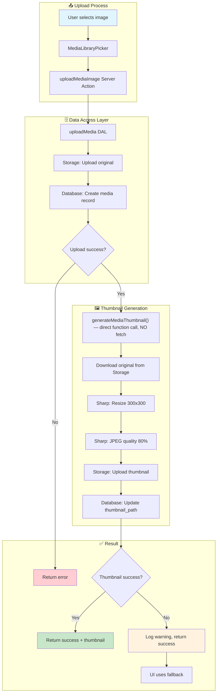

# Thumbnail Generation Flow

> Documentation du flux de génération des thumbnails dans le système Media Library

## Diagramme de flux


```mermaid
flowchart TD
    subgraph Upload["📤 Upload Process"]
        A[User selects image] --> B[MediaLibraryPicker]
        B --> C[uploadMediaImage Server Action]
    end

    subgraph DAL["🗄️ Data Access Layer"]
        C --> D[uploadMedia DAL]
        D --> E[Storage: Upload original]
        E --> F[Database: Create media record]
        F --> G{Upload success?}
    end

    subgraph Thumbnail["🖼️ Thumbnail Generation"]
        G -->|Yes| H["generateMediaThumbnail() — direct function call, NO fetch"]
        H --> I[Download original from Storage]
        I --> J[Sharp: Resize 300x300]
        J --> K[Sharp: JPEG quality 80%]
        K --> L[Storage: Upload thumbnail]
        L --> M[Database: Update thumbnail_path]
    end

    subgraph Result["✅ Result"]
        G -->|No| N[Return error]
        M --> O{Thumbnail success?}
        O -->|Yes| P[Return success + thumbnail]
        O -->|No| Q[Log warning, return success]
        Q --> R[UI uses fallback]
    end

    style A fill:#e1f5fe
    style P fill:#c8e6c9
    style Q fill:#fff3e0
    style N fill:#ffcdd2
```

> ⚠️ **Historique (corrigé le 2026-07-20)** : ce flux appelait auparavant l'API route via un `fetch(${env.NEXT_PUBLIC_SITE_URL}/api/admin/media/thumbnail)` interne avec forward manuel des cookies. Ce pattern causait `fetch failed` en staging et `HTTP 500` en production (dépendance fragile à `NEXT_PUBLIC_SITE_URL` + cookies). La logique a été extraite dans `lib/dal/media-thumbnail.ts::generateMediaThumbnail()`, appelée **directement** (function call) par les Server Actions. La route API est conservée uniquement comme thin wrapper pour d'éventuels appels externes — elle n'est plus utilisée en interne. Voir `/memories/repo/site-url-config.md` pour la règle générale (ne jamais self-fetch une route API interne depuis un Server Component/Action).
>
> ⚠️ **Bug n°2 (corrigé le 2026-07-20, même jour)** : une fois le self-fetch supprimé, l'upload Storage échouait encore avec `400 invalid_mime_type` (zéro thumbnail n'avait jamais été généré, bug préexistant). Cause : passage d'un `Buffer` Node **brut** (sortie `sharp().toBuffer()`) à `.upload()` au lieu d'un `Blob` avec `type` explicite — `@supabase/storage-js` ne propage pas fiablement `contentType` pour un Buffer nu côté Node.js. Fix : wrapper `new Blob([Uint8Array.from(thumbnailBuffer)], { type: "image/jpeg" })` avant l'upload, même pattern que l'upload du fichier original.

## Composants impliqués

### 1. Client Component - MediaLibraryPicker

**Fichier** : [components/features/admin/media/MediaLibraryPicker.tsx](../../components/features/admin/media/MediaLibraryPicker.tsx)

Déclenche l'upload via le Server Action `uploadMediaImage`.

### 2. Server Action - uploadMediaImage / regenerateThumbnailAction

**Fichier** : [lib/actions/media-actions.ts](../../lib/actions/media-actions.ts)

Appel **direct** (function call, pas de `fetch`) à la fonction DAL partagée après un upload réussi (non-bloquant) ou depuis le bouton "Générer thumbnail" :

```typescript
try {
  const thumbResult = await generateMediaThumbnail({
    mediaId: Number(result.data.mediaId),
    storagePath: result.data.storagePath,
  });

  if (!thumbResult.success) {
    throw new Error(thumbResult.error);
  }

  console.log("[uploadMediaImage] Thumbnail generated:", thumbResult.data.thumbPath);
} catch (thumbnailError) {
  console.warn("[uploadMediaImage] Thumbnail generation failed (non-critical):", thumbnailError);
}
```

### 3. DAL - uploadMedia

**Fichier** : [lib/dal/media.ts](../../lib/dal/media.ts#L80-L150)

- Upload fichier vers Supabase Storage
- Création enregistrement dans table `medias`
- Retourne `mediaId` et `storagePath`

### 4. DAL - generateMediaThumbnail (logique partagée)

**Fichier** : [lib/dal/media-thumbnail.ts](../../lib/dal/media-thumbnail.ts)

```typescript
// Paramètres Sharp
const THUMBNAIL_SIZE = 300;
const THUMBNAIL_QUALITY = 80;
const THUMBNAIL_SUFFIX = "_thumb.jpg";
```

**Étapes** (fonction `generateMediaThumbnail({ mediaId, storagePath })`, retourne `DALResult<{ thumbPath }>`) :

1. `requireMinRole("editor")`
2. Download original depuis Storage
3. Traitement Sharp : resize 300x300, cover, JPEG 80%
4. Upload thumbnail : `{storagePath}_thumb.jpg`
5. Update DB : `thumbnail_path`

### 5. API Route - Thin wrapper (compat externe uniquement)

**Fichier** : [app/api/admin/media/thumbnail/route.ts](../../app/api/admin/media/thumbnail/route.ts)

Valide le body (Zod) puis délègue à `generateMediaThumbnail()`. **N'est plus appelée en interne** par les Server Actions — conservée uniquement pour d'éventuels appels externes (API publique/webhook).

### 5. Database Schema

**Table** : `public.medias`

| Colonne | Type | Description |
| --------- | ------ | ------------- |
| `id` | bigint | PK, auto-increment |
| `storage_path` | text | Chemin fichier original |
| `thumbnail_path` | text | Chemin thumbnail (nullable) |
| `mime_type` | text | Type MIME du fichier |
| `file_size` | integer | Taille en bytes |

### 6. UI Component - MediaCard

**Fichier** : [components/features/admin/media/MediaCard.tsx](../../components/features/admin/media/MediaCard.tsx)

**Pattern de fallback** :

```typescript
// Préférence : thumbnail > original > placeholder
const imageUrl = media.thumbnail_url || media.public_url || '/placeholder.svg';
```

## Paramètres de configuration

| Paramètre | Valeur | Description |
| ----------- | -------- | ------------- |
| `THUMBNAIL_WIDTH` | 300px | Largeur cible |
| `THUMBNAIL_HEIGHT` | 300px | Hauteur cible |
| `THUMBNAIL_QUALITY` | 80% | Qualité JPEG |
| `THUMBNAIL_FIT` | cover | Mode de redimensionnement |
| `THUMBNAIL_SUFFIX` | `_thumb.jpg` | Suffixe fichier |

## Formats supportés

### ✅ Génération de thumbnail

| Format | Extension | MIME Type |
| -------- | ----------- | ----------- |
| JPEG | .jpg, .jpeg | image/jpeg |
| PNG | .png | image/png |
| WebP | .webp | image/webp |
| GIF | .gif | image/gif |
| AVIF | .avif | image/avif |

### ⏭️ Pas de thumbnail (original utilisé)

| Format | Extension | MIME Type | Raison |
| -------- | ----------- | ----------- | -------- |
| SVG | .svg | image/svg+xml | Vectoriel, pas besoin |
| PDF | .pdf | application/pdf | Document, pas image |
| Video | .mp4, .webm | video/* | Pas supporté |

## Pattern non-bloquant

Le système utilise un **pattern non-bloquant** pour la génération de thumbnails :

1. **Upload réussit toujours** si le fichier original est uploadé
2. **Thumbnail en background** : si échec, warning logged mais pas d'erreur
3. **UI avec fallback** : affiche original si thumbnail absent

```yaml
┌──────────────────────────────────────────────────────┐
│ Upload original   ────────────────────► SUCCESS      │
│       │                                              │
│       ▼                                              │
│ Generate thumbnail ─── Success ──► thumbnail_path    │
│       │                                              │
│       └─────────── Failure ──► Warning (logged)      │
│                                UI uses original      │
└──────────────────────────────────────────────────────┘
```

## Scripts de diagnostic

| Script | Commande | Description |
| -------- | ---------- | ------------- |
| Check DB | `pnpm thumbnails:check` | Liste médias + status thumbnail |
| Check Storage | `pnpm thumbnails:check-storage` | Vérifie fichiers Storage |
| Regenerate LOCAL | `pnpm thumbnails:regenerate:local` | Régénère sur DB locale |
| Regenerate REMOTE | `pnpm thumbnails:regenerate:remote` | Dry-run production |
| Apply REMOTE | `pnpm thumbnails:regenerate:remote:apply` | Applique en production |

## Références

- [TASK029 - Media Library](../../memory-bank/tasks/tasks-completed/TASK029-media-library.md)
- [Thumbnail Debug & Fix](./THUMBNAIL-GENERATION-DEBUG-AND-FIX.md)
- [Scripts README](../../scripts/Thumbnails/README-thumbnails.md)
- [Sharp Documentation](https://sharp.pixelplumbing.com/)
- Fix self-fetch interne (2026-07-20) : `/memories/repo/site-url-config.md`
