    

    <b>Automatic Architecture Diagrams from Code</b> 
    <a href="https://github.com/swark-io/swark">GitHub</a> • <a href="https://swark.io">Website</a> • <a href="mailto:contact@swark.io">Contact Us</a>

## Usage Instructions

1. **Render the Diagram**: Use the links below to open it in Mermaid Live Editor, or install the [Mermaid Support](https://marketplace.visualstudio.com/items?itemName=bierner.markdown-mermaid) extension.
2. **Recommended Model**: If available for you, use `claude-3.5-sonnet` [language model](vscode://settings/swark.languageModel). It can process more files and generates better diagrams.
3. **Iterate for Best Results**: Language models are non-deterministic. Generate the diagram multiple times and choose the best result.

## Generated Content

**Model**: GPT-4o - [Change Model](vscode://settings/swark.languageModel)  
**Mermaid Live Editor**: [View](https://mermaid.live/view#pako:eNp9Vsty2jAU_RWP1xXdZ9EZBRIICYEEQh6iCyHLoMa2PJYcynT6772SbEtu6q44996j17kP8ytmMuHxRbwrDhUtj9FmsiuiSNV7Z2Zib-wowqTiihfJSKvvznNJFDvynKqvmtPc-8ek1iJT3jEhSmiOmCxScfDu7owyqw-iUM4bRVdEy5od0VHovfyJXHT0o10Gd_hrfUKzdu01oQcgUH9KFE0Jk3lJD4XgoXtGjjLnSB3lSYX-G-cv-EllXGtehcE5KUEG1dvolqiSM01Zxnsb3flzUWnF01QLWYScBelrF0X3_vjQvXRuupe1Dv0r5y9ppQte9ZY8wPlwJOvxHx3_yCvp3Y2k9qeXfcUqUeomM2vywSuRntGH4CekOKsroc9IFB_yPVRpA29S2rLUf2hPjkazDEECUVoXzKgTPGFLEgHySQVZ4hUcjmitjz7-7HbgH7zgOairEGUMsuMZL46Rcg31lHPYDoFQop-p12abnIoMrqk5vL2fpzcChc7eG0omD93qz5KZnMvC3OavKlXvHOpJ-jrHuClW1IZg159dpjD0l6nNgeiY2FoYiE6IyfBA8Coo2AHKNfH1P0CZWspAcEbaihwg3DSNNBCet7U7EL8NeusfjG5G4DuS8DKTZ7SvdZ-DF6QuE6pN8yh1klWCUlnlAaNLXcqpruG67fF-ctX7TDBkxlsbC6P2hT4AZ96TlXWOzetEYfvBP8tSlg1lC_3zObpqomvbEFO4_mfOA9Hnsj-LAkkCONj3ttCb5-JH0tQ9Pbvh0ym4Jr7aR-3Q76KbsIbs8K_ytrE60lOX6ByeBf2ACqlFKlif-Y_RVJd0T1t58Za4EeEfjZ9JLpIk4ydaBfMavxCWCbjxcAtb9Rr2q3v8KPju4TcCZWMPH_WE7nbCEULfIvshvbRwYeC1hVMPbw2cesLMe28sXBo4txCvDL51-N7gO7_dIqDcO2z9S4fHBq8cnhn84PDc4EeH7WXXFm8M3Fj4ZOCThVsDtxY-G_hs4YuBLxa-Gvhq4ZsVAQeXxZehMQ6NSWhchcZ1aExDYxYaN6ExD41QLnwXGovQaCSzauNloCVuRHuwRqOUlQevQ8OJha1a2GmErUjYqYStTNiJg0Gd-Eucc-gGkcA_r1-7WMP_KL6LL6JdnPCU1pnexb-B5AbUBL6CFc3jC13V_EsMH0G5PhestStZH47xRUozxX__AWnbFOk) | [Edit](https://mermaid.live/edit#pako:eNp9Vsty2jAU_RWP1xXdZ9EZBRIICYEEQh6iCyHLoMa2PJYcynT6772SbEtu6q44996j17kP8ytmMuHxRbwrDhUtj9FmsiuiSNV7Z2Zib-wowqTiihfJSKvvznNJFDvynKqvmtPc-8ek1iJT3jEhSmiOmCxScfDu7owyqw-iUM4bRVdEy5od0VHovfyJXHT0o10Gd_hrfUKzdu01oQcgUH9KFE0Jk3lJD4XgoXtGjjLnSB3lSYX-G-cv-EllXGtehcE5KUEG1dvolqiSM01Zxnsb3flzUWnF01QLWYScBelrF0X3_vjQvXRuupe1Dv0r5y9ppQte9ZY8wPlwJOvxHx3_yCvp3Y2k9qeXfcUqUeomM2vywSuRntGH4CekOKsroc9IFB_yPVRpA29S2rLUf2hPjkazDEECUVoXzKgTPGFLEgHySQVZ4hUcjmitjz7-7HbgH7zgOairEGUMsuMZL46Rcg31lHPYDoFQop-p12abnIoMrqk5vL2fpzcChc7eG0omD93qz5KZnMvC3OavKlXvHOpJ-jrHuClW1IZg159dpjD0l6nNgeiY2FoYiE6IyfBA8Coo2AHKNfH1P0CZWspAcEbaihwg3DSNNBCet7U7EL8NeusfjG5G4DuS8DKTZ7SvdZ-DF6QuE6pN8yh1klWCUlnlAaNLXcqpruG67fF-ctX7TDBkxlsbC6P2hT4AZ96TlXWOzetEYfvBP8tSlg1lC_3zObpqomvbEFO4_mfOA9Hnsj-LAkkCONj3ttCb5-JH0tQ9Pbvh0ym4Jr7aR-3Q76KbsIbs8K_ytrE60lOX6ByeBf2ACqlFKlif-Y_RVJd0T1t58Za4EeEfjZ9JLpIk4ydaBfMavxCWCbjxcAtb9Rr2q3v8KPju4TcCZWMPH_WE7nbCEULfIvshvbRwYeC1hVMPbw2cesLMe28sXBo4txCvDL51-N7gO7_dIqDcO2z9S4fHBq8cnhn84PDc4EeH7WXXFm8M3Fj4ZOCThVsDtxY-G_hs4YuBLxa-Gvhq4ZsVAQeXxZehMQ6NSWhchcZ1aExDYxYaN6ExD41QLnwXGovQaCSzauNloCVuRHuwRqOUlQevQ8OJha1a2GmErUjYqYStTNiJg0Gd-Eucc-gGkcA_r1-7WMP_KL6LL6JdnPCU1pnexb-B5AbUBL6CFc3jC13V_EsMH0G5PhestStZH47xRUozxX__AWnbFOk)

```mermaid
graph TD
  subgraph lib
    A[resend.ts]
    B[schemas/team.ts]
    C[utils.ts]
    D[site-config.ts]
    subgraph plugins
      E[touch-hitbox-plugin.js]
    end
    subgraph dal
      F[agenda.ts]
      G[compagnie.ts]
      H[home-shows.ts]
      I[home-newsletter.ts]
      J[presse.ts]
      K[spectacles.ts]
      L[compagnie-presentation.ts]
      M[team.ts]
      N[home-news.ts]
      O[home-about.ts]
      P[home-partners.ts]
      Q[contact.ts]
      R[home-hero.ts]
    end
  end

  subgraph scripts
    S[verify-view-security-invoker.ts]
    T[test-views-security-invoker.ts]
    U[test-all-dal-functions.ts]
    V[diagnose-server-auth.ts]
    W[test-evenements-access.ts]
    X[test-fetch-media-articles.ts]
    Y[test-email-integration.ts]
    Z[check-email-logs.ts]
  end

  subgraph components
    subgraph skeletons
      AA[agenda-skeleton.tsx]
      AB[shows-skeleton.tsx]
      AC[about-skeleton.tsx]
      AD[hero-skeleton.tsx]
      AE[spectacles-skeleton.tsx]
      AF[newsletter-skeleton.tsx]
      AG[news-skeleton.tsx]
      AH[partners-skeleton.tsx]
      AI[presse-skeleton.tsx]
      AJ[contact-skeleton.tsx]
      AK[compagnie-skeleton.tsx]
    end
    AL[deploy-button.tsx]
    AM[update-password-form.tsx]
    subgraph features
      subgraph public-site
        subgraph presse
          AN[PresseContainer.tsx]
          AO[PresseView.tsx]
          AP[PresseServerGate.tsx]
          AQ[types.ts]
        end
      end
    end
  end

  subgraph emails
    AR[email-layout.tsx]
    AS[components.utils.tsx]
    AT[newsletter-confirmation.tsx]
    AU[contact-message-notification.tsx]
  end

  subgraph supabase
    AV[server.ts]
    AW[middleware.ts]
    AX[client.ts]
  end

  subgraph types
    AY[email.d.ts]
    AZ[database.types.ts]
  end

  A --> D
  B --> M
  F --> G
  F --> K
  G --> M
  H --> K
  I --> O
  J --> AP
  K --> AN
  L --> G
  M --> AP
  N --> AG
  O --> AC
  P --> AH
  Q --> AJ
  R --> AD
  S --> T
  T --> U
  U --> V
  V --> W
  W --> X
  X --> Y
  Y --> Z
  AA --> AN
  AB --> AN
  AC --> AN
  AD --> AN
  AE --> AN
  AF --> AN
  AG --> AN
  AH --> AN
  AI --> AN
  AJ --> AN
  AK --> AN
  AL --> AN
  AM --> AN
  AN --> AO
  AO --> AP
  AP --> AQ
  AR --> AT
  AS --> AT
  AT --> AU
  AV --> AW
  AW --> AX
  AY --> AZ
```

