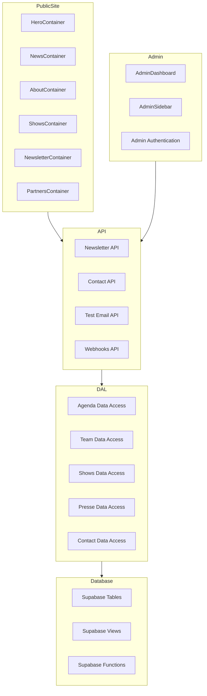

    

    <b>Automatic Architecture Diagrams from Code</b> 
    <a href="https://github.com/swark-io/swark">GitHub</a> • <a href="https://swark.io">Website</a> • <a href="mailto:contact@swark.io">Contact Us</a>

## Usage Instructions

1. **Render the Diagram**: Use the links below to open it in Mermaid Live Editor, or install the [Mermaid Support](https://marketplace.visualstudio.com/items?itemName=bierner.markdown-mermaid) extension.
2. **Recommended Model**: If available for you, use `claude-3.5-sonnet` [language model](vscode://settings/swark.languageModel). It can process more files and generates better diagrams.
3. **Iterate for Best Results**: Language models are non-deterministic. Generate the diagram multiple times and choose the best result.

## Generated Content

**Model**: GPT-4o - [Change Model](vscode://settings/swark.languageModel)  
**Mermaid Live Editor**: [View](https://mermaid.live/view#pako:eNp1U91qgzAUfpWQ6_YFvBjI3FhhDMGyXWgvTsxpDdOk5IcxSt99iUZrrbvy-9NzTk680FpxpAmt5EnDuSH7rJKEGMcGmjvWiroQFoNMyBtq9aykBSFRD9IH_piFlDLl7EIrGvWQC6-2aC3qhZGDtp7c51HySt51l_JOyFgywAxMwxRoPtMKwZGBnimps03ZIxIgSitqsELJwz9V8t2yXS-VNxYShyHSN1zb4Ec4M_do7EsHog12IKRns8QXskapbxMCI57sx86y9D3OdfImeFoOiGRggaR1jcZMxaELgfBcsfv1BL8HK4Fce4whMaCVSJw4ZMbhl6GVGXyCgYn3aw-sRVMW7tyLkcfvfwp_5Devp9F6dbIOK5zZk3Rf-HajyXb7NC53uA5zId_1NB6xfwx06pZuaIfa74_7v-dSUX-ROqxoQirK8QiutRW9-pA7c7CYCfDjdjSx2uGGgrOq-JX1yLVyp4YmR2gNXv8AlgQ1LQ) | [Edit](https://mermaid.live/edit#pako:eNp1U91qgzAUfpWQ6_YFvBjI3FhhDMGyXWgvTsxpDdOk5IcxSt99iUZrrbvy-9NzTk680FpxpAmt5EnDuSH7rJKEGMcGmjvWiroQFoNMyBtq9aykBSFRD9IH_piFlDLl7EIrGvWQC6-2aC3qhZGDtp7c51HySt51l_JOyFgywAxMwxRoPtMKwZGBnimps03ZIxIgSitqsELJwz9V8t2yXS-VNxYShyHSN1zb4Ec4M_do7EsHog12IKRns8QXskapbxMCI57sx86y9D3OdfImeFoOiGRggaR1jcZMxaELgfBcsfv1BL8HK4Fce4whMaCVSJw4ZMbhl6GVGXyCgYn3aw-sRVMW7tyLkcfvfwp_5Devp9F6dbIOK5zZk3Rf-HajyXb7NC53uA5zId_1NB6xfwx06pZuaIfa74_7v-dSUX-ROqxoQirK8QiutRW9-pA7c7CYCfDjdjSx2uGGgrOq-JX1yLVyp4YmR2gNXv8AlgQ1LQ)

