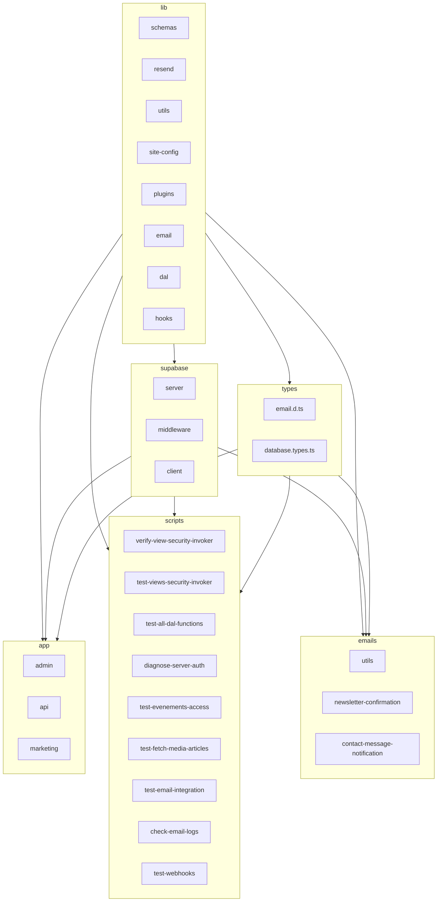

    

    <b>Automatic Architecture Diagrams from Code</b> 
    <a href="https://github.com/swark-io/swark">GitHub</a> • <a href="https://swark.io">Website</a> • <a href="mailto:contact@swark.io">Contact Us</a>

## Usage Instructions

1. **Render the Diagram**: Use the links below to open it in Mermaid Live Editor, or install the [Mermaid Support](https://marketplace.visualstudio.com/items?itemName=bierner.markdown-mermaid) extension.
2. **Recommended Model**: If available for you, use `claude-3.5-sonnet` [language model](vscode://settings/swark.languageModel). It can process more files and generates better diagrams.
3. **Iterate for Best Results**: Language models are non-deterministic. Generate the diagram multiple times and choose the best result.

## Generated Content

**Model**: GPT-4o - [Change Model](vscode://settings/swark.languageModel)  
**Mermaid Live Editor**: [View](https://mermaid.live/view#pako:eNp9VL2O2zAMfpVA8ykPkKHAobnt2qWHdpA7KDLtCJElQ6QTBId799L6SZQhHSyRnz7-iCL9KUzoQexE58eo5-PmY9_5zQaXQ1adPaw6I-YIk0ZV9r8ZjYDge5W3gi1kHaq0FgQtwffgBzuqVZQmyeVwdstoPaqyF5RjWKfSWpBeO8Vf0Y4hnFClNSEcvvMPmet5zlTdT9artBZjPVvFX9EmHU9A1o_qJj1xiSbamTCbnSHa4frbwkVlUZ5ZlghmiZau0vpzOEEsQQiQVi6qVUpU_B93__qemdo5ydeWw-IN2XArUG_16APC60JHVRX2GDkZqRlsnL2dwVOJDCzDtOpSGwOIDe8HsKNMG4DMUU4rIHUkaxy0zLf0PNnhKvINCLhIa4aFxn1iTon3HkZUSS1kx0Dj7A8c8nMmf5eiPXmD5AGbTsuptO3mubYOiCCmpotTSkvd4dyABa_pBk_a0M9AdrAmWxSMy4CoR5C-OXzWIsusDxqhNH56DpW32m627x1cdAR1F2sSzvLLqLw9iUDXGbAZko9Vz5Oy7bd06w9NKZF8XLVtsq6sm3Oe8o2U3-rMVLXp9wrdy38jNTeuWMkx552PW_8PWBPkAa-R1oPkr_VwBxrzO1htxYuYgN_Z9vyH--wE8b8LOrHbdKKHQS-OOvHFpGXmAsGepyjqSewoLvAieIjCr6s3VY9hGY9iN2iH8PUPHlrbMw) | [Edit](https://mermaid.live/edit#pako:eNp9VL2O2zAMfpVA8ykPkKHAobnt2qWHdpA7KDLtCJElQ6QTBId799L6SZQhHSyRnz7-iCL9KUzoQexE58eo5-PmY9_5zQaXQ1adPaw6I-YIk0ZV9r8ZjYDge5W3gi1kHaq0FgQtwffgBzuqVZQmyeVwdstoPaqyF5RjWKfSWpBeO8Vf0Y4hnFClNSEcvvMPmet5zlTdT9artBZjPVvFX9EmHU9A1o_qJj1xiSbamTCbnSHa4frbwkVlUZ5ZlghmiZau0vpzOEEsQQiQVi6qVUpU_B93__qemdo5ydeWw-IN2XArUG_16APC60JHVRX2GDkZqRlsnL2dwVOJDCzDtOpSGwOIDe8HsKNMG4DMUU4rIHUkaxy0zLf0PNnhKvINCLhIa4aFxn1iTon3HkZUSS1kx0Dj7A8c8nMmf5eiPXmD5AGbTsuptO3mubYOiCCmpotTSkvd4dyABa_pBk_a0M9AdrAmWxSMy4CoR5C-OXzWIsusDxqhNH56DpW32m627x1cdAR1F2sSzvLLqLw9iUDXGbAZko9Vz5Oy7bd06w9NKZF8XLVtsq6sm3Oe8o2U3-rMVLXp9wrdy38jNTeuWMkx552PW_8PWBPkAa-R1oPkr_VwBxrzO1htxYuYgN_Z9vyH--wE8b8LOrHbdKKHQS-OOvHFpGXmAsGepyjqSewoLvAieIjCr6s3VY9hGY9iN2iH8PUPHlrbMw)

